# 主成分分析:机器学习的视角(下)

> 原文：<https://towardsdatascience.com/principal-component-analysis-the-machine-learning-perspective-part-2-a2630fa3b89e?source=collection_archive---------7----------------------->

[https://3c1703fe8d.site.internapcdn.net/newman/gfx/news/hires/2017/sixwaysandco.jpg](https://3c1703fe8d.site.internapcdn.net/newman/gfx/news/hires/2017/sixwaysandco.jpg)

在我之前的文章中，我从统计学的角度回顾了主成分分析。在本文中，我将回顾同一主题的机器学习方面。请注意，我将涉及的范围是基本的，不包括 PCA 的变体，如概率 PCA 和核 PCA。就像我之前的文章一样，内容相当专业，所以熟悉以下一些内容会让这篇文章更容易理解:[线性代数(矩阵、特征向量/特征值、对角化、正交性)和统计学/机器学习(标准化、方差、协方差、独立性、线性回归](https://www.amazon.com/Elementary-Algebra-Classics-Advanced-Mathematics/dp/013468947X))。

我们将从寻找二维数据空间的一维投影开始。以下是我们的数据集。

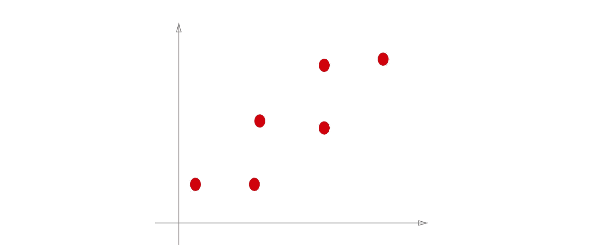

我们有无限多可能的一维投影:

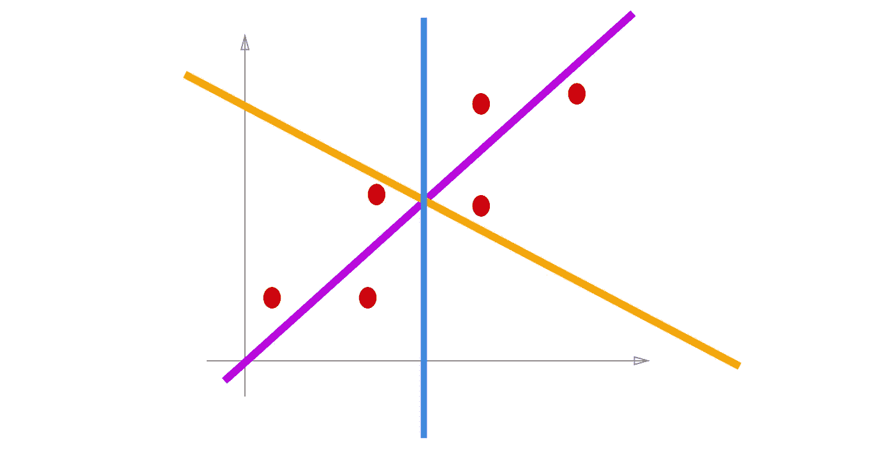

在我们所有的可能性中，我们将关注**正交投影**。

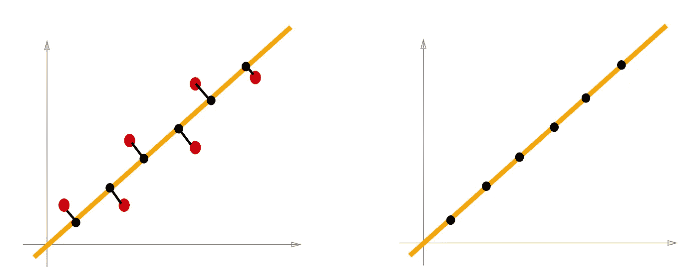

在所有可能的投影中，正交投影是我们感兴趣的原因，因为它具有最接近的矢量特性。根据**最近向量性质，在 W 空间的所有向量中，**最接近 **u** 的向量就是 **u** 在 W 上的正交投影，换句话说，我们希望得到最接近原始数据集的投影，以保持降维后尽可能多的信息。这是最近向量性质的证明:

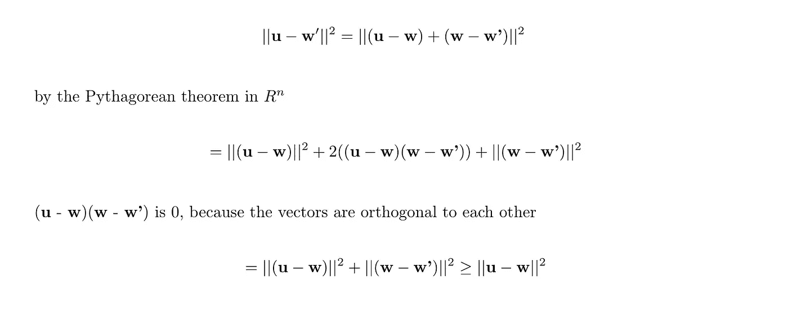

现在我们知道了投影的方向，让我们用数学公式来表示投影。为了做到这一点，我们将从正交投影的定义开始。

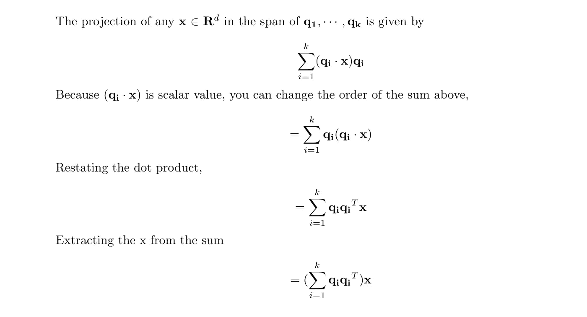

上面的等式是我们的数据需要经过正交化的线性变换。最后一个表达式显示了我们最终想要的:一个新的、更低的维度上的正交投影数据。因此，**我们希望找到一个线性算子，它用最小正交投影将我们的数据映射到一个子空间上**。

重要的是要看到，正交投影是原始 d 维空间的 k 维子空间，用原始 d 维坐标表示。比如 k = 1，q 的 q 转置为(d x k * k x d = d x d)。看起来降维还没做，但那是因为我们参考了原始坐标的投影。如下图所示，一维投影数据是指二维坐标。

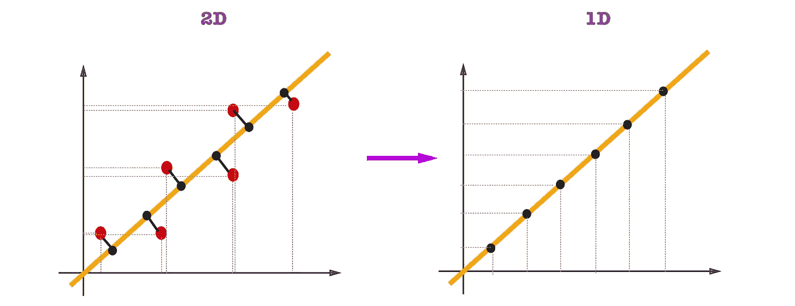

考虑到这一点，我们可以将问题表述为寻找最佳线性变换 Pi(将我们的数据变换为投影到较低维度的线性算子),以最小化重建误差:

不要混淆 PCA 和线性回归。PCA 是最小化*正交投影*的距离，而线性回归是最小化*在 y 轴上的距离*。

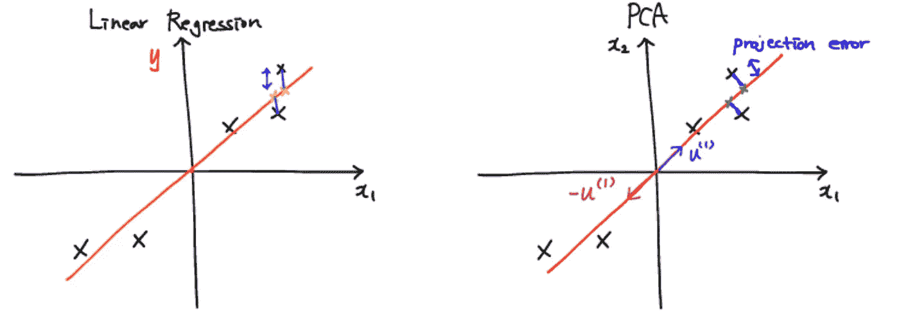

[https://wikidocs.net/4870](https://wikidocs.net/4870)

在 **k** 维子空间中，有 **k** 个正交基向量。基向量不必是正交的，但是子空间中的每个基向量可以使用 [Gram-Schmidt 过程](https://en.wikipedia.org/wiki/Gram%E2%80%93Schmidt_process)用正交基来代替，并且我们可以容易地将基向量的长度改变为 1。因此，我们对这个优化问题的约束将是基向量的长度必须是 1。我们可以重申我们的问题:

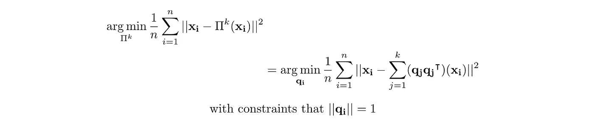

# 将最小化转换为最大化(K = 1 的情况)

我们将从最容易处理的情况开始，即当投影维数 k = 1 时。处理 k = 1 情况的好处是，我们可以消除 Pi 或基向量 q 的内部求和，因为这里只有一个向量。

我们可以通过做一些线性代数，将这个问题转化为最大化问题，而不是致力于最小化问题。我们将从最初开始的正交投影表达式开始，而不是从上一段中的表达式开始。

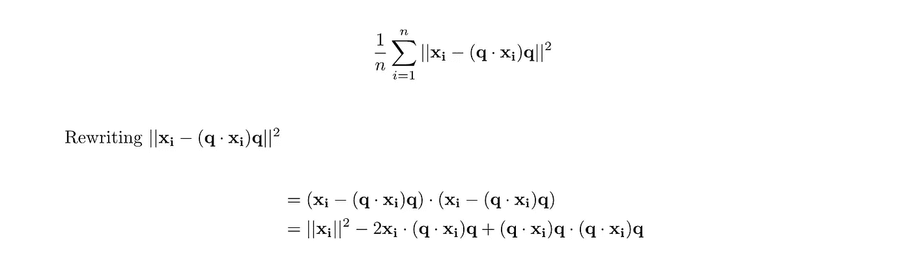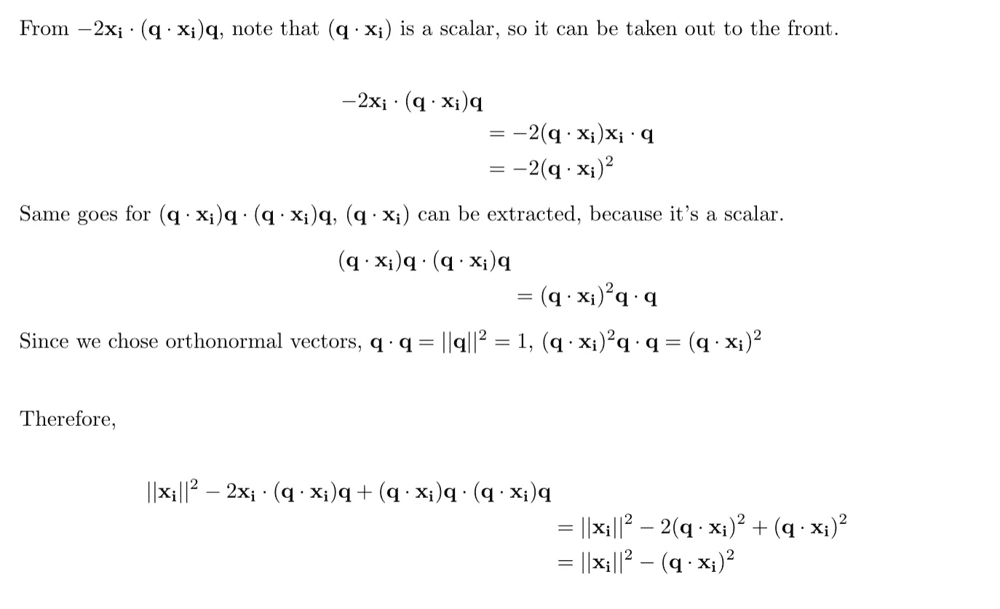

第一次求和不依赖于基向量 **q** ，所以不影响我们的最小化问题。去掉常数后，现在我们试图最小化负面表达，就变成了最大化问题。

做更多的代数，

现在问题变成了，

[http://www.cs.columbia.edu/~verma/teaching.html](http://www.cs.columbia.edu/~verma/teaching.html)

# 最大化问题是什么意思？

我们开始的最小化问题是最小化从数据集到投影的正交距离。对于最大化问题，我们看到是**最大化方差**。现在我将展示为什么问题的最大化版本是投影数据集方差的最大化。为了证明它，让我们从方差的方程开始。

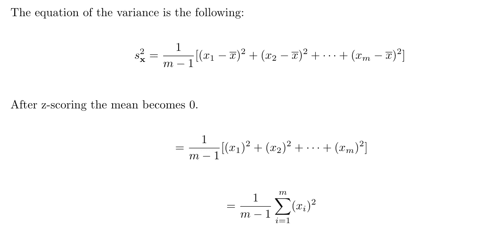

请注意，上面的等式是一个标量乘以一个矢量本身的点积。

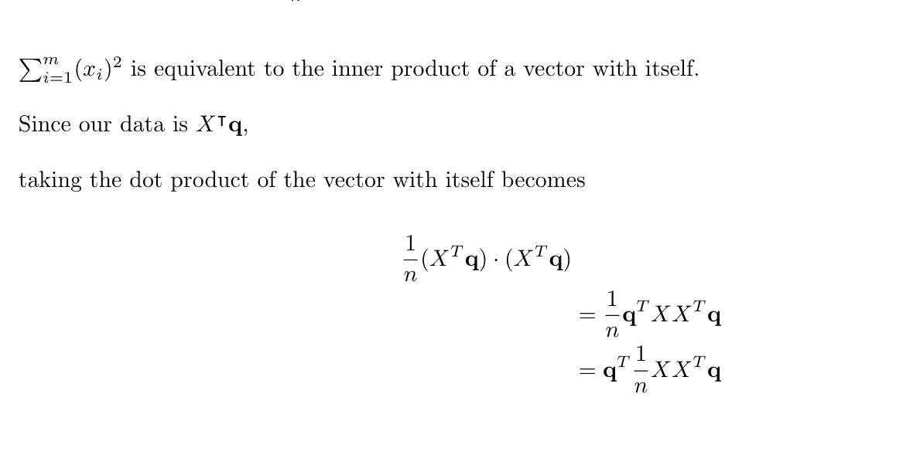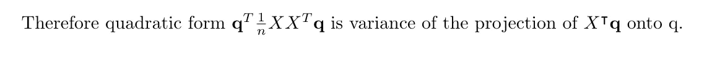

# 为什么我们把最小化问题转化为最大化问题？

那什么是 X q 的转置呢？和原来的 X 有什么不同？

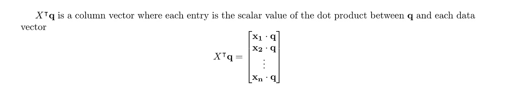

换句话说，列向量表示 k 维的新子空间内的距离。

从最小化和最大化的角度来看，看到同样的问题是很有趣的，因为它们都实现了降低维度的目标，但实现的方式不同。*最小化将是最小化残差，残差是数据点和投影*之间的正交距离。另一方面， ***最大化问题是最大化正交投影数据集的方差*** 。我们可以直观地看一下最小化和最大化:

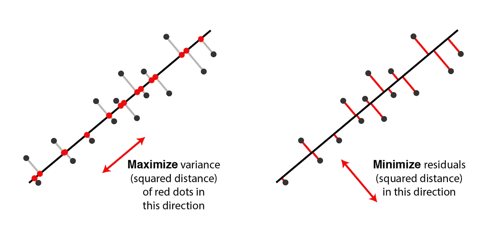

[http://alexhwilliams.info/itsneuronalblog/2016/03/27/pca/](http://alexhwilliams.info/itsneuronalblog/2016/03/27/pca/)

# 一般 K 情况

现在我们将把 k = 1 的表达式转换成一般的 k 种情况的表达式。的原始最小化表达式

[http://www.cs.columbia.edu/~verma/teaching.html](http://www.cs.columbia.edu/~verma/teaching.html)

相当于

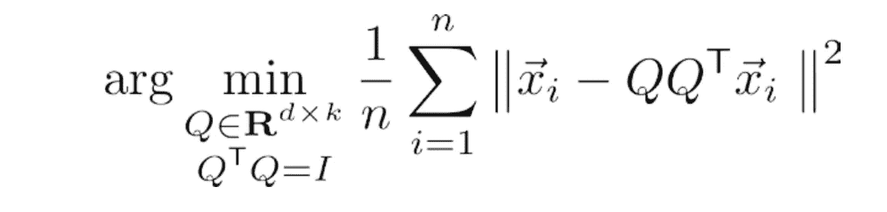

[http://www.cs.columbia.edu/~verma/teaching.html](http://www.cs.columbia.edu/~verma/teaching.html)

当我们有不止一个 q 并且 q 不再是一个向量而是一个矩阵时。

原因是因为外积之和(即变换运算符)相当于矩阵乘法，因为它从一个向量增长为一个矩阵，如下所示:

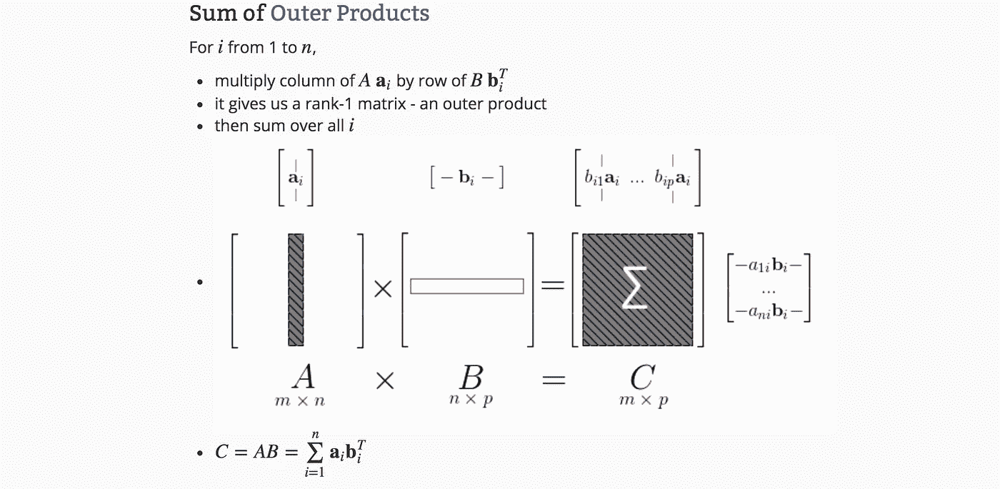

[http://mlwiki.org/index.php/Matrix-Matrix_Multiplication](http://mlwiki.org/index.php/Matrix-Matrix_Multiplication)

为了将最大化问题转化为一般的 k 情况，我们需要决定我们想要从矩阵中最大化什么。让我们从轨迹的定义开始。一个 *n* -by- *n* 方阵 *A* 的**迹**定义为[A*A*](https://en.wikipedia.org/wiki/Trace_(linear_algebra))*的主对角线(从左上到右下的对角线)上的元素之和。*由于我们的矩阵 Q(Q 的转置)是对称的，所以上面提到的对称矩阵的相同定理将被应用于它可以被分解为 t 的 P D 转置，并且我们还将使用 trace 的一个性质 trace(AB) = trace (BA)。

如果 A 是可对角化的矩阵，那么 A 的迹等于 A 的特征值之和，证明如下:

因此，为了最大化方差，我们可以最大化矩阵的迹，它是 d 的对角线元素之和。

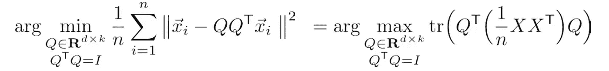

[http://www.cs.columbia.edu/~verma/teaching.html](http://www.cs.columbia.edu/~verma/teaching.html)

我们也可以像这样将迹的概念引入最小化问题:

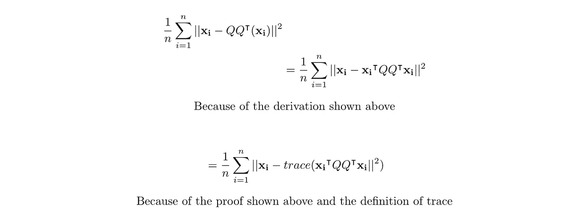

因此，最大化矩阵的轨迹，

等同于最大化协方差矩阵以及与 X 的 X 转置相关联的特征值。注意，X 的 X 转置的维数是 d×d，但是其*正被最大化的矩阵具有 k×k 的维数。追踪操作的输出是特征值之和的 k×k 矩阵， 但是 ***argmax*** 运算的输出是(d×k)Q 矩阵，其中每一列是 X 的 X 转置的特征向量。*

# *投影数据*

*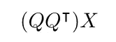*

*到目前为止，我们只研究了新维度的基本向量。然而，我们真正想要的是原始数据在新维度上的投影。PCA 的最后一步是我们需要将 Q 的 Q 变换与原始数据矩阵相乘，以获得投影矩阵。我们从(d×k)Q 矩阵和 Q 的 Q 转置得到 d×d 维的结果。乘以(d×n)X 矩阵，投影矩阵为 d×n。*

# *结论*

*我们从 d×d 协方差矩阵开始，通过最小化重构误差得到前 k 个特征向量，这相当于最大化矩阵的迹。所以我们成功降维了。回到统计学的角度，我们为什么要最大化方差的问题已经得到了回答，因为我们要最小化重建误差，这与最大化方差有相同的结果。*