# 主成分分析的主要成分

> 原文：<https://towardsdatascience.com/principal-components-of-pca-bea010cc1d33?source=collection_archive---------9----------------------->

Photo by [Katie Smith](https://unsplash.com/@kate5oh3?utm_source=medium&utm_medium=referral) on [Unsplash](https://unsplash.com?utm_source=medium&utm_medium=referral)

主成分分析( [PCA](https://en.wikipedia.org/wiki/Principal_component_analysis) )用于机器学习应用中，以降低数据的维度。在其他应用中，它对[图像压缩](http://people.ciirc.cvut.cz/~hlavac/TeachPresEn/11ImageProc/15PCA.pdf)特别有用。在本帖中，我们将浏览 Lindsay Smith 的 [*关于主成分分析的教程*](https://ourarchive.otago.ac.nz/bitstream/handle/10523/7534/OUCS-2002-12.pdf) 以及 python 中的实现。

我们的目标是通过布置数学公式来开发 PCA 的直觉，并超越 *fit* 和 *fit_transform* 方法。在继续之前，熟悉[扩散度量](https://www.abs.gov.au/websitedbs/a3121120.nsf/home/statistical+language+-+measures+of+spread)和[线性代数](https://en.wikipedia.org/wiki/Linear_algebra)是有帮助的。如果解释看起来微不足道，可以直接跳到实现。

# 传播的量度

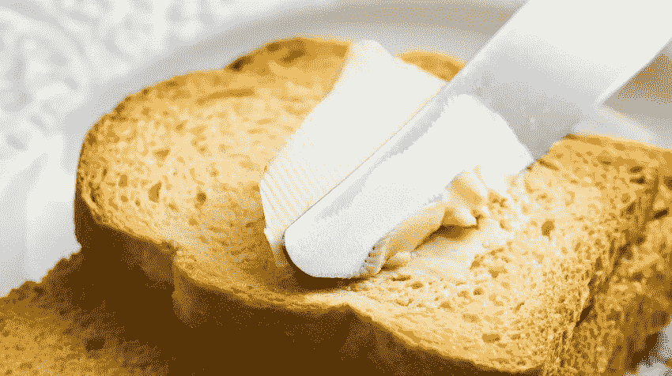

## 差异

方差是对分布的度量，它表示一组数字与它们的平均值相差多远。对于一维数组 X，方差 s2 为:

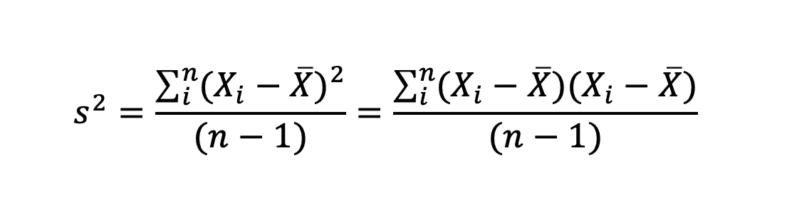

*   Xi =数组 X 的第 I 个条目的值
*   X 条= X 的平均值
*   n =条目的数量

## 二维之间的协方差

如果我们想测量两个随机变量的联合可变性呢？[协方差](https://en.wikipedia.org/wiki/Covariance)测量各条目相对于平均值的变化程度。它由下式给出:

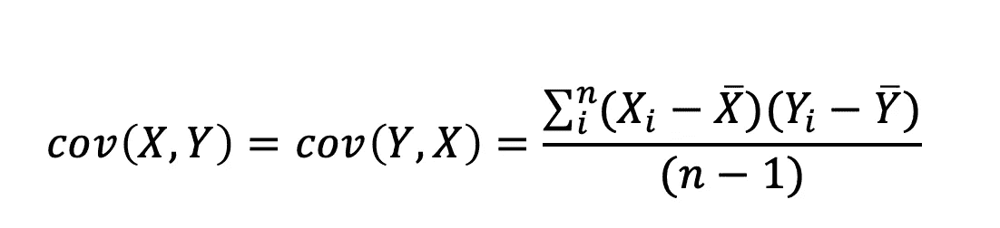

*   Xi =数组 X 的第 I 个条目的值
*   Yi =数组 Y 的第 I 个条目的值
*   X bar =数组 X 的平均值
*   Y 条=数组 Y 的平均值
*   n =条目数，X 和 Y 相同

查看协方差的输出时，查看符号很重要。如果是正的，那么就有正相关，意味着 X 和 Y 一起增加；如果是负的，那么两者都增加。如果我们关心值，那么最好使用[皮尔逊相关系数](https://en.wikipedia.org/wiki/Pearson_correlation_coefficient)。

## n 维之间的协方差

如果我们有一个 n 维数据，我们如何测量协方差？回想一下，协方差仅在 2 维之间，因此结果是一个[协方差矩阵](https://en.wikipedia.org/wiki/Covariance_matrix)。知道我们可以计算的协方差值的数量是有用的:

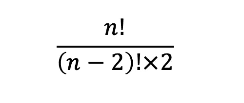

*   n =维数

例如，如果我们有一个维度为 x、y 和 z 的数据集，那么我们的协方差矩阵 C 将为:

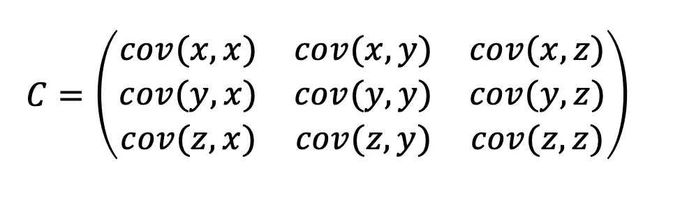

# 线性代数

Photo by [Alex Block](https://unsplash.com/@alexblock?utm_source=medium&utm_medium=referral) on [Unsplash](https://unsplash.com?utm_source=medium&utm_medium=referral)

## 特征向量

当我们将两个兼容的矩阵相乘时，我们实际上是在做一个[线性变换](https://en.wikipedia.org/wiki/Linear_map)。考虑一个方阵 *A* 和一个向量 *v* 以及以下属性:

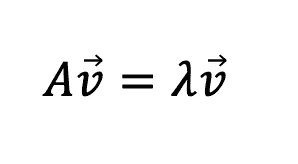

*   A =方阵
*   v =矢量
*   λ =标量值

上面告诉我们的是 *v* 实际上是一个特征向量。从几何学上讲，该表达式意味着对向量 *v* 应用线性变换会返回其缩放版本。

如果 A 是一个可对角化的矩阵，那么它有 n 个特征向量。特征向量的一个重要性质是它们都是正交的。稍后，我们将会看到如何用这些向量来表达数据，而不是原始维度。

## 本征值

在上一节中，我们在没有意识到的情况下计算了特征值:它不是别人，正是λ。在计算特征向量的时候，我们也会计算特征值。如本[教程](https://www.scss.tcd.ie/~dahyotr/CS1BA1/SolutionEigen.pdf)所示，可以手动计算这些值。然而，一旦 A 的维数超过 3×3，那么获得特征值和特征向量会非常繁琐和耗时。

# PCA 实施

Photo by [Lauren Mancke](https://unsplash.com/@laurenmancke?utm_source=medium&utm_medium=referral) on [Unsplash](https://unsplash.com?utm_source=medium&utm_medium=referral)

我们现在知道了在我们选择的例子中实现 PCA 的必要成分。在本节中，我们将详细介绍每个步骤，并了解前面章节中的知识是如何应用的。

## 第一步:获取数据

在本练习中，我们将创建一个 3D 玩具数据。这是任意的数据，所以我们可以提前猜测我们的结果会是什么样子。为了使接下来的部分更简单，我们将把数据转换成玩具数据帧。

请注意，我们的数据没有任何缺失值，因为这是 PCA 正常运行的关键。对于缺失的数据，我们可以用均值、方差、众数、零值或我们选择的任何值来代替空的观测值。每种技术都会将方差归入数据集，由我们根据具体情况做出适当的判断。

查看 3D 散点图中的数据:

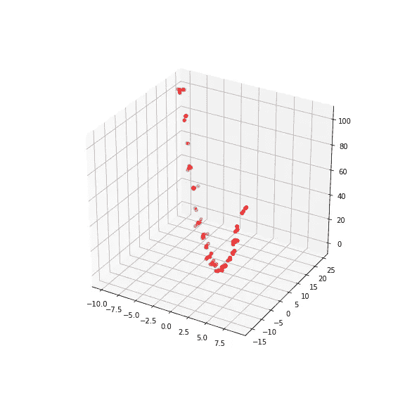

## 第二步:减去平均值

为了使 PCA 工作，我们需要具有平均值为零的数据集。我们可以用下面的代码轻松减去每个维度的平均值:

## 步骤 3:计算协方差矩阵

再次挑选熊猫让我们的生活变得更容易，我们使用了 [cov](https://pandas.pydata.org/pandas-docs/stable/reference/api/pandas.DataFrame.cov.html) 方法。

回想一下，非对角项是一个维度与另一个维度的协方差。例如，在下面的示例输出中，我们不太关心值，而是关心符号。这里 X 和 Y 是负相关的，而 Y 和 Z 是正相关的。

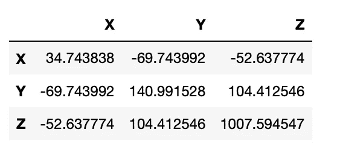

## 第四步:计算协方差矩阵的特征向量和特征值

我们用 numpy 的线性代数包 [numpy.linalg.eig](https://docs.scipy.org/doc/numpy/reference/generated/numpy.linalg.eig.html) 计算特征向量 **v** 和特征值 **w** 。特征向量被归一化，使得列 **v[:，i]** 是对应于特征值 **w[i]** 的特征向量。计算出的特征值不一定是有序的，这将与下一步相关。

## 步骤 5:选择组件和新的特征向量

现在我们有了特征向量和特征值，我们可以开始降维了。事实证明，具有最高特征值的特征向量是数据集的主分量。事实上，具有最大特征值的特征向量代表了数据维度之间最重要的关系。

我们现在的任务是将特征值从最高到最低排序，按照重要性的顺序给出分量。我们从作为向量矩阵的特征向量中提取想要保留的特征向量:

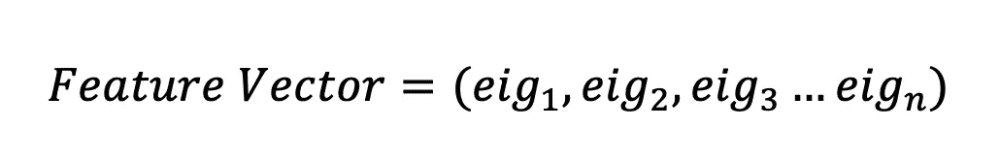

让我们看看如何在代码中做到这一点。这里我们决定忽略最小的特征值，因此我们的索引从 1 开始。

## 步骤 6:派生新数据集

在最后一部分中，我们取向量的转置，并将其乘以原始数据集的左边，转置。

在上面的代码中，转置的特征向量是行特征向量，其中特征向量现在位于行中，因此最重要的特征向量位于顶部。行数据调整是转置的平均调整数据，其中每行保存一个单独的维度。我们的新数据如下所示:

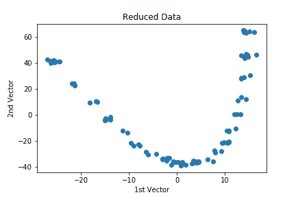

你可能会注意到上面轴的标签不是 X 和 y。通过我们的变换，我们已经改变了我们的数据，用我们的 2 个特征向量来表示。

如果我们决定保留所有的特征向量，我们的数据将保持不变，只是旋转，使特征向量是轴。

## 步骤 1:取回旧数据

假设我们减少了图像压缩的数据，现在我们想检索它。为此，让我们回顾一下我们是如何获得最终数据的。

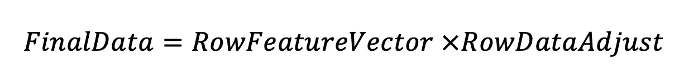

我们可以把这个表达式反过来得到:

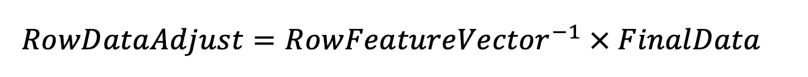

因为行特征向量的倒数等于我们的特征向量的转置。这是真的，因为矩阵的元素都是数据集的单位向量。我们的等式变成:

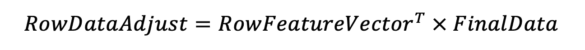

最后，我们加上从开始减去的平均值:

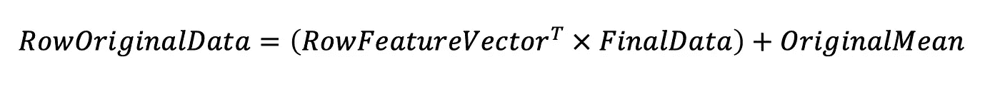

在 python 代码中，这看起来像:

# 结论

恭喜你！我们在练习的最后，从头开始执行 PCA 以减少数据的维数，然后返回我们的步骤以取回数据。

尽管我们没有深入探究*为什么*会起作用的细节，但我们可以自信地解读来自 [sklearn 的 PCA](https://scikit-learn.org/stable/modules/generated/sklearn.decomposition.PCA.html) 等软件包的输出。

*对于完整的 python 代码，可以随意探索本* [*笔记本*](https://github.com/NadimKawwa/Statistics/blob/master/pca_tutorial.ipynb) *。*