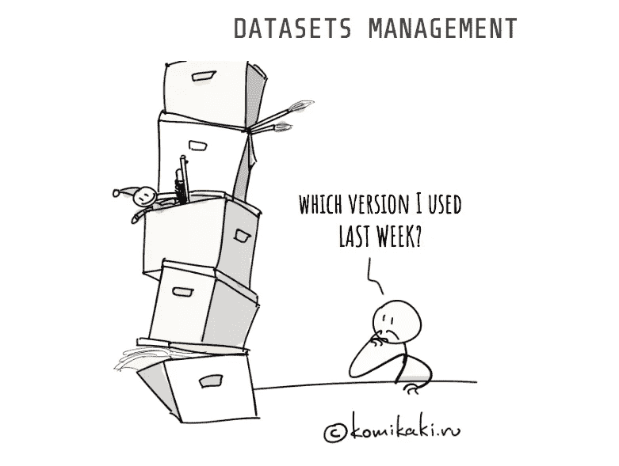
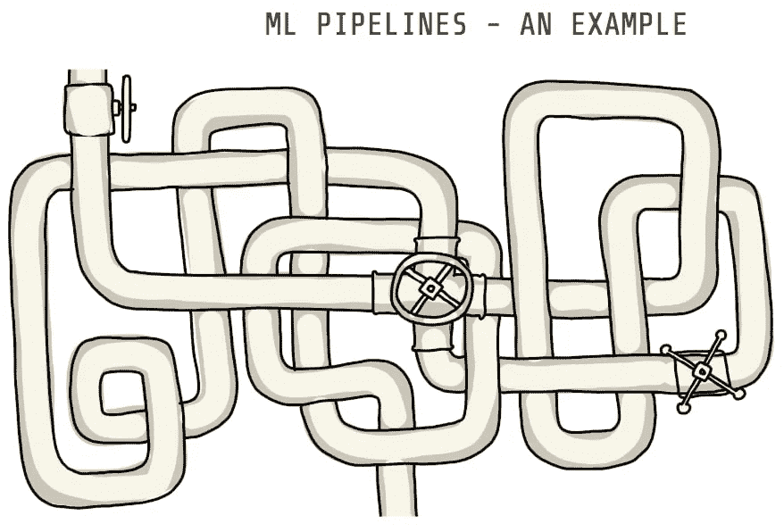

# 有原则的机器学习:高效协作的实践和工具

> 原文：<https://towardsdatascience.com/principled-machine-learning-practices-and-tools-for-efficient-collaboration-560b429c353b?source=collection_archive---------15----------------------->

机器学习项目通常比它们应该的要难。我们正在处理数据和软件，这应该是一个简单的问题，运行代码，迭代一些算法调整，过一会儿我们就有了一个训练有素的人工智能模型。但是快进三个月后，训练数据可能已经被更改或删除，并且对训练脚本的理解可能是对哪个做什么的模糊记忆。您是否在已训练的模型和创建模型的过程之间建立了一个分离？您如何与同事分享工作以进行协作或复制您的成果？

对于一般的软件项目来说，需要的是更好地管理代码版本和项目资产。人们可能需要重新审视项目在过去任何阶段的状态。我们在软件工程中一直这样做(审查旧的提交)。一个机器学习项目不也应该需要偶尔这样做吗？不仅如此。拉式请求的等价物，或者其他领域中常规使用的其他种类的团队管理实践呢？

我自己，刚刚开始学习机器学习工具的旅程。在学习材料中，我会看一些教程视频，有时老师会谈到一些问题，让我想起我软件工程生涯早期的一段时间。例如，在 1993-1994 年，我是一个开发电子邮件用户代理团队的首席工程师。我们没有任何种类的源代码管理(SCM)系统。每天，我都会咨询所有其他团队成员，看看他们当天做出了哪些改变。我拥有的唯一工具是在他们的源代码树和主源代码树之间运行 diff(使用`diff -c | less`)，然后手动应用更改。后来，团队成员从主源代码树中手动更新了他们的源代码树。这是一个烂摊子，直到我们发现了一个早期的 SCM 系统(CVS)。这一工具使得项目进行得更加顺利。

当我学习机器学习和数据科学项目中使用的工具时，这些故事感觉与此类似。即使在今天，ML 研究人员有时也将实验(数据、代码等)存储在平行的目录结构中，以方便区分，就像我在 1993 年所做的那样。

让我们从一些可能有助于改善机器学习项目的软件管理工具状态的原则的简要概述开始。

在任何机器学习项目中，科学家都会进行许多实验，为目标场景开发最佳训练模型。实验包含:

*   *代码和配置*:实验中使用的软件，以及配置参数
*   *数据集*:使用的任何输入数据——其大小很容易达到数千兆字节，例如用于识别音频、图像或视频文件内容的项目
*   *输出*:训练好的 ML 模型和来自实验的任何其他输出

一个机器学习项目只是运行软件。但是通常在与同事共享文件或复制结果时会有困难。获得可以与同事共享的可重复的结果，并且您可以及时返回以评估项目的早期阶段，这需要更全面的管理工具。

解决方案需要包含这样的想法(摘自 Patrick Ball 题为[原则性数据处理](https://www.youtube.com/watch?v=ZSunU9GQdcI)的演讲):

*   **透明**:检查一个 ML 项目的每一个方面。
*   使用什么代码、配置和数据文件
*   项目中使用了哪些处理步骤，以及这些步骤的顺序
*   **可审核性**:检查管道中间结果
*   **再现性**:在项目开发的任何阶段精确地重新执行项目的能力，以及同事精确地重新执行项目的能力
*   记录处理步骤，以便任何人都可以自动重新运行
*   随着项目的进展记录项目的状态。“状态”是指代码、配置和数据集
*   能够在项目历史中的任何时间重新创建可用的精确数据集对于可审计性的有用性至关重要
*   **可伸缩性**:支持多个合作者从事一个项目的能力，以及同时从事多个项目的能力


# ML 项目与常规软件工程的不同之处是什么？

你是否已经得出结论，如果 ML 项目与软件工程相同，那么我们为什么不在机器学习项目中使用常规的软件工程工具呢？没那么快！

在常规的软件工程项目中，有许多工具可能对 ML 研究人员有用。代码和实验配置可以在 Git 这样的常规源代码管理系统中轻松管理，pull requests 这样的技术可以用来管理这些文件的更新。CI/CD (Jenkins 等)系统甚至可以用于自动化项目运行。

但是 ML 项目的不同之处在于，常规的软件开发工具无法满足所有的需求。这里有几件事:

*   **度量驱动的开发与特性驱动的开发**:在常规的软件工程中，“是否发布”的决定是基于团队是否达到了特性里程碑。相比之下，ML 研究人员看的是一种完全不同的测量方法——生成的机器学习模型的预测值。研究人员将反复生成几十个(或更多)模型，测量每个模型的准确性。由于目标是找到最准确的模型，所以该项目由每个实验中获得的度量来指导。
*   **ML 模型需要大量的资源来训练**:常规软件项目组织文件来一起编译一个软件产品，而 ML 项目则训练一个描述人工智能算法的“模型”。在大多数情况下，编译一个软件产品只需要几分钟，这非常便宜，许多团队都遵循持续集成策略。训练一个 ML 模型需要很长时间，除非必要，否则最好避免这样做。
*   **巨大的数据集和训练过的模型**:前面一点的概括是，机器学习开发阶段几乎总是需要用于训练 ML 模型的巨大数据集，加上训练过的模型可能是巨大的。普通的源代码管理工具(Git 等)不能很好地处理大文件，像 Git-LFS 这样的插件也不适合 ML 项目。(见[我之前的文章](/why-git-and-git-lfs-is-not-enough-to-solve-the-machine-learning-reproducibility-crisis-f733b49e96e8))
*   **管道** : ML 项目是下载数据、准备数据、将数据分成训练/验证集、训练模型、验证模型等一系列步骤。许多人使用“管道”这个词，用每个步骤的离散命令来构建一个 ML 项目比把所有东西都塞进一个程序有用。
*   **专用硬件**:软件组织可以在任何类型的服务器设备上托管其软件基础设施。如果他们想要云部署，他们可以从他们最喜欢的云计算提供商那里租用日常的 VPS。ML 研究人员有巨大的计算需求。高功率 GPU 不仅可以加快视频编辑速度，还可以让 ML 算法飞起来，大幅减少训练 ML 模型所需的时间。

如果中间结果是在三个月前生成的，而事情发生了变化，以至于您不记得当时软件是如何运行的，那该怎么办？如果数据集已被覆盖或更改，该怎么办？一个支持 ML 项目的透明性、可审计性和可再现性的系统必须考虑所有这些因素。

现在我们有了一个原则列表，让我们在这个背景下看看一些开源工具。

有大量的工具可能适合数据科学和机器学习从业者。在接下来的部分中，我们将具体讨论两个工具( [MLFlow](https://mlflow.org) 和 [DVC](https://dvc.org) )，同时还将讨论一般原则。



# ML 项目的原则性数据和模型存储

这场讨论的一面可以归结为:

*   跟踪每一轮训练机器学习模型使用了哪些数据文件。
*   跟踪生成的训练模型和评估指标
*   通过任何形式的文件共享系统与同事共享数据文件的简单方法。

需要一个数据跟踪系统来进行透明的审计，或再现结果。将项目团队扩展到多个同事所需的数据共享系统。

这可能已经很明显了，但是使用 Git 或其他 SCM(源代码管理系统)来存储机器学习项目中使用的数据文件是不切实际的。如果存储代码和配置文件的 SCM 也可以存储数据文件，这将是非常简单的。Git-LFS 也不是一个好的解决方案。我之前的文章[为什么 Git 和 Git-LFS 不足以解决机器学习的可复制性危机](/why-git-and-git-lfs-is-not-enough-to-solve-the-machine-learning-reproducibility-crisis-f733b49e96e8)，详细讨论了这个推理。

有些库提供 API 来简化远程存储上的文件处理，并管理向远程存储上传文件或从远程存储上传文件。虽然这对于远程数据集的共享访问很有用，但对这里描述的问题没有帮助。首先，它是嵌入式配置的一种形式，因为文件名是嵌入到软件中的。任何将配置设置嵌入到源代码中的程序都很难在其他情况下重用。其次，它没有关联每个版本的脚本使用了哪个数据文件。

考虑 MLFlow 的示例代码:

```
mlflow.pytorch.load_model("runs:/<mlflow_run_id>/run-relative/path/to/model")
```

这支持几种可选的文件访问“方案”,包括像 S3 这样的云存储系统。此处的示例从“run”区域加载了一个文件，在本例中是一个经过训练的模型。每次执行“一段数据科学代码”时，都会生成一个 MLFlow“运行”。您配置了一个存储“运行”数据的位置，很明显，每次运行都会生成一个“运行 ID ”,用于索引数据存储区域。

这看起来很有用，因为它会自动将数据与提交到存储代码和配置文件的 SCM 存储库相关联。此外，由于 MLFlow API 可用于多种语言，因此您不会局限于 Python。

DVC 有一种不同的方法。您的脚本只是使用普通的文件系统 API 输入和输出文件，而不是将文件 API 集成到 ML 脚本中。例如:

理想情况下，该路径名将从命令行传入。关键是代码没有什么特别的要求，因为 DVC 在用于训练或验证模型的代码的上下文之外提供它的值。

DVC 使这变得透明，因为数据文件版本控制与 Git 成对出现。使用以下命令将文件或目录置于 DVC 控制之下:

```
$ dvc add path/to/model.pkl
```

数据存储在一个自然的地方，在您的工作目录中。浏览各种运行的结果就像浏览 Git 历史一样简单。查看特定的结果就像运行`git checkout`一样简单，DVC 将被调用以确保正确的数据文件被链接到工作区。

创建一个“DVC 文件”来跟踪每个文件或目录，并由 DVC 插入到工作空间中。它们有两个目的，一个是跟踪数据和模型文件，另一个是记录工作流命令，我们将在下一节中讨论。

这些 DVC 文件记录被跟踪的文件或目录的 MD5 校验和。它们被提交到 Git 工作区，因此 DVC 文件为每次 Git 提交记录工作区中每个文件的校验和。在幕后，DVC 使用所谓的“DVC 缓存目录”来存储每个文件的多个实例。实例通过校验和进行索引，并使用引用链接或符号链接链接到工作区。当 DVC 响应`git checkout`操作时，它能够根据 DVC 文件中记录的校验和快速重新排列工作区中的链接文件。

DVC 支持用于与其他人共享数据和模型的远程缓存目录。

```
$ dvc remote add remote1 ssh://user@host.name/path/to/dir 
$ dvc push 
$ dvc pull
```

DVC 遥控器是一个存储池，通过它可以共享数据。它支持许多存储服务，包括 S3 和其他服务、HTTP 和 FTP。创建一个非常简单。`dvc push`和`dvc pull`命令特意与`git push`和`git pull`命令相似。当 dvc push 将数据发送到远程 dvc 缓存时，我们使用`dvc pull`从 DVC 缓存中检索数据。



# ML 项目的原则性工作流程描述

讨论的另一方面是关于如何最好地描述 ML 项目中使用的工作流或管道。我们是不是把所有的东西都塞进一个程序里？还是我们使用多种工具？

最大的灵活性来自于将工作流实现为可重用命令的管道或有向非循环图，这些命令将配置选项作为命令行参数。这有意地类似于 Unix 的小型定义良好的工具的哲学，具有狭窄的范围，可以很好地协同工作，其中行为是由命令行选项或环境变量定制的，并且可以根据需要混合和匹配。这种哲学背后有一个漫长的集体历史。

相比之下，许多 ML 框架采用不同的方法，编写一个程序来驱动特定项目使用的工作流。单个程序可以从将数据分成训练集和验证集开始，然后通过训练模型和运行模型的验证来继续。这限制了我们在其他项目中重用代码的机会。

将 ML 项目构建为管道有一些好处。

*   **管理复杂性**:将各个步骤作为独立的命令来执行，可以提高透明度，让你集中注意力
*   **优化执行**:如果文件没有改变，可以跳过不需要重新运行的步骤。
*   **可重用性**:在多个项目之间使用相同工具的可能性。
*   **可扩展性**:不同的工具可以由不同的团队成员独立开发。

在 MLFlow 中，框架让你编写一个“驱动程序”。该程序包含所需的任何逻辑，例如处理和生成机器学习模型。在幕后，MLFlow API 向 MLFlow 服务器发送请求，然后由它生成指定的命令。

多步骤工作流的 MLFlow 示例使这一点变得很清楚。即:

```
...
load_raw_data_run = _get_or_run("load_raw_data", {}, git_commit) 
ratings_csv_uri = os.path.join(load_raw_data_run.info.artifact_uri, "ratings-csv-dir") 
etl_data_run = _get_or_run("etl_data", {"ratings_csv": ratings_csv_uri, "max_row_limit": max_row_limit}, git_commit) 
... 
als_run = _get_or_run("als", {"ratings_data": ratings_parquet_uri, "max_iter": str(als_max_iter)}, git_commit) 
... 
_get_or_run("train_keras", keras_params, git_commit, use_cache=False) 
...
```

`_get_or_run`函数是对`mlflow.run`的简单包装。每个参数的第一个参数是在`MLproject`文件中定义的一个`entrypoint`。入口点包含环境设置、要运行的命令以及传递给该命令的选项。例如:

```
etl_data: 
    parameters: 
      ratings_csv: path 
      max_row_limit: {type: int, default: 100000} 
    command: "python etl_data.py --ratings-csv {ratings_csv} --max-row-limit {max_row_limit}"
```

乍一看，这似乎很好。但这里有几个问题值得思考:

*   如果你的工作流程必须比直线更复杂呢？您将 false 传递给 mlflow.run 的 synchronous 参数，然后等待 SubmittedRun 对象以指示任务已完成。换句话说，可以在 MLFlow API 之上构建一个流程管理系统。
*   为什么需要服务器？为什么不直接在命令行运行这些命令呢？要求配置服务器会使 MLFlow 项目的设置更加复杂。
*   如何避免运行不需要执行的任务？在许多 ML 项目中，训练一个模型需要几天时间。该资源成本只应在需要时使用，如更改数据、更改参数或更改算法。

DVC 有一种使用常规命令行工具的方法，但不需要安装服务器，也不需要编写驱动程序。DVC 支持使用前面提到的 DVC 文件集将工作流定义为有向无环图(DAG)。

我们前面提到过 DVC 文件与添加到工作区的文件相关联。DVC 文件还描述了要执行的命令，例如:

```
$ dvc run -d matrix-train.p -d train_model.py \
     -o model.p \
     python train_model.py matrix-train.p 20180226 model.p 
$ dvc run -d parsingxml.R -d Posts.xml \
     -o Posts.csv \ 
      Rscript parsingxml.R Posts.xml Posts.csv
```

dvc run 命令定义了一个描述要执行的命令的 dvc 文件。`-d`选项记录了对文件的依赖性，其中 DVC 将跟踪其校验和以检测对文件的更改。`-o`选项是命令的输出。一个命令的输出当然可以用作另一个命令的输入。通过查看依赖项和输出，DVC 可以计算命令的执行顺序。

与工作空间中的任何其他数据文件一样，所有输出(包括训练模型)都会在 DVC 缓存中自动跟踪。

因为它计算校验和，DVC 可以检测改变的文件。当用户请求 DVC 重新执行流水线时，它只执行有变化的阶段。如果输入文件没有变化，DVC 可以跳过你的三天模型训练任务。

一切都在常规命令行中执行，不需要设置服务器。如果您希望在云计算环境中或在连接了 GPU 的服务器上执行，只需将代码和数据部署到该服务器，并在该服务器的命令行上执行 DVC 命令。

# 结论

在探索改进机器学习实践的一些原则方面，我们已经走了很长的路。正如许多人认识到的那样，ML 领域需要更好的管理工具，以便 ML 团队能够更有效和可靠地工作。

复制结果的能力意味着其他人可以评估你所做的事情，或者就进一步的发展进行合作。再现性有许多先决条件，包括检查系统每个部分的能力，以及精确地重新运行软件和输入数据的能力。

机器学习项目中使用的一些工具有漂亮的用户界面，比如 Jupyter Notebook。这些工具在机器学习工作中有它们的位置。然而，GUI 工具并不完全符合本文讨论的原则。命令行工具非常适合处理在后台运行的任务，并且可以很容易地满足我们概述的所有原则，而典型的 GUI 会干扰这些原则中的大部分。

正如我们在本文中看到的，一些工具和实践可以从常规软件工程中借鉴。然而，机器学习项目的需求决定了更适合这一目的的工具。一些有价值的工具包括 [MLFlow](https://mlflow.org/) 、 [DVC](https://dvc.org/) 、 [ModelDb](https://mitdbg.github.io/modeldb/) 甚至 [Git-LFS](https://git-lfs.github.com/) (尽管我们之前已经说过了)。

*原载于 2019 年 6 月 20 日*[*https://dev . to*](https://dev.to/robogeek/principled-machine-learning-4eho)*。*