# 先验函数:高斯过程

> 原文：<https://towardsdatascience.com/prior-over-functions-gaussian-process-1c58e8c40272?source=collection_archive---------8----------------------->

在这篇文章中，我们讨论高斯过程的工作。高斯过程属于核方法，且与模型无关。高斯过程对于低数据方案“学习”复杂函数特别有用。我们将回顾一个非常实际的真实世界应用(与深度学习或神经网络无关)。讨论是在主题专家尼尔·劳伦斯教授和 T2 教授理查德·特纳教授的演讲之后进行的。

**背景阅读:**

**多元高斯分布:**高斯分布可以使用均值(u)、方差(σ2)和概率分布函数(PDF)来指定，如下所示

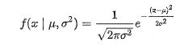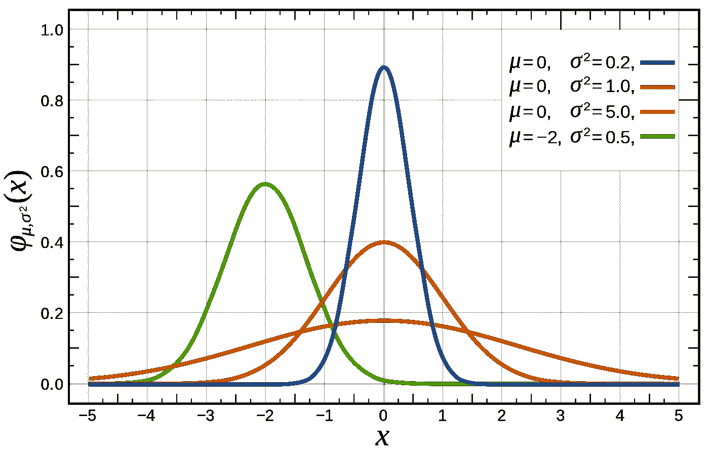

如果我们有一个以上的独立高斯分布，我们可以把它们结合起来。*组合的* PDF 也是高斯的，即多变量高斯。例如两个高斯的示例在下面针对两个高斯(即，二元)示出

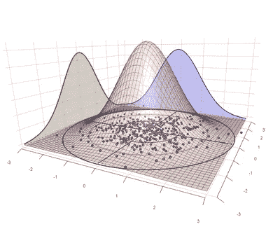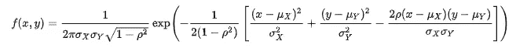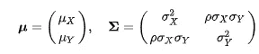

一般来说多元高斯的 PDF 可以具体通过均值、方差(或标准差)和*协方差矩阵(σ)*

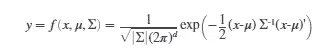

多元(MV)高斯的性质

*   高斯和就是高斯
*   高斯的边际就是高斯
*   调节高斯型也会导致高斯型

如果你想阅读证明或者只是想要方程式，请在这里[看到它们](http://i-systems.github.io/HSE545/machine%20learning%20all/14%20Gaussian%20Process%20Regression/GaussianProcess.html)或者在这里[看到它们](http://i-systems.github.io/HSE545/machine%20learning%20all/14%20Gaussian%20Process%20Regression/GaussianProcess.html#1.1.-The-marginal-pdf-of-a-Gaussian-(is-Gaussian))，摘要在这里[看到它们](https://www.stat.ubc.ca/~will/cx/private/normal_properties.pdf)。回顾这些非常重要，因为大多数与高斯过程相关的数学都是这些基本结果的应用。

**贝叶斯规则**:后验概率是先验概率乘以似然性，即

**后验，P(H|E) =(先验 P(H) *似然 P(E|H))|证据 P(E)**

其中 H 是一些假设，E 是证据。

高斯过程:我们从线性回归方法开始讨论。对于一些输入( *x* ，我们可以写成

这个等式的一种形式是斜率截距形式(忽略噪声项，我们通常将其添加到权重 w 中)

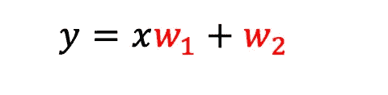

现在让我们改变 w *1(斜率)*和 w *2(截距)，看看结果是什么(演示/gif 可能需要一些时间来加载)*

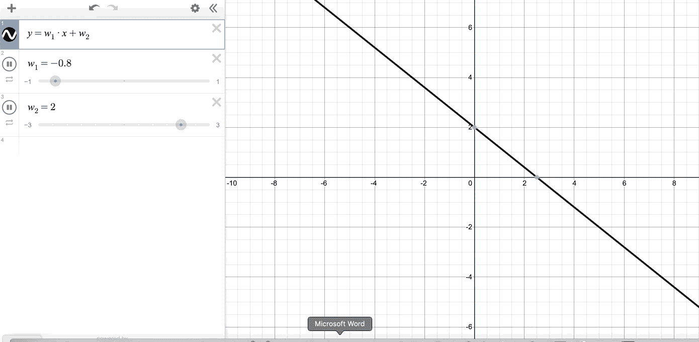

我们有一系列的线！我们试图在参数模型中实现什么，例如这里的线性回归，是为了估计 w(或线性回归的β),它最好地描述了我们的*数据，参见数学* [*这里的*](https://en.wikipedia.org/wiki/Linear_regression) *。*

在贝叶斯线性回归中，我们放置权重 w1 和 w2 的先验，然后获得后验，一旦我们观察到(x，y)即训练集

利用贝耶法则，这是

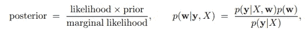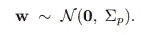

w1 和 w2 可以组合成一个矩阵，并从二元高斯分布中提取。一般来说，对于多元高斯分布，可以画出“n”个权重(β)“w”

**后验**:最能描述我们的训练集(x，y)的权重“w”

**似然**:对于给定的权重和训练输入 x，最像 p(y|x，w)的函数

**边际可能性**是归一化常数，是所有先验和所有可能性的积分

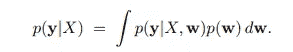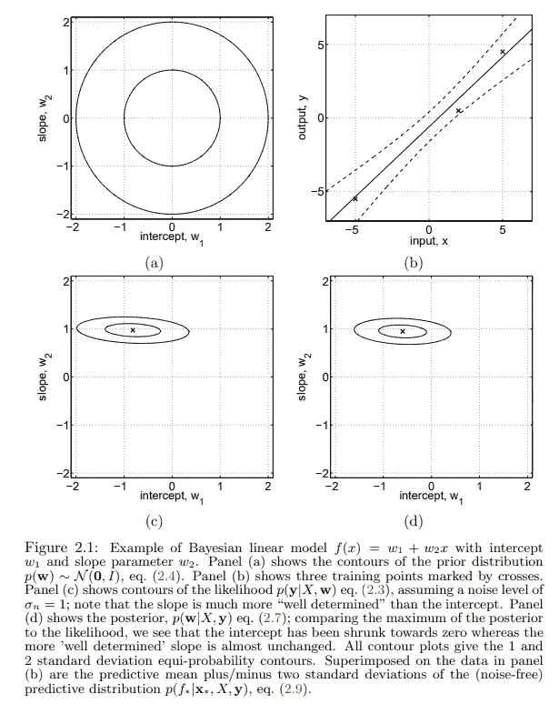

[Source](http://www.gaussianprocess.org/gpml/chapters/RW2.pdf)

在获得后验“w”之后，我们可以将它们用于新数据，即不在我们的训练集(x，y)中的数据，这些数据是从高斯的边缘化属性获得的。

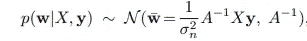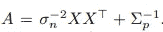

对于新的观察值，我们有 x*并希望获得(f*)或 y*，这使用贝叶斯规则

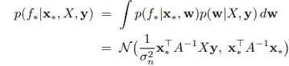

**线性到非线性:**到目前为止我们假设我们的函数是线性的，w 想要获得“w”。对于非线性和一般情况，我们可以用*(x)代替 x，把 x 变换到一个我们可以线性处理的特征空间。然后利用*(x *)应用贝叶斯推理得到 f*或 y*，松散地说变换就是把线性模型变成高斯过程。数学虽然相对简单，但很难评估到底发生了什么。它通常以指定作用于输入 x 的核函数或协方差函数结束。上述方程与核函数的关系很难理解，需要一些努力。为了使事情变得简单，我们求助于直觉。这里讨论的例子来自 Richard Tuner 的[教程](http://cbl.eng.cam.ac.uk/pub/Public/Turner/News/imperial-gp-tutorial.pdf)**

**正如 Tuner 博士解释的那样，让我们从两个相关的高斯分布 y1 和 y2 开始，在图表上绘制它们的高度(随机抽取的)以获得一个新的表示。如果我们从“顶部”看这两个 2D 高斯，它可以产生一个等高线图。这里我们假设这两个高斯函数高度相关，如协方差矩阵所示，均值为零。**

**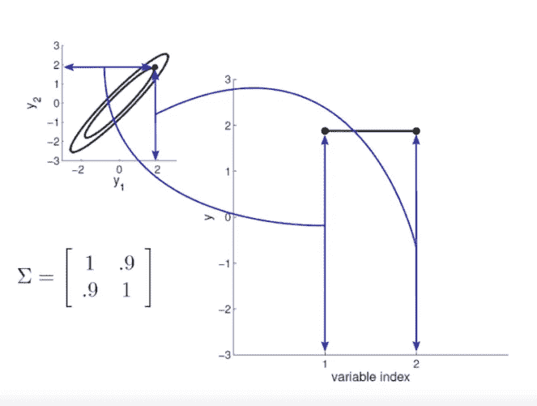**

**现在我们从这两个高斯样本中抽取一些样本，绘制如下**

**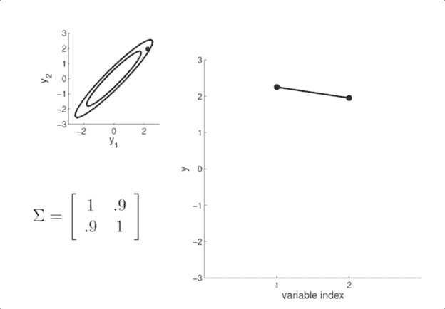**

**现在，我们固定一个高斯，然后从第二个相关的高斯中抽取样本，这限制了第二个样本来自红色显示的较小的高斯。**

**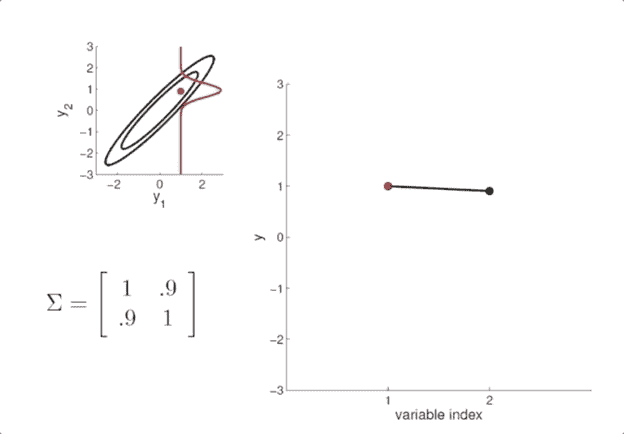**

**我们可以对 20 维高斯进行重复，现在协方差矩阵是由一个“函数”表示的，其中相关在对角线上是强的，而在其他方向上是弱的**

**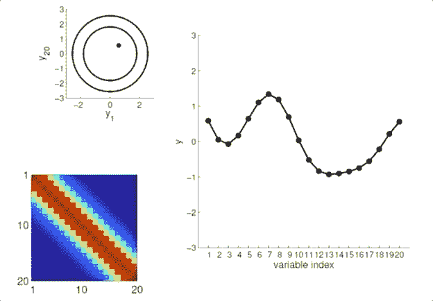**

**这里固定两点，我们控制“蠕动”**

**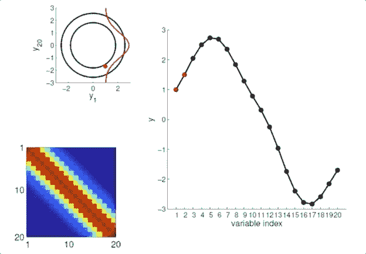**

**一般来说，这对于无限维高斯是可以做到的。其中“y”中的每一个都是通过对任意输入(x)加上 so 噪声起作用的核函数 K 来指定的。I 是单位矩阵。这里我们只选择协方差矩阵 K 的必要部分**

**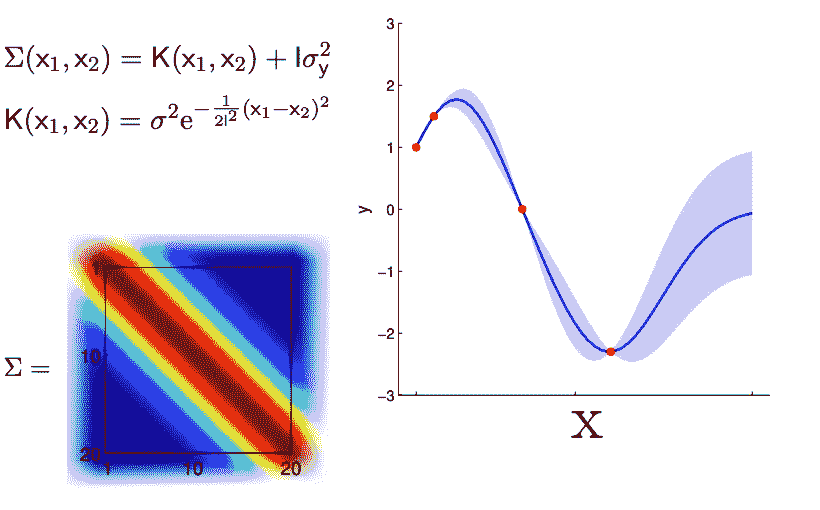**

****核函数或协方差函数 K 是允许我们将我们用线性模型开发的贝叶斯框架应用于任何函数的“诀窍”。通过将输入 x 变换到函数空间 的 *ϕ:基或激活函数，将贝叶斯线性回归的权重空间视图关联到“函数空间”视图*****

**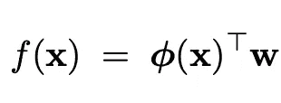**

****(x)由于我们对协方差矩阵(*σ)施加的*技术条件而与核函数相关。σ是正的* [*半定的*](https://en.wikipedia.org/wiki/Definiteness_of_a_matrix) *因此，我们可以应用* [*【奇异值分解】、*](https://en.wikipedia.org/wiki/Singular_value_decomposition) *并由此我们可以写出****

*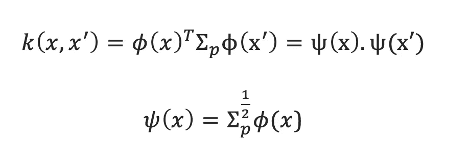*

*这个[内核技巧](https://en.wikipedia.org/wiki/Kernel_method)允许直接处理函数空间中的输入。因此，核函数更重要，因为它直接作用于输入，我们不需要指定权重“w”或**(x)***

**最常见内核函数如下所示**

**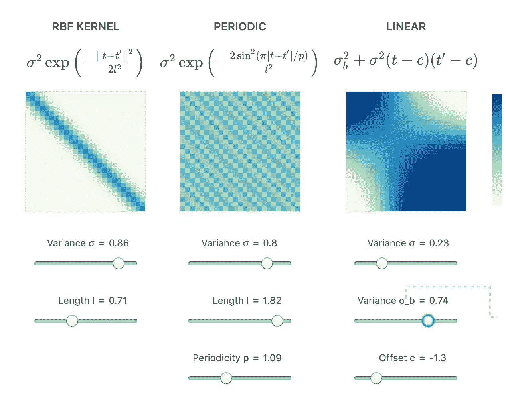**

**For a demo see source of changing parameters of K see the source [here](https://www.jgoertler.com/visual-exploration-gaussian-processes/#PriorFigure)**

**在函数空间视图中，我们写道**

**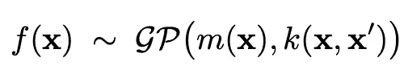**

**通常平均 m(x)是零:你可以认为这是批量标准化数据的工作。**

****定义:高斯过程由(无限)随机变量的集合定义，通过协方差函数 k 指定****

****先验:**当我们从 GP 中抽取先验样本时，我们可以获得任意的函数样本，如下所示。**

****后验:利用我们的训练数据集(x，y)，我们可以获得后验(y 或 f(x)，因为 y = f(x)+噪声)。在这里，我们仅限于仅通过我们的训练数据点的函数，参见两个动画中“y”示例的修复****

**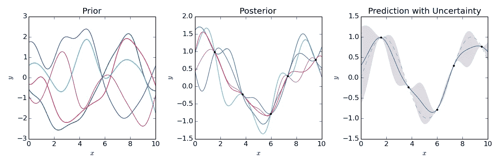**

****预测分布**也可以通过使用特定于 k 的无限协方差矩阵的相关子矩阵来获得。这里的输入是 X*以获得似然性(y 和 f*)。**

**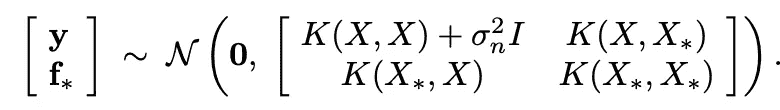**

**由于一切都是高斯的，我们可以应用边际化属性，使用贝叶斯规则获得最终的高斯，这通过方差给出了平均预测函数和不确定性。**

**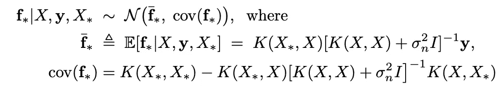**

****直觉:**粗略地说，记住后验分布和预测分布的直觉，对于我们控制蠕动的图形来说更简单，其中红点是我们的训练示例(x，y)，我们已经“固定”了它们，并从其他可能变化的高斯分布中进行选择。在预测时，我们甚至“更少”扭动，因为我们已经固定了更多的数据点(x+x *，y ),因此进一步减少了不确定性。**

**有许多技术细节已经被跳过，所以阅读[拉斯姆森&威廉姆斯](http://www.gaussianprocess.org/gpml/chapters/RW2.pdf)来理解它们是很重要的，因此我们遵循相同的惯例。这篇文章只是为了提供这个丰富的主题的概述，并方便我们广泛使用他们的作品来阅读文献。**

****实现:**在实践中，我们必须选择正确的核(协方差函数)及其参数，并应用 cholskey 分解，但这是计算开销很大的。关于实施问题的说明可在[这里](https://drafts.distill.pub/gp/)获得。为了克服这种限制[变分法](https://arxiv.org/abs/1511.06499)也可以用于像张量流概率这样的框架中。**

****应用** : GP 允许对复杂函数的不确定性进行估计，因此被广泛使用。下面列出的是我个人最喜欢的医学成像。**

**GP 是扩散 MRI 数据后处理的核心。 [fsl](https://fsl.fmrib.ox.ac.uk/fsl/fslwiki/) 工具[漩涡](https://fsl.fmrib.ox.ac.uk/fsl/fslwiki/eddy)基于 GP。获得人脑的准确连接(白质轨迹)是至关重要的一步。显示主要白色轨迹的示例(低分辨率)如下所示**

**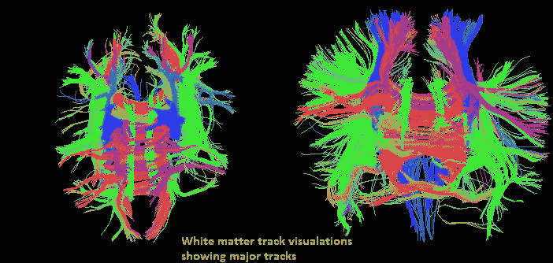**

**无模型方法也用于减少 MRI 扫描采集，以减少研究中的扫描时间。这里通过高斯过程对 MRI 扩散信号建模，然后采用该模型重建 k-q 空间中的缺失采集，如这里的[所示](https://wol-prod-cdn.literatumonline.com/cms/attachment/b6d61118-7db5-4136-bbdd-28a606420813/mrm27699-fig-0001-m.jpg)。这为许多复杂的[采集](https://www.youtube.com/watch?v=2EM3KyTWALE)打开了大门，这些采集不能常规地在临床上进行，因为它们太长并且只限于研究工作。由于需要大量领域知识的专业性质，我们不讨论技术细节，但一定要阅读论文以了解工作的味道和复杂性。**

**参考资料:**

1.  **理查德调谐器的网站【http://cbl.eng.cam.ac.uk/Public/Turner/Presentations **
2.  **尼尔·劳伦斯的博客:[http://inverseprobability.com/](http://inverseprobability.com/)**
3.  **[机器学习的高斯过程，c . e . Rasmussen&c . k . I . Williams 此处提供:](http://www.gaussianprocess.org/gpml/chapters/RW2.pdf)**
4.  **[https://www . jgoertler . com/visual-exploration-Gaussian-processes/# Gaussian processes](https://www.jgoertler.com/visual-exploration-gaussian-processes/#GaussianProcesses)**