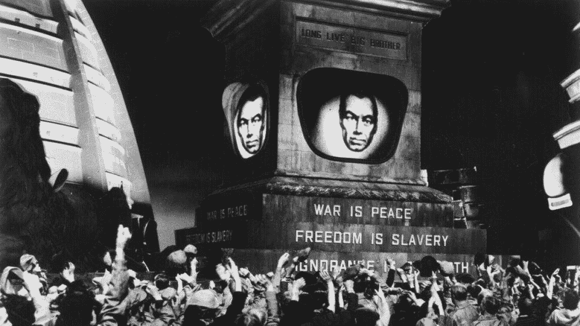
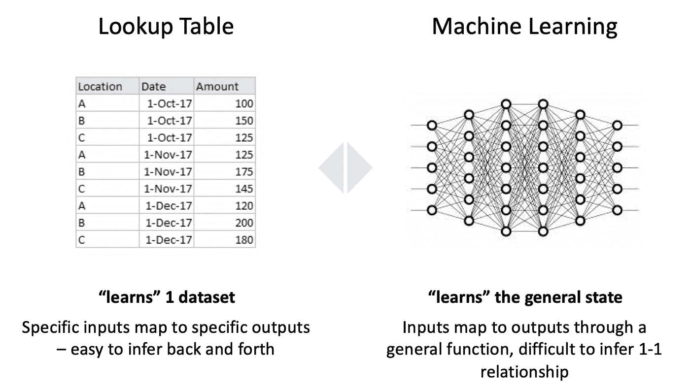
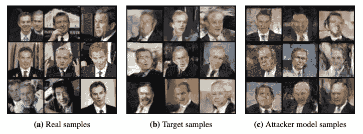
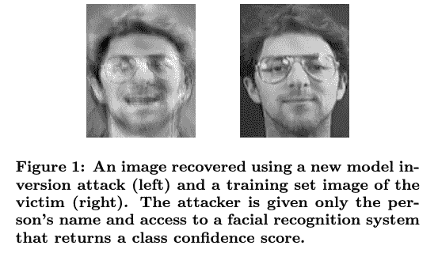
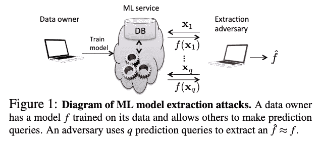
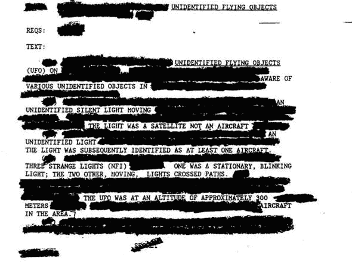

# 对机器学习的隐私攻击

> 原文：<https://towardsdatascience.com/privacy-attacks-on-machine-learning-a1a25e474276?source=collection_archive---------17----------------------->

## [机器学习的安全性](https://towardsdatascience.com/tagged/security-for-ml)

## 或者如何从您的 ML 端点提取您的训练数据和模型

机器学习是[惊人的](https://www.youtube.com/watch?v=hPKJBXkyTKM)，我想我们都同意，很快 ML 将成为你我日常使用的每一个科技产品的标准组件。

然而，挑战在于，伴随着 ML 承诺的所有闪亮的新功能，也出现了大量的漏洞，可供攻击者利用。

攻击者可以利用其中的一些漏洞来扰乱你的模型的思维，并让它输出错误的预测——就像在[逃避](https://medium.com/@iljamoisejevs/evasion-attacks-on-machine-learning-or-adversarial-examples-12f2283e06a1)和[中毒](https://medium.com/@iljamoisejevs/poisoning-attacks-on-machine-learning-1ff247c254db)攻击的情况下。然而，另一些方法允许攻击者从您的模型中提取敏感信息，比如底层数据或模型本身。

我们称这种攻击为对机器学习的隐私攻击——这正是我们今天帖子要讨论的内容。

# 数据

不用说，如果你试图在 YouTube 视频中识别猫，那么数据隐私对你来说可能不是一个大问题。但一旦你开始在银行和医疗保健等行业应用机器学习，控制底层训练数据的访问和传播就成了一个真正的问题。

但首先，让我们后退一步，想想机器学习到底是什么。比如这些机器到底在“学习”什么？希望在看到一定数量的训练数据后，机器能够发现数据中的某些模式。但是，至关重要的是，它不仅能够在同一个数据集内发现它们，而且还可以将其“学习”推广到其他之前未见过的数据集。

概括点很重要。如果我们希望机器只学习训练数据集而不进行归纳，我们可以让它简单地记住每个例子和每个标签，然后使用类似查找表的东西来提取知识。我们通过机器学习跳过所有额外障碍的原因是因为我们希望它学习世界的总体状态，而不仅仅是手头的数据集。

这就是隐私的来源。取决于我们如何构建和训练我们的模型，有时仍然有可能从机器的记忆(参数)中逆向工程机器在训练期间看到的东西。这为隐私攻击打开了几个通道。

第一个，也是最简单的一个是**成员推理攻击**。这时，攻击者手头有一个数据点，并想知道它是否属于原始数据集。想象一下，例如，如果有人想知道你的名字是否在一些敏感的医疗名单上？

这正是这项研究的作者[所做的。他们设计了一种技术，使用建立在原始目标模型上的“影子”模型来决定患者是否在医院出院数据集中。他们在谷歌和亚马逊的商业“ML 即服务”分类器上证明了攻击的成功。](https://arxiv.org/abs/1610.05820)

这里还有一些:

*   [这里](https://arxiv.org/pdf/1705.07663.pdf)攻击者利用 GANs 对生成模型进行攻击。他们 100%成功地推断出哪些样本用于训练白盒攻击的目标模型，80%成功地推断出黑盒攻击的目标模型。

Real samples vs samples from the original generator vs samples the attackers were able to reconstruct using GANs.

*   [在这里](https://arxiv.org/pdf/1811.00513.pdf)，本着 GDPR 等数据保护法规的精神，作者设计了一种方法来检查特定用户的文本数据是否被用于训练一系列语言模型(单词预测、对话生成)。
*   在这里，作者研究了一个联合 ML 系统中敌对内部参与者的威胁。他们得出结论，威胁是真实的，事实上，他们发现不同用户之间的数据集差异越大，就越容易发起攻击。
*   [这里](https://arxiv.org/abs/1708.06145)作者对聚合位置数据进行攻击，以确定特定用户是否是聚合的一部分。
*   最后，以稍微不同的方式，[在这里](https://arxiv.org/abs/1306.4447)作者能够成功地推断出关于基础训练数据的有价值的统计信息。

为了更好地理解成员推理攻击，作者[在这里](https://arxiv.org/pdf/1807.09173.pdf)做了一个非常深入的调查，关于是什么驱动了它们。他们有一些有趣的发现:

*   你训练你的模型的数据很重要。例如，类越多，模型就越脆弱，因为每个类在潜在空间中占据的区域越小，未知空间就越少。
*   你选择的算法也很重要。一般来说，其决策边界不太可能受到特定实例的剧烈影响的算法更有弹性(选择贝叶斯而不是决策树！).
*   白盒知识很重要，但不是全部。例如，尽管多达 10%的数据被噪声所取代，攻击者仍能发动成功的攻击。
*   阴影模型不必像目标模型那样进行训练。事实上，对于作者测试的 7 个数据集中的 5 个，当攻击数据生成模型与目标模型的类型不同时，报告的准确性最高。
*   成员推理攻击就像[敌对例子](https://medium.com/@iljamoisejevs/evasion-attacks-on-machine-learning-or-adversarial-examples-12f2283e06a1)一样可以转移

所以推断一个人是“在”还是“在外”是很有趣的。但是您可能想知道，如果只对分类器进行黑盒访问，是否有可能实际重建一些底层数据？

答案是肯定的(算是)。这种攻击(称为**“数据提取”**或**“模型反演”**)试图提取模型被训练的每个类的平均表示。他们无法提取单个实例，但结果往往相当可怕。

几个例子:

*   [在这里](https://www.usenix.org/system/files/conference/usenixsecurity14/sec14-paper-fredrikson-privacy.pdf)作者从一个训练来预测医疗剂量的 ML 模型中提取了患者的基因组信息(尽管[不清楚](https://github.com/frankmcsherry/blog/blob/master/posts/2016-06-14.md)这是由于模型记忆还是他们使用的辅助信息)。
*   [这里](https://www.cs.cmu.edu/~mfredrik/papers/fjr2015ccs.pdf)作者从一个被训练来进行人脸识别的 ML 模型中提取了特定的人脸图像(还记得我在上面说过的关于平均表示吗？嗯这里 1 类= 1 张人脸图片)。

*   [在这里](https://arxiv.org/pdf/1802.08232.pdf)作者从一个经过私人数据训练的文本生成器中提取了特定的信用卡号码和社会安全号码(他们研究了边缘案例或他们所谓的**“无意识记忆”**)。

# 模型

任何机器学习系统的第二个有价值的部分是模型本身——有一堆理由可能有人想要窃取它(执行**“模型提取】**)。

第一个也是最明显的——因为模型是有价值的。想象一下，您的数据科学团队夜以继日地工作了 6 个月，构建了一个让您从所有竞争对手中脱颖而出的杰作。如果有人通过向您的 API 发送几个查询就成功下载了全部内容，您会有什么感觉？

第二种——也许不太明显，但可以说更危险——因为他们想对你发起[白盒规避攻击](https://medium.com/@iljamoisejevs/will-my-machine-learning-be-attacked-6295707625d8)。通过访问模型渐变精心制作的规避攻击[更加强大](https://medium.com/@iljamoisejevs/evasion-attacks-on-machine-learning-or-adversarial-examples-12f2283e06a1)，因此如果对手可以先下载你的模型，他们将有更大的机会成功攻破你的系统。

不幸的是，在模型提取方面还没有做太多的工作，但在【2016 年的这篇论文中，作者通过观察输入输出对成功提取了模型参数。警告:他们依赖于访问置信度得分，这在现实的黑盒设置中可能可用，也可能不可用。

如果你好奇，这里有几个[其他](https://arxiv.org/abs/1802.05351) [作品](https://arxiv.org/abs/1711.01768)。

# 辩护

就像[闪避](https://medium.com/@iljamoisejevs/part-3-evasion-attacks-on-machine-learning-or-adversarial-examples-12f2283e06a1)和[中毒](https://medium.com/@iljamoisejevs/part-4-poisoning-attacks-on-machine-learning-1ff247c254db)攻击一样，你可以做一些事情来使你的模型更加安全。

让我们从最明显的开始: **API 强化**。我上面链接的大多数论文都依赖于对目标模型的 API 的无限制访问(带有置信度得分)，这使得它成为最容易开始的地方。您可以:

*   根本不公开 API
*   只暴露硬标签，不暴露可信度分数
*   如果您必须公开置信度得分，您可以降低维度。例如，代替显示 64%,你可以把分数分成 3 或 4 个部分，只显示“高”

接下来是**数据清理**。另一个显而易见的要点是——如果你在大量用户信息上训练一个模型，并且不想意外泄露信用卡号码——就把它们过滤掉。你可以尝试在正文中查找所有的 16 位数字，或者一起过滤掉所有的数字。

稍微复杂一点的是**模型硬化**。还记得我们上面讨论的这篇论文的发现吗？我们可以利用其中的一些来使我们的机器学习更加强大:

*   模型选择——例如，贝叶斯模型比决策树更健壮
*   拟合控制-一般来说，过度拟合可以更容易地从模型中提取数据，因此使用正则化是一个好主意
*   知识控制——将模型及其开发限制在一小部分人的范围内，将有助于防止泄露对攻击者有用的知识

接下来是**检测**。为了从模型中提取任何数据，攻击者将不得不多次查询它，如果不是数十次，也可能是数千次。[他们的查询模式](https://ieeexplore.ieee.org/document/8682578)与你的实际用户相比可能是异常的，因此是很好的异常检测材料。

最后还有**差分隐私**。如果你是这个游戏的新手，差分隐私是一个理论框架，旨在提供健壮性的正式保证。更具体地说，它旨在证明仅相差 1 个样本的两个模型将产生相似的预测(使得无法推断该样本)。

用外行人的话来说，差分隐私就是把**噪音**(或者**“随机性”**)注入你的机器学习系统。有很多方法可以做到:

*   扰乱[用户对公共训练池的输入](https://static.googleusercontent.com/media/research.google.com/en//pubs/archive/42852.pdf)(例如，当用户向服务器发送数据时，x%被替换为随机数)
*   扰乱[底层数据](https://arxiv.org/pdf/1807.09173.pdf)
*   扰动[模型](https://arxiv.org/abs/1607.00133)的参数(例如将噪声注入参数更新过程)
*   扰动损失函数(类似于例如 L2 正则化)
*   在预测过程中干扰输出(例如，你的 API 向 x%的用户发送随机噪声)

差别隐私的挑战在于它不是免费的。你想要的保护越多，你分配的“隐私预算”越多，你的模型的性能就越差。例如[这里](http://www.tdp.cat/issues16/tdp.a289a17.pdf)为了防止成员推理攻击，作者不得不遭受从 94.4%到 24.7%的训练准确度损失。模型基本上变得没用了。这里有一个替代差分隐私的有趣方法，适用于这种 DP 本身过于昂贵的情况。

# 结束语

尤其是最近，[隐私是一个大话题](https://techcrunch.com/2019/04/25/facebook-privacy-investigations/)。随着我们越来越多的生活被托付给算法，重要的是我们要确保它们既安全(抵御像[逃避](https://medium.com/@iljamoisejevs/evasion-attacks-on-machine-learning-or-adversarial-examples-12f2283e06a1)或[中毒](https://medium.com/@iljamoisejevs/poisoning-attacks-on-machine-learning-1ff247c254db)这样的攻击)又保护隐私。希望这篇文章能让你对问题有所了解——以及潜在的解决方案。

确保每个人的安全。