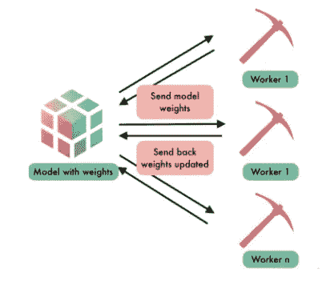

# 私有人工智能——使用 PySyft 和 PyTorch 的联合学习

> 原文：<https://towardsdatascience.com/private-ai-federated-learning-with-pysyft-and-pytorch-954a9e4a4d4e?source=collection_archive---------11----------------------->

## GRU 模型在垃圾短信检测中的应用


OpenMined

# **简介**

在过去的几年里，我们都见证了人工智能和机器学习领域的一个重要而快速的发展。这种快速发展得益于计算能力的提高(通过上一代 GPU 和 TPU 实现)以及多年来积累的每秒钟都在创建的大量数据。

从对话助手到肺癌检测，我们可以清楚地看到 AI 发展对我们社会的几种应用和各种好处。然而，在过去的几年里，这种进步是有代价的:在某种程度上失去了隐私。[剑桥分析公司丑闻](https://en.wikipedia.org/wiki/Facebook%E2%80%93Cambridge_Analytica_data_scandal)敲响了保密和数据隐私的警钟。此外，无论大小，科技公司对数据的使用越来越多，导致多个司法管辖区的当局致力于制定有关数据保护和隐私的法规和法律。欧洲的 [GDPR](https://en.wikipedia.org/wiki/General_Data_Protection_Regulation) 是这种行为最著名的例子。

这些担忧和法规与人工智能和机器学习的发展并不直接兼容，因为模型和算法总是依赖于数据的可用性和将其集中在大型服务器中的可能性。为了解决这个问题，一个新的研究领域引起了 ML 研究者和实践者的兴趣:私有和安全的 AI。

# **什么是私有安全 AI？**

这个新领域由一系列技术组成，这些技术允许 ML 工程师在不直接访问用于训练的数据的情况下训练模型，并避免他们通过使用密码术获得关于数据的任何信息。

这看起来像是黑魔法，不是吗？

不要担心…在一系列文章中，我将展示它是如何工作的，以及我们如何通过开源库 [PySyft](https://github.com/OpenMined/PySyft) 将它应用于我们自己的 Python 深度学习模型。

该框架依赖于三种主要技术:

*   联合学习
*   差异隐私
*   安全多方计算

在本文中，我将介绍联合学习及其在垃圾短信检测中的应用。

# 联合学习

也许是私人人工智能中最容易理解的概念，联合学习是一种训练人工智能模型的技术，而不必将数据移动到中央服务器。谷歌在 2016 年发表的一篇论文[中首次使用了这个术语。](https://arxiv.org/pdf/1602.05629.pdf)



Schema of a Federated Learning task

主要思想是，我们不是将数据带到模型中，而是将模型发送到数据所在的位置。

由于数据位于几个设备中(在这里我称之为 workers ),模型被发送给每个 worker，然后再发送回中央服务器。

现实世界中联合学习的一个简单例子发生在苹果设备上。应用程序 QuickType(苹果的文本预测工具)实际上使用的模型通过 WiFi 不时发送到 iOS 设备，用用户的数据在本地进行训练，然后发送回苹果的中央服务器，并更新其权重。

# PySyft

PySyft 是一个为联邦学习和隐私保护而构建的开源库。它允许其用户执行私人和安全的深度学习。它是作为一些 DL 库的扩展而构建的，如 PyTorch、Keras 和 Tensorflow。

[](https://github.com/OpenMined/PySyft) [## 露天开采/PySyft

### 一个加密的、保护隐私的深度学习库

github.com](https://github.com/OpenMined/PySyft) 

如果你更感兴趣，你也可以看看 OpenMined 发表的关于这个框架的[论文](https://arxiv.org/pdf/1811.04017.pdf)。

在本文中，我将展示一个使用 PyTorch 的 PySyft 扩展的教程。

## 入门-设置库

为了安装 PySyft，建议您首先设置一个 conda 环境:

```
conda create -n pysyft python=3
conda activate pysyft # or source activate pysyft
conda install jupyter notebook
```

然后安装软件包:

```
pip install syft
```

请确保您的环境中也安装了 PyTorch 1.0.1 或更高版本。

*如果你有一个关于 zstd 的安装错误，尝试卸载 zstd 并重新安装。*

```
pip uninstall zstd
pip install --upgrade zstd
```

*如果您在设置时仍然遇到错误，您也可以使用* [*Colab*](https://colab.research.google.com/) *笔记本并运行以下代码行:*

```
!pip install syft
```

# 使用 PySyft 和 PyTorch 检测垃圾短信

包含以下代码的 jupyter 笔记本可以在我的 GitHub 页面上找到。

[](https://github.com/andrelmfarias/Private-AI) [## andrelmfarias/私人-AI

### 包含教程和应用程序的库，带有 PySyft-andrelmfarias/Private-AI 的 Private-AI 算法

github.com](https://github.com/andrelmfarias/Private-AI) 

在本教程中，我将模拟两个工人，Bob 和 Anne 的设备，在那里存储 SMS 消息。使用 PySyft，我们可以通过使用 *VirtualWorker* 对象的抽象来模拟这些远程机器。

首先，我们钩住 PyTorch:

```
import torch
import syft as sy
hook = sy.TorchHook(torch)
```

然后，我们创建*虚拟工人:*

```
bob = sy.VirtualWorker(hook, id="bob")
anne = sy.VirtualWorker(hook, id="anne")
```

我们现在可以用方法*向工人发送张量。*送(工)。例如:

```
x = torch.Tensor([2,2,2]).send(bob)
print(x)
```

您可能会得到类似这样的输出:

> (Wrapper)>[pointer tensor | me:79601866508-> bob:62597613886]

您还可以检查指针所指张量的位置:

```
print(x.location)
```

> <virtualworker id:bob=""></virtualworker>

我们可以看到张量位于一个叫做“鲍勃”的*虚拟工作者*处，这个工作者有一个张量。

现在，您可以使用这些指针进行远程操作:

```
y = torch.Tensor([1,2,3]).send(bob)
sum = x + y
print(sum)
```

> (Wrapper)>[pointer tensor | me:40216858934-> bob:448194605]

你可以看到在操作之后我们得到了一个指针作为返回。要取回张量，你需要使用方法*。get()*

```
sum = sum.get()
print(sum)
```

> 张量([3。, 4., 5.])

最令人惊奇的是，我们可以在这些指针上实现 PyTorch API 提供的所有操作，例如计算损失、将梯度归零、执行反向传播等。

现在你已经理解了*虚拟工人*和*指针*的基础，我们可以使用联合学习来训练我们的模型。

## 准备数据并将其发送给远程工作人员

为了模拟远程数据，我们将使用 [UCI 机器学习库](https://archive.ics.uci.edu/ml/index.php)上的[垃圾短信收集数据集](https://archive.ics.uci.edu/ml/datasets/sms+spam+collection)。它由大约 5500 条短信组成，其中大约 13%是垃圾短信。我们将大约一半的消息发送到 Bob 的设备，另一半发送到 Anne 的设备。

对于这个项目，我执行了一些文本和数据预处理，我不会在这里展示，但如果你感兴趣，你可以看看我在我的 [**GitHub**](https://github.com/andrelmfarias/Private-AI) 页面上使用的 [**脚本**](https://github.com/andrelmfarias/Private-AI/blob/master/Federated_Learning/preprocess.py) 。还请注意，在现实生活中，这种预处理将在每个用户的设备中完成。

让我们加载处理过的数据:

```
# Loading data
inputs = np.load('./data/inputs.npy')
inputs = torch.tensor(inputs)
labels = np.load('./data/labels.npy')
labels = torch.tensor(labels)# splitting training and test data
pct_test = 0.2
train_labels = labels[:-int(len(labels)*pct_test)]
train_inputs = inputs[:-int(len(labels)*pct_test)]
test_labels = labels[-int(len(labels)*pct_test):]
test_inputs = inputs[-int(len(labels)*pct_test):]
```

然后，我们将数据集一分为二，发送给带有 sy 类的工人。基础数据集:

在 PyTorch 中训练时，我们使用数据加载器来迭代批处理。使用 PySyft，我们可以使用 FederatedDataLoaders 进行类似的迭代，其中批处理以联合的方式来自几个设备。

## 训练 GRU 模型

对于这个任务，我决定使用一个基于一层 GRU 网络的分类器。不幸的是，PySyft 的当前版本还不支持 PyTorch 的 RNNs 模块。然而，我能够手工制作一个简单的线性图层的 GRU 网络，这是 PySyft 支持的。

因为我们这里的重点是 PySyft 框架的使用，所以我将跳过模型的构建。如果你对我是如何构建的感兴趣，你可以在我的 [**GitHub**](https://github.com/andrelmfarias/Private-AI) 页面查看一下这个 [**脚本**](https://github.com/andrelmfarias/Private-AI/blob/master/Federated_Learning/handcrafted_GRU.py) 。

让我们启动模型！

```
from handcrafted_GRU import GRU# Training params
EPOCHS = 15
CLIP = 5 # gradient clipping - to avoid gradient explosion 
lr = 0.1
BATCH_SIZE = 32# Model params
EMBEDDING_DIM = 50
HIDDEN_DIM = 10
DROPOUT = 0.2# Initiating the model
model = GRU(vocab_size=VOCAB_SIZE, hidden_dim=HIDDEN_DIM, embedding_dim=EMBEDDING_DIM, dropout=DROPOUT)
```

现在训练它！

请注意第 8、12、13 和 27 行。这些步骤将 PyTorch 的集中培训与 PySyft 的联合培训区分开来。

在训练循环结束时取回模型后，我们可以使用它在本地或远程测试集上用类似的方法评估它的性能。在这种情况下，我能够获得超过 97.5%的 [AUC 得分](https://scikit-learn.org/stable/modules/generated/sklearn.metrics.roc_auc_score.html)，表明以联合方式训练模型不会损害性能。然而，我们可以注意到整体时间计算的增加。

# 结论

我们可以看到，使用 PySyft 库及其 PyTorch 扩展，我们可以使用张量指针执行操作，就像我们可以使用 PyTorch API 一样(但仍有一些限制需要解决)。

由于这一点，我们能够在不访问远程和私有数据的情况下训练垃圾邮件检测器模型:对于每一批，我们将模型发送给当前的远程工作器，并在将其发送给下一批的工作器之前将其返回到本地机器。

然而，这种方法有一个限制:通过取回模型，我们仍然可以访问一些私人信息。假设 Bob 的机器上只有一条短信。当我们取回模型时，我们只需检查模型的哪些嵌入发生了变化，就可以知道哪些是 SMS 的标记(单词)。

为了解决这个问题，有两种解决方案:差分隐私和安全多方计算(SMPC)。差分隐私将用于确保该模型不会提供对某些隐私信息的访问。SMPC 是一种加密计算，作为回报，它允许您私下发送模型，这样拥有数据的远程工作人员就看不到您使用的重量。

我将在下一篇文章中展示我们如何用 PySyft 执行这些技术。

欢迎随时给我反馈和提问！

如果你有兴趣学习更多关于安全和私人人工智能以及如何使用 PySyft 的知识，你也可以在 Udacity 上查看这个免费课程 [**。这是一门很棒的初学者课程，由 Andrew Trask 教授，他是 OpenMined Initiative 的创始人。**](https://eu.udacity.com/course/secure-and-private-ai--ud185)

# 来源:

*   OpenMined 关于 PySyft 在 arXiv 上的文章:【https://arxiv.org/pdf/1811.04017.pdf 
*   谷歌关于联邦学习的文章:[https://arxiv.org/pdf/1602.05629.pdf](https://arxiv.org/pdf/1602.05629.pdf)
*   PySyft 初学者教程:[https://github . com/open mined/PySyft/tree/dev/examples/tutorials](https://github.com/OpenMined/PySyft/tree/dev/examples/tutorials)
*   联邦学习概述:[https://medium . com/@ ODSC/an-open-framework-for-secure-and-private-ai-96c 1891 a4b](https://medium.com/datadriveninvestor/an-overview-of-federated-learning-8a1a62b0600d)
*   一个安全私有 AI 的开放框架:[https://medium . com/@ ODSC/an-Open-Framework-for-Secure-and-Private-AI-96c 1891 a 4b](https://medium.com/@ODSC/an-open-framework-for-secure-and-private-ai-96c1891a4b)
*   PyTorch + PySyft 的 10 行联合学习:[https://blog . open mined . org/upgrade-to-federated-Learning-in-10-lines/](https://blog.openmined.org/upgrade-to-federated-learning-in-10-lines/)