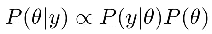
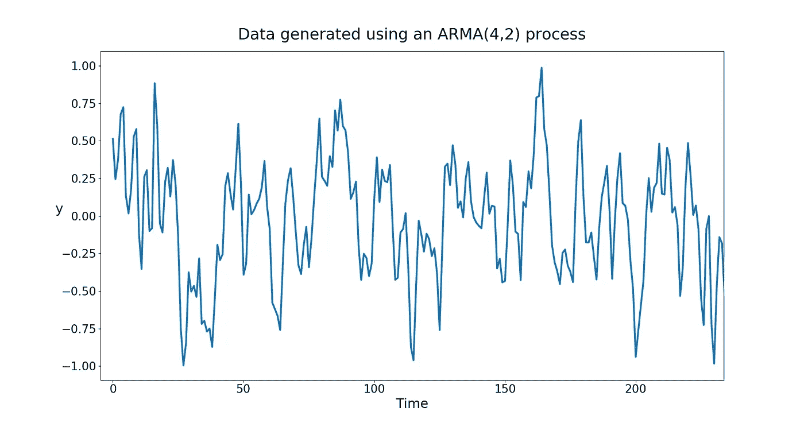
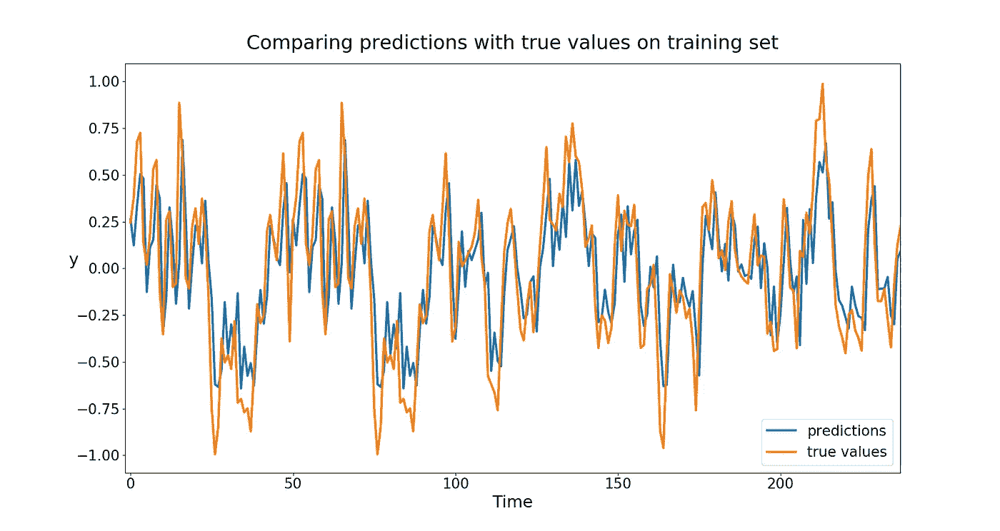
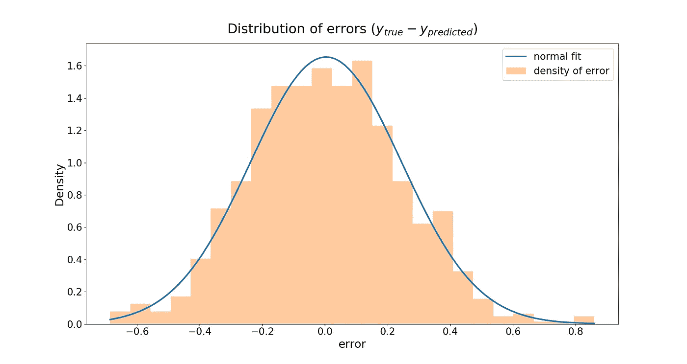
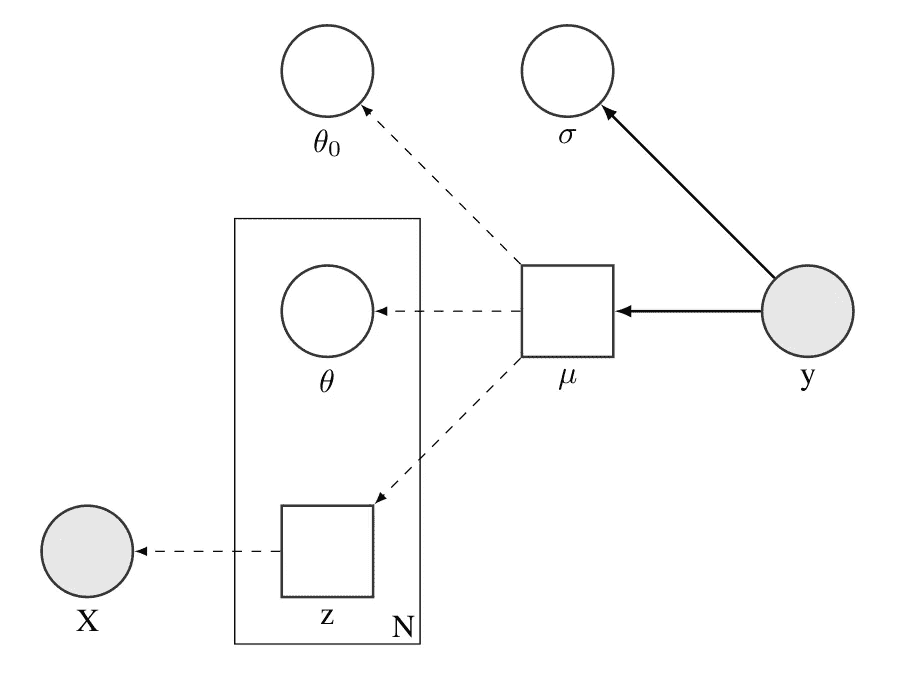
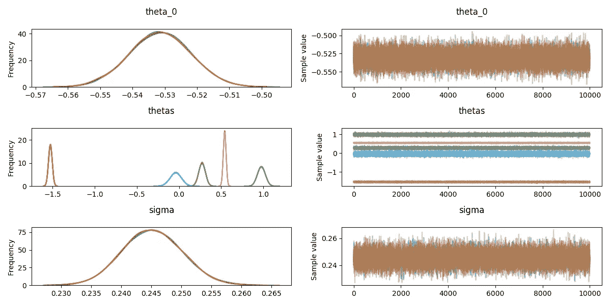
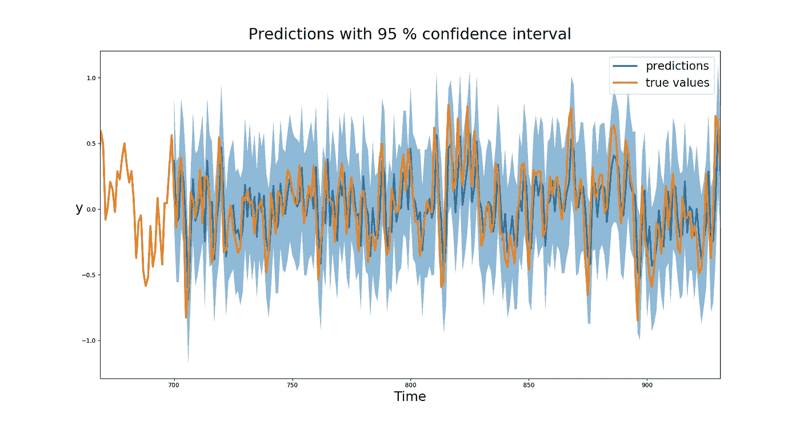

# 概率机器学习系列文章 1:使用神经网络作为贝叶斯模型的一部分

> 原文：<https://towardsdatascience.com/probabilistic-machine-learning-series-post-1-c8809652dd60?source=collection_archive---------10----------------------->

source: [https://www.pexels.com/photo/ask-blackboard-chalk-board-chalkboard-356079/](https://www.pexels.com/photo/ask-blackboard-chalk-board-chalkboard-356079/)

这一系列将是关于概率机器学习的不同实验和例子。概率机器学习的优势在于，我们将能够提供概率预测，并且我们可以分离来自模型不同部分的贡献。在第一篇文章中，我们将使用神经网络作为贝叶斯模型的一部分进行实验。这使得我们可以通过贝叶斯框架提供的不确定性估计来使用深度学习的特征学习方面。对于那些不熟悉贝叶斯框架的人，建议阅读[第一章《黑客概率编程和贝叶斯方法》](https://nbviewer.jupyter.org/github/CamDavidsonPilon/Probabilistic-Programming-and-Bayesian-Methods-for-Hackers/blob/master/Chapter1_Introduction/Ch1_Introduction_PyMC2.ipynb)。简而言之，在贝叶斯框架中，概率被视为基于先验知识的信任程度。最终结果是，我们将看到数据是固定的，参数是随机变量。因此，我们模型的参数将由分布来表示。相比之下，在 frequentist 框架中，参数是固定的，但数据是随机的。代表不同样本的预期结果的置信区间。我们将使用数值方法评估后验 P(θ|y)。后验概率与可能性 P(y|θ)乘以前验概率 P(θ)成正比。

The posterior, left-hand side, is proportional to the likelihood times the prior.

对于我们的实验，主要假设是训练一个神经网络，作为特征提取器，用于贝叶斯线性回归。根据数据类型选择神经网络结构。我们的例子将是关于时间序列预测，所以我们将使用一个 [LSTM](https://colah.github.io/posts/2015-08-Understanding-LSTMs/) (长期短期记忆)神经网络，因为它将能够提取时间相关性。神经网络与贝叶斯模型的这种完全分离的主要优点是，给出良好特征的预训练神经网络可以用于进行概率预测。缺点之一是我们失去了贝叶斯深度学习对于神经网络的正则化方面，而这需要以其他方式实现。

我们的目标是对仅使用短期时间相关性生成的时间序列进行概率预测，即 [ARMA(4，2)](https://en.wikipedia.org/wiki/Autoregressive%E2%80%93moving-average_model) 。时间序列分为两部分。第一个是自回归 AR(4)，这意味着下一个值线性依赖于最后四个值。第二部分是移动平均部分 MA(2 ),这意味着下一个值也将取决于最后两个噪声值。这两部分结合起来就构成了 ARMA(4，2)过程。LSTM 将识别时间序列中的结构，而贝叶斯模型将提供概率估计。第一步，我们将训练一个具有线性最后一层的 LSTM，它将模拟贝叶斯线性回归。之后，我们将把 LSTM 作为特征提取器包含在我们的贝叶斯模型中。我们将在第三部分描述完整的模型。接下来的三个部分将是关于

*   训练 LSTM，
*   描述贝叶斯模型和
*   进行概率预测

但是我们先来看看生成的数据。

由于过程是 ARMA (4，2)，我们只有短期相关性，没有季节性(也没有周期)和趋势。如果我们有了这两个组件，就需要进一步的预处理，但是我们希望在这个例子中保持乐观。在继续之前，我想提一下 LSTM 是在 PyTorch 中实现的，贝叶斯模型是在 [PyMC3](https://docs.pymc.io/) 中实现的。

## 步骤 1:训练 LSTM

用具有均方误差损失的七个时间步长的序列来训练 LSTM。我们使用早期停止来防止过度拟合。我们可以在接下来的图中看到，我们对训练集的预测接近真实值，并且可以使用正态分布很好地拟合误差。

我们现在有了一个准确的时间序列预测器，它只能给出逐点的预测。在下一节中，我们将把它包括在贝叶斯模型中，以获得概率预测。

## 第二步:贝叶斯模型

首先，我们将查看模型的图形表示。白色圆圈是随机节点，阴影圆圈是观测值，方形节点是确定性变换的结果。实线箭头指向随机节点的参数，虚线是确定性变换。我们从 y 开始，这是我们想要预测的值。

**Figure 3: Graphical representation of our Bayesian model**

我们假设 y 遵循一个正态(μ，σ)。μ相当于我们的 LSTM 预测值，定义如下

其中 z *ᵢ* 是 LSTM 的最后一个隐藏状态，θ *ᵢ* 是线性层的权重，θₒ是偏差，n 是 LSTM 的最后一个隐藏状态的数量。LSTM 模型的最后一层与贝叶斯模型的主要区别在于，权重和偏差将由正态分布表示，而不是点估计(即单个值)。σ是权重的不确定性无法捕捉到的预测值的随机误差。在这一点上，z 可以被认为是由观测数据的 LSTM 完成的确定性变换。由于权重的不确定性不取决于具体的数据值本身，我们只描述模型的不确定性。将 LSTM 纳入贝叶斯模型的步骤如下:

*   我们用线性的最后一层来训练 LSTM
*   我们删除了最后一层，并使用 LSTM 作为特征提取器
*   我们用贝叶斯线性回归代替了原始的线性层

现在我们已经知道了我们想要评估的模型的所有参数，让我们看看使用 ADVI ( [自动微分变分推断](https://arxiv.org/pdf/1603.00788.pdf))和使用 MCMC ( [马尔可夫链蒙特卡罗](https://en.wikipedia.org/wiki/Markov_chain_Monte_Carlo))的一些微调获得的它们的分布。这些推理数值方法通过使用 ADVI 后验概率作为 MCMC 先验进行组合，这在 PyMC3 中很容易实现。ADVI 方法的优点是可扩展，但只能给出一个近似的后验概率。MCMC 方法较慢，但收敛于精确的后验概率。在下一篇文章中，我们将更详细地探讨这些问题。

在这一步中，我们将训练好的 LSTM 作为贝叶斯模型的一部分。我们已经获得了参数的分布，这些分布是上一步中的点估计。我们现在准备进行概率预测。

## 步骤 3:进行概率预测

使用后验预测检查进行预测(即，给定特征的模型参数被采样以获得概率预测)。我们可以在下图中看到 95%置信区间的结果。我们可以注意到，大多数预测都接近真实值，并且大多数预测都落在置信区间内。

Time series predictions (blue) with 95% confidence interval (shaded blue) and the true values (orange)

让我们简单回顾一下。为了获得准确的预测，我们在 LSTM 进行了时间序列的训练。我们可以就此打住，但是我们想要一个概率预测。正因为如此，我们使用 LSTM 作为贝叶斯模型的特征提取器。由于贝叶斯模型参数由分布表示，我们可以描述模型的不确定性。然后，贝叶斯模型用于使用后验预测检查进行概率预测。这个帖子里汇集了很多想法。如前所述，这是概率建模系列文章的一部分，所以我们将在以后的文章中单独处理其中的一些部分。

感谢阅读！

**参考资料和建议阅读:**

[*【1】*](http://www.stat.columbia.edu/~gelman/book/)*a .盖尔曼、j .卡林、h .斯特恩、d .邓森、a .韦赫塔里和 d .鲁宾*、* [*贝叶斯数据分析*](http://www.stat.columbia.edu/~gelman/book/) *(2013)、*查普曼和霍尔/CRC*

*[*【2】*](https://github.com/CamDavidsonPilon/Probabilistic-Programming-and-Bayesian-Methods-for-Hackers)c .戴维森-皮隆*、* [*面向黑客的贝叶斯方法:概率编程与贝叶斯推理*](https://github.com/CamDavidsonPilon/Probabilistic-Programming-and-Bayesian-Methods-for-Hackers) *(2015)、*艾迪森-卫斯理专业*

*[*【3】*](https://arxiv.org/pdf/1603.00788.pdf)a . Kucukelbir、D. Tran、R. Ranganath、A. Gelman 和 D. M. Blei、 [*自动微分变分推理*](https://arxiv.org/pdf/1603.00788.pdf)【2016】、ArXiv*