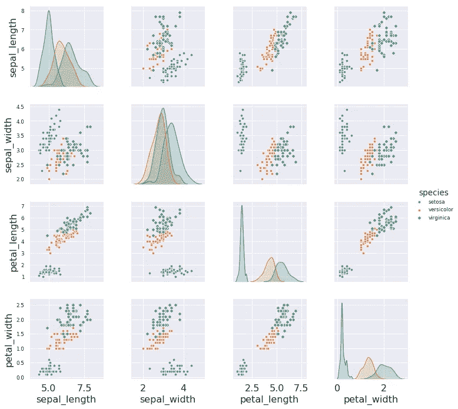
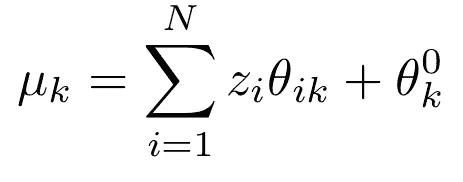
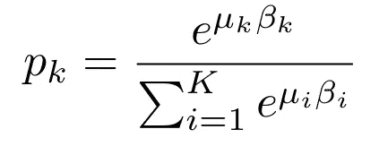
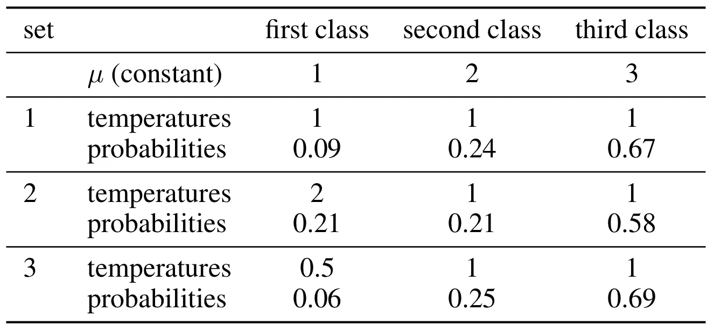
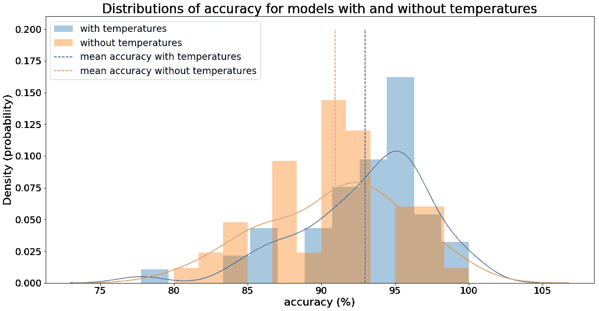
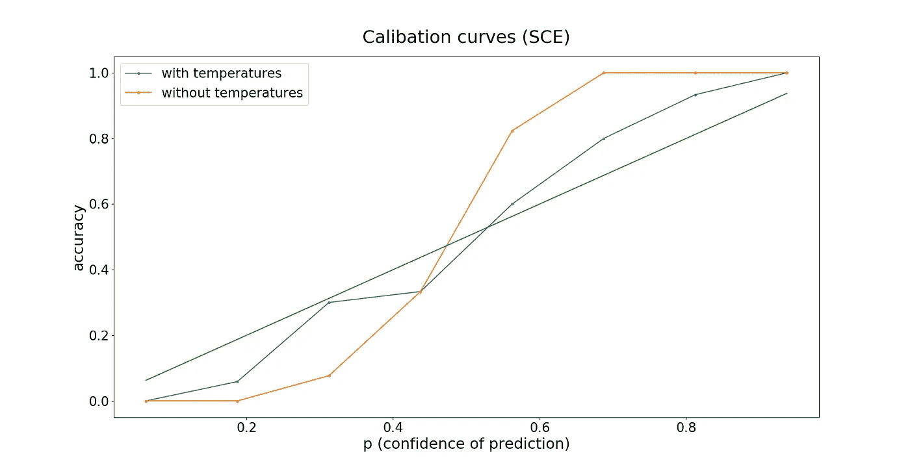
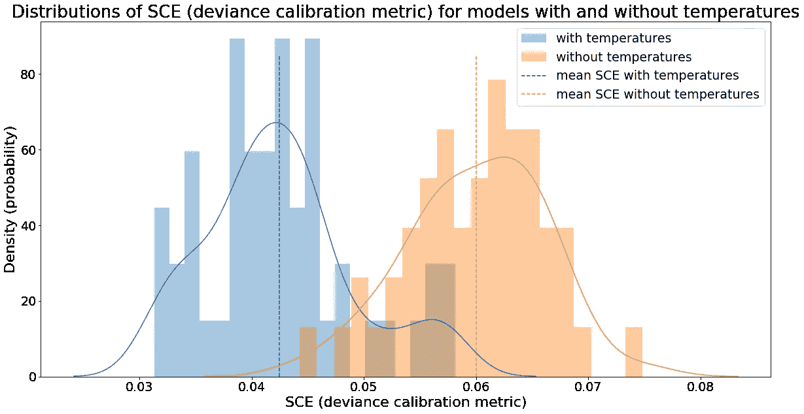
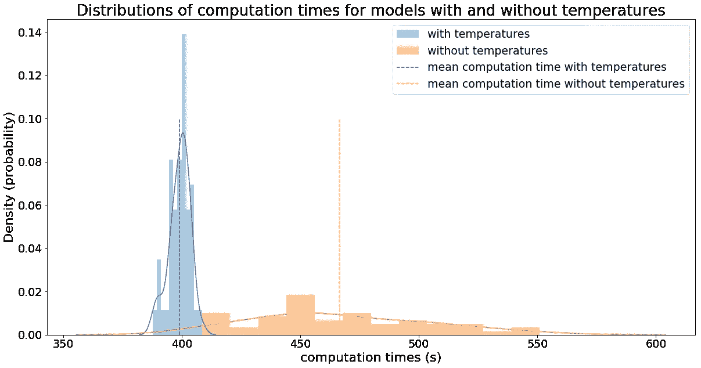
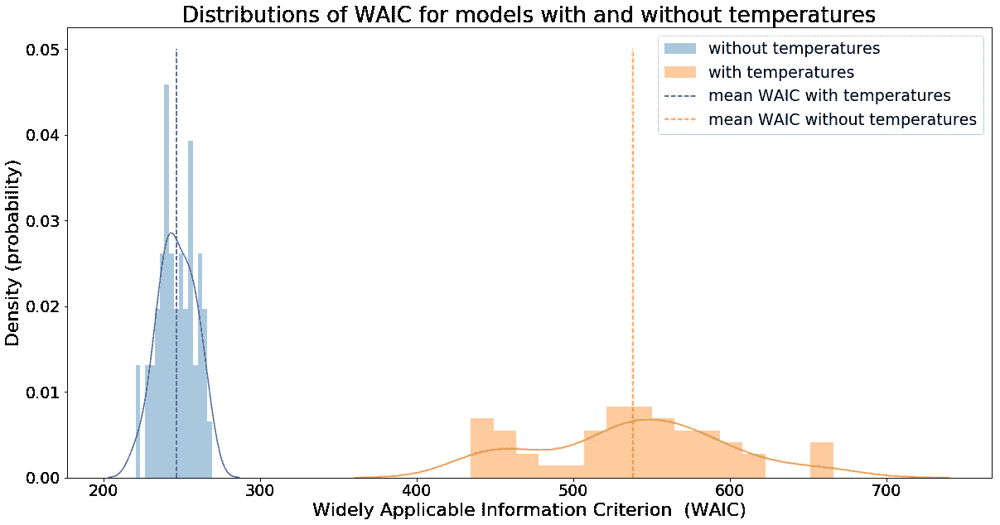

# 概率机器学习系列文章之二:模型比较

> 原文：<https://towardsdatascience.com/probabilistic-machine-learning-series-post-2-model-comparison-5c6504beb235?source=collection_archive---------20----------------------->

[source](https://www.pexels.com/photo/ask-blackboard-chalk-board-chalkboard-356079/)

将原始数据转换为机器学习模型必须遵循许多步骤。这些步骤对于非专家来说可能很难，而且[数据量还在持续增长](https://www.forbes.com/sites/bernardmarr/2018/05/21/how-much-data-do-we-create-every-day-the-mind-blowing-stats-everyone-should-read/#53b2de8360ba)。解决[人工智能技能危机](https://www.forbes.com/sites/bernardmarr/2018/06/25/the-ai-skills-crisis-and-how-to-close-the-gap/#6d144a7d31f3)的一个建议是进行自动机器学习(AutoML)。一些著名的项目是[谷歌云汽车](https://cloud.google.com/automl/)和[微软汽车](https://www.microsoft.com/en-us/research/project/automl/)。自动机器学习的问题包括不同的部分:神经结构搜索、模型选择、特征工程、模型选择、超参数调整和模型压缩。在本帖中，我们将对模型选择感兴趣。

模型选择可以被看作是一项微不足道的任务，但是我们将会看到，要获得模型质量的全貌，需要许多度量标准。在选择模型时，通常想到的衡量标准是准确性，但是在继续之前，还需要考虑其他因素。为了探究这个问题，我们将比较同一个数据集的两个相似的模型类。

在[之前的帖子](/probabilistic-machine-learning-series-post-1-c8809652dd60)中，我们能够对一个时间序列进行概率预测。这就提出了一个问题，即预测的概率是否与经验频率相对应，这被称为模型校准。直观上，对于分类问题，我们希望 80%置信度的预测具有 80%的准确性。有人可能会问，为什么最后准确度还不够。如果在决策过程中使用这些结果，如果预测是错误的，过度自信的结果可能导致更高的成本，而在预测不自信的情况下，可能导致机会的损失。例如，假设我们有一个模型，可以根据土壤样本预测特定地区是否存在贵重矿物。由于贵重矿物的勘探钻井可能耗时且成本高昂，因此在校准模型时，通过关注高可信度预测，可以大大降低成本。

正如贾斯汀·汀布莱克在电影《时间里的 T0》中向我们展示的那样，时间可以是一种货币，所以我们要比较的下一个方面是训练一个模型所需的时间。尽管我们将使用小数据集(即经典的 Iris 数据集)，但有许多理由跟踪训练模型所需的时间。例如，一些基于重采样的模型测试技术(例如:交叉验证和自举)需要用不同的数据样本进行多次训练。因此，模型将不会只被训练一次而是多次。当算法将被投入生产时，我们应该期待路上的一些颠簸(如果不是颠簸，希望是新数据！)并且知道重新训练和重新部署模型需要多少时间是很重要的。对训练一个模型所需时间的准确估计也将表明是否需要对更大的基础设施进行投资。

用于比较模型的最后一个方面(见后文)将是使用广泛适用的信息标准(WAIC)的模型的预测能力/复杂性。该标准可用于比较具有完全不同参数的相同任务的模型[【1】](http://www.stat.columbia.edu/~gelman/book/)。它是标准 AIC 的贝叶斯版本(另一个信息标准或 Alkeike 信息标准)。信息标准可以被视为交叉验证的一种近似，这可能很耗时[【3】](http://www.stat.columbia.edu/~gelman/research/published/waic_understand3.pdf)。

# 有哪些数据？

使用的数据集现在是机器学习的经典:虹膜分类问题。分类是基于萼片和花瓣的测量。这些数据是由英国统计学家和生物学家罗伯特·费希尔在 1936 年提出的。在下图中，长度和宽度的分布基于物种显示。线性分类器应该能够对除海滨锦鸡儿和杂色锦鸡儿以外的边缘物种进行准确的分类。

Pairplots of the features which will be used for the classification. A linear classifier should be able to make accurate classification except on the fringe of the virginica and versicolor species.

# 我们要对比的车型有哪些？

将为分类问题训练线性分类器。首先，使用特征的线性组合为每个类计算μ。

Equation for the calculation of μ for each of the k class using the N features.

然后，每个类的μ用于我们的 softmax 函数，该函数提供 0 到 1 之间的值(pₖ)。这个值(pₖ)将是索引为 k 的类的概率

Softmax function for the probability p of belowing to the k class based on the previous calculation of μ.

在第一个模型中，β都是常数，等于 1。这将被称为无温度模型(借用物理学术语，因为该函数类似于统计物理学中的配分函数)。第二个模型将对每个类有不同的β，这将增加模型的复杂性(更多的参数)，但希望也将给出更好的结果。在文献[【4】](https://arxiv.org/pdf/1507.04544.pdf)[【5】](https://arxiv.org/pdf/1905.00174.pdf)中可以找到机器学习中用于校准的温度的用法。计算概率时，改变温度会影响每个μ的相对比例。举个例子，我们假设μ₁ = 1，μ₂ = 2，μ₃ = 3。将所有的初始温度固定为一，我们得到的概率是 p₁ = 0.09，p₂ = 0.24，p₃ = 0.67。现在让我们保持相同的温度β₂ = β₃ = 1，但是将第一个温度增加到 2(β₁= 2)。结果概率变成了 p₁ = 0.21，p₂ = 0.21，p₃ = 0.58。最后，如果我们将第一个温度降低到 0.5，第一个概率将向下移动到 p₁ = 0.06，其他两个将调整到 p₂ = 0.25 和 p₃ = 0.69。

Summary of the resulting probabilities for differents temperatures by keeping the μ values fixed.

我们在下面的图形模型中表示了参数和观测值之间的依赖关系。阴影圈是观察结果。z 是特征(萼片长度、萼片宽度、花瓣长度和花瓣宽度),类是用分类变量建模的花的种类。正方形代表其他变量的确定性变换，例如μ和 p，它们的方程已经在上面给出。圆圈是我们试图找到其分布的随机参数(θ和β)。方框表示参数重复出现的次数，由右下角的常数给出。

Graphical representation of the model with temperatures.

# 哪种模型的精确度最高？

尽管这不是一个模型唯一重要的特征，一个不精确的模型可能不是很有用。对于 50 个不同的训练/测试分割(0.7/0.3)，计算两个模型的准确度。这样做是因为我们想要比较模型类，而不是学习模型的特定实例。对于同一个模型规格，很多训练因素会影响最终学习到哪个具体的模型。其中一个因素是所提供的训练数据。由于数据集很小，训练/测试分割可能会导致获得的模型发生很大变化。正如我们在下图中看到的，在测试集上，温度模型的平均精确度为 92.97 %(标准差:4.50 %)，而没有温度时，平均精确度为 90.93 %(标准差:4.68 %)。

Distribution of accuracies of fifty different random train/test split for the model with and without temperatures. The model with temperatures has an average accuracy on the test set of 92.97 % (standard deviation: 4.50 %) compared to 90.93 % (standard deviation: 4.68 %) when there is no temperatures. The vertical lines are the corresponding means.

# 我的参数的分布是什么？

在接下来的两张图中，我们注意到，有温度模型中的一些θ分布比无温度模型中的更分散。我们通常希望这些值尽可能达到峰值。越分散的分布意味着参数值越不确定。我们遇到的通常的罪魁祸首是不良的先验，没有足够的采样步骤，模型设定错误，等等。因为我们想在这种情况下比较模型类，我们将在每个模型训练之间保持这些参数固定，所以只有模型会改变。

Distribution of the parameters for the model without temperatures. There is no distribution for the temperatures since the value is always a constant set to one.

Distribution of the parameters for the model with temperatures. There is a distribution for each blank circle in the graphical representation seen above.

# 我的概率可信吗？

概率模型只能将其概率建立在观察到的数据和模型规范给出的允许表示的基础上。在我们的例子中，我们只能根据特征的线性组合来区分类别。如果做不到这一点，不仅精度会很差，而且我们的校准也不会很好。在使用这些指标之前，基于后验样本的其他迹象将表明指定的模型对手头的数据并不好。为了测量校准，我们将使用静态校准误差(SCE)[【2】](https://arxiv.org/pdf/1904.01685.pdf)定义为

常设专家委员会[【2】](https://arxiv.org/pdf/1904.01685.pdf)可以理解如下。在 B 个时间 K 个箱中分离预测，其中 B 是用于计算的置信区间数(例如:在 0 和 0.1 之间、0.1 和 0.2 之间等)，K 是类别数。对于这些仓中的每一个，取观测精度 acc(b，k)和预期精度 conf(b，k)之间的绝对偏差。取置信区间箱相对于那些箱中预测数量的加权和。最后取上一笔的班级平均值。示出了具有 89 %的相同准确度的两个训练模型的校准曲线，以更好地理解校准度量。

An exemple of calibration curve for two model with the same accuracy of 89 %. The model with the temperatures (blue) is better calibrated than the one without temperatures (orange). The green line is the perfect calibration line which means that we want the calibration curve to be as close as possible to this line. The dots are the values obtained for each of the eight intervals used.

绿线是完美的校准线，这意味着我们希望校准曲线接近它。如果我们看高置信度预测(0.70 及以上)，没有温度的模型有低估其置信度和高估其在较低值(0.3 及以下)的置信度的趋势。有温度的模型通常比没有温度的模型校准得更好(平均 SCE 为 0.042，标准偏差为 0.007)(平均 SCE 为 0.060，标准偏差为 0.006)。

Distribution of SCE (a deviance calibration metric) of fifty different random train/test split for the model with and without temperatures. The model with temperatures (blue) is generally better calibrated (mean SCE of 0.042 with standard deviation of 0.007) than the model without temperature (orange) (mean SCE of 0.060 with standard deviation of 0.006). The vertical lines are the corresponding means.

# 我要等多久？

正如预期的那样，更复杂的带温度的模型需要更多的时间来进行相同次数的迭代和采样。平均花费 467 秒(37 秒的标准偏差)来训练具有温度的模型，而没有温度的模型花费 399 秒(4 秒的标准偏差)。

Computation times of fifty different random train/test split for the model with and without temperatures. It took on average 467 seconds (standard deviation of 37 seconds) to train the model with temperatures (blue) compared to 399 seconds (standard deviation of 4 seconds) for the model without temperatures (orange). The vertical lines are the corresponding means.

# 增加了什么复杂性？

在这个实验中，我们比较了更简单的模型(没有温度)和更复杂的模型(有温度)。一个有趣的度量标准是广泛适用的信息标准，它由下式给出

其中，LPPD 是对数逐点预测密度，P 是参数的有效数量。WAIC 用于估计样本外预测精度，不使用未观测数据[【3】](http://www.stat.columbia.edu/~gelman/research/published/waic_understand3.pdf)。WAIC 越低越好，因为如果模型与数据拟合得很好(高 LPPD)，WAIC 将变得更低，并且无限数量的有效参数(无限 P)将给出无穷大。具有无限数量有效参数的模型只能记忆数据，因此不能很好地推广到新数据。因此，减去它是为了纠正这样一个事实，即它可能恰好符合数据。因子 2 来源于历史原因(自然来源于基于 Kullback-Leibler 散度和卡方分布的阿凯克信息准则的原始推导)。LPPD(对数逐点预测密度)是用来自后验分布的 S 个样本估计的，定义如下

使用每个数据点[【3】](http://www.stat.columbia.edu/~gelman/research/published/waic_understand3.pdf)的对数似然密度(也称为对数预测密度)相对于参数的方差之和来估计有效参数的数量。

正如我们在下图中看到的，没有温度的模型的 WAIC 通常更好(即更低)。原因之一可能是模型的一些参数随温度的高变化，这将导致更高的有效参数数，并可能给出更低的预测密度。人们可能希望两个模型之间的有效参数数量相同，因为我们可以通过将θ乘以相应的β，将带温度的模型转换为不带温度的模型，但经验证据表明并非如此。

Widely Applicable Information Criterion (WAIC) of fifty different random train/test split for the model with and without temperatures. The model without temperatures (orange) has a better WAIC, 247 with standard deviation of 12 , compared to the model with temperatures (orange), 539 with standard deviation of 60\. The vertical lines are the corresponding means.

# 结论

下表总结了为特定任务比较两个模型类所获得的结果。具有温度的模型具有更好的精度和校准，但是需要更多的计算时间并且具有更差的 WAIC(可能由参数的变化引起)。

Summary of the mean results obtained for the metrics evaluated. The value in parenthesis is the standard deviation. The green dot indicate the better value of the two model classes while the red dots the worst value.

与精度和校准增益相比，计算时间并不令人望而却步，因此这里选择的是温度模型。在将它投入生产之前，人们可能会通过微调它来减少参数的不确定性。人们必须记住，不确定性也可能通过避免过度自信而给出更高的校准。我们看到，为了获得一个任务的模型类的质量的全貌，需要许多度量。在 AutoML 的情况下，系统会自动使用这些指标来选择最佳模型。正如我们所看到的，我们可以根据用户的需求和与模型使用相关的成本来解释它们。对数据科学家来说幸运的是，这也意味着仍然需要人类的参与。

感谢阅读

# 参考文献和推荐读物

[1] A.Gelman，J. Carlin，H. Stern，D. Dunson，A. Vehtari 和 D. Rubin，[贝叶斯数据分析](http://www.stat.columbia.edu/~gelman/book/) (2013)，Chapman and Hall/CRC

[2] J. Nixon，M. Dusenberry，L. Zhang，G. Jerfel，D. Tran，[深度学习中的测量校准](https://arxiv.org/pdf/1904.01685.pdf) (2019)，ArXiv

[3] A. Gelman、J. Hwang 和 A. Vehtari，(2014)，斯普林格统计和计算

[4] A. Vehtari，A. Gelman，J. Gabry，使用留一交叉验证和 WAIC 的实用贝叶斯模型评估(2017)，Springer 统计和计算

[5] A. Sadat Mozafari，H. Siqueira Gomes，W. Leã，C. Gagné，[无监督温度缩放:深度网络的无监督后处理校准方法](https://arxiv.org/pdf/1905.00174.pdf) (2019)，ICML 2019 深度学习中的不确定性和鲁棒性研讨会