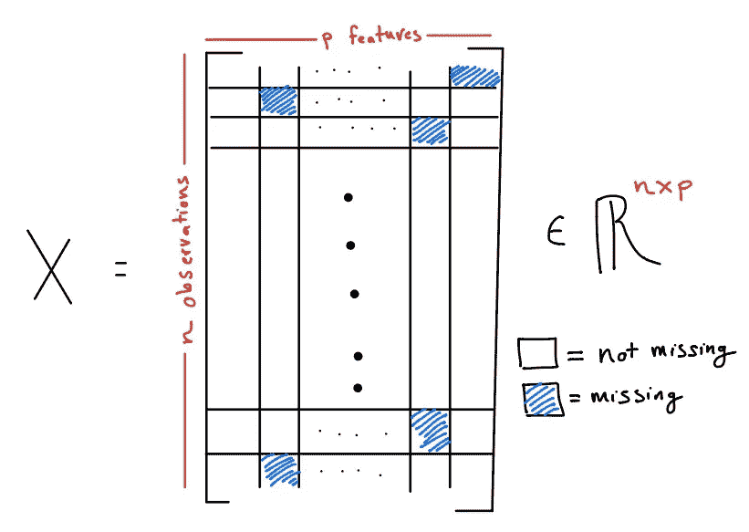
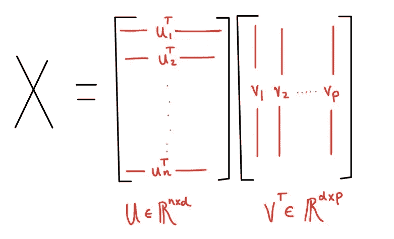
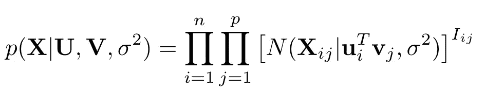
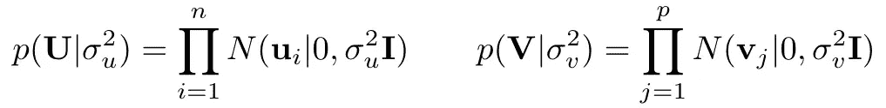
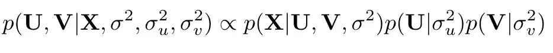
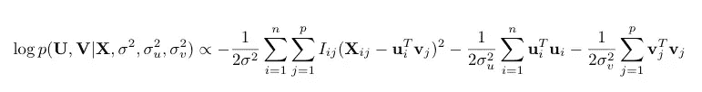
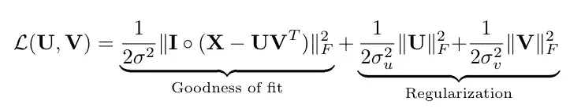
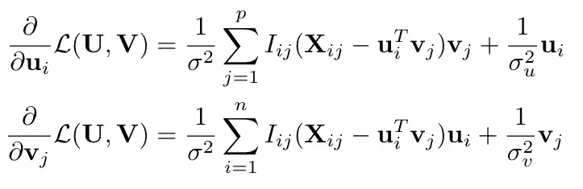
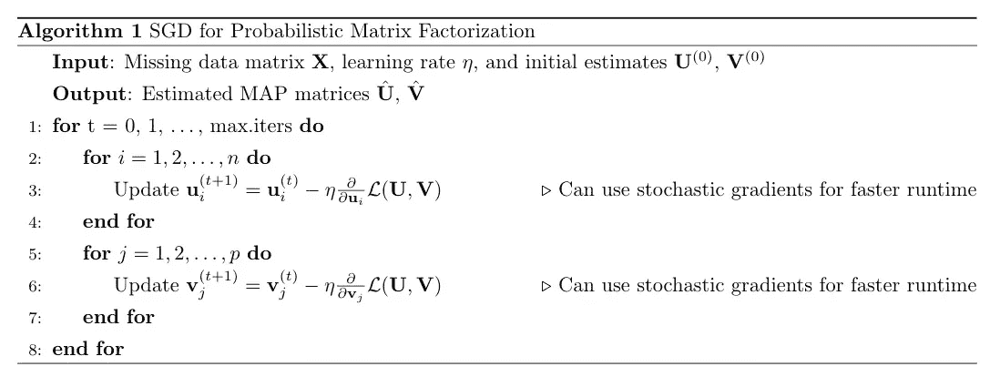

# 概率矩阵分解

> 原文：<https://towardsdatascience.com/probabilistic-matrix-factorization-b7852244a321?source=collection_archive---------10----------------------->

## 动机

“给你一个设计矩阵 **X** ，你会如何预测 **Y** ？”这个问题是基于监督学习和回归的任务的核心。这个问题假设完全了解设计矩阵 **X** 。在 **X** 中，我们在行中存储记录，在列中存储描述这些记录的特性。但是当这个矩阵被破坏时会发生什么呢？当一些观测值缺失时会发生什么？

考虑这样的设置，我们有一个 n 行 p 列的数据矩阵 **X** ，其中 **X** 始终有缺失值。

Data matrix **X** with missing values. The goal of matrix completion (and probability matrix factorization) is to impute or predict these missing values.

没有什么奇特的机器学习模型能拯救我们。事实上，奇特的监督学习技术*依赖于*对 **X** 的执行，就像它们做的一样好。在某种意义上，这是格言*垃圾的最坏情况；垃圾出去*——我们连垃圾都没有放进去！

这个问题在大多数数据分析中非常典型，最近又被重新讨论，因为许多现代数据科学问题都可以在这个框架内提出。我们将在下面的应用部分讨论其中的一些问题。

在这篇文章中，我们来看一个基于模型的方法来克服这个丢失数据的问题。我们将讨论一些令人惊讶的应用，在这些应用中，这种方法在矩阵补全之外也很有用。我们将从完全贝叶斯的角度来看这个问题，并分析在这个模型下，一个典型的 SGD 框架是如何与后验最大化紧密相连的。

## 应用程序

特别感兴趣的三个应用范围从数据分析的基础到推荐系统中最先进的方法。

*   *数据插补-* 当数据缺失时，监督学习技术很难提供高质量的解决方案。例如，在随机森林中丢失数据可能是灾难性的。输入缺失数据是任何数据分析的第一步。
*   *图像完成-* 考虑这样一幅图像，其中图像的一部分已经被破坏、扭曲或看不到。如果我们希望*完成*图像，我们希望以使用其他观察到的像素的信息的方式来完成。智能地结合这些信息将导致更精确的图像恢复。
*   *基于模型的推荐系统-* 许多协同过滤应用依赖矩阵完成算法向新用户提供推荐。如果矩阵的行是用户，列是产品，那么矩阵中的条目可以是该用户对该产品的评级。由于每个用户不会对每个产品进行评级，因此我们的目标是找到没有被用户评级但可能被高度评级的产品。通过预测这些缺失值(用户尚未评级的产品)，我们可以根据用户过去的评级和其他人的评级向用户推荐新产品。

这些只是适合矩阵完成框架的问题的示例。在后面的帖子中，我将考虑图像完成任务，并使用下面介绍的模型构建一个推荐系统。

## 基于模型的方法

形式化该任务的一种方式是*矩阵完成问题*，其中我们试图用已知值的知识(白色图块)替换缺失的数据(蓝色图块)。我认为这是在矩阵中“堵塞漏洞”。

一种流行的基于模型的方法是假设数据矩阵 **X** 具有低秩，因此可以分解成两个低秩矩阵 **U，V** 的乘积。希望 d = rank( **X** )远小于 min(n，p)以降低计算复杂度。

Factorization of data matrix **X** into the “observation” matrix **U** and the “feature” matrix **V.**

你可以把矢量 **uᵢ** 想象成描述第 ***i* -** th 观察行为的矢量，把 **v** ⱼ想象成描述第 ***j* -** th 特征行为的矢量。必然地，我们假设词条 **Xᵢⱼ = ⟨uᵢ，v** ⱼ **⟩.**我们的问题归结为获得 **U** 和**v**的估计值

这个问题的常见解决方案是最小化最小平方损失的优化方法。使用交替最小二乘算法可以有效地(并行地)解决这个问题。文献中也详细描述了正则化扩展和解决方案。

另一种提供更健壮的统计框架的方法是基于模型矩阵 **X** 的贝叶斯观点。这个名为*概率矩阵分解*的方法是由 Salakhutdinov 和 Mnih 在 2006 年提出的。在这个模型下，我们假设 **X** 的条目正态分布在内积 **⟨uᵢ，v** ⱼ **⟩** 的周围，具有共同的方差。假设 **Iᵢⱼ** 在观察到条目时为 1，在数据值缺失时为 0，我们可以将 **X** 的条目的可能性写成如下。

Likelihood of the entries of **X**. The entries are independent normals centered around the inner product **⟨uᵢ, v**ⱼ**⟩.**

这种可能性的核心假设是:( a)**X**的条目是独立的;( b)每个条目是正态分布的;( c)这些条目共享一个共同的方差σ。这些假设可能适合也可能不适合某些应用，需要在实践中更仔细地考虑。

为了包含完整的贝叶斯范式，我们将先验分布放在以下形式的矩阵 **U** 和 **V** 中。

在这些先验中，我们假设(a)**U**和 **V** 的行是不相关的，(b)是正态分布的，以及(c)具有共同的方差。有了额外的先验信息，我们可以构建更多信息的先验分布，以捕捉设计矩阵 **X** 中观察值或特征之间的已知相关性。

## 后验推断

引入了矩阵 **X** 的先验分布和似然性后，我们可以推导出归一化常数的完整后验概率。

Full posterior distribution of matrices **U** and **V**.

在他们的工作[3]中，建议通过找到最大化该后验分布的矩阵 **U** 和 **V** 来导出*最大后验估计值(MAP)。在未来，我们着眼于通过为这些模型 parameters⁴.构建 MCMC 采样器来开发完整的后验分布*

最大化这个后验概率相当于最大化对数后验概率。对数后验概率具有下面给出的形式。

The log posterior up to a normalizing constant. Notice that the last two terms have built in regularization on the matrices **U** and **V**.

这样，我们的目标是最小化损失函数 ***L(* U，V *)*** ，它可以写成如下形式

其中 **I** 是具有上面定义的 **Iᵢⱼ** 的 n × p 矩阵，圆积表示元素式矩阵积，使用的范数是 Frobenius 范数。

从这个损失中，我们看到我们平衡了 **U** 和 **V** 的乘积与这些矩阵相对于 Frobenius 范数的“大小”的拟合优度。我们通过调整先验方差σ、σᵤ和σᵥ来平衡拟合优度和正则化之间的权衡。这些参数可以通过交叉验证以数据依赖的方式进行选择，或者通过对这些 hyerparameters 进行先验的贝叶斯方法进行选择。

从这里我们看到，最大化对数后验概率是*等价于*在【2】中考虑的正则化优化方法。因此，我们看到，通过正确选择先验，*概率矩阵分解方法概括了矩阵分解中的标准优化技术。*

通过为 **U** 和 **V** 的行选择更复杂的先验分布，我们可以设计出类似弹性网和套索的优化问题，其中更稀疏的解是优选的。

## 通过优化映射解决方案

已经根据优化问题描述了 **U** 和 **V** 的 MAP 估计，我们现在考虑解决该问题的优化方法。不幸的是，这个优化问题不是凸的，所以我们不能保证随后的任何方法都有全局解。最近 work⁵致力于刻画全局解的性质，这将有望增强我们对任何局部解的性质的理解。

为了获得 **U** 和 **V** 的估计，我们考虑(随机)梯度下降更新方案。虽然我们也可以考虑交替最小二乘更新，这可以通过使用迭代岭解来解决，但 SGD 方法将能够更容易地扩展到更大的数据集。

将损失函数 ***L(* U，V *)*** 相对于 **uᵢ** 或 **vⱼ** 进行微分将提供感兴趣的梯度。梯度可以写成

Gradient of the loss function for each row of **U** and **V**. Stochastic gradients can be applied by using a subset of the full n observations or p features. Moreover, rows of each matrix can be updated in parallel.

其与来自正则化回归设置的岭回归估计有明确的联系。请注意，每个梯度包括 n 或 p 个元素的总和。这些总和在实践中可能很难计算，并且可能有必要通过对 n 个观测值或 p 个特征的子集(小批量)求和来使用*随机*梯度。

使用这些梯度，我们迭代地更新我们的估计，直到收敛。完整的算法如下所示。

A full SGD algorithm for PMF.

可以对该算法进行一些改进以提高运行时间。特别是，使用随机梯度可以大大加快计算时间。此外，每个嵌套的 for 循环都可以并行完成，并跨单元分布。 [Kevin Liao](https://medium.com/u/93b225681c92?source=post_page-----b7852244a321--------------------------------) 在 PySpark 上有一个关于这个的不错的帖子，我会在这里链接。

## 结论

至此，我们已经基本涵盖了概率矩阵分解的基础知识！这里讨论的大多数观点都在[3]中介绍过，我真的鼓励你读一读他们的论文。希望这篇文章能在这个问题和贝叶斯统计、正则化回归和正则化矩阵分解之间找到一些联系。

既然我们已经解决了所有的数学问题，是时候实现上面介绍的 SGD 算法了。在我的下一篇文章中，我将会关注图像补全的问题以及一个推荐系统。

[1]:m·尤德尔和 a·汤森。[为什么大数据矩阵的排名很低？](https://epubs.siam.org/doi/pdf/10.1137/18M1183480) (2019)，暹罗。

这种假设在许多统计和机器学习环境中非常普遍。请查看由 Udell 和 Townsend 在 2019 年完成的这项工作，其中有一个关于为什么这一假设是合理的有趣讨论。

[2]: T. Hastie 等人[通过快速交替最小二乘法进行矩阵补全和低秩 SVD](http://jmlr.org/papers/volume16/hastie15a/hastie15a.pdf)。(2015)，机器学习研究杂志。

[3]: R. Salakhutdino 和 A. Mnihv。[概率矩阵分解。](https://papers.nips.cc/paper/3208-probabilistic-matrix-factorization.pdf) (2008)，NIPS 会议录。

[4]: R. Salakhutdino 和 A. Mnihv。[使用马尔可夫链蒙特卡罗的贝叶斯概率矩阵分解](https://www.cs.toronto.edu/~amnih/papers/bpmf.pdf)。(2008)，2008 年机器学习国际会议。

[5]: S. Zheng 等[正则化奇异值分解及其在推荐系统中的应用](https://arxiv.org/pdf/1804.05090.pdf)。(2018)，ArXiv。