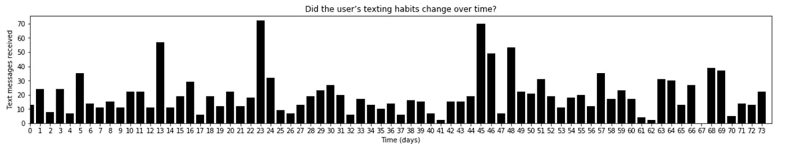
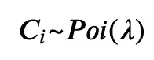
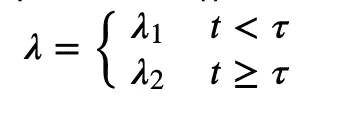
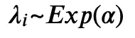
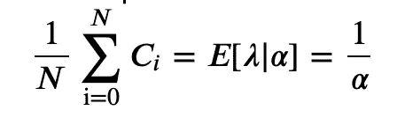
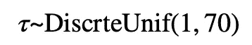
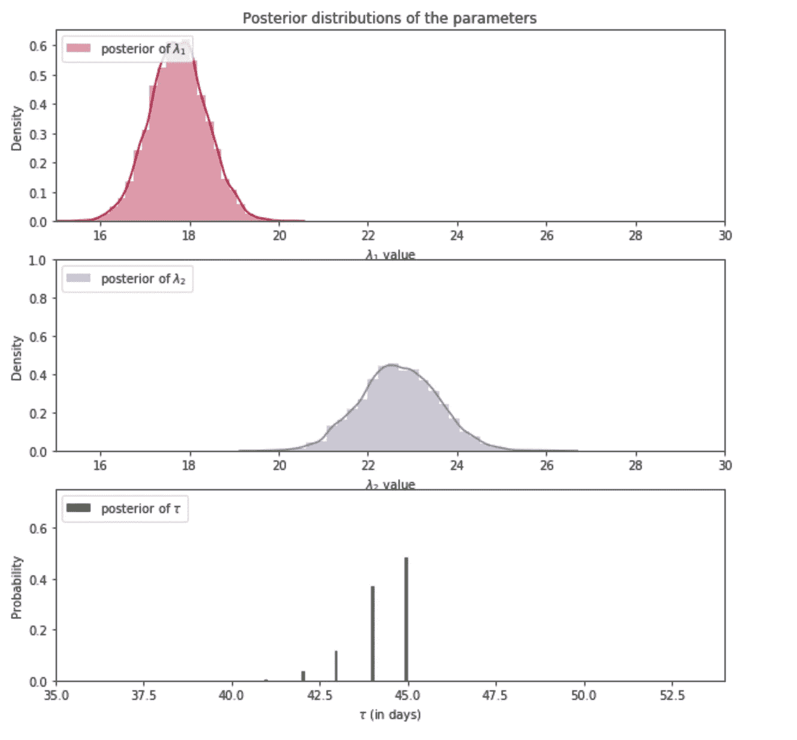

# 概率编程杂志 1:模拟事件变化

> 原文：<https://towardsdatascience.com/probabilistic-programming-journal-1-modeling-event-change-9e9a91a5283a?source=collection_archive---------18----------------------->

*免责声明:我的来源和灵感来自《黑客的贝叶斯方法》(Cameron Davidson-Pilon)，这篇文章出于非盈利原因。我只是记录我对这个新主题的学习，并在媒体上分享我的学习，以强化我自己的概念。大部分代码都是从这本书里派生出来的，我只做了很少的改动，但是我花了很大的力气来解释每个代码块是如何工作的。*

**问题:**我们的目标是了解我们的数据是否随时间发生了变化。

**数据:**[https://github . com/CamDavidsonPilon/probabilical-Programming-and-Bayesian-Methods-for-Hackers/tree/master/chapter 1 _ Introduction](https://github.com/CamDavidsonPilon/Probabilistic-Programming-and-Bayesian-Methods-for-Hackers/tree/master/Chapter1_Introduction)

```
import numpy as np
import matplotlib.pyplot as plt
import seaborn as sns
%matplotlib inlinecount_data = np.loadtxt("Data/txtdata.csv")
n_count_data = len(count_data)
f, ax = plt.subplots(figsize=(20, 3))
sns.barplot(np.arange(n_count_data), count_data, color = 'black');
plt.xlabel("Time (days)")
plt.ylabel("Text messages received")
plt.title("Did the user’s texting habits change over time?")
plt.xlim(0, n_count_data);
```



我们正在处理的数据与文本相关。我们观察和收集数据的时间段是总共 74 天，加载的数据是包含每天文本观察的向量形式。我们生成一个互补向量，记录向量中每个点的日期。这可以在上面使用 numpy arrange 函数的代码中看到。我们的目标是确定趋势是否有变化。由人类来完成这项任务将是非常具有挑战性的，因为目测数据根本无助于确定变化。所以我们将使用一些概率模型来解决这个问题。

我们如何对这些数据建模？我们的选择之一是使用泊松模型。为什么？因为这种模型可以很好地处理计数数据。



为了表示我们的模型，假设λ将在我们的数据集τ中的时间点(t)之后改变。



下一个要解决的难题是我们如何估计λ？模型假设λ可以采用任何正数的形式。指数分布提供了一个连续的密度函数，但指数分布有自己的参数，称为α。所以…



*当一个随机变量 Z 具有参数为λ的指数分布时，我们说 Z 是指数的，写 Z∞Exp(λ)给定一个特定的λ，一个指数随机变量的期望值等于λ的倒数。即 E[Z|λ] = 1/λ* (黑客的贝叶斯方法，卡梅伦·戴维森)

根据上述概念，将α设置为计数数据平均值的倒数。



最后τ



在数据集中持续 70 天，其中τ在每一天都是同等可能的。

在我解释下一步之前，我想分享一个关键概念。因此，泊松模型中的主要模型采用参数λ。Lambda 是每个间隔的平均事件数，它是由另一种称为指数分布的方法估计的。编程意义上的指数分布将由该特定分布的特征产生。因此，如果一个程序员调用一个分布函数，他们可以期待一个对象或向量的值。现在有了这些值，接下来发生的是泊松函数使用它，另一个生成函数。因此，泊松函数将在由指数生成器生成的λ值数组上生成值。

当我们看τ和 T 时，令人困惑的部分来了，它们的目的是什么？我们猜测模型的分布在 t 点发生变化。这与下面代码中描述的函数有关。我会在代码后解释 tau 的作用。

```
import pymc as pm#Alpha as described in above
alpha = 1.0/count_data.mean()# Exp distribution for lambda using alpha
lambda_1 = pm.Exponential("lambda_1", alpha)
lambda_2 = pm.Exponential("lambda_2", alpha)#Uniform distribution for tau 
tau = pm.DiscreteUniform("tau", lower=0, upper=n_count_data)#Declare a deterministic result
[@pm](http://twitter.com/pm).deterministic
def lambda_(tau=tau, lambda_1=lambda_1, lambda_2=lambda_2):

    #create a null vector of size == size(data)
    out = np.zeros(n_count_data)

    # t < tau will recieve lambda1
    out[:tau] = lambda_1

    #t > tau will recieve lambda2
    out[tau:] = lambda_2
    return out#feeding custom function to observed poisson generator
observation = pm.Poisson("obs", lambda_, value=count_data,observed=True)#declaring pymc model
model = pm.Model([observation, lambda_1, lambda_2, tau])#blackbox MCMC model for sampling
mcmc = pm.MCMC(model)
mcmc.sample(40000, 10000)#Drawing samples from mcmc model
lambda_1_samples = mcmc.trace('lambda_1')[:]
lambda_2_samples = mcmc.trace('lambda_2')[:]
tau_samples = mcmc.trace('tau')[:]
```

所以，发生的事情是，一个生成器被创建，它输出 1 到 70 之间的值，其中每一天都有均等的机会被抽取。想象这是一袋 70 颗红色弹珠，画一颗弹珠是 1/70。所以一定数量的随机抽取被记录下来并发送给 lambda_ function。在基于τ值的 lambda 函数中，向量 lambda 被分成将接收 lambda_1 值的左半部分和将接收 lambda_2 值的右半部分。这个过程用 lambda _i(i = 1 或 2)的不同组合来测试。然后将其转换为泊松生成器。我很难解释后面的部分，因为它涉及到使用 MCMC 方法从我们创建的条件中采样和重新采样。用最简单的话来说，我能说的是，我们有一个复杂的对象迭代来检索显示可能值的分布。

```
# histogram of the samples
f, ax = plt.subplots(figsize=(10, 10))#plt sublot 1 declarartion (lambda 1)
ax = plt.subplot(311)
sns.distplot(lambda_1_samples, bins=30,label="posterior of $\lambda_1$", color="#A60628")
plt.legend(loc="upper left")#declare main title
plt.title(r"""Posterior distributions of the parameters""")plt.xlim([15, 30])
plt.xlabel("$\lambda_1$ value")
plt.ylabel("Density")
#lambda1 plot ends#plt sublot 2 declarartion (lambda 2) setting similar to plot 1
ax = plt.subplot(312)
ax.set_autoscaley_on(False)
sns.distplot(lambda_2_samples, bins=30,label="posterior of $\lambda_2$", color="#7A68A6")
plt.legend(loc="upper left")
plt.xlim([15, 30])
plt.xlabel("$\lambda_2$ value")
plt.ylabel("Density")#plt sublot 2 declarartion (lambda 2)
plt.subplot(313)
w = 1.0 / tau_samples.shape[0] * np.ones_like(tau_samples)
plt.hist(tau_samples, bins=n_count_data, alpha=1,
         label=r"posterior of $\tau$", color="#467821",
         weights=w, rwidth=2.)
plt.legend(loc="upper left")
plt.ylim([0, .75])
plt.xlim([35, len(count_data)-20])
plt.xlabel(r"$\tau$ (in days)")
plt.ylabel("Probability");
```



做完这些，我们就能画出λI 和τ的可能值。我对这里的理论的理解仍然不是很强，但是我认为我们能够基于我们使用泊松分布产生的观察结果来产生这些分布。还有一点需要注意的是，泊松样本被观察和固定，而其他样本则没有。对观察结果的解释总结如下。

1.  λ1、λ2 可以分别保持大约 18 和 23 的值。
2.  基于λ分布，我们可以评论两组中存在差异，回想一下，我们将λ1 分配给组 t < τ，并且我们相应地改变了λ2。两组都采用相似的指数分布，每组的后验分布各不相同。
3.  τ的正序分布是离散的。基于我们输出前的假设。
4.  第 45 天有 50%的几率表现出行为变化。