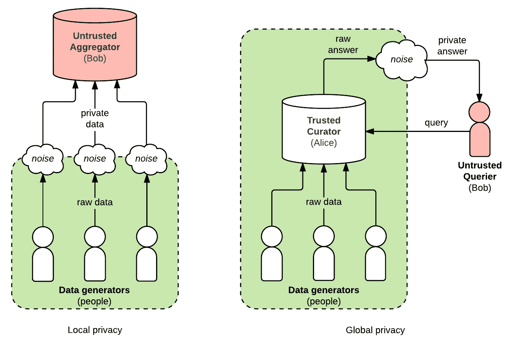
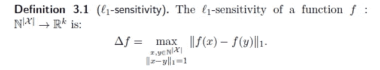
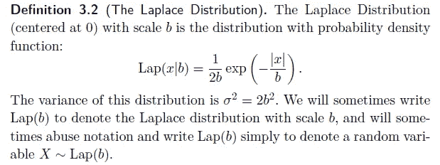
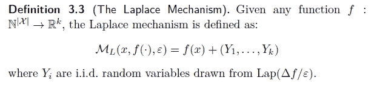

# 数据分析中隐私的概率工具

> 原文：<https://towardsdatascience.com/probabilistic-tools-for-privacy-in-data-analysis-a715ec5ac25c?source=collection_archive---------35----------------------->

Photo by [Stephen Dawson](https://unsplash.com/@srd844?utm_source=medium&utm_medium=referral) on [Unsplash](https://unsplash.com?utm_source=medium&utm_medium=referral)

## 我们将继续我们的旅程来学习差分私有算法，这一次探索更多的概率工具。

在上一篇文章中，我们学习了如何使用大数理论和概率来设计差分私有算法。

我鼓励您在继续学习之前查看一下，以便更好地理解本教程的范围。

 [## 一枚硬币、一些吸烟者和数据分析中的隐私

### 我们将继续探索学习隐私保护数据分析的技术，更深入地挖掘…

towardsdatascience.com](/a-coin-some-smokers-and-privacy-in-data-analysis-1339b83ede74) 

如果您阅读了本系列的上一篇文章，您已经知道任何随机化算法 M 都可以是( **ε，δ)差分私有算法，**，如果它满足这样的性质。

这种方法的核心特性之一是在进行任何分析之前，甚至在将数据放入数据库之前，向数据本身注入噪声。像这样给数据引入随机性在隐私保护数据分析中相当常见，事实上它有一个专门的名字叫做**局部差分隐私。**

Photo by [Franki Chamaki](https://unsplash.com/@franki?utm_source=medium&utm_medium=referral) on [Unsplash](https://unsplash.com?utm_source=medium&utm_medium=referral)

> 然而，仅仅为了防止数据被对手窃取而破坏我们的数据的想法听起来非常妥协。一定有别的办法。

此时我们应该想到的两个问题是:

*   本地差分隐私是防止隐私数据泄露的唯一方法吗，有什么方法可以在不损坏我们数据的情况下提供隐私？
*   除了随机化回答，还有其他算法可以解决这个保护隐私的数据分析问题吗？

我们将在本文中尝试解决这两个问题。

# 全球差异隐私—简介:

我们已经知道，在局部差分隐私的情况下，我们向输入数据点添加噪声。因此，每个人都可以向自己的数据中添加噪声，从而完全消除了信任数据所有者或管理者的需要。**我们可以说，在这种环境下，个人隐私得到了最大程度的保护。**

**另一方面，全局差分隐私**给数据库的查询输出增加了**噪声。因此，在这种情况下，我们有一个包含所有敏感信息的数据库，但是对该数据库的任何查询都不一定会生成真实的结果，因为这些结果是错误的。**

> 但是，如果局部差异隐私更能保护个人隐私信息，为什么还要使用全局差异隐私呢？

如果你还记得上一篇文章，你应该知道，准确性和隐私之间总是有一个权衡。因此，如果你的目标是更多的隐私，它会来找你，但代价是失去一些准确性。考虑到这一点，本地和全局差异隐私的唯一区别在于:

> **如果数据所有者值得信任，那么对于相同级别的隐私保护，全局差异隐私会产生更准确的结果。**

**一个重要的问题是要有一个值得信赖的所有者或管理者，**如果找到了，我们就可以在相同的隐私级别上有更好的准确性，因为在全球差异隐私的设置中，我们不再破坏我们的数据，而是将所需的噪声添加到我们对该数据库的查询的输出中。

Difference b/w Local and Global Privacy Settings

上面给出的图表毫不费力地解释了这一点。然而，我们现有的保护隐私的方法没有为应用全局差分隐私提供空间，因此我们需要设计一种不同的算法来做到这一点。

# 保护隐私的拉普拉斯机制:

在上一篇文章中，我们了解了一种实现差分隐私的技术，我们设计的算法给了数据生成器一种 ***似是而非的可否认性*** 的感觉，从而允许它们向数据中添加噪声。

在这里，我们将了解一个更常用的工具，它为我们提供差分隐私，**拉普拉斯机制，**，它为实(向量)值查询提供差分隐私。这些查询将数据库映射到一些实数，而不是整数值。

**ℓ1-敏感度**可以再次用于确定我们可以多准确地回答数据库的查询，因此，直观地，我们必须引入响应中的不确定性以隐藏单个个体的参与。因此，拉普拉斯机制帮助我们在全局差分隐私的设置下保护隐私。

函数(查询)的敏感度也告诉我们，为了保护隐私，我们必须对其输出进行多大程度的扰动，它为我们提供了查询输出中最大可能变化的度量。拉普拉斯机制将简单地计算 **func** ，并用从拉普拉斯分布中提取的噪声扰动每个坐标。噪声的标度将被校准到 **func** 的灵敏度(除以 **ε** ，这被称为**β。**

**β= Lap(δf/ε)**

From the Algorithmic Foundation of Diff. Privacy

Formalizing Laplace mechanism

> ***因此，在拉普拉斯机制的情况下，不是在查询之前将噪声添加到数据，而是将该噪声添加到对数据库的查询的输出。拉普拉斯机制只是简单地把对称连续分布的噪声加到真答案上，如上图所示。***

Photo by [Markus Spiske](https://unsplash.com/@markusspiske?utm_source=medium&utm_medium=referral) on [Unsplash](https://unsplash.com?utm_source=medium&utm_medium=referral)

这里需要理解的重要一点是，在拉普拉斯机制的情况下，这种对称连续分布以零为中心。

辛西娅·德沃克(Cynthia Dwork)的《差分隐私算法基础》( algorithm Foundation of Differential Privacy)中提供了为什么拉普拉斯机制是( **ε，0)差分隐私算法**的有力证明。

# 总结:

在本文中，我们了解了局部和全局差分隐私之间的差异，并介绍了一种使用后者的设置来实现差分隐私的算法。

本系列接下来的几篇文章将更侧重于使用差分隐私进行深度学习。

敬请关注。暂时快乐学习。

PS。这是我关于媒体的第三篇文章，所以欢迎任何反馈和建议。

**资源:**

1.  https://www.cis.upenn.edu/~aaroth/Papers/privacybook.pdf
2.  【http://www.cis.upenn.edu/~ahae/papers/epsilon-csf2014.pdf 
3.  [http://dimacs . Rutgers . edu/~ Graham/pubs/slides/priv db-tutorial . pdf](http://dimacs.rutgers.edu/~graham/pubs/slides/privdb-tutorial.pdf)
4.  [https://arxiv.org/pdf/1808.10410.pdf](https://arxiv.org/pdf/1808.10410.pdf)
5.  [https://towards data science . com/understanding-differential-privacy-85ce 191 e 198 a](/understanding-differential-privacy-85ce191e198a)
6.  [https://towards data science . com/a-coin-some-smokers-and-privacy-in-data-analysis-1339 b 83 ede 74](/a-coin-some-smokers-and-privacy-in-data-analysis-1339b83ede74)
7.  [https://towards data science . com/Mr-x-网飞和数据分析隐私-f59227d50f45](/mr-x-netflix-and-privacy-in-data-analysis-f59227d50f45)