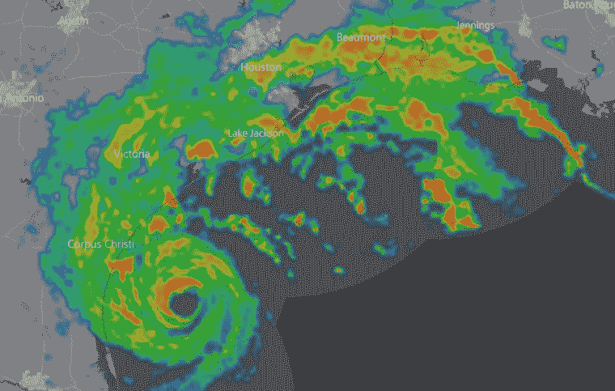
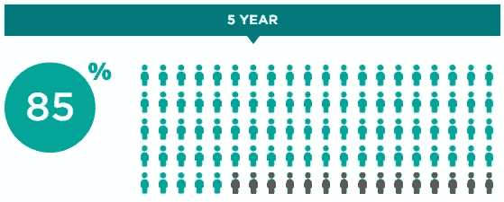

# 概率不是可预测性

> 原文：<https://towardsdatascience.com/probability-and-predictability-b3d7ebb6952e?source=collection_archive---------15----------------------->

## 天气预报、癌症诊断、掷硬币

假设你正在看晚间新闻(或者更有可能是你的手机告诉你)，明天有 30%的可能性会下雨。明天，你带伞了吗？

这似乎是一个良性的问题，但我们解释概率的方式对我们如何决策、做生意和生活有着真正的影响。它

在下文中，我们将分解像这样的概率和统计数据的核心含义，以及我们如何围绕这种不确定性做出决策。

## 当统计变成概率

让我们用同样的例子——明天有 30%的可能性下雨。一般来说，像这样的陈述使用的是推理统计学:它们观察一个事件在过去发生的频率，并使用推理将其应用于未来。

Via [windy.com](http://windy.com).

假设在过去的 100 次特定天气模式中，有 30 次第二天下雨。如果今天气象学家看到这种模式，他或她可能会说:

> *“我见过 30%的这种模式，第二天就下雨了。所以明天有 30%的可能性会下雨。”*
> ——某处某气象学家

然而，这并不是概率(注意:统计数据是历史频率，概率是未来的可能性)*的意思*。它实际上的意思大致是:

> *基于我在过去 100 次中见过 30 次这种模式，第二天就下雨了，我* **推断***在接下来的 100 次我看到这种模式时，第二天会下雨 30 次。
> 假设我今天看到了模式，有 30%的几率这是我看到模式的一天，第二天下雨。*
> ——任何地方都没有气象学家

我们马上看到这是一个更复杂的声明。重要的是，我们看到了*历史观察*(即统计)是如何转化为前瞻性概率的。不幸的是，我们不知道明天是否会下雨——知道概率并不能帮助我们预测明天是否带伞。毕竟，明天不会发生 100 次，只会发生一次。

## 概率和离散事件

天气是每天都会发生的事情，所以从长远来看，用概率来描述天气*可能是合适的。让我们来看看一些不相关的事情:一个接受癌症诊断的病人。*

当患者被诊断患有癌症时，他们通常会问(或被医生告知)的一个问题是“我的机会有多大？”这经常被用来帮助病人评估诊断的严重性。直觉上，我们理解“80%的类似患者在 10 年后存活”是比“8%的机会活到 10 年”更好的预后。然而，我们应该进一步展开这个问题，以真正理解这些意味着什么。

为了帮助我们，我使用了纪念斯隆-凯特琳癌症中心发表的一个模型(以及他们发表的其他几个模型)，显示了结肠直肠癌手术后 5 年的存活率。在[模型](https://www.mskcc.org/nomograms/colorectal/overall_survival_probability)中，我输入了一个假设的 N1 期 T3 期癌症，已经扩散到 16 个淋巴结中的 2 个，具有中度分化，且为 27 岁男性。该模型正确地指出，我在这里还要补充一点，“预测工具不能用来替代任何健康状况或问题的医疗建议、诊断或治疗。”

那么，结果如何呢？

> “这个数字以百分比的形式显示了您在接受结肠癌完全切除术(手术切除所有癌组织)后至少存活 5 年的概率。这一概率意味着，对于每 100 名像你这样的患者，我们预计有 85 人在手术后存活 5 年，15 人将在 5 年内死亡。”

我们先来看第二句:“每 100 个像你这样的病人，我们预计有 85 个会在手术后存活 5 年。”这与我们的降雨示例非常匹配，假设的气象学家指出，对于特定的天气模式，每 100 天就会有 30 天降雨。MSK 的模型使用过去的患者数据，并对 100 名患者的未来生存可能性做出**推断**，我们的患者只是其中之一。然后(甚至在此之前)，MSK 跳出来说，由于 100 个病人中有 85 个会在 5 年后存活，*我们的病人*有 85%的机会存活 5 年。

但是这种跳跃有一个问题——它没有声音。我们的病人患的不是 100 种癌症中的 85 种，而是一种癌症。也许对医生来说，知道如果医生有 100 个病人，他可以期望 85 个存活 5 年是有用的，但是这并不意味着对每个病人都有用。这不能提供任何类型的可预测性——它不能告诉病人他们是在 85%还是在 15%的关键信息，医生当然不能说。

这是保罗·卡兰尼蒂在他的回忆录*中写的当呼吸变成空气:*

> 与其说“中位生存期是 11 个月”或“你有 95%的机会在两年内死亡”，我会说，“大多数病人能活几个月到几年。”对我来说，这是一个更真实的描述。问题是你不能告诉一个病人她处在曲线的哪个位置:她会在六个月还是六十年后死去？我开始相信，比你能做到的更精确是不负责任的。

其实，**连数学家都在争论这个**。具体来说，“频繁主义者”坚持认为概率只适用于事件，就像掷硬币一样，可以被广泛重复(理论上无限重复*)。因为抛硬币和天气有规律地反复发生，你可以指定一个概率，因为随着时间的推移，你会做出足够的预测来与指定的概率进行比较。然而，对于癌症预测，以及其他离散事件，如超级碗(以及超级碗的硬币投掷)和总统选举，不会有数百个事件被重复——*只有一个*。*

**

*再者，**概率不是可预测性**。知道了一枚公平的硬币正面朝上的概率是 50%，你在*不可能*准确预测*下一次掷硬币*。也许你可以平均预测 100 次翻转中有多少次是正面，但你无法确定地预测下一次翻转。*

**

*Huffington Post’s 2016 presidential election probabilities, for posterity.*

*这种思考方法可能会增加混乱，因为它看起来不太精确，而且确实如此！但它让我们面对未来的不确定性。我们常常过于自信，因为概率让不可能的事情看起来不可能，而事实上它们极有可能发生。邓肯·沃茨在*中写道，这是企业向应急战略发展的一个原因，一切都很明显**

> *因此，如果连[数学家]都难以理解“明天下雨的概率是 60%”这句话的含义，那么我们其他人也能理解就不足为奇了。*

## *延伸阅读:*

*   *【文章】 [*中位数不是史蒂芬·杰·古尔德的消息*](https://www.cancerguide.org/median_not_msg.html)*
*   *[*【信号与噪音】*作者内特·西尔弗](https://www.goodreads.com/book/show/13588394-the-signal-and-the-noise)*