# 不平衡数据集的概率校准

> 原文：<https://towardsdatascience.com/probability-calibration-for-imbalanced-dataset-64af3730eaab?source=collection_archive---------6----------------------->

## 对欠采样方法的一点建议


Photo by [Bharathi Kannan](https://unsplash.com/@bk010397?utm_source=medium&utm_medium=referral) on [Unsplash](https://unsplash.com?utm_source=medium&utm_medium=referral)

当我们试图为现实世界的问题建立机器学习模型时，我们经常会面临不平衡的数据集。重采样方法，尤其是欠采样是克服类别不平衡最广泛使用的方法之一(我在另一篇[中的](https://medium.com/analytics-vidhya/can-we-predict-a-price-adjustment-in-an-online-supermarket-by-using-machine-learning-and-7bf3e8fff81a?source=friends_link&sk=f43dc2cb1805864cf37c58deb237f8b1)文章中也展示了那些重采样方法是如何在[我的硕士论文](https://www.researchgate.net/publication/324749650_Analyzing_online_price_by_using_machine_learning_techniques)中起作用的)。然而，由于训练和测试集中不同的类别分布，实现这种方法倾向于增加假阳性。这会使分类器产生偏差并增加假阳性。[1] [Pozzolo 等人，(2015)](https://www3.nd.edu/~dial/publications/dalpozzolo2015calibrating.pdf) 认为可以利用贝叶斯最小风险理论来修正由于欠采样而产生的偏差。这有助于我们找到正确的分类阈值。

# 内容

1.  概率校准是如何工作的？
2.  实验
3.  结论

# 1.概率校准是如何工作的？


Photo by [John Schnobrich](https://unsplash.com/@johnschno?utm_source=medium&utm_medium=referral) on [Unsplash](https://unsplash.com?utm_source=medium&utm_medium=referral)

如上所述，欠采样会导致后验概率出现偏差。这是由于随机欠采样的特性，其通过随机移除它们来缩小多数类，直到两个类具有相同数量的观察值。这使得训练集的类分布不同于测试集中的类分布。那么，在这个问题上，使用贝叶斯最小风险理论的概率校准究竟是如何工作的呢？—这种方法的基本思想是通过考虑欠采样率 *β* 考虑*来试图减少/消除随机欠采样率引起的偏差。*让我们来看看一些定义:

设 *ps* 为随机欠采样后预测为正类的概率；

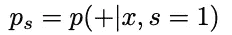

，而 *p* 是预测给定特征的概率(不平衡)。我们可以把 *ps 写成 p 的函数；*

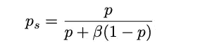

，其中 *β* 为欠采样情况下选择负类的概率，可表示如下。

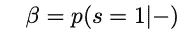

，可以这样写

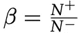

上式可解出 *p* 并表示如下。

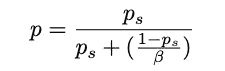

因此，在应用欠采样率 *β、*之后，我们可以计算出 *p* ，这是无偏概率。

这个阈值可以是:

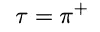

，这是数据集中正类的概率。

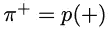

简要介绍了利用贝叶斯最小风险理论进行概率校准的方法。现在我们将继续看看这是如何在一个代码示例中工作的。

# 2.例子


Photo by [Nathan Dumlao](https://unsplash.com/@nate_dumlao?utm_source=medium&utm_medium=referral) on [Unsplash](https://unsplash.com?utm_source=medium&utm_medium=referral)

在本节中，我们将看到概率校准技术如何在 Kaggle 上著名的[信用卡欺诈数据集](https://www.kaggle.com/mlg-ulb/creditcardfraud)上对二进制分类问题进行建模。该数据集由 28 个 PCA 特征(全部匿名)和数量特征组成。目标特征是二元的，要么是诈骗，要么不是。正类占整个数据集的 0.17%，严重不平衡。让我们看看这个例子的代码。

首先，导入包。

```
## config
import numpy as np
import pandas as pd
import matplotlib.pyplot as plt
import seaborn as sns
import io, os, sys, types, gc, re
from sklearn import preprocessing
from sklearn.linear_model import LogisticRegression
from sklearn.model_selection import train_test_split
from sklearn.metrics import average_precision_score,
confusion_matrix, precision_score, recall_score, precision_recall_curve, f1_score, log_loss
from sklearn.decomposition import PCA
pca = PCA(n_components=1,random_state=42)
from imblearn.under_sampling import RandomUnderSampler
rus = RandomUnderSampler(random_state=42)
from imblearn.ensemble import BalancedBaggingClassifier
from src.functionalscripts.BMR import *def make_prediction(model,X,threshold):
    y_pred = model.predict_proba(X)
    y_predicted = np.where(y_pred[:,1]>=threshold,1,0)
    return y_pred, y_predicteddef evaluation(true, pred):    
    print('F1-score: ' + str(round(f1_score(true,pred),4)), '\n'
'Precision: ' + str(round(precision_score(true,pred),4)), '\n'
'Recall: ' + str(round(recall_score(true,pred),4)), '\n'
'Log loss: ' + str(round(log_loss(true,pred),4)), '\n'
'Cohen-Kappa: ' + str(round(cohen_kappa_score(true,pred),4)), '\n'
'Confusion matrix:' + '\n' + str(confusion_matrix(true,pred)))
```

现在读取数据集。

```
# read the data
df = pd.read_csv('src/resources/data/creditcard.csv')
```

这是数据集的前几行。

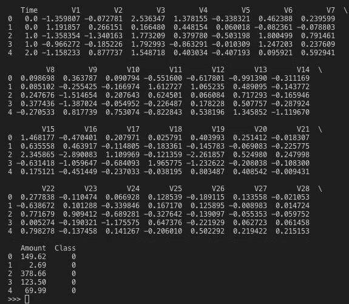

First few rows of the dataset

Class 列是我们的目标变量，Amount 列是交易金额。现在看正班的比例。

```
# The percentage of positive class in this dataset
len(df[df['Class']==1])/len(df)
```

正面类就是我上面说的，0.17%。现在我们将继续参观模型建筑。我们将使用逻辑回归来看看。让我们将 Amount 列标准化，并分成训练和测试数据集。

```
# Normalise the Amount feature
df['amt'] = preprocessing.normalize(np.array(df['Amount']).reshape(-1,1),
norm='l2')
```

现在，数据准备好了，让我们分成训练(整个数据的 80%)和测试(整个数据的 20%)数据集，并实现随机欠采样。

```
# Split the dataset into train and test, and drop unnecessary features
tr, te = train_test_split(df.drop(['Amount','Time'],1), test_size=.2,random_state=42)# Rundom Under Sampling (RUS)
tr_x_rus, tr_y_rus = rus.fit_resample(tr.drop(['Class'],1),tr.Class)
```

我们可以在随机欠采样后检查训练、测试和训练集中类的分布。

```
# See the class distribution with features
feats_distribution_rus = pd.DataFrame(pca.fit_transform(tr_x_rus),columns=['after']).reset_index(drop=True)
feats_distribution_rus['Class'] = tr_y_russns.regplot(x='after',y='Class',data=feats_distribution_rus,logistic=True, n_boot=500, y_jitter=.03)
plt.title('Class distribution of training set after undersampling')
plt.show()
```

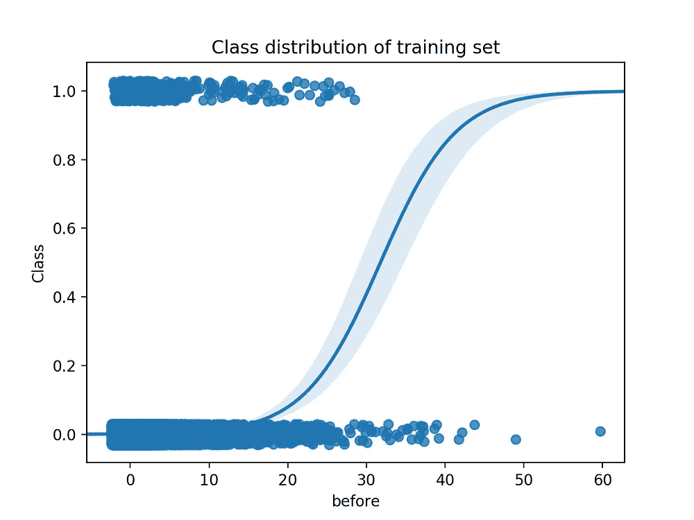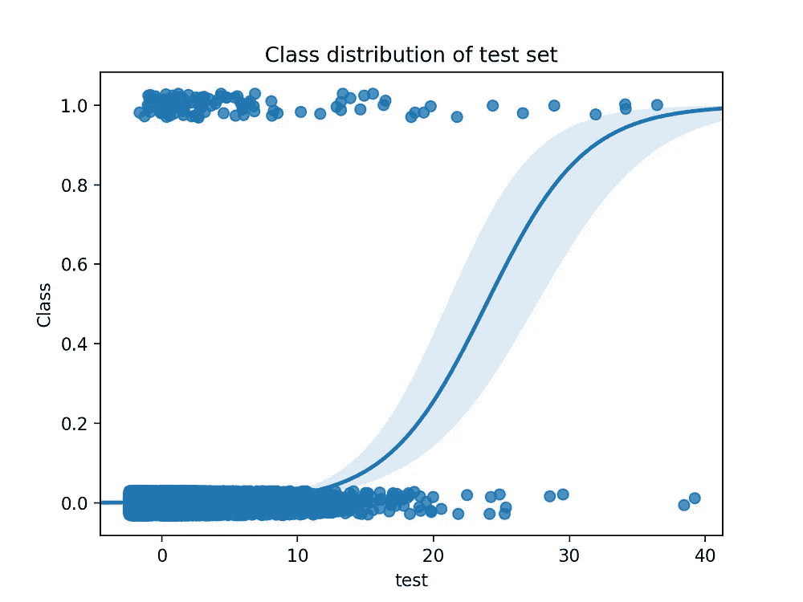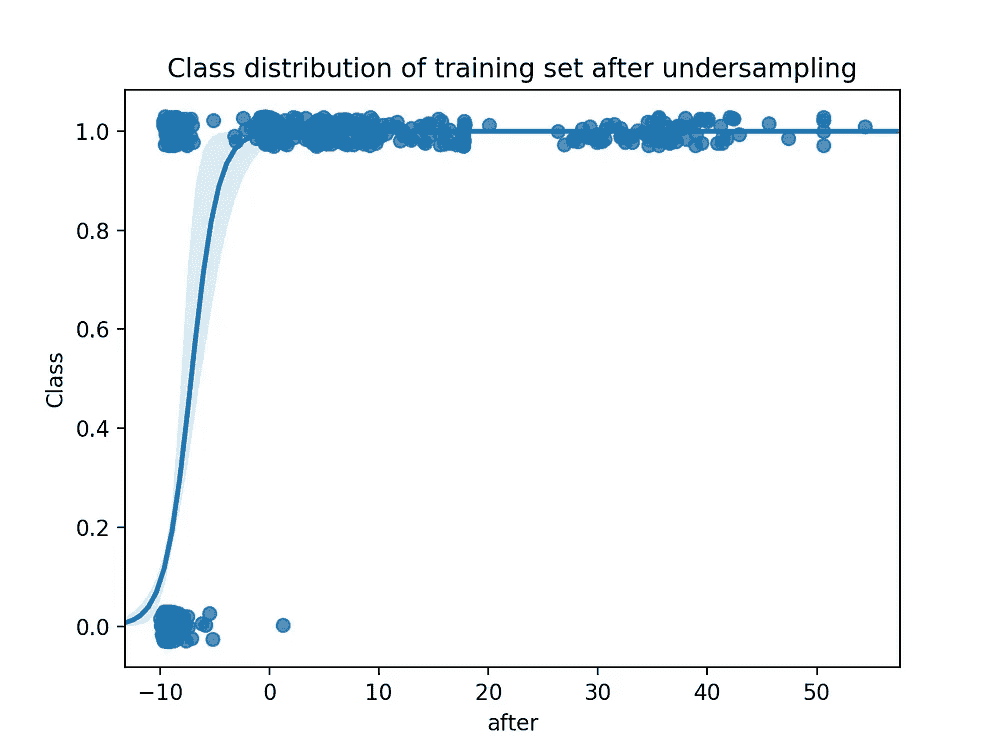

Class distributions of before and after undersampling and test set comparison

左上角是训练集的分布，左下角和右边是随机欠采样后的分布，都是测试集(用于比较)。y 轴表示类别，1 表示交易是欺诈，否则不是欺诈。我们可以在训练集和测试集中看到类似的分布，因为它们是通过随机采样创建的。另一方面，在随机欠采样后的训练集中，显示出与其他分布完全不同的分布。让我们看看这种差异是如何影响分类器的。

现在建立模型。为了比较，让我们看看 RUS 装袋(随机欠采样+装袋)的性能。

```
# Logistic regression
logit = LogisticRegression(random_state=42,solver='lbfgs',
max_iter=1000)# Rundom Under Sampling (RUS)
tr_x_rus, tr_y_rus = rus.fit_resample(tr.drop(['Class'],1),tr.Class)
logit_rus = logit.fit(tr_x_rus,tr_y_rus)# RUS bagging
bc = BalancedBaggingClassifier(base_estimator=logit,random_state=42)
logit_bc = bc.fit(tr.drop(['Class'],1),tr.Class)
```

现在，我们使用贝叶斯最小风险来实现概率校准方法。这里我们创建 beta(少数选择比率)、tau(阈值)和校准函数。

```
# BMR (Bayes Minimum Risk) implementation
# Pozzolo et al., 2015, Calibrating Probability with Undersamplingclass BMR:
    def beta(binary_target):
        return binary_target.sum()/len(binary_target) def tau(binary_target, beta):
        return binary_target.sum()/len(binary_target) def calibration(prob, beta):
        return prob/(prob+(1-prob)/beta)
```

将这些校准技术应用于 RUS 和 RUS·鲍格的预测概率。

```
# Calibration
beta = BMR.beta(tr.Class)
tau = BMR.tau(tr.Class,beta)# with RUS
y_pred_calib_rus = BMR.calibration(prob=logit_rus.predict_proba(te.drop(['Class'],1))[:,1],beta=beta)y_predicted_calib_rus = np.where(y_pred_calib_rus>=tau,1,0)# wtih RUS bagging
y_pred_calib_bc = BMR.calibration(prob=logit_bc.predict_proba(te.drop(['Class'],1))[:,1],beta=beta)y_predicted_calib_bc = np.where(y_pred_calib_bc>=tau,1,0)
```

现在我们有了所有的预测，让我们评估它们，看看它们的表现如何。我将 RUS 和 RUS 装袋模型的阈值设为 0.5。

```
# Evaluation
## Random Under Sampling (RUS)
y_pred_rus, y_predicted_rus = make_prediction(model=logit_rus, X=te.drop(['Class'],1), threshold=.5)
evaluation(te.Class, y_predicted_rus)## RUS + Bagging
y_pred_bc, y_predicted_bc = make_prediction(model=logit_bc, X=te.drop(['Class'],1), threshold=.5)
evaluation(te.Class, y_predicted_bc)## Calibration with Rundom undersampling
evaluation(te.Class, y_predicted_calib_rus)## Calibration with RUS bagging
evaluation(te.Class, y_predicted_calib_bc)
```

这是结果。正如我们所料，有这么多的误报，这一点我们可以从精度得分中看出。

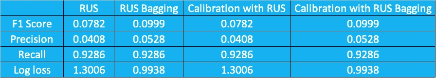

哦，等等，概率校准根本没有改变什么？一定有什么不对劲。让我们看看校准后的 RUS 装袋预测概率的预测分布。蓝色垂直线是通过校准的 RUS 装袋预测概率的平均值，红色垂直线是通过 RUS 装袋模型预测概率的平均值。显然，它们的平均值相差很远，因为校准后的概率平均值为 0.0021，而校准前为 0.5。考虑到正类在整个数据集中占 0.17%，校准后的概率似乎非常接近实际分布。

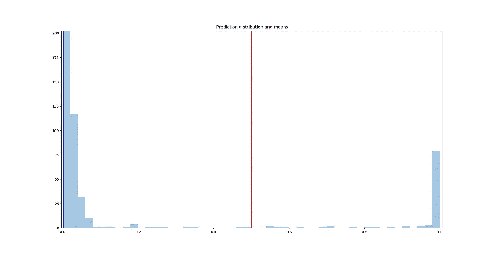

因此，如果我们修改阈值，效果应该会更好，这里我们可以看到修改阈值后的结果。在 RUS 模型上校准之前和校准之后的阈值被设置为 0.99，并且用 RUS 装袋的校准被设置为 0.8。

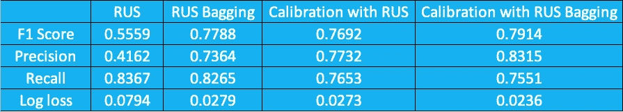

Summary of results after thresholds are modified

正如我们所看到的，在校准后，这些分数得到了提高，尤其是在随机欠采样模型上校准前后的差异非常显著。

因此，通过使用概率校准来校正有偏差的概率，我们可以看到性能的提高。

**3。结论和想法**

在这篇博文中，我们浏览了 Pozzolo 等人(2015)。这回答了我们的经验，即应用随机欠采样后会有更多的假阳性。观察重采样方法如何使分布产生偏差是非常有趣的。这将导致时间序列问题中的类似问题，因为我们预测的目标变量可能与我们训练模型时大不相同。

看看这种方法是否适用于不同类型的分类器(如基于树的分类器或神经网络分类器)以及不同类型的重采样方法，会很有意思。

这篇文章的代码可以在我的 [GitHub 页面](https://github.com/kyosek/Probability_Calibration_Imbalanced)上找到。

# 包裹

*   引入重采样会导致后验分布出现偏差
*   利用贝叶斯最小风险理论引入概率校准方法(Pozzoli，et al. 2015)
*   展示了这种方法的例子
*   证实了该方法纠正了偏差，改善了模型结果

# 参考

[1] Pozzolo 等，[不平衡分类欠采样的概率校准](https://www3.nd.edu/~dial/publications/dalpozzolo2015calibrating.pdf) (2015)，2015 IEEE 计算智能研讨会系列