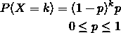
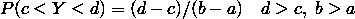
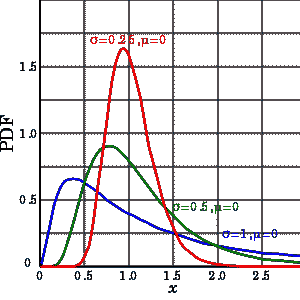
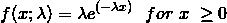

# 每个数据科学家都应该知道的 5 种概率分布

> 原文：<https://towardsdatascience.com/probability-distributions-every-data-scientist-should-know-e0a850c19157?source=collection_archive---------21----------------------->

**Probably** a nice dashboard. Source: [Pixabay](https://pixabay.com/photos/digital-marketing-technology-1433427/).

概率分布就像 3D 眼镜。它们允许一个熟练的数据科学家识别完全随机变量中的模式。

在某种程度上，大多数其他数据科学或机器学习技能都是基于对数据概率分布的某些假设。

这使得概率知识成为你作为统计学家构建工具包的基础的一部分。如果你想出如何成为一名数据科学家的第一步。

事不宜迟，让我们切入正题。

# 什么是概率分布？

在概率统计中，**随机变量**是**取随机值**的东西，比如“我看到的下一个人的身高”或者“我下一碗拉面里厨师的头发数量”。

给定一个随机变量 *X* ，我们希望有一种方法来描述它取哪些值。除此之外，我们还想描述一下**变量**取某个值** *x* 的可能性有多大。**

例如，如果 *X* 是“我的女朋友有多少只猫”，那么这个数字很有可能是 1。有人可能会说，有非零的概率，值甚至可能是 5 或 10。

然而，一个人不可能(因此也不可能)有消极的猫。

因此，我们希望有一种明确的数学方式来表达变量 *X* 可能取的每一个可能值 *x* ，以及事件 *(X= x)* 发生的可能性有多大。

为了做到这一点，我们定义了一个函数 *P* ，使得 *P(X = x)* 是变量 *X* 具有值 *x* 的概率。

我们也可以要求 P(X < x), or P(X > x ),要求间隔而不是离散值。这将很快变得更加重要。

*P* 是变量的**密度函数**，表征该变量的**分布**。

随着时间的推移，科学家们已经认识到自然界和现实生活中的许多事情往往表现相似，变量共享一个分布，或具有相同的密度函数(或类似的函数改变其中的一些常数)。

有趣的是，为了让 P 成为一个真实的密度函数，有些东西必须适用。

*   ***P(X = X)*<= 1**为任意值 *x* 。没有比确定更确定的了。
*   ***P(X =x)* > = 0** 为任意值 *x* 。一件事可能是不可能的，但可能性不会比那更小。
*   而最后一个:所有可能值*X*的 *P(X=x)* 的**总和**为 1 。

最后一个意思是“X 取宇宙中任何值的概率，因为我们知道它会取某个值”。

# 离散与连续随机变量分布

最后，随机变量可以被认为属于两组:**离散的**和**连续的**随机变量。

## 离散随机变量

**离散变量**有一组离散的可能值，每个值都有非零概率。

例如，当掷硬币时，如果我们说

> *X = "1 如果硬币是正面，0 如果是反面"*

那么 *P(X = 1) = P(X = 0) = 0.5* 。

然而，请注意，离散集合不必是有限的。

一个**几何分布**，用于模拟在 *k* 重试之后发生概率为*p*的某个事件的几率。

它的密度公式如下。

其中 ***k* 可以取任意一个概率为正**的非负值。

注意所有可能值的概率总和仍然是**加起来是 1** 。

## 连续随机变量

如果你说

> *X = "从我头上随机拔下的一根头发的长度，单位为毫米(不四舍五入)"*

*X* 可以取哪些可能的值？我们可能都同意负值在这里没有任何意义。

然而，如果你说它正好是 1 毫米，而不是 1.1853759…或类似的东西，我会怀疑你的测量技能，或你的测量误差报告。

一个连续的随机变量可以在给定的(连续的)区间内取任何值。

因此，如果我们给所有可能的值分配一个**非零概率，那么它们的总和**不会等于 1** 。**

为了解决这个，如果 *X* 是连续的，我们为所有的 *k* 设置 *P(X=x) = 0* ，取值**取值 *X* 改为分配一个非零的机会。**

为了表示 X 位于值 *a* 和 *b* 之间的概率，我们说
P(a<X<b)。

为了得到连续变量 *X* 的 *P(a < X < b)* ，而不是仅仅替换密度函数中的值，您将对从 *a* 到 *b* 的 *X* 的密度函数进行积分。

哇，你已经通过了整个理论部分！这是你的奖励。

Source: [pixabay](https://pixabay.com/photos/pug-puppy-dog-animal-cute-690566/).

现在你知道什么是概率分布了，让我们来学习一些最常见的概率分布吧！

# 伯努利概率分布

具有伯努利分布的随机变量是最简单的变量之一。

它代表一个**二元事件**:“这发生了”vs“这没发生”，取一个值 *p* 作为它的**唯一参数**，它代表**事件发生**的概率****。

具有参数为 *p* 的伯努利分布的随机变量 *B* 将具有以下密度函数:

> *P(B = 1) = p，P(B =0)= (1-p)*

这里 *B=1* 表示事件发生了， *B=0* 表示没发生。

注意这两个概率加起来都是 1，因此 *B* 不可能有其他值。

# 均匀概率分布

有两种均匀随机变量:离散的和连续的。

一个**离散均匀分布**将取一组**(有限)**值 *S* ，并给它们中的每一个分配一个概率 *1/n* ，其中 *n* 是 *S* 中元素的数量。

这样，举例来说，如果我的变量 *Y* 在{1，2，3}中是一致的，那么有 33%的几率出现这些值。

在**骰子**中可以找到离散均匀随机变量的一个非常典型的例子，其中典型的骰子具有一组值{1，2，3，4，5，6}。

一个**连续均匀分布**取而代之，只取为参数，并在它们之间的**区间内给每个值分配相同的密度**。

这意味着 Y 在区间(从 *c* 到 *d* )中取**值的概率**与其大小**相对于整个区间( *b-a* 的大小成比例。**

因此，如果 *Y* 均匀分布在 *a* 和 *b* 之间，则

这样，如果 *Y* 是 1 到 2 之间的均匀随机变量，

Python 的`random`包的`random`方法采样 0 到 1 之间的均匀分布的连续变量。

有趣的是，可以证明给定一个[均匀随机值生成器和一些演算](https://www.mathworks.com/help/stats/generate-random-numbers-using-the-uniform-distribution-inversion-method.html)，可以对**任何其他分布**进行采样。

# 正态概率分布

Normal Distributions. source: [Wikipedia](https://en.wikipedia.org/wiki/Normal_distribution)

**正态分布变量**在自然界如此普遍，它们实际上是。这就是这个名字的由来。

如果你把你所有的同事聚集在一起，测量他们的身高，或者称他们的体重，并把结果绘制成柱状图，很可能会接近正态分布。

当我向您展示[探索性数据分析](http://www.datastuff.tech/data-analysis/data-analysis-pandas-seaborn-kaggle-dataset/)示例时，我实际上看到了这种效果。

还可以看出，如果您**从任意随机变量中抽取一个样本**，然后**对这些测量值**进行平均，并多次重复该过程，该平均值也将具有一个**正态分布**。这个事实非常重要，它被称为统计学的基本定理。

正态分布变量:

*   **是否对称**，以平均值为中心(通常称为 **μ** )。
*   可以取真实空间上的**所有值，但只有 5%的时间偏离标准值两个 sigmas。**
*   到处都是**和**。

大多数情况下，如果你测量任何经验数据，并且它是对称的，假设它是正态的会有点用。

例如，滚动 *K* 骰子，将结果相加，将会得到非常正常的分布。

# 对数正态概率分布

Lognormal distribution. source: [Wikipedia](https://en.wikipedia.org/wiki/Log-normal_distribution)

对数正态概率分布是正态概率分布的较小的，不太常见的姐妹。

如果变量 *Y = log(X)* 遵循正态分布，则称变量 *X* 为**对数正态分布**。

当绘制成直方图时，对数正态概率分布是不对称的，如果它们的标准偏差更大，这种情况会变得更加严重。

我认为**对数正态**分布值得一提，因为**大多数基于货币的变量**都是这样的。

如果你观察任何与金钱相关的变量的概率分布，比如

*   某银行最近一次转账的金额。
*   华尔街最近的交易量。
*   一组公司给定季度的季度收益。

它们通常不具有正态概率分布，而是表现得更接近于对数正态随机变量。

(对于其他数据科学家:如果你能想到你在工作中遇到的任何其他经验对数正态变量，请加入评论！尤其是财务之外的任何事情)。

# 指数概率分布

Source: [Wikipedia](https://en.wikipedia.org/wiki/Exponential_distribution)

**指数概率分布**也随处可见。

它们与一个叫做**泊松过程**的概率概念紧密相关。

直接从维基百科上偷来的，[泊松过程](https://en.wikipedia.org/wiki/Poisson_point_process)是“*一个事件以恒定的平均速率连续独立发生的过程*”。

这意味着，如果:

*   你有很多事情要做。
*   它们以一定的速率发生(该速率**不会随着时间**而改变)。
*   仅仅因为一件事发生了，另一件事发生的可能性不会改变。

然后你有一个泊松过程。

一些例子可能是对服务器的请求，超市中发生的交易，或者在某个湖中钓鱼的鸟。

想象一个频率为λ的泊松过程(比如，事件每秒发生一次)。

指数随机变量模拟一个事件发生后，下一个事件发生所需的时间。

有趣的是，在泊松过程**中，一个事件可能发生在 0 到无限时间** ( *概率递减*)之间的任何时间间隔。

这意味着不管你等了多长时间，该事件都有非零的几率不会发生。这也意味着它可能在很短的时间间隔内发生多次。

在课堂上，我们曾经开玩笑说公交车到站是泊松过程。我认为当你向某些人发送 WhatsApp 消息时的响应时间也符合标准。

然而，λ参数**调节事件的频率**。

它将使事件发生的**预期时间****以某个值**为中心。

这意味着如果我们知道每 15 分钟就有一辆出租车经过我们的街区，尽管理论上我们可以永远等下去，但我们很可能不会等超过 30 分钟。

# 指数概率分布:在实践中

以下是指数分布随机变量的密度函数:

假设您有一个来自变量的样本，并想看看它是否可以用指数分布变量来建模。

最佳 **λ参数可以很容易地估计为**采样值平均值的倒数。

指数变量非常适合建模任何概率分布，这些概率分布非常罕见，但是有巨大的(和均值突变的)**异常值**。

这是因为它们可以**取任何非负的值**，但是集中在较小的值上，随着值的增加频率降低。

在一个异常值特别多的**样本**中，你可能想要估计λ作为**中值而不是平均值**，因为中值对于异常值更加**稳健。你的里程可能会有所不同，所以要有所保留。**

# 结论

总而言之，作为数据科学家，我认为学习基础知识对我们来说很重要。

概率和统计可能不像[深度学习](http://www.datastuff.tech/machine-learning/autoencoder-deep-learning-tensorflow-eager-api-keras/)或[无监督机器学习](http://www.datastuff.tech/machine-learning/k-means-clustering-unsupervised-learning-for-recommender-systems/)那样华而不实，但它们是数据科学的**基石。尤其是机器学习。**

以我的经验来看，在不知道特征遵循哪种分布的情况下，给机器学习模型提供特征是一个糟糕的选择。

记住**无处不在的指数和正态概率分布**以及它们较小的对应物，对数正态分布也是很好的。

在训练机器学习模型时，了解它们的属性、用途和外观是改变游戏规则的**。在进行任何类型的数据分析时，记住它们通常也是好的。**

你觉得这篇文章有用吗？这些都是你已经知道的东西吗？你学到新东西了吗？请在评论中告诉我！

*在* [*Twitter 上联系我*](http://www.twitter.com/strikingloo) *，*[*Medium*](http://www.medium.com/@strikingloo)*of*[*dev . to*](http://www.dev.to/strikingloo)*如果有任何你认为不够清楚的事情，任何你不同意的事情，或者任何明显错误的事情。别担心，我不咬人。*

*原载于 2019 年 6 月 17 日*[*http://www . data stuff . tech*](http://www.datastuff.tech/data-science/5-probability-distributions-every-data-scientist-should-know/)*。*