# 数据科学中的概率分布

> 原文：<https://towardsdatascience.com/probability-distributions-in-data-science-cce6e64873a7?source=collection_archive---------3----------------------->

## 介绍数据科学中一些最常用的概率分布，并附有实际例子。

Photo by [Robert Stump](https://unsplash.com/@stumpie10?utm_source=medium&utm_medium=referral) on [Unsplash](https://unsplash.com?utm_source=medium&utm_medium=referral)

# 介绍

拥有扎实的统计背景对数据科学家的日常生活大有裨益。每当我们开始探索一个新的数据集时，我们需要首先做一个[探索性数据分析(EDA)](/interactive-data-visualization-167ae26016e8) ，以便对某些特性的主要特征有一个大致的了解。如果我们能够了解数据分布中是否存在任何模式，我们就可以定制我们的机器学习模型，以最适合我们的案例研究。这样，我们将能够在更短的时间内获得更好的结果(减少优化步骤)。事实上，一些机器学习模型被设计成在一些分布假设下工作得最好。因此，了解我们正在使用哪些发行版，可以帮助我们确定哪些模型最适合使用。

## 不同类型的数据

每次我们处理数据集时，我们的数据集代表来自**人群**的**样本**。使用这个样本，我们可以试着理解它的主要模式，这样我们就可以用它来预测整个人口(即使我们从来没有机会检查整个人口)。

假设我们想预测给定一套特征的房子的价格。我们可能能够在网上找到旧金山所有房价的数据集(我们的样本)，在进行一些统计分析后，我们可能能够对美国任何其他城市(我们的人口)的房价做出相当准确的预测。

数据集由两种主要类型的数据组成:**数值型**(例如整数、浮点数)和**分类型**(例如姓名、笔记本电脑品牌)。

数值数据还可以分为另外两类:**离散**和**连续**。离散数据只能取某些值(如学校的学生人数)，而连续数据可以取任何实数值或分数值(如身高和体重的概念)。

从离散随机变量中，可以计算出**概率质量函数**，而从连续随机变量中可以推导出**概率密度函数**。

概率质量函数给出了变量可能等于某个值的概率，相反，概率密度函数值本身不是概率，因为它们首先需要在给定范围内积分。

自然界中存在许多不同的概率分布(图 1)，在本文中，我将向您介绍数据科学中最常用的概率分布。

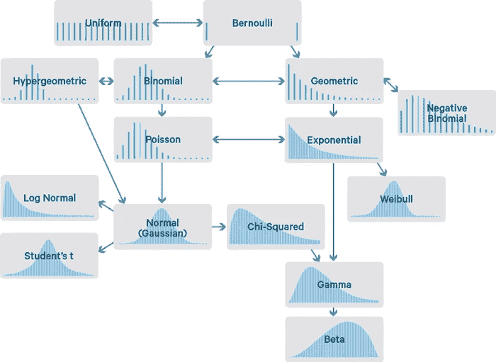

Figure 1: Probability Distributions Flowchart [1]

在整篇文章中，我将提供关于如何创建每个不同发行版的代码片段。如果您对其他资源感兴趣，可以在 [this my GitHub repository](https://github.com/pierpaolo28/Artificial-Intelligence-Projects/tree/master/Statistics) 中找到。

首先，让我们导入所有必需的库:

# 二项分布

伯努利分布是最容易理解的分布之一，并且可以用作推导更复杂分布的起点。

这种分布只有两种可能的结果和一次试验。

一个简单的例子可以是投掷一枚有偏/无偏的硬币。在这个例子中，结果可能是正面的概率可以被认为等于反面的 **p** 和 **(1 - p)** (包含所有可能结果的互斥事件的概率需要总和为 1)。

在图 2 中，我提供了一个有偏差硬币的伯努利分布的例子。

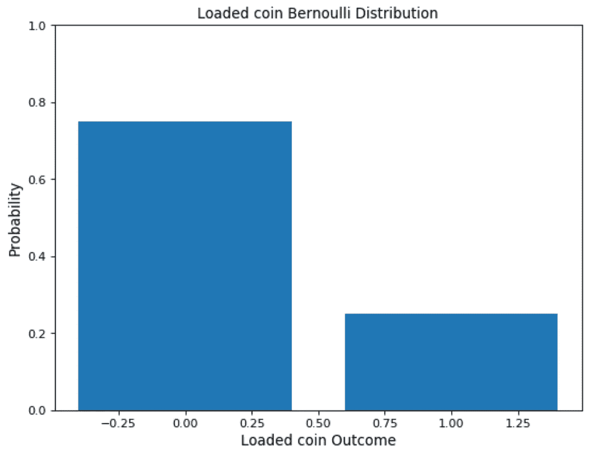

Figure 2: Bernoulli distribution biased coin

# 均匀分布

均匀分布可以很容易地从伯努利分布推导出来。在这种情况下，可能允许无限数量的结果，并且所有事件发生的概率相同。

作为一个例子，想象一个公平的骰子滚动。在这种情况下，有多个可能的事件，每个事件发生的概率相同。

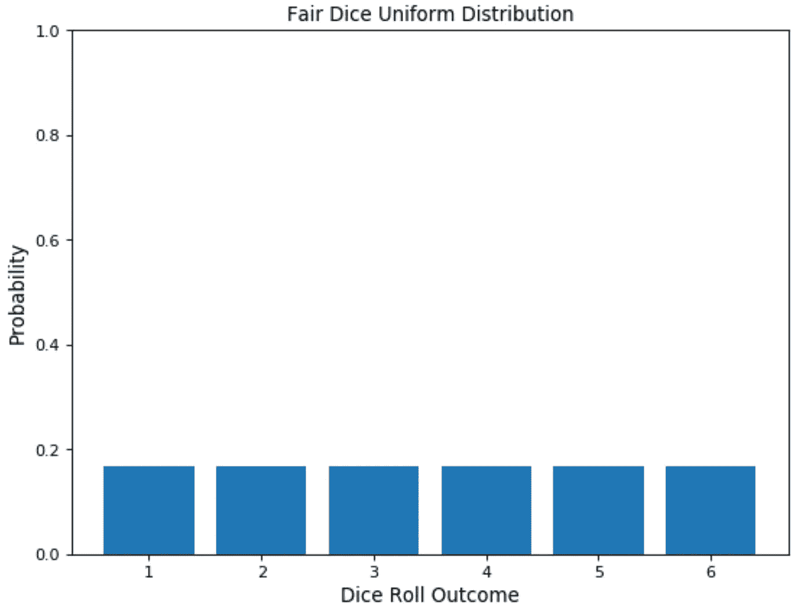

Figure 3: Fair Dice Roll Distribution

# 二项分布

二项式分布可以被认为是遵循伯努利分布的事件结果的总和。因此，二项分布用于二元结果事件，并且在所有连续试验中成功和失败的概率是相同的。该分布将两个参数作为输入:事件发生的次数和分配给两个类别之一的概率。

一个简单的二项式分布的例子可以是一个有偏/无偏硬币的投掷，重复一定的次数。

改变偏差量将会改变分布的样子(图 4)。

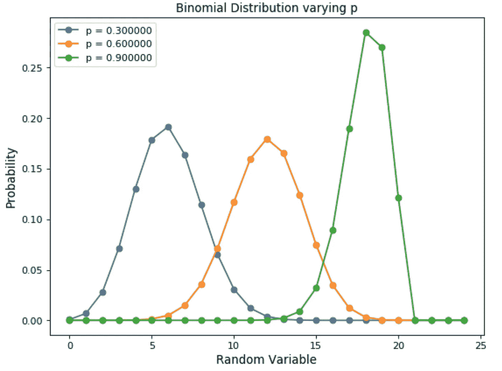

Figure 4: Binomial Distribution varying event occurrence probability

二项式分布的主要特征是:

*   给定多个试验，每个试验都是相互独立的(一个试验的结果不会影响另一个)。
*   每次尝试只能导致两种可能的结果(例如，赢或输)，其概率为 **p** 和 **(1 - p)** 。

如果给定了成功的概率( **p** )和试验的次数( **n** )，我们就可以使用下面的公式计算这 n 次试验的成功概率( **x** )(图 5)。

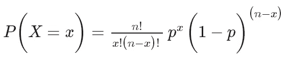

Figure 5: Binomial Distribution Formula [2]

# 正态(高斯)分布

正态分布是数据科学中最常用的分布之一。我们日常生活中发生的许多常见现象都遵循正态分布，例如:经济中的收入分布、学生平均报告、人口中的平均身高等。除此之外，小随机变量的总和也通常遵循正态分布(中心极限定理)。

> 在概率论中，**中心极限定理** ( **CLT** )确立了，在某些情况下，当独立的随机变量相加时，它们的正常标准化和趋向于正态分布，即使原始变量本身不是正态分布
> 
> — [维基百科](https://en.wikipedia.org/wiki/Central_limit_theorem)

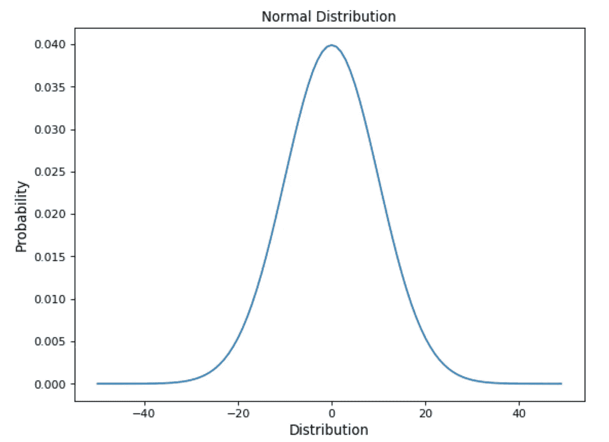

Figure 6: Gaussian Distribution

可以帮助我们识别正态分布的一些特征是:

*   这条曲线在中心对称。因此，平均值、众数和中位数都等于同一个值，使所有值围绕平均值对称分布。
*   分布曲线下的面积等于 1(所有概率的总和必须为 1)。

正态分布可以用下面的公式推导出来(图 7)。

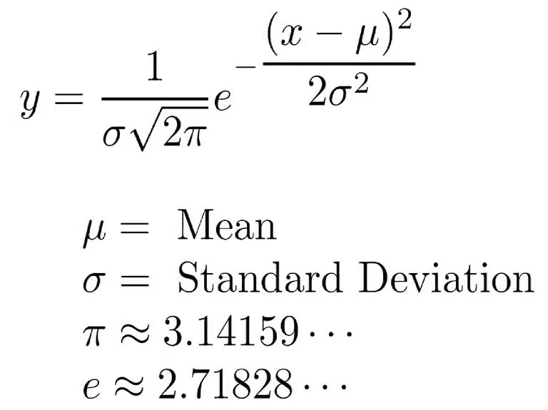

Figure 7: Normal Distribution Formula [3]

使用正态分布时，分布均值和标准差起着非常重要的作用。如果我们知道它们的值，我们就可以很容易地通过检查概率分布来找出预测精确值的概率(图 8)。事实上，由于分布特性，68%的数据位于平均值的一个标准偏差内，95%位于平均值的两个标准偏差内，99.7%位于平均值的三个标准偏差内。

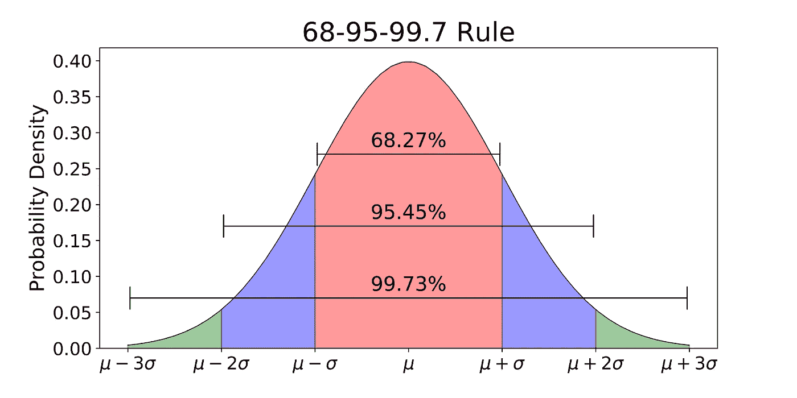

Figure 8: Normal Distribution 68–95–99.7 Rule [4]

许多机器学习模型被设计为使用遵循正态分布的数据工作得最好。一些例子是:

*   高斯朴素贝叶斯分类器
*   线性判别分析
*   二次判别分析
*   基于最小二乘法的回归模型

此外，在某些情况下，还可以通过应用对数和平方根等变换将非正常数据转换为正常形式。

# 泊松分布

泊松分布通常用于寻找事件可能发生的概率或不知道它通常发生的频率。此外，泊松分布也可用于预测一个事件在给定时间段内可能发生的次数。

例如，保险公司经常使用泊松分布来进行风险分析(例如，预测预定时间跨度内的车祸数量)以决定汽车保险定价。

使用泊松分布时，我们可以确信不同事件发生之间的平均时间，但是事件可能发生的精确时刻在时间上是随机的。

泊松分布可使用以下公式建模(图 9)，其中 **λ** 代表一段时间内可能发生的事件的预期数量。

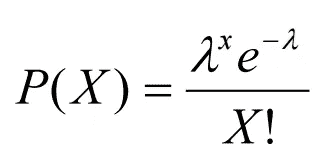

Figure 9: Poisson Distribution Formula [5]

描述泊松过程的主要特征是:

1.  这些事件相互独立(如果一个事件发生，这不会改变另一个事件发生的概率)。
2.  一个事件可以发生任意次数(在定义的时间段内)。
3.  两件事不能同时发生。
4.  事件发生之间的平均速率是恒定的。

图 10 显示了改变一个周期(λ)内可能发生的事件的预期数量如何改变泊松分布。

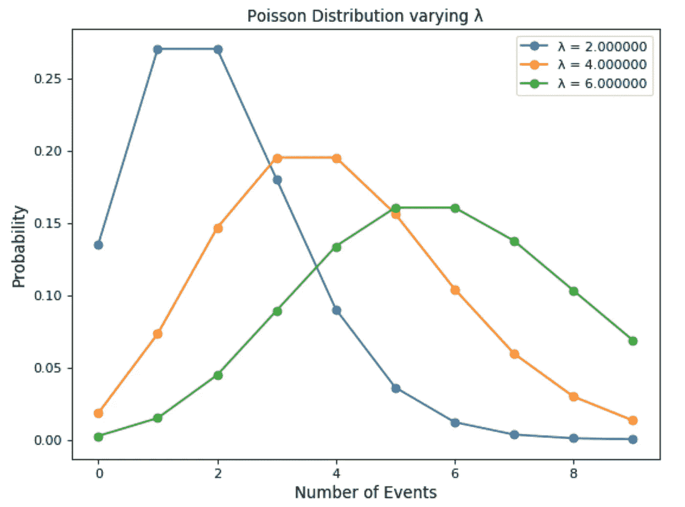

Figure 10: Poisson Distribution varying λ

# 指数分布

最后，指数分布用于模拟不同事件发生之间的时间。

例如，假设我们在一家餐馆工作，我们想预测不同顾客来到餐馆的时间间隔。对于这种类型的问题，使用指数分布可能是一个完美的起点。

指数分布的另一个常见应用是生存分析(如设备/机器的预期寿命)。

指数分布由参数λ控制。λ值越大，指数曲线衰减越快(图 11)。

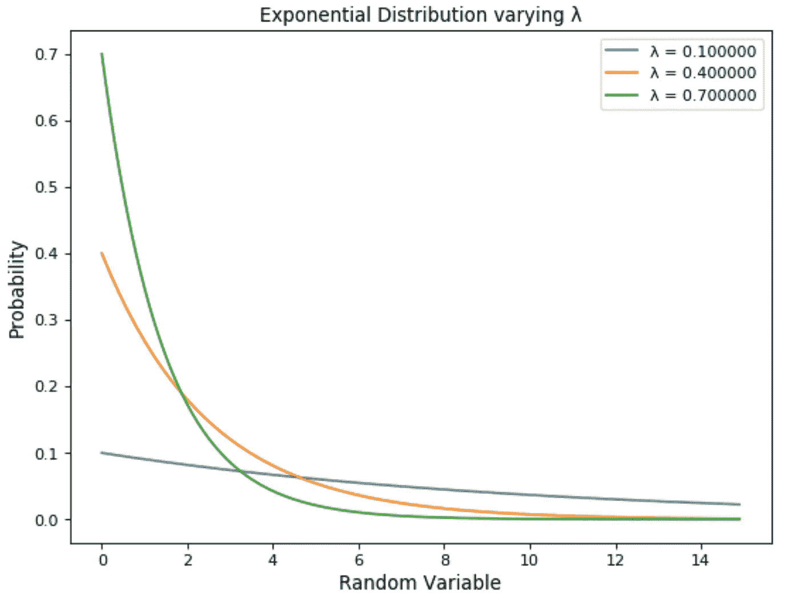

Figure 11: Exponential Distribution

使用以下公式模拟指数分布(图 12)。

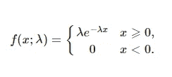

Figure 12: Exponential Distribution Formula [6]

如果你对研究概率分布如何被用来揭开随机过程的神秘面纱感兴趣，你可以在这里找到更多关于它的信息[。](/stochastic-processes-analysis-f0a116999e4)

# 联系人

如果你想了解我最新的文章和项目[，请通过媒体](https://medium.com/@pierpaoloippolito28?source=post_page---------------------------)关注我，并订阅我的[邮件列表](http://eepurl.com/gwO-Dr?source=post_page---------------------------)。以下是我的一些联系人详细信息:

*   [领英](https://uk.linkedin.com/in/pier-paolo-ippolito-202917146?source=post_page---------------------------)
*   [个人博客](https://pierpaolo28.github.io/blog/?source=post_page---------------------------)
*   [个人网站](https://pierpaolo28.github.io/?source=post_page---------------------------)
*   [中等轮廓](https://towardsdatascience.com/@pierpaoloippolito28?source=post_page---------------------------)
*   [GitHub](https://github.com/pierpaolo28?source=post_page---------------------------)
*   [卡格尔](https://www.kaggle.com/pierpaolo28?source=post_page---------------------------)

# 文献学

[1]数据科学统计学导论。
迪奥戈·梅内塞斯·博尔赫斯，数据科学家的成就。访问:[https://medium . com/diogo-menez es-Borges/introduction-to-statistics-for-data-science-7bf 596237 ac6](https://medium.com/diogo-menezes-borges/introduction-to-statistics-for-data-science-7bf596237ac6)

[2]二项式随机变量，用友生物统计学开放学习教材。访问地址:[https://bolt . mph . ufl . edu/6050-6052/unit-3b/binomial-random-variables/](https://bolt.mph.ufl.edu/6050-6052/unit-3b/binomial-random-variables/)

[3]正态分布或钟形曲线的公式。ThoughtCo，考特尼泰勒**。**访问:[https://www . thoughtco . com/normal-distribution-bell-curve-formula-3126278](https://www.thoughtco.com/normal-distribution-bell-curve-formula-3126278)

[4]解释正态分布的 68–95–99.7 规则。
迈克尔·加拉尼克，中等。访问:[https://towardsdatascience . com/understanding-the-68-95-99-7-rule-for-a-normal-distribution-b7b 7 CBF 760 c 2](/understanding-the-68-95-99-7-rule-for-a-normal-distribution-b7b7cbf760c2)

【5】正态分布，二项式分布&泊松分布，让我分析师。访问网址:[http://makemanealyst . com/WP-content/uploads/2017/05/Poisson-Distribution-formula . png](http://makemeanalyst.com/wp-content/uploads/2017/05/Poisson-Distribution-Formula.png)

[6]指数函数公式，&学习。访问地点:[https://www.andlearning.org/exponential-formula/](https://www.andlearning.org/exponential-formula/)