# 概率论

> 原文：<https://towardsdatascience.com/probability-fundamentals-of-machine-learning-part-1-a156b4703e69?source=collection_archive---------2----------------------->

## 机器学习基础(第一部分)

这是我认为机器学习基础的一系列主题中的第一部分。概率论是一个数学框架，用于量化我们对世界的不确定性。它允许我们(和我们的软件)在不可能确定的情况下进行有效的推理。概率论是许多机器学习算法的基础。这篇文章的目标是在将概率论应用于机器学习应用程序之前，涵盖所需的词汇和数学。所涉及的主题将在以后的帖子中讨论！

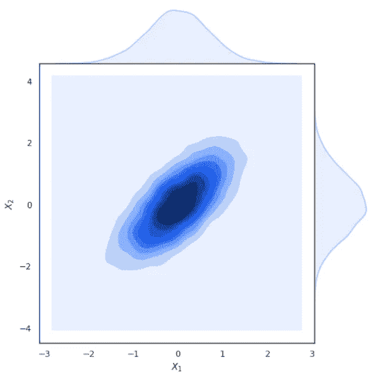

# 一些关于概率的哲学

概率到底是什么？大多数人都知道事件发生的概率是介于 0 和 1 之间的某个值，它表示事件发生的可能性有多大。看起来很简单，但是这些值实际上来自哪里呢？

客观主义者的观点是，随机性是宇宙的基础。他们会说，公平硬币正面朝上的概率是 0.5，因为这是公平硬币的本性。或者，**主观主义者**的观点认为，概率代表了我们对事件将会发生的相信程度。如果我们知道硬币的初始位置以及力是如何施加的，那么我们就可以确定它是正面朝上还是反面朝上。在这种视角下，概率是衡量我们无知的一个尺度(就像不知道力是如何作用在硬币上的)。

我个人是主观主义者。如果我们有适当的测量方法，我们应该能够确定地预测任何事情。一个不正确的领域是量子力学。为了理解一些量子现象，我们必须将它们视为真正随机的。有可能有一天我们会对宇宙如何运作有更好的理解，因此也能正确预测这些现象。似乎阿尔伯特·爱因斯坦也认同我的主观主义:

> "上帝不和宇宙玩骰子。"

无论我们对随机性的本质有什么样的信念，我们都需要一些有原则的方法来实际估算概率。

**频率主义者的**立场是，估计来自实验，而且只是实验。如果我们想估计一个六面骰子掷出 4 的可能性，我们应该掷几次骰子，观察 4 出现的频率。

当我们有大量数据时，这种方法工作得很好，但是在例子较少的情况下，我们不能对我们的估计有信心。如果五卷之后我们还没有看到 a 4，是不是意味着 a 4 是不可能的？另一个问题是，我们不能将任何关于骰子的先验知识注入到我们的估计中。如果我们知道骰子是公平的，那么在前五次掷骰中没有看到 4 是完全可以理解的。

另一个流行的评估哲学是贝叶斯理论。概率的贝叶斯处理允许我们将我们先前的信念与我们的观察相结合。想象一下，一枚我们认为公平的硬币被抛了三次，结果是三个头。一个频率主义者的计算会建议硬币是装载的(虽然可信度低)，但是我们的贝叶斯先验硬币是公平的允许我们保持一定程度的信念，即一个尾巴仍然是可能的。我们如何结合我们先前的信念的实际机制依赖于所谓的贝叶斯法则，这将在后面介绍。

# 概率数学

一开始，我提出概率论是一个数学框架。正如任何数学框架一样，需要一些词汇和重要的公理来充分利用该理论作为机器学习的工具。

概率就是各种结果的可能性。所有可能结果的集合被称为**样本空间**。抛硬币的样本空间是{正面，反面}。水温的样本空间是冰点和沸点之间的所有值。样本空间中一次只能有一个结果，并且样本空间必须包含所有可能的值。样本空间通常用ω(大写ω)表示，特定结果用ω(小写ω)表示。我们将事件发生的概率ω表示为 P(ω)。

概率的两个基本公理是:

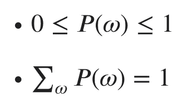

Axioms of Probability

说白了，任何事件的概率都得在 0(不可能)到 1(一定)之间，所有事件的概率之和应该是 1。这是因为样本空间必须包含所有可能的结果。所以我们确定(概率 1)可能的结果之一会发生。

一个**随机变量** x，是一个从样本空间随机取值的变量。我们经常用斜体表示 x 可以取的一个特定值。例如，如果 x 代表掷硬币的结果，我们可以讨论一个特定的结果为 *x* =正面。随机变量既可以像硬币一样是离散的，也可以是连续的(可以有无数个可能的值)。

为了描述随机变量 x 的每个可能值的可能性，我们指定一个**概率分布**。我们写 x ~ P(x)来表示 x 是一个随机变量，它取自一个概率分布 P(x)。根据随机变量是离散的还是连续的，概率分布有不同的描述。

## **离散分布:**

离散随机变量用一个**概率质量函数** (PMF)来描述。PMF 将变量样本空间中的每个值映射到一个概率。一个这样的 PMF 是在 *n* 个可能结果上的均匀分布:P(x= *x* ) = 1/ *n* 。这读作“x 取值 *x* 的概率是 1 除以可能值的数量”。它被称为均匀分布，因为每种结果都有相同的可能性(可能性均匀分布在所有可能的值上)。因为骰子的每个面都有相同的可能性，所以公平掷骰由均匀分布来模拟。加载的骰子通过分类分布来建模，其中每个结果被分配一个不同的概率。

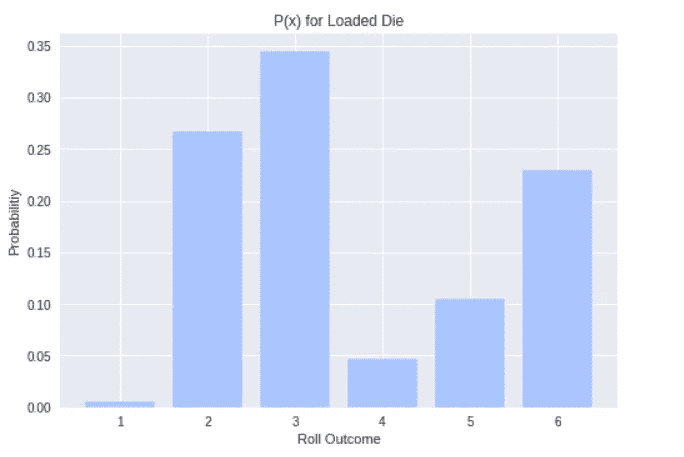

另一种常见的离散分布是伯努利分布。伯努利分布规定了随机变量的概率，它可以取两个值中的一个(1/0，正面/反面，真/假，下雨/不下雨，等等)。).伯努利分布的 PMF 是 P(*x*)= {*P*if*x*= 1，1- *p* if *x* =0}。因此，我们可以用单个参数 *p* 指定整个分布，即正面结果的概率。对于一枚公平的硬币，我们有 p = 0.5，因此正面或反面的可能性是相等的。或者，如果我们说明天下雨的概率是 *p* = 0.2，那么我们可以推断不下雨的概率是 0.8。

## **连续分布:**

连续随机变量由**概率密度函数** (PDF)描述，这可能有点难以理解。我们通常将随机变量 x 的 PDF 表示为 *f* ( *x* )。pdf 将无限样本空间映射到相对似然值。为了理解这一点，让我们看一个最著名的连续分布的例子，高斯(正态)分布。

高斯分布(俗称钟形曲线)可以用来模拟几种自然现象。例如，每个性别的身高近似为高斯分布。高斯分布由两个值参数化:均值μ(μ)和方差σ(σ平方)。平均值指定分布的中心，方差指定分布的宽度。你可能也听说过标准差σ，它就是方差的平方根。为了表示 x 是从具有均值μ和方差σ的高斯分布中抽取的随机变量，我们写:

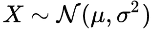

X is drawn from a Normal distribution with mean μ and variance σ².

乍一看，高斯分布的 PDF 的函数形式可能令人生畏。我保证，在应用程序中使用高斯分布后，这种恐惧就会消失！PDF 的功能形式是:

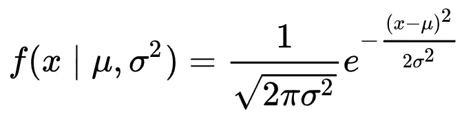

The PDF of x given μ and σ²

等式的左手边写着“给定μ和σ的 *x* 的 PDF”。竖线代表单词“given ”,表示我们已经知道括号中它后面的所有值。假设μ = 0，σ = 4，我们来绘制这个等式:

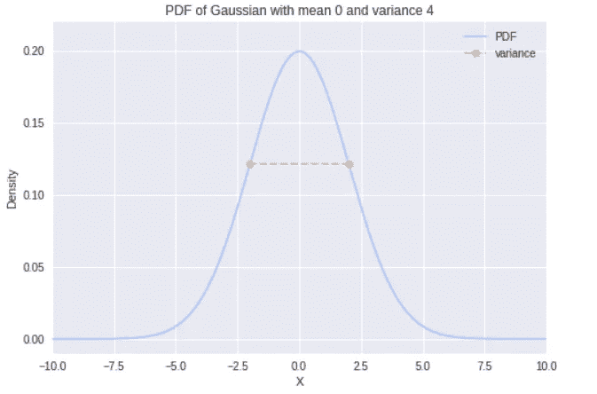

那么我说的相对可能性是什么意思呢？与离散分布不同，x = *x* 处的 PDF 值并不是 *x* 的实际概率。当人们刚开始涉足概率论时，这是一个常见的误解。因为 x 可以取无限多的值，所以 x 取任何特定值的概率实际上是 0！我猜你不相信我，但是让我们在重温我们的公理时一起考虑一下。

回想一下，每个可能值的总概率总和需要为 1。我们如何对无限多的值求和？答案来自积分形式的微积分。我们可以用积分来重写 PDF 形式的公理:

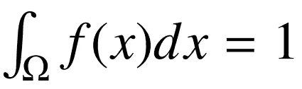

The integral of the PDF over the sample space is 1.

如果你不熟悉微积分，积分是一个计算曲线下面积的运算符 *f* ( *x* )。这是对无穷多个值求和的概括。所以 PDF 下面的区域代表高斯分布的总概率！如果你熟悉微积分(并且有能力)，你可以自己计算高斯函数的积分来确定面积是 1。

因为面积是我们感兴趣的，所以使用连续随机变量的**累积分布函数** (CDF)通常更有用。我们把 CDF， *F* ( *x* )写成:

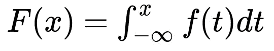

CDF is a function of the integral of the PDF.

这到底是什么意思？嗯，对于给定的值 *x* ，我们对 PDF 从负无穷大到那个值进行积分。所以 *F* ( *x* )给出了从负无穷大到 *x* 区间的 PDF 下的面积。

我们只要确定面积对应概率，那么 *F* ( *x* )给我们 P(x≤ *x* )。现在，我们可以通过注意到 P(*a*≤x≤*b*)=*F*(*b*)-*F*(*a*)来使用 CDF 确定任何给定范围[ *a* ， *b* ]的概率。这就回答了“x 在 *a* 和 *b 之间的概率是多少？”*。

求 P(x= *x* )等价于求 P(*x*≤x≤*x*)= F(*x*)-F(*x*)= 0。现在你知道了，从分布中抽取一个特定数字的概率是 0！(更有力的论据可以通过实际采用极限来提出)。这是之前相同高斯的 CDF:

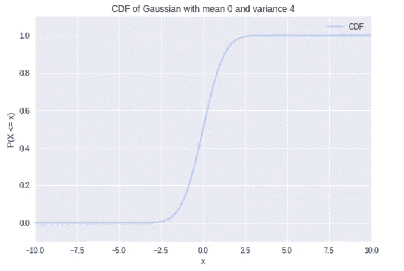

我们看到 x 取小于-2.5 的值的概率接近于 0。我们还看到，从 x 采样的值大多小于 2.5。

## **联合概率分布:**

多个随机变量的分布称为**联合概率分布**。我们可以把随机变量的集合写成一个向量 **x** 。在 **x** 上的联合分布指定了 **x** 中包含的所有随机变量的任何特定设置的概率。为了更清楚地说明这一点，让我们考虑两个随机变量 x 和 y，我们把联合概率写成 P(x= *x* ，y= *y* )或者简称为 P( *x* ， *y* )。我大声说出“x= *x* 和 y= *y* 的概率”。如果两个随机变量都是离散的，我们可以用一个简单的概率表来表示联合分布。例如，让我们考虑我穿哪件外衣与天气条件的联合分布(在只有这些选项的宇宙中):

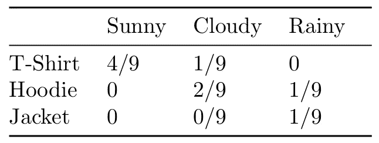

Joint Distribution of clothes and weather (in an odd universe)

这个玩具例子强调了一些重要的事情。首先，我不擅长做玩具例子。其次，请注意，该表满足我们的公理所提出的要求。我们可以立即回答 P 形式的问题(衣服=T 恤衫，天气=晴天)，但是联合分布给了我们更多！

## **边际概率分布:**

首先，我们来看看**求和规则**:

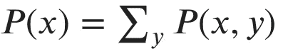

Sum Rule

术语 P( *x* )被称为**边际概率分布**，因为我们已经将随机变量 y“边缘化”了。让我们使用求和规则来计算我穿帽衫的概率。P(帽衫)= P(帽衫，晴天)+ P(帽衫，多云)+ P(帽衫，雨天)= 3/9。我们可以使用相同的过程来找到任何衣服项目或任何天气条件的边际概率。

如果 P( *x* ， *y* )是连续随机变量的联合分布，那么为了将 y 边缘化，我们将求和转化为 y 上的积分，就像之前一样。

## **条件概率分布:**

我们也经常对一个事件发生的概率感兴趣，因为另一个事件已经被观察到了。给定 y，我们将 x 的条件概率分布 T37 表示为:

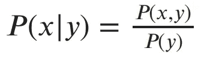

Probability of x conditioned on observing y

换句话说，如果我观察到 y= *y* ，那么 x= *x* 的概率就是 P( *x，y* )/P( *y* )。为什么观察 y 会改变 x 的概率？想象一下你看到我穿着夹克走进去。知道我穿了夹克，就给了你关于天气的信息，不用直接观察天气。

注意，条件概率只存在于 P( *y* ) > 0 的情况下。如果 *y* 不可能发生，那么我们一开始就不可能观察到 *y* 。

将最后一个方程的两边乘以 P( *y* )我们得到概率的**链式法则**，P( *x，y*)= p(*x*|*y*)⋅p(*y*)。链式法则可以推广到任意数量随机变量的联合分布:P( *x，y，z* ) = P( *x* | *y，z* ) ⋅ P( *y，z* ) = P( *x* | *y，z*)⋅p(*y*|*z*)⋅p(【t34

## **贝叶斯法则:**

请注意，我们可以用两种等价的方式来编写两个变量的链式法则:

*   P( *x，y*)= p(*x*|*y*)⋅p(*y*)
*   P( *x，y*)= p(y |*x*)⋅p(*x*)

如果我们设置两个右侧相等，并除以 P( *y* )，我们得到贝叶斯法则:

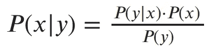

Bayes Rule

贝叶斯法则对于许多统计学和机器学习来说至关重要。如前所述，这是贝叶斯统计背后的驱动力。随着我们从数据中收集更多的观察结果，这个简单的规则允许我们更新我们对数量的信念。我肯定会在以后的文章中更多地讨论贝叶斯法则(和贝叶斯统计)。

## **独立性和条件独立性:**

在前面的例子中，我们看到 P( *x|y* ) ≠ P( *x* )是因为观察 *y* 给了我们关于 *x* 的信息。总是这样吗？我们假设 P( *x，y* )是一个联合分布，x 代表一家店的冰淇淋量，y 代表月亮每天被物体撞击的次数。知道其中一个值会给我们任何关于另一个值的信息吗？当然不是！所以在这种情况下 P( *x|y* ) = P( *x* )！通过把这个代入链式法则，我们发现在这个场景中我们得到 P( *x，y*)= p(*x | y)⋅p(*y*)= p(x*)⋅p(*y*)。这直接把我们引向我们对独立的定义。如果 P( *x，y*)= p(*x*)⋅p(*y*)，则称两个变量 x 和 y 是独立的。

一个类似的概念是**条件独立性**。给定另一个变量 z，如果 P( *x，y | z*)= p(*x | z*)⋅p(*y | z*)，则两个变量 x 和 y 称为条件独立。让我们做一个例子来看看这是怎么回事。

假设 x 是一个随机变量，表示我是否带伞上班，y 是一个随机变量，表示我的草地是否潮湿。很明显，这些事件不是独立的。如果我带了一把伞，这可能意味着下雨了，如果下雨，我的草是湿的。现在让我们假设我们观察变量 z，它代表外面实际上正在下雨。现在不管我有没有带伞上班，你都知道我家的草是湿的。所以下雨的条件已经使我的伞独立于我的草是湿的！

当我们需要表示非常大的联合分布时，独立性和条件独立性变得非常重要。独立性让我们将分布分解成更简单的术语，实现有效的内存使用和更快的计算。我们将在未来关于贝叶斯网络的文章中具体看到这一点！

# 随机变量的函数

创建以随机变量为输入的函数通常很有用。让我们考虑去一趟赌场。玩我最喜欢的游戏“猜一个 1 到 10 之间的数字”要花 2 美元。如果你猜对了，你将赢得 10 美元。如果你猜错了，你什么也赢不了。设 x 是一个随机变量，表示你是否猜对了。然后我们可以写一个函数*h*(*x*)= { $ 8 if*x*= 1，和-$2 if *x* = 0}。换句话说，如果你猜对了，你会得到 10 美元减去你支付的 2 美元，否则你会失去你的 2 美元。你可能有兴趣提前知道预期的结果是什么。

## **期望:**

随机变量 x ~ P(x)上的函数 *h* (x)的期望值，或**期望值**，是 P(x)加权后的 *h* ( *x* )的平均值。对于离散的 x，我们写为:

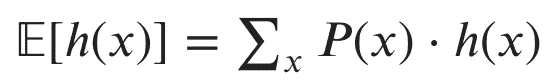

Expected Value of h(x) with respect to P(x)

如果 x 是连续的，我们会用一个积分代替求和(我敢打赌你现在已经看到一个模式了)。因此，期望充当了对 *h* ( *x* )的加权平均，其中权重是每个 *x* 的概率。

如果我们假设有 1/10 的机会猜中正确的数字，在赌场玩猜谜游戏的期望值是多少？

𝔼[ *h* (x)] = P(赢)⋅ *h* (赢)+ P(输)⋅ *h* (输)=(1/10)⋅$ 8+(9/10)⋅(-$ 2)= $ 0.80+(-1.80)=-1 美元。所以平均来说，我们每次玩游戏都会输掉 1 美元！

期望的另一个很好的特性是它们是线性的。我们假设 *g* 是 x 的另一个函数，α和β是常数。然后我们有:

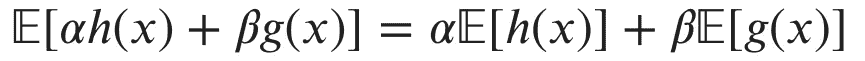

Expectations are linear

## **方差和协方差:**

当我们讨论连续随机变量时，我们看到了高斯分布的方差。一般来说，**方差**是随机值与其平均值相差多少的度量。类似地，对于随机变量的函数，方差是函数输出与其期望值的可变性的度量。

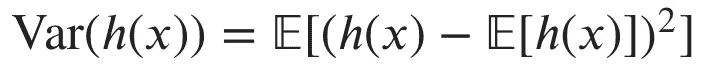

Variance of h(x) with respect to P(x)

另一个重要的概念是**协方差**。协方差是两个随机变量(或随机变量上的函数)之间线性相关程度的度量。函数 *h* (x)和 *g* (y)之间的协方差写为:

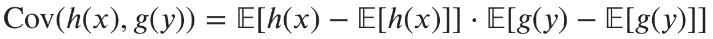

Covariance between h(x) and g(y).

当协方差的绝对值较高时，两个函数往往同时偏离均值很远。当协方差的符号为正时，两个函数一起映射到更高的值。如果符号为负，则一个函数映射到较高的值，而另一个函数映射到较低的值，反之亦然。本文开头的可视化展示了变量间具有正协方差的联合高斯分布的样本。你可以看到，随着第一个变量的增加，第二个变量也在增加。

## 时刻:

注意，我们可以通过用 x 本身替换函数 *h* (x)来计算随机变量的期望和方差。一个分布的期望是它的平均值，或一阶矩。分布的方差是它的二阶矩。概率分布的高阶矩捕捉其他特征，如偏斜度和峰度。

# 重要分布

我们已经讨论了概率论的大部分重要方面。这些想法为开发大多数统计学和机器学习的基础提供了基础。为了掌握概率论并开始弥补统计学的差距，人们需要对更有用的概率分布有所了解。

概率分布的函数形式可能令人生畏。我的建议是不要太关注那个方面，而是关注每个发行版擅长建模什么类型的情况。型号/用途描述的一些示例包括:

*   伯努利:模拟掷硬币和其他二元事件的结果
*   二项式:模拟一系列伯努利试验(一系列抛硬币等)。)
*   几何:模拟在你成功之前需要翻转多少次
*   多项式:将二项式推广到两个以上的结果(如掷骰子)
*   泊松:模拟在特定时间间隔内发生的事件数量

对于连续分布，知道形状也是有用的。例如，我们看到高斯分布的形状像一个钟，其大部分密度接近平均值。贝塔分布在区间[0，1]上可以呈现各种各样的形状。这使得贝塔分布成为我们对特定概率的信念建模的一个很好的选择。

记住这些格式良好的发行版更像是模板，这一点也很重要。您的数据的真实分布可能并不那么好，甚至可能会随着时间的推移而改变。

# 太好了，但是这一切和机器学习有什么关系呢？

这篇文章的目标是建立我们的概率语言，这样我们就可以用概率的观点来构建机器学习。我将在未来的帖子中介绍具体的机器学习算法和应用，但我想描述一下我们刚刚实现的功能。

## **监督学习:**

在监督机器学习中，我们的目标是从标记的数据中学习。被标记的数据意味着对于一些输入 X，我们知道期望的输出 y。一些可能的任务包括:

*   识别图像中的内容。
*   给定公司的一些特征，预测股票的价格。
*   检测文件是否是恶意的。
*   给病人诊断病情。

在这些情况下，概率如何帮助我们？我们可以用各种方法学习从 X 到 Y 的映射。首先，你可以学习 P(Y|X)，也就是说，假设你观察到一个新的样本 X，Y 的可能值的概率分布。找到这种分布的机器学习算法被称为**判别**。想象一下，我告诉你，我看到了一只长着毛皮、长尾巴、两英寸高的动物。你能区分可能的动物并猜出它是什么吗？

Photo by [Ricky Kharawala](https://unsplash.com/@sweetmangostudios?utm_source=medium&utm_medium=referral) on [Unsplash](https://unsplash.com?utm_source=medium&utm_medium=referral)

或者，我们可以尝试学习 P(X|Y)，即给定标签下输入的概率分布。实现这一点的算法被称为**生成**。假设我想要一只老鼠，你能描述一下老鼠的身高、体毛和尾巴长度吗？枚举特性的可能值有点像生成所有可能的鼠标。

你可能想知道了解生殖模型如何帮助我们完成动物分类的任务？还记得贝叶斯法则吗？从我们的训练数据中，我们可以学习 P(Y)，任何特定动物的概率，以及 P(X)，任何特定特征配置的概率。使用这些术语，我们可以用贝叶斯法则回答 P(Y|X)形式的查询。

有可能知道从 X 到 Y 的映射，它不是以概率分布的形式。我们可以用一个确定性函数 *f* 来拟合我们的训练数据，这样 *f* ( *X* ) ≈ Y。好吧，想象一个算法正在诊断你的疾病，它告诉你你还能活一个月。函数 *f* 无法向你表达它在评估中有多自信。也许你有算法在训练数据中从未见过的特征，导致它或多或少地猜测出一个结果。概率模型**量化了不确定性**，常规函数没有。

## 无监督学习:

无监督学习是一套从无标签数据中学习的广泛技术，其中我们只有一些样本 X，但没有输出 y。常见的无监督任务包括:

*   将相似的数据点分组在一起(聚类)。
*   取高维数据，投射到有意义的低维空间(降维、因子分析、嵌入)。
*   用分布表示数据(密度估计)。

表征未标记数据的分布对于许多任务是有用的。一个例子是异常检测。如果我们学习 P(X)，其中 X 代表正常的银行交易，那么我们可以用 P(X)来衡量未来交易的可能性。如果我们观察到低概率的交易，我们可以将其标记为可疑和可能的欺诈。

聚类是无监督学习的典型问题之一。给定一些来自不同组的数据点，我们如何确定每个点属于哪个组？一种方法是假设每个组是从不同的概率分布中产生的。解决这个问题就变成了寻找这些分布最可能的配置。

降维是无监督学习的另一个主要领域。高维数据占用内存，降低计算速度，并且难以可视化和解释。我们希望有办法在不丢失太多信息的情况下将数据降低到一个较低的维度。人们可以把这个问题看作是在低维空间中寻找一个与原始数据的分布具有相似特征的分布。

## 强化学习:

强化学习领域就是训练人工智能体在特定任务中表现出色。代理通过在他们的环境中采取行动并根据他们的行为观察奖励信号来学习。代理人的目标是最大化其预期的长期回报。概率在强化学习中用于学习过程的几个方面。你可能在目标中发现了“期望”这个词。代理人的学习过程通常围绕着量化采取一个特定行动相对于另一个行动的效用的不确定性。

# 结论

这是对概率论语言的温和概述，并简要讨论了我们将如何将这些概念应用于更高级的机器学习和统计学。请务必查看关于最大似然估计的第二部分:

 [## 最大似然估计

### 机器学习基础(二)

towardsdatascience.com](/maximum-likelihood-estimation-984af2dcfcac) 

如果你想从另一个角度来研究概率论，我强烈推荐看看《看见理论》中这个令人惊叹的视觉介绍:

 [## 视觉理论

### 概率和统计的直观介绍。

seeing-theory.brown.edu](https://seeing-theory.brown.edu/) 

下次见！