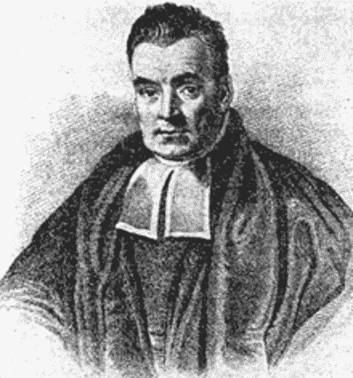
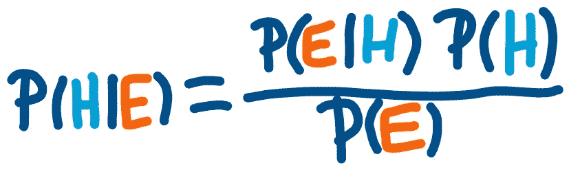
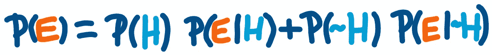
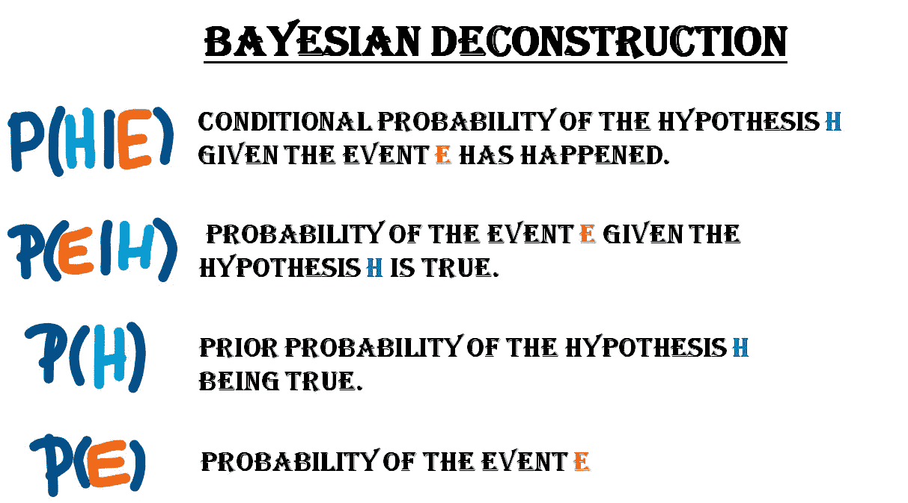
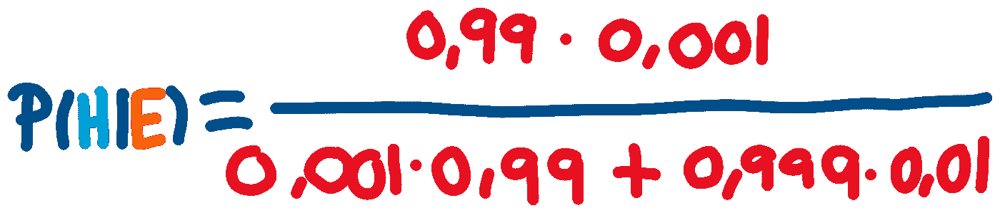
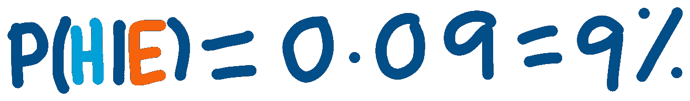
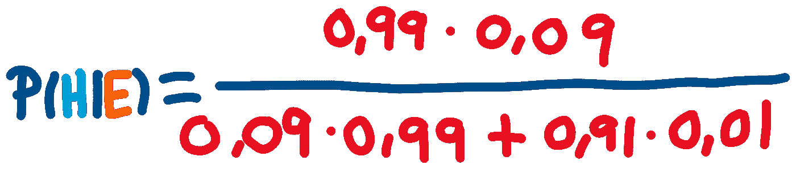
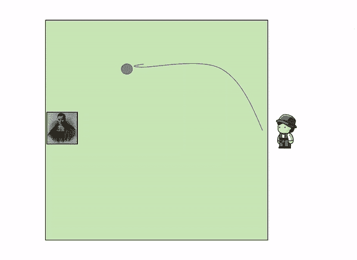
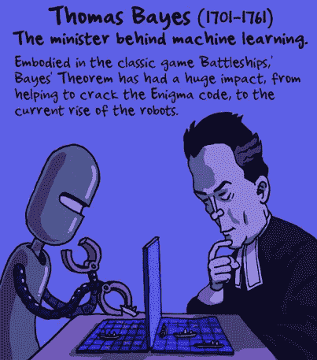

# 概率学习 I:贝叶斯定理

> 原文：<https://towardsdatascience.com/probability-learning-i-bayes-theorem-708a4c02909a?source=collection_archive---------7----------------------->

## 通过一个简单的日常例子来了解概率的基本定理之一。


这篇文章假设你有一些概率和统计的基础知识。如果你不知道，不要害怕，我已经在**收集了我能找到的向你介绍这些主题的最佳资源**，这样你就可以阅读这篇文章，理解它，并且**充分享受它**。

在这本书中，我们将讨论概率论中最著名和最常用的定理之一:**贝叶斯定理**。没听说过？那么你将会享受到一顿大餐！已经知道是什么了？然后继续读下去，用一个简单的日常例子巩固你的知识，这样你也可以用简单的语言向他人解释。

在接下来的**帖子**中，我们将了解一些**更实用的贝叶斯定理**的简化，以及**其他机器学习的概率方法**，如 ***隐马尔可夫模型*** 。

*最后，在我们开始之前，这里有一些额外的资源可以让你的机器学习生涯突飞猛进:*

```
*Awesome Machine Learning Resources:**- For* ***learning resources*** *go to* [***How to Learn Machine Learning***](https://howtolearnmachinelearning.com/books/machine-learning-books/)*! 
- For* ***professional******resources*** *(jobs, events, skill tests) go to* [***AIgents.co — A career community for Data Scientists & Machine Learning Engineers***](https://aigents.co/)***.***
```

我们走吧！

# 概率介绍:

在本节中，我列出了三个非常好的和简明的**来源(主要是前两个，第三个更广泛一点)来学习概率的基础知识**，这是你理解这篇文章所需要的。不要害怕，这些概念非常简单，只要快速阅读，你就一定能理解它们。

如果你已经掌握了基本概率，可以跳过这一节。

*   [**有趣的小概率介绍在*机器学习***](http://www.mbmlbook.com/MurderMystery.html) 中，主要用一个神秘但简单的例子来介绍概率的每个主要术语。
*   [**哈佛的统计学 110 课程**。](https://projects.iq.harvard.edu/stat110/home)这是一个更大的资源，以防你不仅想学习基础知识，还想更深入地了解统计的奇妙世界:

好了，现在你已经准备好继续这篇文章的其余部分了，坐下来，放松，享受吧。

# 贝叶斯定理:

## 贝叶斯是谁？

**托马斯·贝叶斯** (1701 — 1761)是**的英国神学家和数学家**，隶属于**皇家学会**(世界上最古老的国家科学学会，也是促进英国科学研究的主要国家组织)，其他知名人士都曾在此注册，如牛顿、达尔文或法拉第。他发展了一个最重要的概率定理，这个定理创造了他的名字:**贝叶斯定理，或条件概率定理。**



Portrait of the Reverend Thomas Bayes, father of Bayes’ Theorem

## 定理:条件概率

为了解释这个定理，我们将使用一个非常简单的例子。假设你被诊断出患有一种非常罕见的疾病，这种疾病只影响 0.1%的人。也就是说，每 1000 人中有 1 人。

**您进行的疾病检查**测试**对 99%的患病者进行了正确分类**，而对健康人的错误分类只有 1%的几率。

> 我完了！这种病致命吗医生？

大多数人都会这么说。然而，在这次测试之后，我们真的患病的可能性有多大？

> 99%肯定！我最好把我的东西整理好。

基于这种想法，贝叶斯的想法应该会占上风，因为它实际上与现实相差甚远。让我们用贝叶斯定理来获得一些观点。

**贝叶斯定理**，或者我之前称之为条件概率定理**，用于计算假设(H)为真的**概率**(即。患有疾病)**鉴于某一事件(E)已经发生**(在测试中被诊断为该疾病阳性)。使用以下公式描述该计算:**



Bayes’ formula for conditional probability

等号 P(H |E ) 左边的**项是**假设我们在这种疾病的测试中被诊断为阳性(E)** ，那么我们实际上想要计算的是患这种疾病的概率(H)。概率项中的**竖线(|)** 表示条件概率(即给定 B 的概率将是 ***P(A|B)*** )。**

右边 ***P(E|H)*** 的分子左边一项是假设为真的情况下，事件发生的概率。在我们的例子中，这将是在测试中被诊断为阳性的**概率，假设我们患有疾病**。

它旁边的术语；***【P(H)***是假设在任何事件发生之前的**先验概率。在这种情况下，这将是在进行任何测试之前患病的可能性。**

最后，分母上的项； ***P(E)*** 是事件发生的概率，即被诊断为该疾病阳性的概率。**这个术语可以进一步分解**为两个更小术语的总和:患病且检测呈阳性加上未患病且检测也呈阳性。



Deconstruction of the probability of testing positive on the test

在这个公式中 ***P(~H)*** 表示没有患病的**先验概率，**其中 ***~*** 表示否定或不否定。下图描述了条件概率整体计算中涉及的每个术语:



Description of each of the terms involved on the formulation of by Bayes’ Theorem

记住，对我们来说,**假设或假设 H 患有**疾病，而**事件或证据 E** 在这种疾病的测试中被**诊断为阳性**。

如果我们使用我们看到的**第一个公式**(计算患有疾病并被诊断为阳性的条件概率的完整公式)**分解分母，并插入数字**，我们得到以下计算结果:



Calculation of the conditional probability

0.99 来自 99%的被诊断为阳性的概率，0.001 来自 1000 分之一的患病概率，0.999 来自没有患病的概率，最后的 0.01 来自即使我们没有患病也能被诊断为阳性的概率。这种计算的最终结果是:



Result of the calculation

**9%！我们患这种疾病的可能性只有 9%!***怎么会这样？”*你大概在问自己。**魔法？**不，我的朋友们，这不是魔术，这是**只是概率**:应用于数学的常识。就像丹尼尔·卡内曼在《思考，快与慢》一书中描述的那样，人类的大脑非常不擅长估计和计算概率，就像前面的例子所显示的那样，所以我们应该总是抑制我们的直觉，后退一步，使用我们所能使用的所有概率工具。

现在想象一下，在第一次测试被诊断为阳性后，我们决定**在不同的诊所以相同的条件进行另一次测试**以复查结果，不幸的是，我们再次得到阳性诊断，这表明第二次测试也表明我们患有该疾病。

现在得这种病的实际概率是多少？好的，我们可以使用和之前完全一样的公式，但是**用上一次**得到的后验概率(一次检测阳性后 9%的概率)代替最初的先验概率 (0.1%患病几率)**，以及它们的补充项。**

如果我们处理这些数字，我们会得到:



Calculation of the conditional probability after the second positive


Results after the second positive

现在，我们有更高的几率真的患上这种疾病。尽管看起来很糟糕，但在两次阳性测试后，仍然不能完全确定我们患有这种疾病。确定性似乎逃离了概率的世界。

## 定理背后的直觉

这个著名定理背后的直觉是，我们永远无法完全确定这个世界，因为它是一个不断变化的存在，变化是现实的本质。然而，我们可以做的事情，这是这个定理背后的基本原则，是随着我们获得越来越多的数据或证据，更新和改善我们对现实的知识。

**这可以用一个非常简单的例子来说明。**想象以下情景:你在边上方形的花园里，坐在椅子上，看着花园外面。在对面，躺着一个仆人，他把一个蓝色的球扔进了正方形。在那之后，他继续在方块内投掷其他黄色球，并告诉你它们相对于最初的蓝色球落在哪里。



Video of this mental experiment with our good old Bayes sitting on the edge of his garden with his back towards a servant that is throwing the balls.

随着越来越多的黄球落地，你得到了它们相对于第一个蓝球落地的位置的信息，你逐渐增加了关于蓝球可能在哪里的知识，忽略了花园的某些部分:**随着我们获得更多的证据(更多的黄球)，我们更新了我们的知识(蓝球的位置)。**

在上面的例子中，**只扔了 3 个黄色的球**，我们已经可以开始建立一个确定的想法，蓝色的球位于花园左上角的某个地方。

当贝氏第一次公式化这个定理时，**他起初没有发表，认为这没什么了不起，**而公式化这个定理的论文是在他死后才被发现的。

今天，贝叶斯定理不仅是现代概率的基础之一，而且是许多智能系统中高度使用的工具，如垃圾邮件过滤器和许多其他文本和非文本相关的问题解决程序。

在接下来的文章中，我们将看到**这些应用是什么**，以及贝叶斯定理及其变体如何应用于许多现实世界的用例。来看看 [**跟我上媒**](https://medium.com/@jaimezornoza) ，敬请期待！



想了解更多关于概率和统计的资料，请点击下面的[最佳在线课程](https://howtolearnmachinelearning.com/online-courses/statistics-and-probability-courses/)来了解这个精彩的话题！

就这些，我希望你喜欢这个帖子。请随时在 [LinkedIn](https://www.linkedin.com/in/jaime-zornoza/) 上与我联系，或者在 **@jaimezorno** 的 Twitter 上关注我。还有，你可以看看我其他关于数据科学和机器学习的帖子[**这里**](https://medium.com/@jaimezornoza) 。好好读！