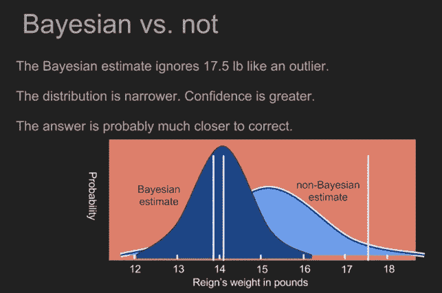

# 概率学习 II:贝叶斯定理如何应用于机器学习

> 原文：<https://towardsdatascience.com/probability-learning-ii-how-bayes-theorem-is-applied-in-machine-learning-bd747a960962?source=collection_archive---------5----------------------->

## 了解贝叶斯定理是如何在机器学习中进行分类和回归的！


在上一篇文章中，我们看到了**什么是贝叶斯定理**，并通过一个简单直观的例子展示了它是如何工作的。你可以在这里 **找到这个帖子[。如果你不知道贝叶斯定理是什么，并且你还没有阅读它的乐趣，我推荐你去读，因为它会让你更容易理解这篇文章。](/probability-learning-i-bayes-theorem-708a4c02909a?source=friends_link&sk=29a5c9c9301a1204f16460781eaba113)**

在本帖中，我们将看到这个定理在*机器学习中的**用途。***

*在我们开始之前，这里有一些额外的资源可以让你的机器学习事业突飞猛进:*

```
*Awesome Machine Learning Resources:**- For* ***learning resources*** *go to* [***How to Learn Machine Learning***](https://howtolearnmachinelearning.com/books/machine-learning-books/)*! 
- For* ***professional******resources*** *(jobs, events, skill tests) go to* [***AIgents.co — A career community for Data Scientists & Machine Learning Engineers***](https://aigents.co/)***.***
```

***准备好了吗？那我们走吧！***

# 机器学习中的贝叶斯定理

正如上一篇文章中提到的，贝叶斯定理告诉我们，当我们获得更多关于某件事的证据时，如何逐渐更新我们对某件事的知识。

通常，在**监督机器学习**中，当我们想要训练一个模型时，**主要构件**是一组包含**特征**(定义这种数据点的属性)**这种数据点的标签**(我们稍后想要在新数据点上预测的数字或分类标签)，以及将这种特征与其相应标签相链接的**假设函数**或模型。我们还有一个**损失函数**，它是模型预测和真实标签之间的差异，我们希望减少该差异以实现最佳可能结果。


Main elements of a supervised Learning Problem

这些受监督的机器学习问题可以分为**两个主要类别:回归**，其中我们希望计算与一些数据(例如房子的价格)相关联的一个数字或**数字** **值**，以及**分类**，其中我们希望将数据点分配给**某个类别**(例如，如果一幅图像显示一只狗或猫)。

**贝叶斯定理既可以用于回归，也可以用于分类。**

让我们看看如何！

## **回归中的贝叶斯定理**

假设我们有一组非常简单的**数据**，它代表一个城镇的某个地区一年中每天的**温度(数据点的**特征**，以及该地区一家当地商店每天卖出的**数量**(数据点的**标签**)。**

通过制作一个**非常简单的模型**，我们可以**查看这两者是否相关**，如果相关，然后使用这个模型**进行预测**，以便根据温度储备水瓶，永远不会缺货，或者避免库存过多。

我们可以尝试一个非常简单的**线性回归模型**来看看这些变量是如何相关的。在下面描述这个线性模型的公式中，y 是目标标签(在我们的例子中是水瓶的数量)，**每个θs 是模型的参数**(y 轴的斜率和切割)，x 是我们的特征(在我们的例子中是温度)。


Equation describing a linear model

这种训练的目标是**减少提到的损失函数**，以便模型对已知数据点的预测接近这些数据点的标签的实际值。

用可用数据训练模型后，我们将得到两个 **θs** 的值。该训练可以通过使用类似梯度下降的**迭代过程**或类似最大似然的另一种**概率方法**来执行。无论如何，我们只需要**为每个参数设定一个值**。

以这种方式，当我们得到没有标签的**新数据(新的温度预测)时，因为我们知道 **θs** 的值，我们可以使用这个简单的等式来获得想要的 ***Ys*** (每天需要的水瓶数量)。**


Figure of an uni-variate linear regression. Using the initial blue data points, we calculate the line that best fits these points, and then when we get a new temperature we can easily calculate the Nº sold bottles for that day.

当我们使用贝叶斯定理进行回归时，不是**认为模型的参数**(θs)具有单一的唯一值，而是将它们**表示为具有特定分布**的参数**:参数的先验分布。下图显示了一般贝叶斯公式，以及如何将其应用于机器学习模型。**


Bayes formula


Bayes formula applied to a machine learning model

这背后的想法是，**我们在没有任何实际数据之前，已经有了模型**参数的一些先验知识: ***P(模型)*** 就是这个先验概率。然后，**当我们得到一些新的数据时，我们更新模型的参数**的分布，使之成为后验概率 ***P(模型|数据)*** 。

这意味着**我们的参数集**(我们模型的θs)不是常数，而是**有自己的分布**。基于先前的知识(例如，来自专家，或来自其他作品)**我们对我们的模型的参数分布做出第一个假设**。然后，当我们用更多的数据**，**训练我们的模型时，这个分布得到更新**，变得更加精确(实际上方差变得更小)。**

****

**Figure of the a priori and posteriori parameter distributions. θMap is the maximum posteior estimation, which we would then use in our models.**

**该图显示了模型参数的**初始分布 *p(θ)*** ，以及当我们添加更多数据时，该分布**如何更新，**使其更精确地增长到 ***p(θ|x)*** ，其中 x 表示该新数据。这里的θ相当于上图公式中的*型号*，这里的*x*T37 相当于这样公式中的*数据*。**

**贝叶斯公式一如既往地告诉我们如何从先验概率到后验概率。随着我们获得越来越多的数据，我们在迭代过程中这样做，让**后验概率成为下一次迭代的先验概率**。一旦我们用足够的数据训练了模型，为了选择最终参数组，我们将搜索**最大后验(MAP)估计，以使用模型参数的一组具体值。****

**这种分析**从最初的先验分布**中获得其优势:如果我们没有任何先验信息，并且不能对其做出任何假设，那么像最大似然法这样的其他概率方法更适合。**

**然而，**如果我们有一些关于参数分布的先验信息，贝叶斯方法被证明是非常有效的**，特别是在有**不可靠的训练数据**的情况下。在这种情况下，由于我们不是使用该数据从零开始构建模型和计算其参数，而是使用某种先前的知识来推断这些参数的初始分布，**该先前的分布使得参数更加稳健，并且更少受到不准确数据的影响。****

**我不想在这部分讲太多技术，但是所有这些推理背后的数学是美丽的；如果你想了解它，不要犹豫，给我发电子邮件到 jaimezorno@gmail.com 或者通过 [LinkdIn](https://www.linkedin.com/in/jaime-zornoza/) 联系我。**

## ****分类中的贝叶斯定理****

**我们已经看到，通过估计线性模型的参数，贝叶斯定理可以用于回归分析。同样的推理可以应用于其他类型的回归算法。**

**现在我们将看看如何使用贝叶斯定理进行分类。这就是所谓的**贝叶斯最优分类器**。现在的推理和之前的很像。**

**假设我们有一个分类问题，用 ***i* 不同的类**。我们在这里追求的是**每个类**w*I*的类概率**。与之前的回归案例一样，我们也区分先验概率和后验概率，但现在我们有了**先验类概率** ***p(wi)*** 和**后验类概率**，在使用数据或观测值 ***p(wi|x)*** 之后。****

****

**Bayes formula used for Bayes’ optimal classifier**

**这里的***【x】***是**所有数据点*****【x | wi】***所共有的**密度函数，是属于 *wi*** 类的数据点的**密度函数， ***P(wi)*** 是 ***wi 类的先验分布 ***P(x|wi)*** 是从训练数据中计算出来的，假设某个分布，并计算每个类别***的**均值向量和属于该类别的数据点的特征**的**协方差。先验类分布 ***P(wi)*** 是基于**领域知识**、专家建议或以前的工作来估计的，就像回归示例中一样。******

让我们看一个如何工作的例子:图像我们测量了 34 个人的身高: **25 个男性(蓝色)**和 **9 个女性(红色)**，我们得到了一个 172 cm 的**新的**身高**观察值**，我们想将它分类为男性或女性。下图显示了使用**最大似然分类器和贝叶斯最优分类器获得的预测。**


On the left, the training data for both classes with their estimated normal distributions. On the right, Bayes optimal classifier, with prior class probabilities p(wA) of male being 25/34 and p(wB) of female being 9/34.

在这种情况下，我们使用训练数据**中的**个样本**作为**的**先验知识**用于我们的类别分布，但是例如，如果我们对特定国家的身高和性别进行相同的区分，并且我们知道那里的女性特别高，也知道男性的平均身高，我们可以使用这个**信息来构建我们的先验类别分布。**

从例子中我们可以看出，使用这些**先验知识会导致与不使用它们**不同的结果。假设先前的知识是高质量的(否则我们不会使用它)，这些预测应该比没有结合这些信息的类似试验更加准确。

在这之后，一如既往，当我们得到更多的数据时，这些分布会得到更新以反映从这些数据中获得的知识。

和前一个案例一样，我不想太过技术化，或者过多地延伸文章，所以我就不深究数学上的细节了，但是**如果你对它们**感兴趣，可以随时联系我。

# 结论

我们已经看到**贝叶斯定理是如何用于机器学习的**；无论是在**回归**还是**分类**中，都要将以前的知识融入到我们的模型中并加以改进。

在接下来的文章中，我们将看到贝叶斯定理的简化如何成为自然语言处理中最常用的技术之一，以及它们如何应用于许多真实世界的用例，如垃圾邮件过滤器或情感分析工具。来看看 [**跟我上媒**](https://medium.com/@jaimezornoza) ，敬请期待！



Another example of Bayesian classification

就这些，我希望你喜欢这个帖子。欢迎在 LinkedIn[上与我联系，或者在 Twitter 上关注我，邮箱: **@jaimezorno** 。还有，你可以看看我其他关于数据科学和机器学习的帖子](https://www.linkedin.com/in/jaime-zornoza/)[**这里**](https://medium.com/@jaimezornoza) 。好好读！

# 额外资源

如果您想更深入地研究贝叶斯和机器学习，请查看以下其他资源:

*   [贝叶斯推理如何工作](https://brohrer.github.io/how_bayesian_inference_works.html)
*   [贝叶斯统计 Youtube 系列](https://www.youtube.com/watch?v=YsJ4W1k0hUg)
*   [机器学习贝叶斯学习幻灯片](https://slideplayer.com/slide/4940573/)
*   [贝叶斯推断](https://www.umass.edu/landeco/teaching/ecodata/schedule/bayesian.pdf)
*   [统计与概率网络课程](https://howtolearnmachinelearning.com/online-courses/statistics-and-probability-courses/)

有关机器学习和数据科学的更多资源，请查看以下资源库: [**如何学习机器学习**](https://howtolearnmachinelearning.com/books/machine-learning-books/) ！有关职业资源(工作、事件、技能测试)，请访问[**AIgents.co——数据科学家的职业社区&机器学习工程师**](https://aigents.co/) ，如有任何问题，请联系我。祝你有美好的一天，继续学习。