# 概率学习 III:最大似然

> 原文：<https://towardsdatascience.com/probability-learning-iii-maximum-likelihood-e78d5ebea80c?source=collection_archive---------9----------------------->

## 我们成为概率大师的又一步…


在之前的两篇关于贝叶斯定理的帖子之后，我收到了很多请求，要求对定理的回归和分类用途背后的数学进行更深入的解释。**下一个系列的帖子是对这些要求的回答**。

然而，我认为，如果我们首先涵盖概率机器学习的另一个基本方法**最大似然法**背后的理论和数学，贝叶斯背后的数学将会**更好理解**。**本帖将致力于解释。**

前面的文章可以找到 [**这里**](/probability-learning-i-bayes-theorem-708a4c02909a?source=friends_link&sk=29a5c9c9301a1204f16460781eaba113) 和[**这里**](/probability-learning-ii-how-bayes-theorem-is-applied-in-machine-learning-bd747a960962) **。我建议在处理下一个问题之前先读一读，然后跟随我们一起创造的美丽故事线。**

*在我们开始之前，这里有一些额外的资源可以让你的机器学习生涯突飞猛进*

```
*Awesome Machine Learning Resources:**- For* ***learning resources*** *go to* [***How to Learn Machine Learning***](https://howtolearnmachinelearning.com/books/machine-learning-books/)*! - For* ***professional******resources*** *(jobs, events, skill tests) go to* [***AIgents.co***](https://aigents.co/)[***— A career community for Data Scientists & Machine Learning Engineers***](https://aigents.co/)***.***
```

# 最大似然原则

最大似然法的目标是使一些数据符合最佳的统计分布。这使得数据更容易处理，更通用，允许我们查看新数据是否遵循与先前数据相同的分布，最后，它允许我们对未标记的数据点进行分类。

就像在[上一篇](/probability-learning-ii-how-bayes-theorem-is-applied-in-machine-learning-bd747a960962)中，想象一个**男性和女性个体使用身高的二元分类问题**。一旦我们计算了男女身高的概率分布，并且我们得到了一个**新数据点**(作为没有标签的身高)**我们就可以将其分配到最有可能的类别**，看看哪个分布报告了两者的最高概率。

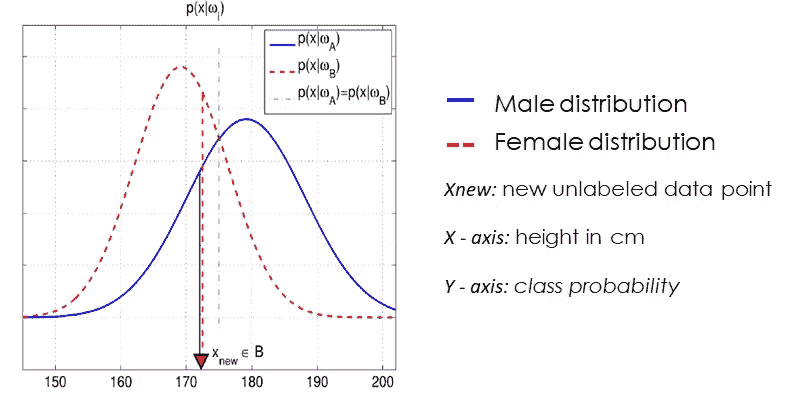

Graphical representation of this binary classification problem

在之前的图像中，该新数据点( ***xnew，*** 对应于 172 cm 的高度)被分类为女性，对于该特定高度值，女性高度分布产生比男性高的概率。

你可能会说这很酷，但是我们如何计算这些概率分布呢？不要担心，我们现在就开始。首先我们将解释其背后的一般过程，然后我们将通过一个更具体的例子。

# 计算分布:估计参数密度函数

像往常一样在**机器学习**中，我们首先需要开始计算一个分布是要学习的东西:**我们宝贵的数据**。我们将把我们的**大小 n** 的数据向量表示为 ***X*** 。在这个向量中，每一行都是具有 d 个特征的数据点**，因此我们的数据向量 *X* 实际上是向量的向量:大小为 n x d** 的矩阵**；n 个数据点，每个具有 d 个特征。**

一旦我们收集了想要计算分布的数据，我们需要开始猜测。**猜谜？**是的，你没看错，我们需要猜测我们的数据符合哪种密度函数或分布:**高斯、指数、泊松……**

不要担心，这听起来可能不太科学，但大多数情况下，每种数据都有一个最可能符合的分布:温度或高度等特征的**高斯分布**，时间等特征的**指数分布**，电话通话时间或细菌种群寿命等特征的**泊松分布**。

完成后，我们**计算最符合我们数据的特定分布参数**。对于正态分布，这将是平均值和方差。由于高斯或正态分布可能是最容易解释和理解的分布，**我们将继续这篇文章，假设我们已经选择了一个高斯密度函数来表示我们的数据。**

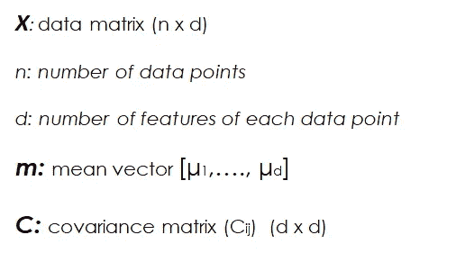

Data and parameters for our gaussian distribution

在这种情况下，我们需要计算的参数个数是 ***d*** means(每个特征一个)和 ***d(d+1)/2*** 方差，因为协方差矩阵是对称的 *dxd* 矩阵。

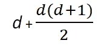

Total parameters we need to calculate for a normal distribution depending on the number of features

让我们称分布的整体参数组为 **θ** 。在我们的例子中，这包括每个特征的平均值**和方差**。我们现在要做的是获得使数据向量的联合密度函数最大化的参数集**θ**；所谓 ***似然函数*** ***L(θ)。*** 这个似然函数也可以表示为 ***P(X|θ)*** ，可以读作给定参数集θ时 X 的条件概率。

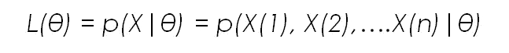

Likelihood function

在这个符号**中，X 是数据矩阵，X(1)到 X(n)是每个数据点，θ是分布的给定参数集。**同样，由于最大似然法的目标是选择参数值，使观察到的数据尽可能接近，**我们得出一个依赖于θ的优化问题。**

为了获得该最佳参数集，我们**对似然函数**中的θ进行求导，并搜索最大值:该最大值代表尽可能观察到可用数据的参数值。

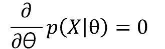

Taking derivatives with respect to θ

现在，**如果 X 的数据点彼此独立**，则似然函数可以**表示为给定参数集的每个数据点的个体概率**的乘积:


Likelihood function if the data points are independent of each other

在保持其他参数不变的情况下，对该方程的每个参数(平均值、方差等)进行求导，得到数据点数值、数据点数和每个参数之间的**关系。**

让我们看一个使用正态分布和一个简单的男性身高数据集的例子。

# **使用正态分布深入了解最大似然法的数学原理**

让我们来看一个例子，如何使用最大似然法来拟合一组数据点的正态分布，其中只有一个特征:以厘米为单位的身高。正如我们之前提到的，我们需要计算一些参数:**平均值和方差。**

为此，我们必须知道正态分布的**密度函数:**

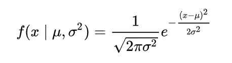

Density function for the normal distribution. Source [Wikipedia](https://en.wikipedia.org/wiki/Normal_distribution)

一旦我们知道了这一点，我们就可以计算每个数据点的似然函数。对于第一个数据点，它将是:

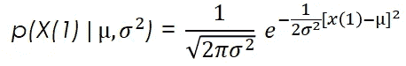

Likelihood equation for the first data point

对于整个数据集，考虑到我们的数据点是独立的，因此我们可以将似然函数计算为各个点的似然性的乘积，它将是:

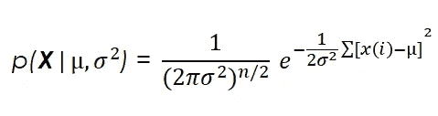

Likelihood equation for the whole dataset

我们可以用这个函数和**以对数方式表达它**，这有助于后验计算和**产生完全相同的结果。**

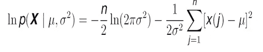

Same equation expressed in a logarithmic way

最后，我们将似然函数相对于平均值的导数设置为零，得到一个表达式，其中我们**获得第一个参数的值:**

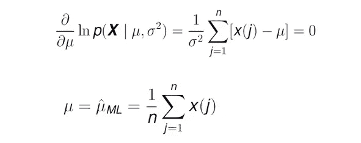

Derivative of the likelihood function for the mean, and Maximum Likelihood value for this parameter

**惊喜！**正态分布均值的最大似然估计就是我们直观预期的**:每个数据点的值之和除以数据点的数量。**

**现在我们已经计算了平均值的估计值，是时候为其他相关参数做同样的事情了:**方差**。为此，就像以前一样，我们在似然函数中求导，目标是找到使观察数据的似然性最大化的方差值。**

**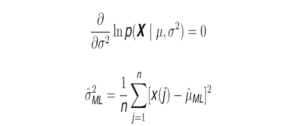**

**Maximum likelihood estimate for the variance**

**这与上一个案例一样，**给我们带来了同样的结果，我们熟悉每天的统计数据。****

**就是这样！我们已经看到了计算正态分布的最大似然估计背后的一般数学和程序。**最后，让我们看一个快速的数字示例！****

# **男性身高的最大似然估计:一个数值例子**

**让我们举一个我们之前提到过的非常简单的例子:**我们有一个某个地区男性身高的数据集，我们想使用最大似然法找到它的最优分布。****

**如果我们没记错的话，第一步(在收集和理解数据之后)是**选择我们想要估计的密度函数的形状。**在我们的例子中，对于身高，我们将使用高斯分布，这也是我们在 ML 数学背后的一般推理中看到的。让我们重新看看定义这种分布的公式:**

****

**Density function for the normal distribution. Source [Wikipedia](https://en.wikipedia.org/wiki/Normal_distribution)**

**此外，让我们只恢复数据集的一个点的似然函数。**

****

**Likelihood equation for the first data point**

**想象我们的**数据向量 X** ，在我们的例子中如下:**

**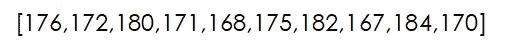**

**Data vector of male heights**

**我们有 **10 个数据点(n = 10)** 和**每个数据点(d=1)** 一个特征。如果在上面所示的公式中，我们为每个数据点代入它们的实际值，我们会得到如下结果:**

**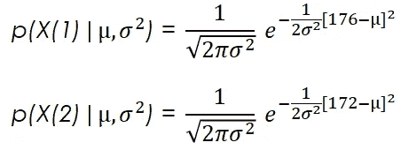**

**Likelihood of the first two data points**

**如果在这些公式中，我们**选择一个特定的平均值和方差值**，我们将获得**观察到具有这些特定平均值和方差值**的每个高度值(在我们的例子中是 176 和 172cm)**的可能性。例如，如果我们选择 180 厘米的平均值，方差为 4 厘米，我们将得到上面所示两点的如下可能性:****

**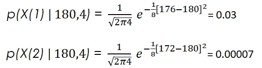**

**Calculations of likelihood of observing points of 176 cm and 172 cm of height on a normal distribution with a mean of 180 cm and a variance of 4 cm**

**简要说明后，如果我们继续该过程以获得最适合数据集的最大似然估计值，**我们将不得不首先计算平均值**。对于我们的例子来说，非常简单:我们只需将数据点的值相加，然后将这个和除以数据点的数量。**

**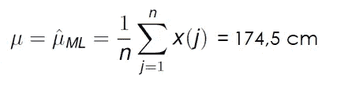**

**Maximum likelihood estimate for the mean of our height data set**

**如果我们**对方差**做同样的处理，计算每个数据点的值减去平均值的平方和，并除以我们得到的总点数:**

**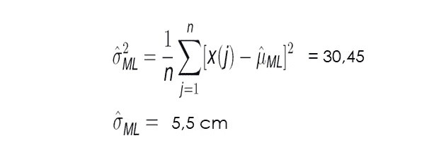**

**Variance and Standard deviation estimates for our height data set**

****就是它！**现在我们已经计算了平均值和方差，我们已经拥有了建模分布所需的所有参数。现在，当我们得到一个**新数据点时，例如，一个高度为 177 cm** 的数据点，我们可以看到该点属于我们数据集的可能性:**

**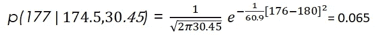**

**Likelihood of the new data point belonging to our data set**

**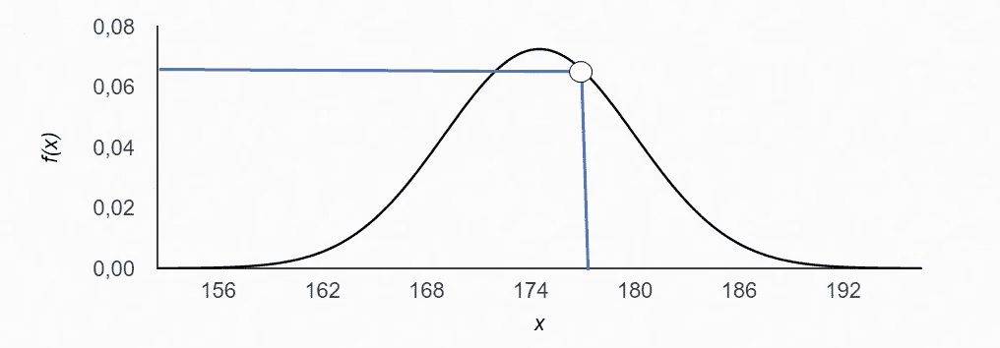**

**Representation of the obtained normal distribution and the likelihood of the new data point**

**现在，如果我们有另一组数据，例如女性身高，我们做同样的程序，我们会有两个身高分布:一个是男性，一个是女性。**

**这样，我们可以**使用两种分布来解决男性和女性身高的二元分类问题**:当我们获得一个新的未标记身高数据点时，我们计算该新数据点**属于两种分布**的概率，并将其分配给该分布产生最高概率的类别(男性或女性)**。****

# **结论**

**我们已经看到了**什么是最大似然，**它背后的数学原理，以及如何应用它来解决现实世界的问题。这给了我们解决下一个问题的基础，你们都一直在问:**贝叶斯定理背后的数学**，它非常类似于最大似然法。**

**来看看吧 [**关注我的**](https://medium.com/@jaimezornoza) ，敬请关注！**

**就这些，我希望你喜欢这个帖子。请随时在 LinkedIn 上与我联系，或者在 Twitter 上关注我，地址是:jaimezorno。还有，你可以看看我其他关于数据科学和机器学习的帖子[**这里**](https://medium.com/@jaimezornoza) 。好好读！**

# **额外资源**

**如果你想更深入地了解最大似然法和机器学习，请查看以下资源:**

*   **[带有非常清晰的解释和最大可能性示例的视频](https://www.youtube.com/watch?v=XepXtl9YKwc)**
*   **[关于正态分布最大似然的非常详细的视频](https://www.youtube.com/watch?v=Dn6b9fCIUpM)**
*   **[最大似然幻灯片](https://www.univ-orleans.fr/deg/masters/ESA/CH/Chapter2_MLE.pdf)**

**一如既往，有任何问题请联系我。祝你有美好的一天，继续学习。**