# 概率学习 IV:贝叶斯背后的数学

> 原文：<https://towardsdatascience.com/probability-learning-iv-the-math-behind-bayes-bfb94ea03dd8?source=collection_archive---------18----------------------->

## 支持分类和回归的贝叶斯定理的数学充分解释

在之前的两篇关于**贝叶斯定理**的帖子之后，我收到了很多请求，要求对定理的回归和分类用途背后的**数学进行更深入的解释。**

正因为如此，在上一篇文章中，我们介绍了**最大似然原理**背后的数学原理，以构建一个坚实的基础，让我们能够轻松理解并享受贝叶斯背后的数学原理。

你可以在这里找到所有这些帖子:

*   [概率学习 I:贝叶斯定理](/probability-learning-i-bayes-theorem-708a4c02909a)
*   [概率学习 II:贝叶斯定理如何应用于机器学习](/probability-learning-ii-how-bayes-theorem-is-applied-in-machine-learning-bd747a960962)
*   [概率学习三:最大似然](/probability-learning-iii-maximum-likelihood-e78d5ebea80c)

这篇文章将致力于**解释贝叶斯定理**背后的数学，当它的应用有意义时，以及它与最大似然法的差异。

# **闪回贝叶斯**

正如在[上一篇文章](/probability-learning-iii-maximum-likelihood-e78d5ebea80c)中我们解释了**最大似然**一样，我们将在这篇文章的第一部分记住贝叶斯定理背后的公式，特别是与我们在机器学习中相关的公式:

Formula 1: Bayes formula particularised for a Machine Learning model and its relevant data

如果我们将此公式放入**与我们在[上一篇文章](/probability-learning-iii-maximum-likelihood-e78d5ebea80c)中使用的关于最大似然的相同的数学术语**，我们会得到以下公式，其中 **θ是模型的参数，X 是我们的数据矩阵**:

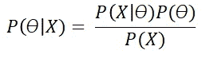

Formula 2: Bayes formula expressed in terms of the model parameters “θ” and the data matrix “X”

正如我们在致力于[贝叶斯定理和机器学习](/probability-learning-ii-how-bayes-theorem-is-applied-in-machine-learning-bd747a960962)的帖子中提到的，贝叶斯定理的**优势是能够**将一些关于模型的先前知识**整合到我们的工具集中，使其在某些情况下更加健壮。**

# 贝叶斯背后的数学解释

既然我们已经很快记住了贝叶斯定理是关于什么的，让我们充分开发它背后的数学知识。如果我们采用前面的公式，并且**以对数方式表示它**，我们得到下面的等式:

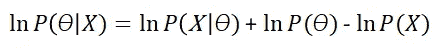

Formula 3: Bayes’ formula expressed in logarithms

还记得最大似然公式吗？等号右边的第一项你看着眼熟吗？

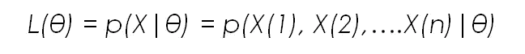

Formula 4: Likelihood function

如果有，说明你做足了功课，看了前面的帖子，理解了。等号右边的第一项正好是似然函数。**这是什么意思？**这意味着**最大似然和贝叶斯定理以某种方式相关**。

让我们看看当我们**对模型参数**求导时会发生什么，类似于我们在最大似然法中所做的，以计算最适合我们数据的分布(我们在上一篇文章中对最大似然法所做的也可以用于计算特定机器学习模型的参数，最大化我们数据的概率，而不是某个分布)。

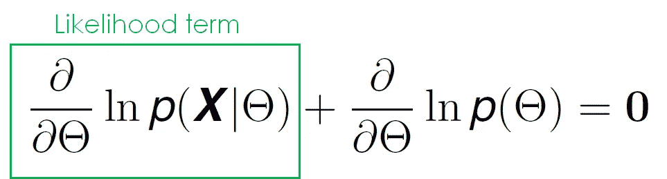

Formula 5: Taking derivatives with respect to the model parameters

我们可以看到这个方程有**两个依赖于θ** 、**的项，其中之一我们在**之前已经看到过:**似然函数**关于θ的导数。然而，另一个术语对我们来说是陌生的。这个术语代表了我们可能拥有的关于模型的**先验知识，稍后我们将看到它如何对我们大有用处。**

让我们用一个例子来说明。

# 回归的最大似然和贝叶斯定理的比较

让我们用一个我们以前探索过的例子来看看这个术语是如何使用的:**线性回归**。让我们恢复等式:

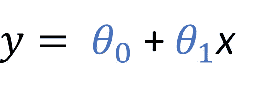

Formula 6: Equation of linear regression of degree 1

让我们将这个线性回归方程表示为依赖于一些数据和一些未知参数向量θ 的更一般的函数。

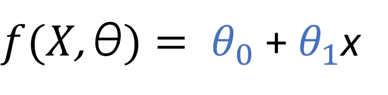

Formula 7: Regression function

此外，让我们假设当我们使用这个回归函数进行预测时，存在某个**相关误差*ɛ****。*然后，每当我们做一个预测 ***y(i)*** (忘记上面用于 LR 的 y，那个现在已经被 ***f*** 代替了)，我们就有了一个表示回归函数得到的值的项，**和某个相关的误差**。

所有这些的组合看起来像是:

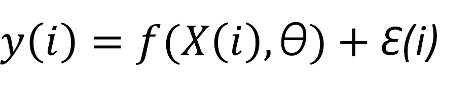

Formula 8: Final form of the regression equation

获得模型 **θ** 的一个众所周知的方法是使用**最小二乘法(LSM)** 并寻找减少某种误差的参数集。具体来说，我们希望**减少一个误差**，该误差被公式化为每个数据点 ***y*** 的实际标签和模型 ***f*** 的预测输出之间的平方的平均差。

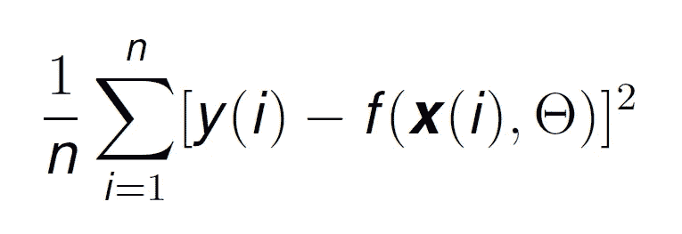

Formula 9: The error that we want to reduce in the Least squares method

我们将看到,**试图减少这一误差相当于使用最大似然估计法最大化观察我们的数据**与某些模型参数的概率。

**首先，然而**我们必须做出一个非常重要的假设，尽管**自然假设**:回归误差***【ɛ(i】，*** 对于每一个数据点来说，都是独立于***【x(I)***(数据点)的值，并且正态分布着一个平均值 0 和一个标准差 ***σ。对于大多数错误类型，这种假设通常是正确的。***

然后，特定参数集θ 的 **ML 估计由以下等式给出，其中我们应用了**条件概率的公式，假设 X 独立于模型参数的**，并且 ***y(i)*** 的值彼此独立(为了能够使用乘法)**

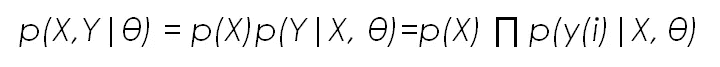

Formula 10: Likelihood function

这个公式可以读作:X 和 Y 给定 **θ** 的概率等于 X 的概率乘以 Y 给定 X 和θ **的概率。**

对于那些不熟悉**联合或组合和条件概率的人，你可以在这里找到一个简单易懂的解释******。如果你仍然不能从最左边的术语找到最终结果，请随时联系我；我的信息在文末。****

**现在，如果我们像过去一样取对数，我们得到:**

**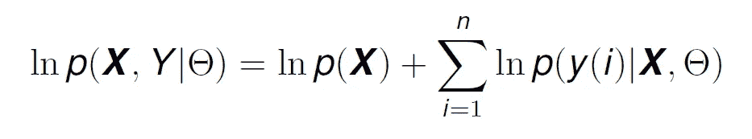**

**Formula 11: Same equation as above expressed in logs**

**如果 **X(数据点的特征)**是**静态的并且彼此独立**(就像我们之前在条件概率中假设的那样)**，那么 y(i)的分布与误差的分布**(来自公式 8)相同，除了平均值现在已经被移动到 f(x(i)|θ而不是 0。这意味着 **y(i)也有正态分布**，我们可以将条件概率 ***p(y(i)|X，θ)*** 表示为:**

**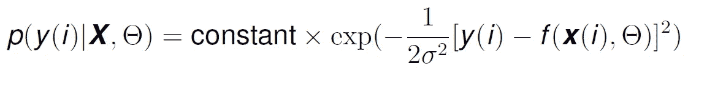**

**Formula 12: Conditional probability of y(i) given the data and the parameters**

**如果我们使常数等于 1 以简化，并在公式 11 内替换公式 12，我们得到:**

**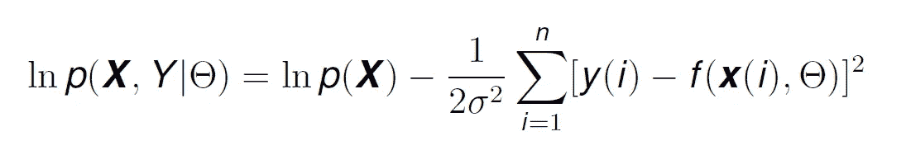**

**Formula 13: Logarithm of the Likelihood function**

**如果我们试图最大化它(对θ求导)，项 **ln *p* (X)** 将不复存在，我们只有负平方和的导数:**这意味着最大化似然函数相当于最小化平方和！****

## **Bayes 能做些什么来让这一切变得更好呢？**

**让我们恢复用对数表示的贝叶斯定理公式:**

****

**Formula 3: Bayes’ formula expressed in logarithms**

**等号右边的第一项，正如我们之前看到的，是**可能性项**，这正是我们在公式 13 中的内容。如果我们将公式 13 的值代入公式 3，考虑到我们也有数据标签 Y，我们得到:**

**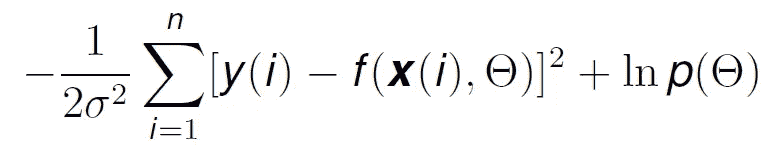**

**Formula 14: Bayes formula expressed in terms on likelihood and logarithms**

**现在，如果我们试图最大化这个函数，以找到最有可能使我们的数据被观察到的模型参数，我们就有了一个**额外项: *ln p(θ)。*还记得这个术语代表什么吗？就是这样，模型参数的先验知识。****

**这里**我们可以开始看到一些有趣的东西** : **σ与数据**的噪声方差相关。由于项 ***ln p(θ)*** 在求和之外，如果我们有一个**非常大的噪声方差，求和项变小，以前的知识占优势**。但如果数据准确，误差小，这个先验知识术语就没那么有用了 ***。*****

**还看不出用途？让我们用一个例子来总结这一切。**

## **ML 与 Bayes:线性回归示例**

**假设我们有一个一阶线性回归模型，就像我们在这篇文章和之前的文章中一直使用的模型。**

**在下面的等式中，我已经将模型参数的 ***θs*** 替换为*a***【b***(它们代表相同的东西，但符号更简单)并添加了误差项。***

***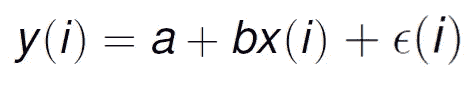***

***Formula 15: Our linear regression model***

***让我们使用 Bayes 估计，假设我们有一些关于 ***a*** 和***b***:*a***b***的均值为 0，标准差为 0.1，均值为 1，标准差为 0.5。这意味着 a 和 b 的密度函数分别为:****

****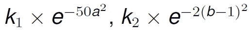****

****Formula 16: Density functions for a and b****

****如果我们移除常数，并将该信息代入公式 14，我们得到:****

****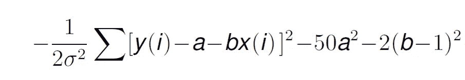****

****Formula 17: Final form of Bayes Formula****

****现在，如果我们**用**对 a 求导，假设所有其他参数为常数，我们得到以下值:****

****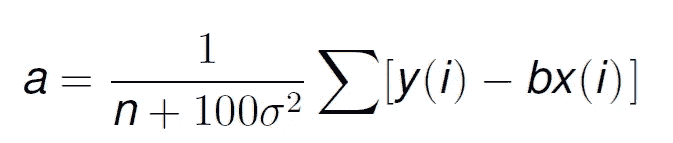****

****同样，对于 b，给我们一个带有两个变量的线性方程，从中我们将**获得模型参数的值，该值报告观察我们的数据**(或减少误差)的最高概率。****

******贝叶斯贡献在哪里？**非常简单，没有它，我们将失去术语 100σ。这是什么意思？**你看，σ与模型的误差方差有关，正如我们之前提到的。如果这个误差方差很小，说明数据是可靠的、准确的，所以计算出的参数可以取很大的值，这就可以了**。****

******然而，通过引入 100σ项，如果该噪声显著，它将迫使参数值更小，这通常使得回归模型的表现优于具有非常大的参数值的回归模型。******

****我们还可以在这里看到分母中的值 n，它表示我们有多少数据。与σ值无关，如果我们增加 n，这一项就失去了重要性。这突出了这种方法的另一个特点:我们拥有的数据越多，贝叶斯的初始先验知识的影响就越小。****

****就是这样:拥有以前的数据知识，有助于我们限制模型参数的值，因为加入贝叶斯总是会导致更小的值，这往往会使模型表现得更好。****

# ****结论****

****我们已经看到了贝叶斯定理、**最大似然法及其比较**背后的完整数学。我希望一切都尽可能清楚，并且回答了你的许多问题。****

****我有一些好消息:**繁重的数学岗位结束了**；在下一篇文章中，我们将讨论**朴素贝叶斯**，一种贝叶斯定理的简化，以及它在**自然语言处理中的应用。******

****来看看吧 [**关注我的**](https://medium.com/@jaimezornoza) ，敬请关注！****

****就这些，我希望你喜欢这个帖子。请随时在 LinkedIn 上与我联系，或者在 Twitter 上关注我，地址是:jaimezorno。还有，你可以看看我其他关于数据科学和机器学习的帖子[**这里**](https://medium.com/@jaimezornoza) 。好好读！****

****一如既往，有任何问题联系我。祝你有美好的一天，继续学习。****