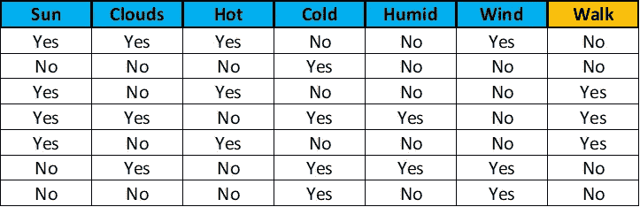
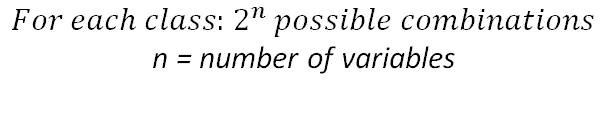
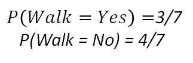
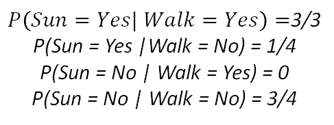
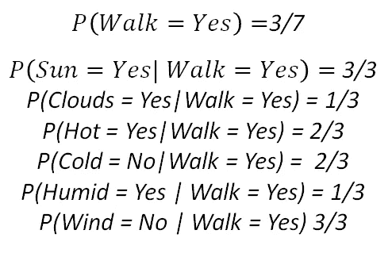
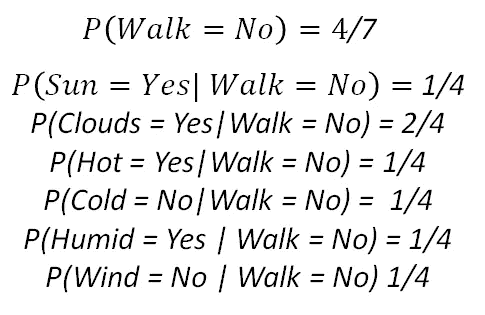

# 概率学习 V:朴素贝叶斯

> 原文：<https://towardsdatascience.com/probability-learning-v-naive-bayes-7f1d0466f5f1?source=collection_archive---------23----------------------->

## 概率机器学习的朴素模型。还是没那么幼稚…

亲爱的读者们，你们好。这是概率学习系列的第五篇文章。之前的帖子有:

*   [概率学习 I:贝叶斯定理](/probability-learning-i-bayes-theorem-708a4c02909a)
*   [概率学习 II:贝叶斯定理如何应用于机器学习](/probability-learning-ii-how-bayes-theorem-is-applied-in-machine-learning-bd747a960962)
*   [概率学习三:最大似然](/probability-learning-iii-maximum-likelihood-e78d5ebea80c)
*   [概率学习四:贝叶斯背后的数学](/probability-learning-iv-the-math-behind-bayes-bfb94ea03dd8)

**我强烈鼓励你阅读它们**，因为它们很有趣，充满了关于概率机器学习的有用信息。

在上一篇文章中，我们讨论了机器学习的贝叶斯定理背后的数学。这篇文章将描述这个定理的各种**简化**，这些**使它更实用，更适用于现实世界的问题**:这些简化被称为**朴素贝叶斯**。此外，为了澄清一切，我们将看到一个非常有说明性的例子，它展示了朴素贝叶斯如何应用于分类。

# 为什么我们不总是使用贝叶斯？

正如在以前的文章中提到的，**贝叶斯定理告诉我们，当我们获得更多关于*某事*的证据时，如何逐步更新我们关于*某事*的知识**。

我们看到，在机器学习中，这通过更新新数据证据中的某些参数分布来反映。我们还看到了如何使用**贝叶斯定理进行分类**，方法是计算一个新数据点属于某个类别的概率，并将这个新点分配给报告最高概率的类别。我们提到过，这种方法的优势在于能够将先前的知识整合到我们的模型中。

**让我们恢复一下最基本的贝叶斯公式:**

General version of Bayes Formula

该公式可以定制为计算一个**数据点 *x* ，**属于某个**类 *ci*** 的概率，如下所示:

Bayes formula particularised for class i and the data point x

像这样的方法可以用于分类:我们计算一个数据点属于每个可能类别的概率，然后将这个新点分配给产生最高概率的类别。**这可用于二值和多值分类。**

**当我们的模型中的数据点具有不止一个特征时，贝叶斯定理应用的问题**就出现了:计算**似然项 *P(x|ci)*** 并不简单。该术语说明了给定某个类别的数据点(由其特征表示)的概率。如果这些特征在它们之间是相关的，那么这个**条件概率**计算的计算量会非常大。此外，如果有许多特征，并且我们必须计算所有特征的**联合概率**，计算也可能相当广泛。

这就是为什么我们不总是使用贝叶斯，而是有时不得不求助于更简单的替代方法。

# 那么什么是朴素贝叶斯呢？

**朴素贝叶斯是贝叶斯定理的简化，它被用作二元多类问题的分类算法。**之所以称之为幼稚，是因为它做出了一个非常重要但却不太真实的假设:数据点的所有特征都是相互独立的。通过这样做，它极大地简化了贝叶斯分类所需的计算，同时保持了相当不错的结果。这类算法通常被用作分类问题的基线。

**让我们看一个例子来阐明这是什么意思**、**以及与贝叶斯**的区别:假设你喜欢每天早上去你家旁边的公园散一会儿步。这样做了一段时间后，你开始遇到一个非常聪明的老人，他有时会和你走同样的路。当你遇到他时，他会用最简单的术语向你解释数据科学的概念，优雅而清晰地分解复杂的事物。

然而，有些日子，当你出去散步，兴奋地想听到更多老人的消息时，他却不在了。那些日子你希望你从未离开过你的家，并感到有点难过。

One of your lovely walks in the park

为了解决这个问题，你在一周内每天都去散步，并记下每天的天气情况，以及老人是否外出散步。下表显示了您收集的信息。“散步”一栏指的是老人是否去公园散步。

Table with the information collected during one week

利用这些信息，以及这位数据科学专家曾经提到过的一些东西，**朴素贝叶斯分类算法**，你会根据当天的天气情况计算出老人每天出去散步的概率，然后决定你是否认为这个概率足够高，让你出去尝试遇见这位睿智的天才。

例如，如果我们**在字段值为“否”时将每个分类变量**建模为 0，在字段值为“是”时建模为 1，那么我们表格的第一行将是:

> 111001 | 0

其中竖线后的 0 表示目标标签。

**如果我们使用正态贝叶斯算法**来计算每种可能的天气情况下每个类别(步行或不步行)的后验概率，我们将必须计算每个类别的 0 和 1 的每种可能组合的概率。在这种情况下，我们必须为每个类计算 2 的 6 次方个可能组合的概率，因为我们有 6 个变量。一般推理如下:

这有各种各样的问题:首先，我们需要大量的数据来计算每个场景的概率。然后，如果我们有这些可用的数据，计算将比其他类型的方法花费更长的时间，并且这个时间将随着变量或特征的数量而大大增加。最后，如果我们认为这些变量中的一些是相关的(例如，阳光与温度)，我们将不得不在计算概率时考虑这种关系，这将导致更长的计算时间。

**朴素贝叶斯是如何修复这一切的？**通过假设每个特征变量独立于其他变量:这意味着我们只需计算给定每个类别的每个单独特征的概率，将所需的计算从 2^n 减少到 2n。同时，这意味着我们不关心变量之间可能的关系，比如太阳和温度。

让我们一步一步地描述它**这样你们就能更清楚地看到我在说什么:**

1.  首先，我们使用上表计算每个类别的**先验概率。**

Prior probabilities for each class

2.然后，**对于每个特征，我们计算给定每个类别的不同分类值的概率**(在我们的示例中，我们只有“是”和“否”作为每个特征的可能值，但这可能因数据而异)。以下示例显示了特征“Sun”的这种情况。**我们必须对每个特性都这样做。**

Probabilities of sun values given each class

3.现在，**当我们获得一个新的数据点**作为一组气象条件时，我们可以通过将给定类别的每个特征的个体概率与每个类别的先验概率相乘来计算每个类别的概率。然后，我们将这个新数据点分配给产生最高概率的类。

让我们看一个例子。假设我们观察以下天气状况。

New data point

**首先，给定这些条件，我们将计算老人行走**的概率。

Probabilities needed to calculate the chance of the old man walking

如果我们做所有这些的乘积，**我们得到 0.0217** 。现在让我们做同样的事情，但是对于另一个目标类:不走。

Probabilities needed to calculate the chance of the old man not walking

同样，如果我们做乘积，**我们得到 0.00027** 。现在，如果我们比较两种可能性(男人走路和男人不走路)，我们得到一个男人走路的更高的可能性，所以我们穿上运动鞋，拿一件外套以防万一(有云)，然后**去公园**。

注意在这个例子中我们没有任何概率等于零。这与我们观察到的具体数据点以及我们拥有的数据量有关。如果任何一个计算出的概率为零，那么整个乘积将为零，这是不太现实的。**为了避免这些，使用了被称为平滑的技术**，但是我们不会在这篇文章中讨论它们。

**就是它！**现在，当我们醒来，想要看到我们会发现老人在散步的机会时，我们所要做的就是像前面的例子一样，看看天气情况，做一个快速的计算！

# 结论

我们已经看到了如何使用贝叶斯定理的一些简化来解决分类问题。在下一篇文章中，我们将讨论朴素贝叶斯在自然语言处理中的应用。

就这些，我希望你喜欢这个帖子。要获得更多关于数据科学和机器学习的资源，请查看下面的博客:[如何学习机器学习](https://howtolearnmachinelearning.com/books/machine-learning-books/)。谢谢，祝你阅读愉快！

# **其他资源**

如果您渴望了解更多信息，您可以使用以下资源:

*   [中型岗位覆盖贝叶斯和朴素贝叶斯](https://medium.com/@mark.rethana/bayesian-statistics-and-naive-bayes-classifier-33b735ad7b16)由[马克·蕾瑟娜](https://medium.com/u/99a3476135bb?source=post_page-----7f1d0466f5f1--------------------------------)
*   [Youtube 视频关于朴素贝叶斯分类器的类似例子](https://www.youtube.com/watch?v=CPqOCI0ahss&t=213s)
*   [机器学习大师关于朴素贝叶斯的帖子](https://machinelearningmastery.com/naive-bayes-for-machine-learning/?source=post_page-----33b735ad7b16----------------------)

一如既往，有任何问题请联系我。祝你有美好的一天，继续学习。