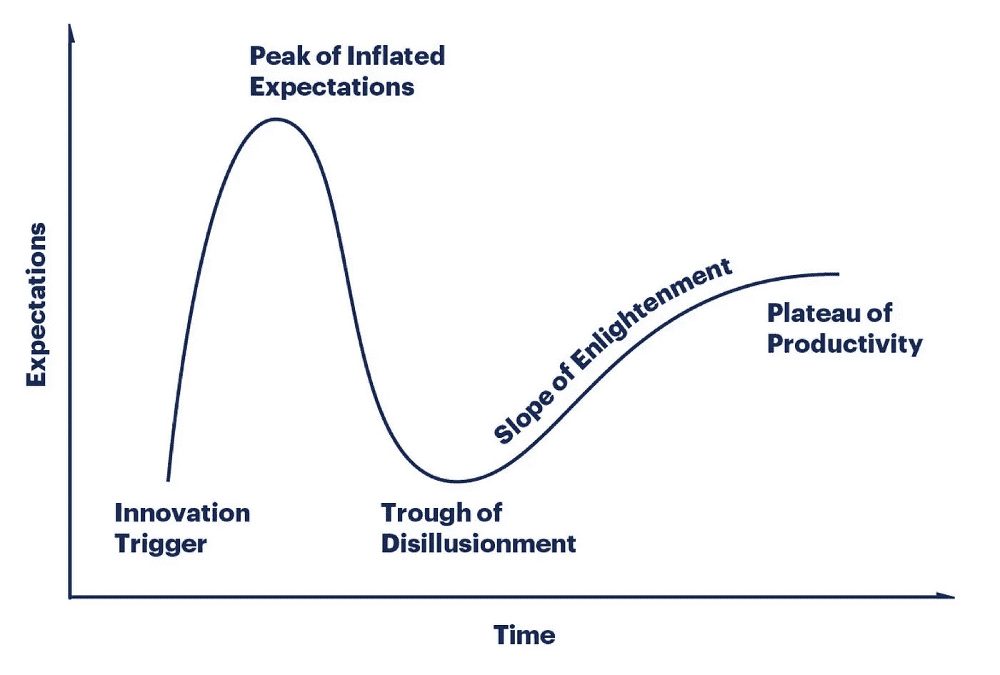
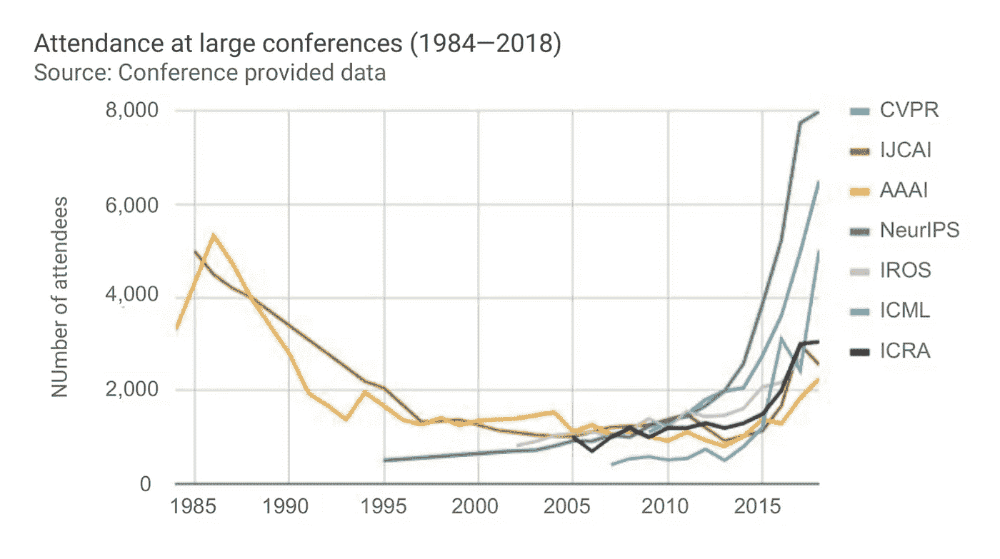
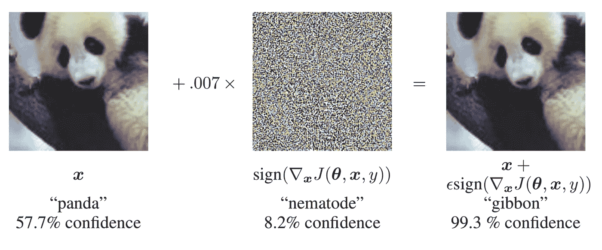
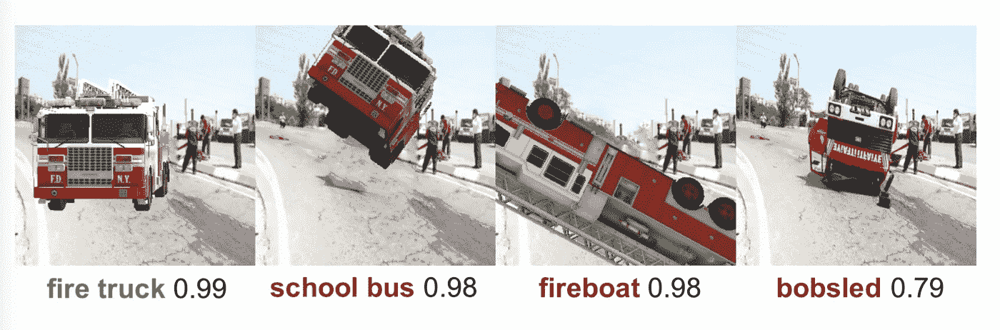
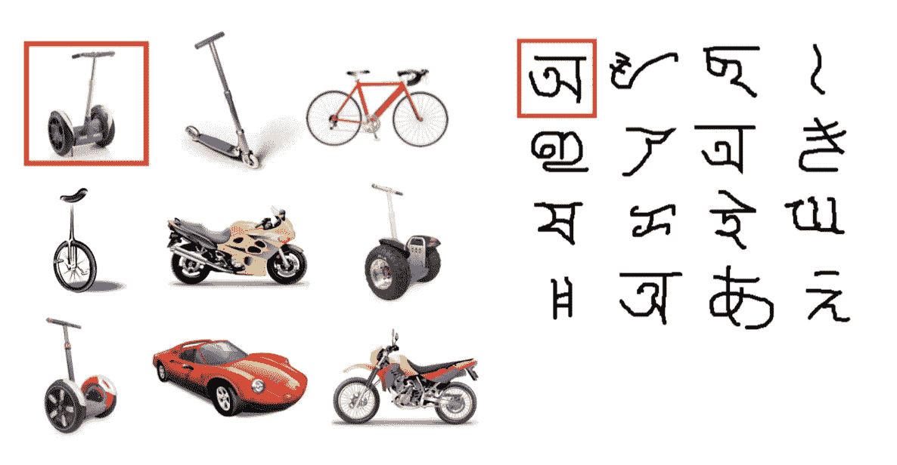
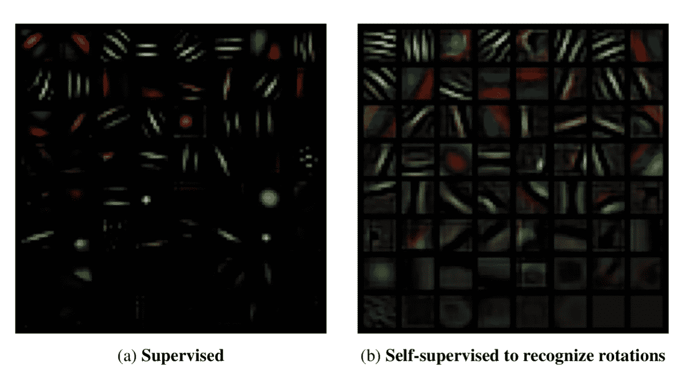

# 人工智能冬天来临的概率

> 原文：<https://towardsdatascience.com/probability-of-an-approaching-ai-winter-c2d818fb338a?source=collection_archive---------12----------------------->

## 这篇文章讨论了人工智能领域是否正在走向另一个人工智能冬天的问题。

## 动机

行业和政府都在人工智能领域投入了大量资金，在过去 5 年里，许多人工智能相关的初创公司成立了。如果另一个人工智能冬天即将到来，许多人可能会失业，许多创业公司可能不得不关闭，就像以前发生的那样。此外，根据麦肯锡公司的数据，到 2025 年，即将到来的冬季和持续的成功之间的经济差异估计至少有数百亿美元。

本文的目的不是讨论人工智能的进步是否值得期待。相反，本文讨论和结果的目的是告诉读者人工智能研究有多大可能取得进展。

# 分析:是什么导致了人工智能冬天？

关于这两个 AI winters 的详细概述，请查看我关于这个主题的第一篇[第一篇](/history-of-the-first-ai-winter-6f8c2186f80b)和第二篇[第三篇](/history-of-the-second-ai-winter-406f18789d45)中型文章。

在这一节中，AI 冬天的主要原因是从以上对以前冬天的讨论中提取出来的。

首先，可以观察到的一个重复模式是，最初点燃兴奋情绪，但后来证明是膨胀的承诺是人工智能冬天的主要原因。例如，在对结果进行诚实的评估后，政府资金在两次 AI 冬季都被削减了。这一进展被高估了，因为人工智能最初导致了各个领域的重大改进，非常快。这表明大部分工作已经完成，只有一些小问题需要解决。然而，后来的事实证明，这些问题一开始就不是那么小。莱特希尔报告，第一次人工智能冬季的主要贡献者说:“到目前为止，该领域的任何发现都没有产生当时承诺的重大影响。”同样，1984 年 AAAI 小组表示:“这种不安是由于担心对人工智能的期望可能过高[……]”

第二，经费的削减对两个人工智能领域的研究都产生了重大影响。在第一个人工智能冬天，Lighthill 报告导致英国除了两所大学之外的所有大学都被削减了资金，并进一步导致欧洲和美国的削减。在第二个人工智能冬天，DARPA 的资金减少了。此外，20 世纪 80 年代末许多人工智能相关创业公司的商业失败标志着第二次人工智能冬天。

第三，技术限制，如 20 世纪 60 年代经历的感知机，抑制了进步。感知器最初被认为很快就会“意识到自己的存在”，但当时它无法解决异或问题。同样，专家系统在 1980 年代也面临着局限性。他们不能解决像视觉或语言这样的基本问题，并且缺乏常识。

因此，在评估另一个人工智能冬季的可能性时，应仔细检查以下方面:

1.  与实际结果相比的期望和承诺；
2.  来自政府和行业的资金；
3.  技术限制。

许多技术表现出与上述类似的模式。为了进一步缩小关注范围，有必要弄清楚 AI 是如何偏离其他技术的。尽管在某些方面相似，人工智能似乎很容易受到夸大的估计和技术限制的影响。人工智能不同于其他技术的一些原因是:

1.智力是高度多维的:

在某种程度上，人工智能研究人员认为，通过解决象棋，智力之谜将得到解决。这被证明是错误的，因为智力不仅仅包括有意识的、战略性的思考。象棋只是智能宇宙中的一个微小粒子。研究人员把它放在如此重要的位置是因为它对人类来说很难，这导致了第二个原因。

2.莫拉维克悖论

国际象棋需要更高层次的思维，在我们的进化史上是一种非常新的技能，这可能是为什么它对人类来说相对困难并因此与智力相关联的原因。另一方面，视觉是古老的，主要是潜意识的，这导致人们认为它很容易，但没有理由认为它没有更高层次的思考难，甚至更难。这是莫拉维克悖论，人们可以说人工智能研究人员已经成为这种说法的牺牲品，因为他们低估了我们下意识的过程，如感觉运动技能或常识。

3.与达到人类水平的智力相关的炒作和恐惧

正如 I. Jordan 指出的，对能够实现智能的机器的大肆宣传和恐惧很容易导致夸大其词，并引起媒体的关注，这在其他领域不太常见。

考虑到这些原因，可以用适当的框架来分析即将到来的人工智能冬天的可能性。

# 人工智能冬天来临的概率

随后，评估了即将到来的人工智能冬天的可能性。研究了人工智能及其公众接受的现状。此外，对于预先提取的关键区域，比较当前和历史的冬前时间。概括来说，这些领域是:

1.  与实际结果相比的期望和承诺；
2.  来自政府和行业的资金；
3.  技术限制。

## 期望和承诺

许多公众人物表达的观点让人想起 20 世纪 50 年代早期人工智能研究人员的观点。通过这样做，前一组为未来的进步创造了兴奋，或炒作。例如，库兹韦尔不仅以预测奇点而闻名，人工超级智能将在 2045 年无处不在，而且人工智能将在 2029 年超过人类智能。以类似的方式，斯科特预测“到 2035 年，人类的思维没有理由也不可能跟上人工智能机器。”此外，Ng 将人工智能视为新的电力。

这种说法为人工智能设定了很高的期望，并引发了炒作。因此，炒作的现象和它如何与人工智能的当前状态相关被调查。

## 炒作和炒作周期

Gartner 的炒作周期是一个常用的工具。它有实际应用，让我们很容易做出预测，但它的有效性没有科学依据。首先，它不是为科学方法开发的工具。这是为商业决策制作的程式化图表。也就是说，已经有人尝试从经验上验证不同技术的炒作周期。可以得出结论，炒作周期是存在的，但其具体模式变化很大。

Figure 1: Gartner’s Hype Cycle

周期的关键阶段是高峰期和低谷期，在高峰期，人们的兴趣和兴奋程度最高，而在低谷期，最初的期望无法实现。在这里，人们对这个领域的兴趣是最低的。然后，油田慢慢恢复，并达到产量的稳定期。

正如门泽斯所证明的，炒作周期在 20 世纪 80 年代 AAAI 会议的与会人数中得到了很好的体现。首先，会议开始时，门票销售迅速增加，达到高峰，然后这些数字迅速下降。目前，NIPS 等会议的与会者人数达到甚至超过了 20 世纪 80 年代 AAAI 的峰值，而且他们的规模正在迅速扩大。

在人工智能初创公司的风险投资基金、职位空缺和收入电话提及中，也可以观察到对该领域兴趣的类似模式。炒作研究人员指出，覆盖的数量很重要，但它必须得到定性情绪的支持。媒体文章中的情感分析显示，从 2016 年到 2018 年，人工智能相关的文章变得积极 1.5 倍。尤其是 2016 年 1 月到 2016 年 7 月期间，情绪发生了转移。这一进步可能与 2016 年 1 月 Alpha Go 的公开发布以及 3 月战胜世界冠军 Lee Sedol 有关。

随着炒作周期的趋势，这可能导致另一个票房收入、资金和工作机会迅速暴跌的幻灭低谷。然而，AI 是一个描述许多技术的非常宽泛的术语。这使问题变得更加复杂，因为在人工智能这个大术语下的每项技术都有自己的炒作周期，而炒作周期之间以及与人工智能之间的相互作用，总的来说，仍然不清楚。

更进一步，对这些说法进行了更深入的研究，评估人工智能兴趣的快速上升是否只是夸大承诺的结果，或者这些说法是否有坚实的基础。

## 与专家意见的比较

现在，公众人物做出的声明和承诺被与领先的人工智能研究人员的调查相比较。2017 年，对 352 名机器学习研究人员进行了一项调查，这些研究人员在领先的会议上发表了论文。这项调查预测，高级机器智能在 45 年内出现的几率为 50%，在未来 9 年内出现的几率为 10%。然而，劳动力的完全自动化被预测要晚得多，有 50%的可能性在未来 122 年内发生。

这项研究呈现的结果与库兹韦尔等未来学家的预测相去甚远。此外，一项关于人工智能预测的元研究发现了一些证据，表明无论何时做出预测，高级机器智能的大多数预测都是在未来 20 年左右。本质上，这指向了人工智能未来预测的不可靠性。此外，对高级机器智能的每一个预测都必须持保留态度。

总之，在当前的人工智能格局中存在一个炒作周期模式，导致人们的兴趣很快可能会下降。此外，乐观的预测是由公众人物做出的，但经验证据质疑它们的有效性。

然而，像 Ng 这样将人工智能视为新的电力的言论，更多地是指该行业的现状。因此，接下来就要考察企业和政府的资助。

## 投资和融资

资金在人工智能研究中一直扮演着重要的角色。正如亨德勒指出的，由于现有的研究项目仍在继续，政府资金的削减只能在几年后才能感觉到。因此，随着时间的推移，新研究项目的缺乏变得明显起来。这意味着目前需要减少资金，才能在未来几年被察觉。

2018 年 4 月，欧盟成员同意就人工智能研究进行合作。发布了一份关于人工智能的通讯，在 2018 年至 2020 年期间为人工智能研究投入了 17 亿美元的资金。随后，2018 年 6 月，欧盟委员会提出创建数字欧洲资助计划，重点关注五个关键领域，总资助额为 92 亿欧元，其中 25 亿专门用于人工智能研究。

2018 年 3 月，美国政府提出了确保美国“仍然是人工智能的全球领导者”的目标。后来，在 2018 年 9 月，DARPA 宣布了一项 20 亿美元的活动，为下一波人工智能技术提供资金。作为直接反对，中国宣布了到 2030 年在人工智能方面领先世界的目标。因此，中国已经启动了几项人工智能计划。这些相互矛盾的说法促使许多人采用“人工智能竞赛”这个术语来指代美国和中国之间在人工智能领域的领导权之战。这类似于 20 世纪美国和苏联之间的太空竞赛，两国争夺太空旅行的主导权。当时，这场比赛引发了大量的资金和研究。同样，“人工智能竞赛”的心态可能会使未来几年的资金减少不太可能。这是对即将到来的人工智能冬天的一个有力支持，因为以前的冬天伴随着政府资金的减少。

另一个关键点是不断增长的人工智能产业。过去的人工智能研究人员一直非常依赖政府资助，但根据麦肯锡公司的数据，2016 年非科技公司在人工智能上花费了 260 亿至 390 亿美元，科技公司在人工智能上花费了 200 亿至 300 亿美元。

另一方面，2025 年的市场预测差异巨大，从 6.44 亿美元到 1260 亿美元不等。这种差异展示了即将到来的人工智能冬天和另一个繁荣时期之间的经济差异。

综上所述，政府资助非常扎实，“AI 竞赛”的心态使得这种情况很可能会持续下去。此外，该行业目前正在蓬勃发展。然而，市场预测却大相径庭。

为了确定哪个预测更有说服力，人工智能在过去几年取得的进展与对当前方法的批评有关。

## 评估进展

为了在适当的框架下查看对当前人工智能技术的批评，评估了从 2012 年到今天(2019 年 4 月)取得的进展。

正如我们之前看到的那样，人工智能和机器学习在许多方面都变得越来越受欢迎。一些关键事件在景观的形成中脱颖而出。2012 年，一个卷积神经网络以较大优势赢得了 ImageNet 竞赛。这与物体检测的进展相结合，彻底改变了计算机视觉的领域，从手工制作的特征工程到学习表示，从而使自动驾驶汽车在可预见的未来变得可行。在自然语言理解领域也取得了同样令人印象深刻的成果。深度学习已经启用了所有流行的语音助手，从 Alexa 和 Siri 到 Cortana。

深度神经网络的强化学习在游戏中取得了令人印象深刻的结果。2014 年，DeepMind 使用深度 q 学习器解决了 50 个不同的 Atari 游戏，而没有改变模型的架构或超参数。这种任务的灵活性是前所未有的，这导致他们很快被谷歌收购，并随后凭借 AlphaGo 和 AlphaStar 等成就领先于强化学习领域。

最后，在过去几年中，生成对抗网络(GAN)在生成例如人脸的图像方面已经取得了令人印象深刻的结果。
本质上，深度学习已经在许多行业取得了突破性的成果。

## 对深度学习的批评

在这一章中，讨论了对深度学习的批评。正如所证明的那样，深度学习处于人工智能领域进步的最前沿，这就是为什么对深度学习潜力的怀疑态度也是对人工智能前景的批评。这与 20 世纪 80 年代的情况类似，当时专家系统主宰了这个领域，它们的崩溃导致了一个冬天。如果深度学习方法面临与它们的历史对手类似的技术障碍，可以预期类似的结果。

对深度学习的批评主要集中在几个方面:深度学习的局限性、脆弱性和缺乏无监督学习。

## 深度学习的局限性

“如今，从事深度学习的人比以往任何时候都多——比 2014 年多了大约两个数量级。在我看来，这是 5 年来最慢的进展速度。是时候来点新鲜的了。”

Francois Chollet，Twitter 上 Keras 的创建者

由于这句话摘自 Twitter，其有效性值得怀疑，但它似乎与他提出的类似论点一致，并且很好地抓住了普遍的感觉。在他的书《用 Python 进行深度学习》(Deep Learning with Python)中，Chollet 有一章专门讨论了深度学习的局限性，他在书中写道:“它(深度学习)不会解决更基本的问题，即深度学习模型在它们所能表示的方面非常有限，并且人们可能希望学习的大多数程序都无法表达为数据流形的连续几何变形。”作为一个思想实验，他提出了一个巨大的数据集，其中包含标有程序描述的源代码。他认为，深度学习系统永远无法以这种方式学习编程，即使有无限的数据，因为像这样的任务需要推理，并且没有从描述到源代码的可学习映射。他进一步阐述说，增加更多的层和数据使这些限制看起来正在消失，但只是表面上的。

他认为，从业者很容易陷入一个陷阱，认为模型理解他们承担的任务。但是，当模型呈现的数据与训练数据中遇到的数据不同时，它们可能会以意想不到的方式失败。他认为这些模型没有对现实的体验，因此它们不能理解它们的输入。这类似于德雷福斯在 20 世纪 80 年代提出的论点，他认为人工智能需要体现。不幸的是，对体现在人工智能中的作用还没有一个清晰的理解。以类似的方式，这指向了深度学习方法尚未解决的基本问题，即推理和常识。

简而言之，Chollet 警告深度学习实践者不要夸大深度学习的能力，因为基本问题仍然存在。

## 深度学习是脆弱的

用于描述深度学习模型的通用术语是脆弱的。有几个例子可以说明为什么这样的描述是准确的，包括对抗性攻击、缺乏概括能力和缺乏数据。对这些缺陷和最终的预防机制进行了详细的讨论。

1.对抗性攻击:已经证明深度学习算法容易受到通过对抗性例子的攻击。对手使用以人类不可识别的方式修改的数据来彻底影响深度学习模型的行为。有多种方法可以创造对立的例子。在一种技术中，通过另一种学习算法将噪声添加到图像中，以便影响分类，而不可见。

Figure 3: A demonstration of fast adversarial example generation applied to GoogLeNet on ImageNet.

通过这种技术，可以以这样的方式改变图像，即可以实现指定的分类，即使它与原始分类非常不同(如人类可以容易地区分的“熊猫”和“长臂猿”)。当对抗攻击的方法已知时，可以通过用对抗的例子增加训练集来防御它。澄清一下，防御特定的对抗性攻击是可能的，但是一般来说，防御对抗性攻击是困难的。尽管如此，最近开发的一些成功的方法在这个问题上显示出了希望。通过限制模型的输出空间，已经使用了防御一般对抗的正式方法。像区间边界传播这样的技术在不同的流行图像集中具有最先进的准确性。

Alcorn 等人指出，当熟悉的物体以奇怪的姿势出现时，也会发生极端的错误分类。诸如此类的例子表明，深度学习模型对物体的理解可能相当幼稚。

Figure 4: The Google Inception-v3 classifier fails to recognize familiar objects in strange poses.

此外，对抗性攻击表明了一个更深刻的潜在问题——缺乏可解释性。由于深度学习模型的黑盒性质，预测网络正在做什么是很难的。这些对抗性攻击表明，模型可能已经找到了在训练数据中对对象进行分类的最佳方法，但它可能仍然无法捕捉到真实世界的浩瀚。

也就是说，在提高模型的可解释性方面已经做了很多工作，主要是在视觉空间中通过语义词典、显著性图和激活地图集等方法。这些作品代表了对深度学习模型隐藏层的深入了解。

2.缺乏归纳能力:此外，深度学习模型在归纳所提供的训练数据之外存在问题。Kansky 等人证明了在 Atari 游戏 Breakout 上训练的模型在环境发生微小变化时会失败。例如，稍微改变桨的高度会导致药剂的性能非常差。类似的批评可以应用于任何强化学习系统。

Cobbe 比较了强化学习代理和监督学习的评估，并得出结论，在代理接受培训的环境中评估代理就像用测试集评估监督学习者的表现一样。不同的是，第一种情况被很好地接受和实践，第二种情况在任何意义上都是不被容忍的。

为了解决这个问题，Cobbe 作为 OpenAI 的一部分，设计了一个通用化的基准，以促进该领域的工作。此外，强化学习领域的迁移学习最近在 OpenAI 的 Dota 代理中看到了令人印象深刻的结果。他们宣布，通过使用迁移学习技术，尽管规则和模型大小发生了重大变化，他们仍然能够继续对代理进行训练。使用类似的方法，可以改善代理中缺乏通用性的问题。

3.缺乏数据:正如《数据的不合理有效性》所展示的，数据在深度学习中是必不可少的。此外，可用数据的增加是深度学习革命的主要贡献者之一。同时，并不是每个领域都能接触到海量数据。

也就是说，有两种方法可以解决这个问题:创建更多的数据或者创建需要更少数据的算法。Lake 等人的研究表明，人类能够从几个例子中学习视觉概念。

Figure 5: Test yourself on one shot learning. From the example boxed in red, can you find the others in the array? On the left is a Segway and on the right is the first character of the Bengali alphabet.

单次或少次学习中的最近方法已经取得了实质性的改进，在这些方法中，仅用一个或几个数据点(例如，给定类别的一个图像)来呈现算法。与此同时，迁移学习方法也有了很大的改进。通过使用在大型数据集上预先训练的模型作为基础，可以显著减少在新数据集上的训练时间。

总而言之，深度学习模型被恰当地描述为脆弱的。也就是说，研究人员正在研究解决这个问题的有希望的方法。

## 监督学习的优势

深度学习实现的大多数成就都是通过监督或强化学习实现的。然而，正如 LeCun 指出的那样，人类大多是通过观察环境以无监督的方式进行学习。此外，据粗略估计，大约 95%的数据是非结构化的。此外，标注是一个耗时且昂贵的过程，但标签仅包含关于每个数据点的非常少的信息。这就是为什么 LeCun 认为该领域必须更多地转向无监督学习。

一种特殊类型的无监督学习，有时称为自我监督学习，在过去几年中获得了关注。自监督学习过程利用训练数据的某些属性来创建监督信号。例如，在一个视频剪辑中，所有帧都是连续的，研究人员利用这一特性，让模型预测剪辑的下一帧，这很容易评估，因为事实是数据固有的。类似的方法可以用于文本或音频信号。此外，可以使用数据的不同特征，例如旋转图像和预测正确的角度。直觉告诉我们，为了将旋转后的图像恢复到其原始形式，模型需要了解世界的属性，这在不同的任务中也是有用的，如物体识别。这被证明是正确的，因为该模型可以通过迁移学习在分类任务中取得很好的结果。当观察网络的第一层时，过滤器非常类似于监督模型，甚至更多样。

Figure 6: First layer filters learned by a AlexNet model trained on (a) the supervised object recognition task and (b) the self-supervised task of recognizing rotated images.

如果研究人员不予理会，这种批评可能会对深度学习和人工智能产生不利影响，但似乎并非如此。OpenAI 已经展示了一些有希望的结果，这些结果是通过今年早些时候使用 GPT-2 transformer 语言模型的无监督学习实现的。这个模型可以通过使用一个非常大的模型和来自 Reddit 的大量数据来生成非常像人类的文本。他们使用一种自我监督的学习方法，利用文本的顺序性，让模型预测下一个单词。使用相同的架构，MuseNet，一个作曲的模型，最近已经被创建。

无监督学习有可能解决深度学习中的重大障碍。目前的研究证据表明，对这种学习技术的进展持乐观态度。

# 结论

人工智能研究人员、公司、技术和对人工智能的认知在许多不同层面上存在复杂的相互作用。因此，很难做出任何预测。然而，我们可以观察到一些与历史上的冬前时期不同的关键现象。

在过去，对政府资金的依赖非常强烈，而这个行业很弱。今天的情况远非如此；许多大公司，如谷歌、脸书和阿里巴巴，仅在人工智能技术上的投资就超过了人工智能行业在 20 世纪 80 年代繁荣时期的价值。更重要的是，这些公司不仅在人工智能上投入巨资，还将它大量融入到产品中。这为该领域提供了坚实的基础，即使公众情绪开始转变。类似地，“人工智能竞赛”心态提供了稳定性，这降低了政府资助下降的风险。

同样重要的是对深度学习及其局限性的批评。尽管其中大部分是有效的，但证据表明研究人员已经在研究解决方案，或者已经意识到这项技术的先天局限性。

此外，无监督学习，特别是自我监督学习，通过允许使用大量的未标记数据和节省大量的繁琐劳动，提供了有希望的机会。

也就是说，这个领域的期望太高了。关于机器达到人类智能的预测是不可靠的。此外，随着该领域在许多规模上快速增长，炒作周期模式可以在当前的会议与会者人数中表现出来。随着炒作周期模式的变化，无法做出任何特定的陈述或预测。

最后，历史视角展示了该领域的波浪式本质。每天都在创造新技术；它们中的大量灭绝了；有些正在复苏。从这个角度来看，为当前方法的消亡做好准备，以及寻找一些值得复兴的被遗忘的技术，似乎已经足够了。

总结一下:对进一步人工智能研究的资助目前看起来很稳定。然而，有一些技术限制，加上非常高的期望，可能会导致另一个人工智能的冬天。

> “人们担心计算机会变得太聪明并接管世界，但真正的问题是它们太笨了，它们已经接管了世界。”
> 
> 佩德罗·多明戈斯

# 感谢阅读！

留下一个👏如果你喜欢！

*对来源感兴趣？查看我的* [*论文*](https://www.researchgate.net/publication/333039347_Analyzing_the_Prospect_of_an_Approaching_AI_Winter) *关于本文出处的话题。*