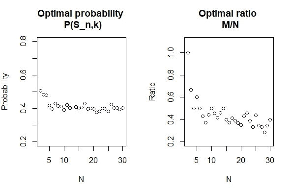
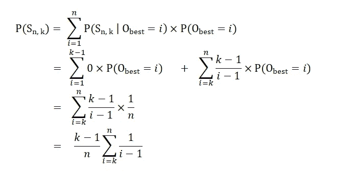
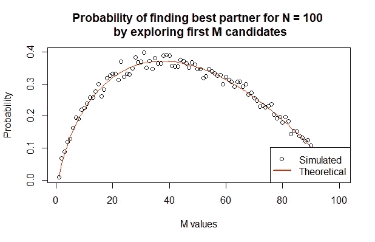
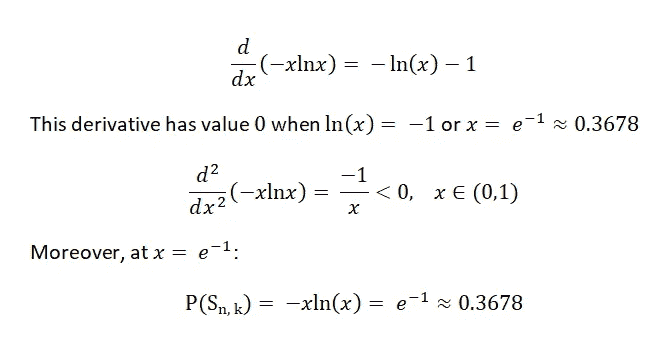

# 用概率论寻找 2019 年的最佳约会策略

> 原文：<https://towardsdatascience.com/probability-theory-and-the-optimal-dating-strategy-for-2018-2b75b26fb0b?source=collection_archive---------10----------------------->

## 了解一些统计理论如何让找到如意郎君变得稍微容易一点？

Image from [Pixabay.com](https://pixabay.com/)

这是探索爱情和约会的第一部分。点击查看第 2 部分[。](/love-in-the-time-of-pandemic-a-probabilistic-approach-to-dating-ba888880cd12)

让我从大多数人都会同意的事情开始:约会很难！！！

(*如果你不同意，那太棒了！！！你可能不会像我一样花那么多时间阅读和撰写中型帖子*

如今，我们每周花无数时间在 Tinder 或微妙的亚洲约会上点击个人资料，给我们觉得有吸引力的人发信息。

当你最终“明白”时，你知道如何为你的 Tinder 的个人资料拍摄完美的自拍照，你可以毫不费力地邀请你韩语班的那个可爱女孩吃饭，你会认为找到完美先生/夫人并不难。没有。！！我们很多人就是找不到合适的匹配。

*约会对凡人来说太复杂、太可怕、太困难了！！！*

Do social media and online dating apps make it easier to find The One? Image by [amrothman](https://pixabay.com/users/amrothman-13991060/?utm_source=link-attribution&amp;utm_medium=referral&amp;utm_campaign=image&amp;utm_content=4888774) from [Pixabay](https://pixabay.com/?utm_source=link-attribution&amp;utm_medium=referral&amp;utm_campaign=image&amp;utm_content=4888774)

我们的期望太高了吗？我们是不是太自私了？还是我们注定不会遇见那个人？放心吧！这不是你的错。你只是没有做数学计算。

> 在你开始满足于更严肃的事情之前，你应该和多少人约会？

这是一个棘手的问题，所以我们必须求助于数学和统计学家。而他们有一个答案: ***37%*** 。

那是什么意思？

这意味着在你可能约会的所有人中，假设你预见自己在未来 10 年内会和 100 人约会(对我来说更像是 10 人，但那是另一个讨论)，你应该先约前 37%或 37 人，然后满足于第一个人**之后的第一个人**比你在之前见过的人更好(或者如果这样的人没有出现，就等到最后一个)

他们是怎么找到这个号码的？让我们挖掘一些数学知识。

# **天真(或绝望)的方法:**

比方说，我们预见到 **N** 个潜在的人将依次进入我们的生活，他们根据一些“匹配/最佳伴侣统计”进行排序。当然，你希望最终与排名第一的人在一起——姑且称此人为 **X** 。

If you can rank these N people. How can you find X?

在我们探索最佳约会策略之前，让我们从一个简单的方法开始。如果你不顾一切地想在 Tinder 上找到伴侣或约会对象，以至于决定和第一个出现的人结婚，那该怎么办？这个人是 **X** 的几率有多大？

嗯！是 ***1/N*** 。

随着我们考虑的时间范围越大，n 越大，这个概率将趋向于 T2 为零。好吧，你可能不会在 20 年内和 10，000 个人约会，但即使是 1/100 的几率也足以让我觉得这不是一个好的约会政策。

> 那么我们该怎么办呢？

我们做人们约会时会做的事。也就是说，我们不是承诺第一个选项，而是想认识几个潜在的伴侣，探索我们约会领域的质量，并开始安顿下来。所以这个约会游戏有探索和安定两个部分。

> 但是我们应该探索和等待多久呢？

把这个策略公式化:你从 **N** 个人中约会 **M** ，拒绝所有人，然后立刻和下一个比你目前所见的所有人都好的人定下来。我们的任务是找到 **M** 的最优值。前面说过，M 的最优规则值是 **M = 0.37N** 。但是我们如何得到这个数字呢？

# 一个小模拟:

我决定在 R 中运行一个小模拟，看看是否存在 m 的最优值。

设置很简单，代码如下:

我们可以为基本的可视化绘制模拟结果:

因此，似乎在 N = 100 的情况下，图表确实显示了 M 的值，该值将最大化我们使用我们的策略找到最佳伙伴的概率。值是概率 39.4% 的 M = **35，相当接近我前面说的魔值，也就是 M = **37** 。**

这个模拟实验还表明，我们考虑的 **N** 的值越大，就越接近幻数。下图显示了随着我们考虑的候选人数量的增加，M/N 的最佳比率。

这里有一些有趣的观察:随着我们考虑的候选人 **N** 数量的增加，不仅最佳概率降低并趋向收敛，最佳比率 **M/N** 也是如此。稍后，我们将严格证明这两个最优实体收敛到大约 0.37 的相同值。

你可能会想:“等一下，我不会以很小的 N 值达到找到最佳人选的最高概率吗？”那是部分正确的。基于模拟，在 **N** = 3 时，我们只要每次选择第三个人，就可以达到高达 66%的成功概率。那么这是不是意味着我们应该总是以和最多三个人约会为目标，然后选择第三个人呢？

你可以。问题是，这种策略只会最大化在这 3 个人中找到**最佳者的机会，在某些情况下，这就足够了。但是，我们大多数人可能想考虑比进入我们生活的前三个可行选项更广泛的选项。这本质上与我们年轻时被鼓励去多次约会的原因是一样的:找出我们吸引和被吸引的人的类型，对约会和与伴侣一起生活有一些很好的理解，并在这个过程中更多地了解自己。**

你可能会发现更多乐观的事实，随着我们与 **N** 约会生活范围的扩大，找到完美先生/夫人的最佳概率不会衰减为零。只要我们坚持我们的策略，我们可以证明存在一个阈值，最优概率不会低于这个阈值。我们的下一个任务是证明我们策略的最优性，并找到最小阈值。

> 能否严谨地证明 37%最优法则？

# 实际的数学:

设 **O_best** 为最佳候选人的到达顺序(完美先生/夫人，The One， **X，**排名为 1 的候选人，以此类推。)我们不知道这个人什么时候会出现在我们的生活中，但我们可以肯定地知道，在下一个预定的 N 个我们将会见到的人中， **X** 将会出现。

让 **S(n，k)** 成为在 **N** 个候选人中成功选择 **X** 的事件，采用我们的 **M = k** 策略，即探索并断然拒绝第一个 **k-1** 候选人，然后与第一个排名比你目前所见的所有人都好的人和解。我们可以看到:

为什么会这样呢？显而易见，如果 **X** 是进入我们生活的第一批 **k-1** 人之一，那么无论我们后来选择谁，我们都不可能选择 **X** (因为我们把 X 包括在我们断然拒绝的人之内)。否则，在第二种情况下，我们注意到，只有当第 **k-1** 个人中有一个是第 **i-1** 个人中最好的，我们的策略才能成功。

下面的视觉线条将有助于澄清上述两种情况:

然后，我们可以用全概率定律求成功的边际概率 **P(S(n，k))**

总之，我们得出成功概率的一般公式如下:

我们可以插入 **n = 100** 并将这条线覆盖在我们的模拟结果之上进行比较:

Our theoretical results align perfectly well with the simulated experiment. The theoretical result yields a maximum probability of 37.1% at M = 37

我不想用更多的数学来烦你，但是基本上，当 **n** 变得非常大时，我们可以把对 **P(S(n，k))** 的表达式写成黎曼和，并简化如下:

最后一步是找到使这个表达式最大化的 **x** 的值。下面是一些高中微积分:

我们刚刚严格证明了 37%最佳约会策略。

# 最后一句话:

那么最后的笑点是什么？你应该用这种策略来寻找你的终身伴侣吗？这是不是意味着你应该在 Tinder 上向左滑动前 37 个有吸引力的个人资料，或者把 37 个滑入你 DMs 的人放在“seen”上？

好吧，由你决定。

该模型提供了最佳解决方案**假设**你为自己设定了严格的约会规则:你必须设定特定数量的候选人 **N，**你必须想出一个排名系统，保证没有平局(给人排名的想法并不适合很多人)，一旦你拒绝了某人，你就再也不会认为他们是可行的约会选择。

显然，现实生活中的约会要混乱得多。

可悲的是，不是每个人都在那里等着你去接受或拒绝——当你遇到他们时，他们可能真的会拒绝你！在现实生活中，人们有时会回到以前拒绝过的人身边，这是我们的模型所不允许的。很难在日期的基础上比较人们，更不用说拿出一个统计数据来有效地预测一个人会成为多么好的潜在配偶，并据此对他们进行排名。我们还没有解决其中最大的问题:估计可行的约会选择的总数是不可能的。如果我想象自己在 20 年后把大部分时间花在编码和写关于约会的中型文章上，我的社交生活会有多活跃？我会和 10 个人、50 个人或 100 个人约会吗？

> 是的，孤注一掷的方法可能会给你更高的赔率，团！！！

另一个有趣的副产品是，如果你认为*最佳选择永远不会出现*，在这种情况下，你试图最大化机会*至少以第二好、第三好等结束*。这些考虑属于一个被称为“博士后问题”的一般问题，它与我们的约会问题有类似的设置，并假设最好的学生将去哈佛(耶鲁，咄！！！) [1]

你可以在我的 Github [链接](https://github.com/tuangauss/Various-projects/blob/master/R/dating_sim.R)找到我文章的所有代码。

[1]罗伯特·范德贝伊(1980 年)。“人口子集的最佳选择”。*运筹学的数学*。**5**(4):481–486

[2]希尔，t . p .[知道何时停止](http://www.americanscientist.org/issues/feature/2009/2/knowing-when-to-stop/1)。*美国科学家*，第 97 卷，126–133 页(2009 年)