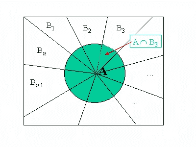
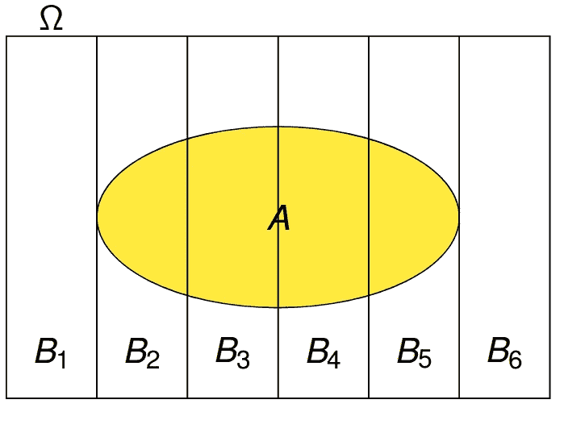

# 概率论继续:用 Kolmogorov 的联合概率定义注入全概率定律

> 原文：<https://towardsdatascience.com/probability-theory-continued-infusing-law-of-total-probability-4abfca6e65bb?source=collection_archive---------15----------------------->

## 通过扩展贝叶斯统计揭开概率论的一个方面

[Source](https://www.researchgate.net/figure/2-Illustrating-the-Law-of-Total-Probability_fig27_265486118)

在我之前的博客中，我简化了贝叶斯定理。在这篇博客中，我将翻译全概率定律，它指出:

对于一组可数的 x 个事件[B₁、B₂、…、Bₓ](其中有“x”个事件被归类为“b”)，且事件 a 仅在事件 b 发生时发生，则事件 a 的概率为 P(A) = ∑P(A∩Bₓ

同样，就像贝叶斯定理一样，乍一看，这似乎非常令人费解和难以理解。但是当把它分解成更小的步骤时，它并不太复杂(实际上相当直观)。当 A 发生的每一个可能条件都发生时，A 发生的概率等于 A 唯一发生的概率之和。或者想象一下:

[source](http://khannay.com/StatsBook/probability.html)

注意，在上面的图像中，a 只出现在 B₂、B₃、B₄和 B₅，所以 P(A∩B₁)和 P(A∩B₆)都是 0，所以在这个例子中我们有:

p(a)=∑p(a∩bₓ)= 0+p(a∩b₂)+p(a∩b₃)+p(a∩b₄)+p(a∩b₅)+0

当这样想的时候，这个等式可能看起来令人困惑，因为它听起来太简单或者太明显了；听起来应该是微不足道的一点。该定律最有用的扩展可能是当我们应用联合概率的 Kolmogorov 定义时，该定义指出

P(A∩B) = P(A|B)*P(B)

当我们把这个应用到全概率定律时，我们看到

P(A) = ∑P(A∩Bₓ) = ∑ P(A|Bₓ)*P(Bₓ)

理解我们为什么需要这个公式(以及如何使用它)的最好方法是看一个例子(这个例子是我直接从由[大会](https://generalassemb.ly/)主办的 DSI 项目的实验室作业中获得的):

*假设你和你的朋友在玩游戏。你的朋友在你面前放了四枚硬币。如果你抛头，你会从你的朋友那里赢得一美元。如果你抛尾巴，你欠你朋友一美元。然而，你面前的硬币并不公平。*

*   一枚硬币有 80%的几率会翻转正面。(称这枚硬币为 a)
*   *一枚硬币有 60%的几率翻转头像。(称这个硬币为 B.)*
*   *一枚硬币有 40%的几率翻转头像。(称这个硬币为 C.)*
*   *一枚硬币有 10%的几率翻头。(称这个硬币为 D.)*

*假设你随机选择一枚硬币。也就是说，你不知道你选择的是硬币 A、B、C 还是 d。你会翻转头部。给定这些数据，你选择硬币 A、硬币 B、硬币 C 和硬币 D 的概率是多少？*

[source](https://www.youtube.com/watch?v=a-50MIDkzKc)

首先，让我们试着把我们刚刚被告知的内容转换成一种可以被读入概率公式的格式:我们被告知，给定硬币 A，有 80%的机会翻转头部，这可以被解释为

P(H|A) = 0.8

我们被告知，给定硬币 B，有 60%的机会翻转头部，这是可以解释的

当 P(H|B) = 0.6 时，

我们被告知，给定硬币 C，有 40%的机会翻转头部，这可以被解释为

P(H|C) = 0.4，

我们被告知，给定硬币 D，有 80%的机会翻转头部，这可以被解释为

P(H|D) = 0.1

因为有 4 个硬币，并且没有理由认为捡起一个硬币的概率与捡起另一个硬币的概率没有任何差异，所以我们可以推断，捡起每个硬币的概率是相等的，也就是四分之一(1/4)的概率。因此:

P(A) = P(B) = P(C) = P(D) = 0.25

为了求解抛头的概率，你可以将所有这些代入全概率定律的公式:

P(H)= P(H | A)* P(A)+P(H | B)* P(B)+P(H | C)* P(C)+P(H | D)* P(D)

= (.8 * .25) + (. 6* .25) + (.4 * .25) + (.1 * .25)

= 0.475

从这里，我们可以使用贝叶斯定理来解决问题的其余部分:

P(A | H)=(P(H | A)* P(A))/P(H)=(. 8 * . 25)/. 475 = 0.42105263
P(B | H)=(P(H | B)* P(B)/P(H)=(. 6 * . 25)/. 475 = 0.31578947
P(C | H)=(P(H | C)* P(C))/P(H)=(. 4 * . 25)/。

因此，如果你抛 A 头，你有 42.1%的机会选择硬币 A，31.6%的机会选择硬币 B，21.1%的机会选择硬币 C，5.3%的机会选择硬币 d。

通过这个例子，你可以看到(一旦应用了 Kolmogorov 对联合概率的定义)全概率定律远不是微不足道的，当一步步解释时并不那么难以理解。看到这三个不同的规则(全概率定律、科尔莫戈罗夫定义和贝叶斯定理)一起使用来寻找更多的关系和相关性也是很好的(至少我认为是这样)，你可以开始看到数学领域中创造性思维的潜力。