# 机器/深度学习的概率论

> 原文：<https://towardsdatascience.com/probability-theory-for-deep-learning-9551b9255cf0?source=collection_archive---------8----------------------->

Probability and Statistics!

# **简介**

## *为什么我们需要概率论的基础才能理解机器/深度学习算法？*

对上述问题的回答是这篇文章背后的主要动机。机器/深度学习经常处理 [**随机**](https://en.wikipedia.org/wiki/Stochastic_process) **或随机**量，这些量可以被认为是非确定性的(无法预先预测或表现出随机行为的东西)。对这些量的研究与在一系列计算机科学领域中出现的[确定性](https://en.m.wikipedia.org/wiki/Deterministic_system)量截然不同。有了这些重要的信息，在不确定的环境中进行推理是很有必要的，概率论就是帮助我们这样做的工具。

> 因为我不想一开始就用数学术语来混淆你的思想，所以我在文章的最后增加了一节关于所有这些东西的应用。T ***这应该是你理解这个东西的主要动机*** *。那我们开始吧*

## 那么，是什么使得任何系统都容易出现这些不确定性呢？

让我们建立一些数学文献，作为我们进一步讨论的基础。首先，一个[确定性系统](https://en.m.wikipedia.org/wiki/Deterministic_system)可以被认为是在未来状态的发展中绝对没有随机性的东西。以牛顿第二运动定律为例。人们可以决定一个加速系统的未来状态。结果不是随机的。

另一方面，非确定性系统是非确定性的(或者在未来状态中包含相当多的随机性)。例如，抛硬币是一个不确定的过程，因为结果中包含随机性(不是正面就是反面，没有办法确定会出现哪种结果)。

*回到问题。系统中引入随机行为的方式多种多样。*

一个系统可能是固有随机的，就像量子力学模型一样。在这种情况下，我们无法对系统的状态做出确定性的论证。或者可能有一个系统是确定性的，因为我们对这个系统的变量有完全的了解。如果我们失去了一些关于这些变量的知识，我们就失去了决定系统未来发展状态的能力。因此，确定性系统变成了非确定性系统。

# 先决条件

阅读这篇文章需要对概率的概念有一个基本的理解，对频率主义和贝叶斯概率有一些了解，对条件概率有一些基本的了解，对(不)相关事件有一些了解。如果你想更新这些概念，我推荐你看看这篇由[基里尔·杜波维科夫](https://towardsdatascience.com/@dubovikov.kirill?source=user_popover)撰写的关于 [TDS](/probabiliy-theory-basics-4ef523ae0820) 的文章

那我们开始吧…

# 随机变量

如上所述，非确定性系统可能有不止一种可能的结果。例如，抛硬币可能有两种不同的、同样可能的结果——正面或反面。

一个随机变量(或随机变量)可以被认为是一个变量，它的可能值是被模拟的非确定性系统的结果。例如，我们可以定义一个随机变量 X 来表示抛硬币的结果。因此，当结果是正面时，X 取值 1，当结果是反面时，X = 0。所以说随机变量 X 取{0，1}中的一个值。

从形式上来说，如果 S 是具有概率测度的事件结果的样本空间，X 是定义在 S 的元素上的实值函数，那么 X 是随机变量(或者是对实验结果的系统可能状态的描述)。

随机变量可以是**离散的**(如果它覆盖了**有限的**或**可数无限的**个状态)或**连续的**(如果它覆盖了**不可数无限的**个状态)。

***注*** *:可数无穷和不可数无穷的概念值得一整篇文章来解释，这里就省略了。然而，你可以在网上查看关于 set 统治的想法。我在这里附上一个非常简短的讨论。*

考虑两个集合——X 和 N(自然数的集合)以及映射和[双射](/probabiliy-theory-basics-4ef523ae0820)的通常定义。如果存在从 N 到 X 的子集**的映射(而不是到整个 X 的映射)，则称集合 X 为**严格支配**N。换句话说，在 X 中至少存在一个元素在 N 中没有预像。你可以为严格支配集合 X 的集合 N 构造类似的条件。此外，当两者之间存在双射时，称集合 X 与集合 N 的**等价。****

当 N 严格支配 X 时，X 是有限的。当 X 等价于 N 时，X 是可数无穷的。当 X 严格支配 N 时，X 是不可数无穷的。

# 概率分布函数

简而言之，PDF 告诉你一个随机变量取一个特定值的可能性有多大。例如，在我们抛硬币的例子中，X =正面的概率分布是 0.5(或者当事件发生时，硬币出来是正面的概率是 0.5)。正式声明，

> P (X = x) = f(x)用 x ~ f(x)表示

或者 PDF 可以被认为是从一个状态的值到它出现的概率的映射。

## 概率质量函数(PMF)

这是一个离散随机变量的概率分布函数。考虑投掷两个骰子的实验，设 X 是一个随机变量，描述单个骰子的数量之和。然后，

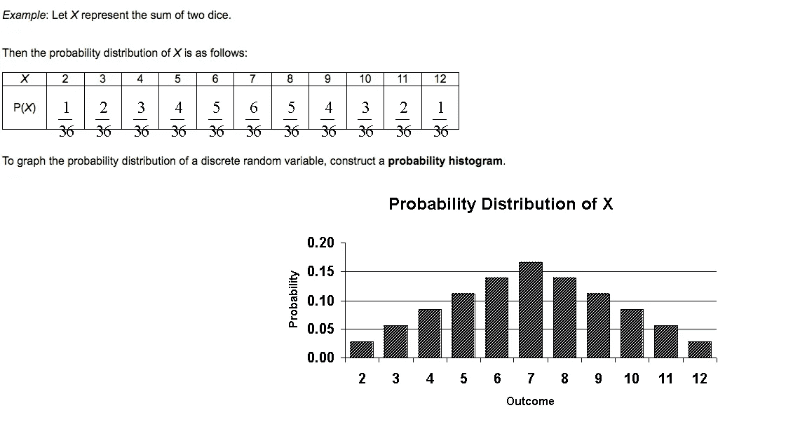

Source: [http://www.henry.k12.ga.us/ugh/apstat/chapternotes/7supplement.html](http://www.henry.k12.ga.us/ugh/apstat/chapternotes/7supplement.html)

你可以在这里看到 X 的值状态是如何映射到上面定义的表中它们各自的概率的。你可以在这里找到更多关于如何计算这个[的信息。](https://www.youtube.com/watch?v=8ZsEYKN0ht8#action=share)

## 概率密度函数

这是连续变量的概率分布函数。与关联 X 取某一值的概率的概率质量函数相反，密度函数将 X 落在具有测量值 dx 的*无穷小区域的概率与 X 相关联(*其中测量值=长度(对于单变量分布)、面积(对于双变量分布)、体积(对于三变量分布)等等*)。*相关的概率可以由 *f(x)给出。dx*

显然，我们可以应用积分计算 X 落在任意两个极限(比如 a 和 b，使得 a ≤ b)之间的*测量*中的概率，方法是重复累加由 *f(x)给出的无穷小区域的概率。dx*

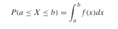

即 X 取值于 a 和 b 之间的概率是 a 和 b 之间无穷小概率的积分。

你可能还想了解二元分布函数([联合概率分布函数](https://en.wikipedia.org/wiki/Joint_probability_distribution)(离散和连续))和[边际分布函数](https://en.wikipedia.org/wiki/Marginal_distribution)。

# 期待值

随机变量的期望值可以认为是根据概率分布 *f(x)绘制的变量的**平均值**。*计算过程如下:

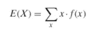

Fig 1: Calculating expectation value of a discrete random variable

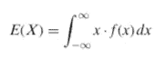

Fig 2: Calculating expectation value of a continuous random variable

同样，随机变量的*方差*可以看作是当 X 从概率分布 *f(x)中抽取时，随机变量的函数值变化多少的度量。*方差是(X —均值)的平方的期望值。

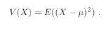

Fig 3: Variance as the expectation value of the square of the difference of the value of X and mean ( calculated by E(X))

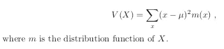

Fig 4: Expanding the equation in Fig 3 using the equation in Fig 1

关于期望值的非常详细的理论和实践可以在[这里](https://www.dartmouth.edu/~chance/teaching_aids/books_articles/probability_book/Chapter6.pdf)找到。

# 协方差

协方差是变量之间有多少相互关联的一种感觉。以这个协方差矩阵为例:

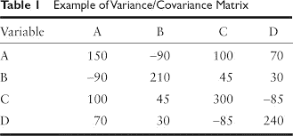

[http://methods.sagepub.com/reference/the-sage-encyclopedia-of-communication-research-methods/i3546.xml](http://methods.sagepub.com/reference/the-sage-encyclopedia-of-communication-research-methods/i3546.xml)

在这个矩阵的第一行，150 是 A 的方差，-90 是 A 和 B 的协方差，100 是 A 和 C 的协方差等等。

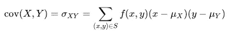

Fig 5: Calculation of covariance using expectation function

图 5 显示了上表中描述的协方差的计算，其中 f(x，Y)是随机变量 X 和 Y 的联合概率分布。可以求解上述方程，得到 ***cov(X，Y) = E(XY) — E(X)。*e(Y)**

从表中可以得出某些推论。负协方差意味着当一个变量的值增加时，另一个变量倾向于取较低的值。反之亦然，对于正协方差(两个变量倾向于同时取高值或低值)。独立变量的协方差为 0(因为它们不相互依赖，所以一个变量的值不会影响另一个变量的值)。*然而，0 协方差不一定意味着变量的独立性。*

# 预定义的概率分布

有几个预定义的概率质量和概率密度函数。我在这里解释其中的一些。

## 二项分布

这是二进制、单个、离散随机变量或离散随机变量 X(只能取 2 个值)的分布函数。举例来说，我有一枚硬币，当扔的时候，正面朝上的概率是𝑝.所以它落在反面的概率是 1−𝑝(抛硬币没有其他可能的结果)。

形式上，伯努利分布由表示成功概率的单个参数来参数化(或者其值等于 *p* ,如果你考虑上一段中的例子的话):

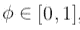

Bernoulli distribution parameter

现在考虑以下情况:

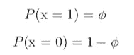

Fig 6: Probabilities of the outcomes {0, 1} in terms of the Bernoulli parameter

这里，X 取值为 1 的概率(或者在我们的例子中头部被抛出)由参数 *phi* (取 0 和 1 之间的某个值)给出。同样，另一个事件发生的几率(抛尾)是(1 — *phi* )。我们可以将这两种概率组合成一个由下式给出的*概括陈述*:

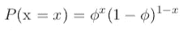

Fig 7: You can try to place values of x = 1 and x = 0 to see how this generalised statement returns the individual probabilities

利用上面讨论的期望值和方差的概念，可以得到该分布的均值和方差，如下所示:

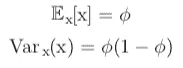

Fig 8: Mean and variance of Bernoulli distribution in terms of Bernoulli parameter

## 二项分布

二项式分布可以认为是 n 个**独立**和**同分布**的伯努利随机变量之和，其中每个伯努利随机变量取两个值{0，1}中的一个。

n 个独立同分布伯努利变量之和*的非正式含义是，我们将同一个实验*重复 n 次*，每个实验的结果独立于其他实验的结果。我们还定义了一个参数 *p* (与伯努利分布中的参数*φ*相同),该参数表示在 n 个实验实例中的该实验实例中随机变量取值 1 的概率。二项式分布是这样的:*

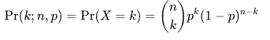

Fig 9: Binomial Distribution. n and p are parameters controlling the distribution for k

例如，投掷 5 次公平且平衡的硬币。现在定义一个随机变量 X，它表示获得的头数。因此，x 可以取{0，1，2，3，4，5}中的任何值。这里 n = 5(实验重复的次数)。从形式上来说，如果我们将伯努利变量 X[i]定义为第 *i* 次抛硬币的结果，我们需要将 X[1]，X[2]，…，X[5]相加，以获得我们想要的 X 值。还要注意 X[1]，X[2]，…，X[5]是成对独立的，或者一次抛硬币不依赖于另一次抛硬币。

浓缩上一段的信息，我们可以直接计算 Pr(k = 2；n = 5，p = 0.5)，将这些变量置于图 9 所示的分布中。假设我们投掷 5 次平衡的(平均值 p = 0.5)硬币，这将输出找到 2 个头的概率。

## 高斯分布(正态分布)

这是连续随机变量最基本的分布函数。这由分布的均值和方差(用标准符号表示)参数化，如下所示:

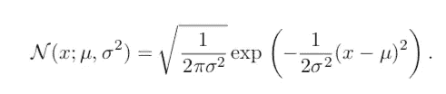

Fig 10: The Gaussian distribution function

该函数如下图所示:

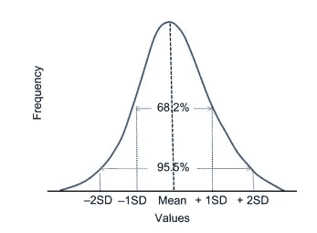

Fig 11: The Gaussian Distribution Function

在我们对随机变量的分布一无所知的情况下，高斯分布是明智的选择。因此，假设值将遵循正态分布，平均值上下的测量次数相等，平均值为分布的峰值。例如，我们的任务是模拟一个连续的随机变量，而我们对它的分布一无所知。在这种情况下，明智的做法是对变量的分布做出最少的假设，并选择高斯分布函数(在所有具有**有限方差**的分布中，高斯分布函数在 X 的分布上引入了**最大不确定性**)。

把上面的一段话浓缩成一个陈述，*你的连续随机变量 X 很有可能遵循一个带有一些噪声的高斯分布(由中心极限定理提出)。那么，为什么不事先做出这样的假设呢？*

如果我们希望对多元分布进行建模，我们可以将高斯分布表示为:

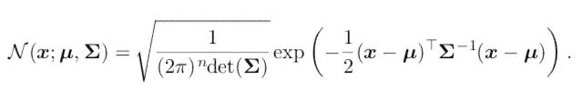

Fig 12: Gaussian distribution in case of multivariate scenarios

这里，均值现在是一个向量，而不是方差，我们使用一个协方差矩阵，用*大写 sigma* 表示(已经在上面的部分讨论过)。

*在下面讨论的高斯混合模型中，查找有关多变量设置中的高斯分布的更多信息。*

## 指数和拉普拉斯分布

在深度学习中，我们需要调整神经网络的参数，以防止过度拟合。从贝叶斯的角度来看，拟合正则化模型可以被解释为计算最大后验概率估计值。这里不再赘述更多细节(你显然可以在这里读到更多关于那个[的内容)，我们需要在 x = 0 或 X = X 分布的均值处有一个非常尖锐的点，以帮助正则化。因此，我们使用以下内容:](https://stats.stackexchange.com/questions/182098/why-is-lasso-penalty-equivalent-to-the-double-exponential-laplace-prior)

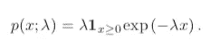

Fig 13: Exponential distribution introducing a spike at x = 0

在哪里，

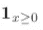

Fig 14: The indicator function in Fig 13

指示函数用于将 0 概率分配给 x 的所有负值。您可以查看图表:

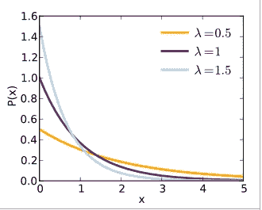

Fig 15: The exponential distribution function graph

指数分布描述了 [*泊松点*](https://en.wikipedia.org/wiki/Poisson_point_process) 过程中事件之间的时间，即事件以恒定的平均速率连续独立发生的过程。

类似地，如果我们希望在 X 分布的平均值处模拟尖峰，我们可以使用拉普拉斯分布函数，

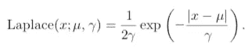

Fig 16: The Laplacian Distribution

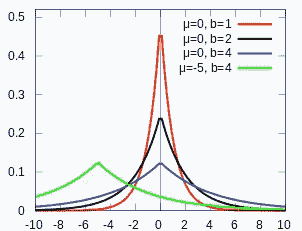

Fig 17: The Laplacian Distribution graph. Here b in the figure is the same as gamma in the equation in fig 16

这个拉普拉斯分布可以被视为两个背靠背拼接在一起的指数分布，从而我们在分布的平均值处获得一个尖峰(*注意我们如何在上图中获得绿色曲线的偏移，*这可以通过拉普拉斯分布中的参数*平均值*来管理)。

## 狄拉克δ分布

Dirac Delta 函数用于聚集单个点周围的所有分布，并中和连续随机变量 x 的所有其他值上的分布。

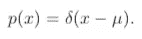

Fig 18: The Dirac Delta function

上述等式倾向于收集平均值周围的所有质量。更具体的例子是下面的函数:

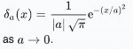

Figure 19: Dirac Delta function to concentrate mass about the origin

这里， *a* 是一个参数，其值用于定义峰值与原点的接近程度(或原点周围的质量浓度)。随着 *a* 接近 0，峰值变得无限窄和无限高。

您可以用平均值参数化图 19 中的等式。然后，该函数将类似于图 18 中的等式，并将在所需点处产生一个峰值(0°以外)。

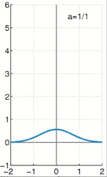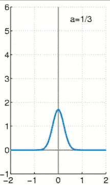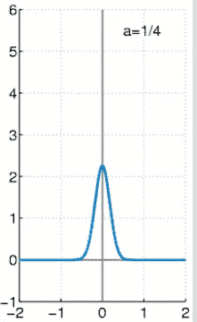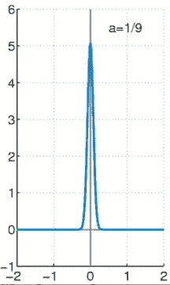

Fig 20: Growth of the Dirac Delta functions as value of the parameter changes

狄拉克δ函数在下一个分布中发现了它们的重要性:

## 经验分布

> 经验分布是连续随机变量的多元分布。

经验分布用于将(1/m)质量(而不是狄拉克δ分布中的全部质量)集中在样本空间中的 m 个点上，利用狄拉克δ分布在这些点上的能力。请考虑以下情况:

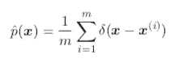

Fig 21: Empirical Distribution

很明显，这个分布以 x(1)，x(2)，…，x(m)上的(1/m)质量为中心。在下一节中可以找到更多的解释…

# 分配混合物

如果你已经走了这么远，恭喜你！我们现在开始理解上述分布的集合。您可以组合这些发行版来创建更复杂的发行版。我们举一个你已经见过的分布混合的例子——*经验分布。*

经验分布如图 21 所示。它是我们所瞄准的 m 个点上描述的狄拉克δ函数的混合。考虑以下等式:

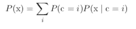

Fig 22: Distribution Mixture equation

让我解释一下。这里， *c* 代表定义的不同分量分布。在我们的例子中，我们有 m 个点，每个点上有一个狄拉克δ函数。因此，您可以将经验分布视为一个混合的 *m* 狄拉克δ分布，其中每个分布都由 x(i)点参数化，它需要将质量集中在 x(I)点上。

图 22 中的等式。意味着最终分布 *P(x)* 是单个分布分量 *c、*上的多努利分布，通过找到从我们拥有的 *m* 狄拉克德尔塔分布中选择第 *i* 狄拉克德尔塔分布的先验概率 ( 或观察 x **之前的概率)**，然后从第 *i* 狄拉克德尔塔分布中采样 x 来计算。

简单地说，*你有 m 个狄拉克δ分布，你选择其中一个，然后在其上集中(1/m)质量。然后你选择另一个狄拉克δ分布，并在其上集中(1/m)质量。继续这样做，直到所有狄拉克德尔塔函数用尽。最后，将它们相加得到你的经验分布。*

我们来讨论一个最终分布混合，*高斯混合模型。*你可以再一次把这个混合物想象成有 *m* 个独立的成分，其中每个成分是一个*高斯分布，有独立的参数:均值向量和协方差矩阵。*现在请看下图:

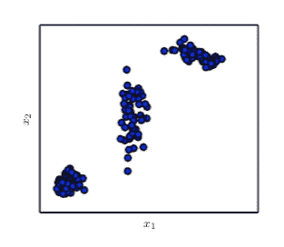

Fig 23: A Gaussian Mixture model

这是一个*高斯混合分布。你可以清楚地观察到三个不同的集群。每一个都是高斯分布。请注意这些参数化的不同(我将从协方差矩阵的角度进行解释，如果您需要复习这个参数，请参考图 12)。*

1.  左下分布有一个**各向同性协方差矩阵。因此，它在所有方向上都有相同的方差**
2.  中间分布有一个**对角协方差矩阵。这意味着只有对角线元素是非零的，或者两个变量的协方差都是 0，意味着它们是独立的。**
3.  右上分布有一个**满秩协方差矩阵。**

我希望这有助于理解如何将具有不同参数的相同分布组合成一个混合模型。

最后！！！

# 所有这些的应用

指数分布有助于调整神经网络的参数，以防止过度拟合。这是一项非常需要完成的任务，因为过度拟合会导致性能不佳，需要不惜一切代价予以消除。

前几天，我试图在 Kaggle 上解决[桑坦德银行客户交易预测](https://www.kaggle.com/c/santander-customer-transaction-prediction)，在探索数据时，我试图查看所有 200 个变量(匿名)的分布，以查看是否有可以立即看到的明显关系。变量的分布可以给出关于您试图处理的数据的性质的重要信息。我附上了我获得的一部分图表:

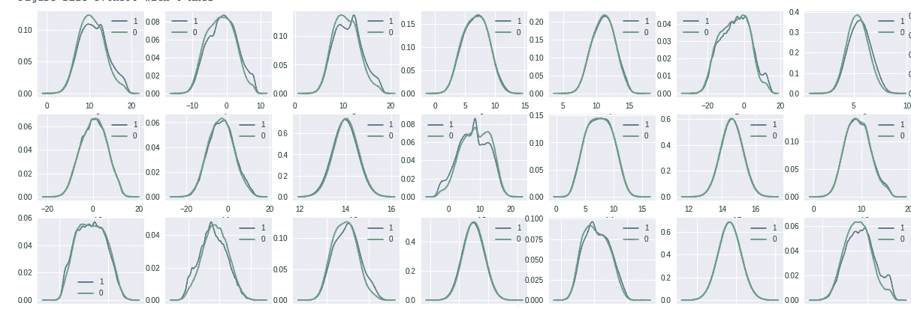

Can you find anything ???

或许，你可以。我的一个初步想法是，顶行中的前三个图表示相同变量在不同组中的不同分布(用 1 和 0 表示)。另一方面，顶行的第四个图表看起来是完美的重叠。因此，第四个变量可能不会影响由 1 和 0 表示的组的分布，而第一、第二和第三个变量可能会影响。

以上推断是初步的。但它可能会给进一步的探索指明方向。

还有很多其他的例子，比如不同算法背后的数学原理，如果你有一些相关的背景知识，现在可以更好地理解。

最后，也是更重要的，你将能够开始以更好的方式理解机器/深度学习文献，因为大多数事情都有这些概念的基础。

另外，你可能想看看这些帖子:

 [## 如何自学数据科学统计学

### 学习系列！！！

medium.com](https://medium.com/ml-research-lab/how-to-self-learn-statistics-of-data-science-c05db1f7cfc3)  [## 大多数 ML 模型都假设了一个底层的数据分布，以便它们能够很好地运行。在哪里可以学到…

### 回答(第 1 题，共 8 题):问题是: >>大多数 ML 模型都假设了一个底层数据分布，以便它们能够很好地运行…

www.quora.com](https://www.quora.com/Most-ML-models-assume-an-underlying-data-distribution-for-them-to-function-well-Where-can-I-learn-about-the-probability-distributions-that-each-ML-model-assumes) 

我希望你在这篇文章中学到了一些新东西。请在下面的评论中告诉我你对这篇文章的看法。

祝你今天开心！玩的开心！