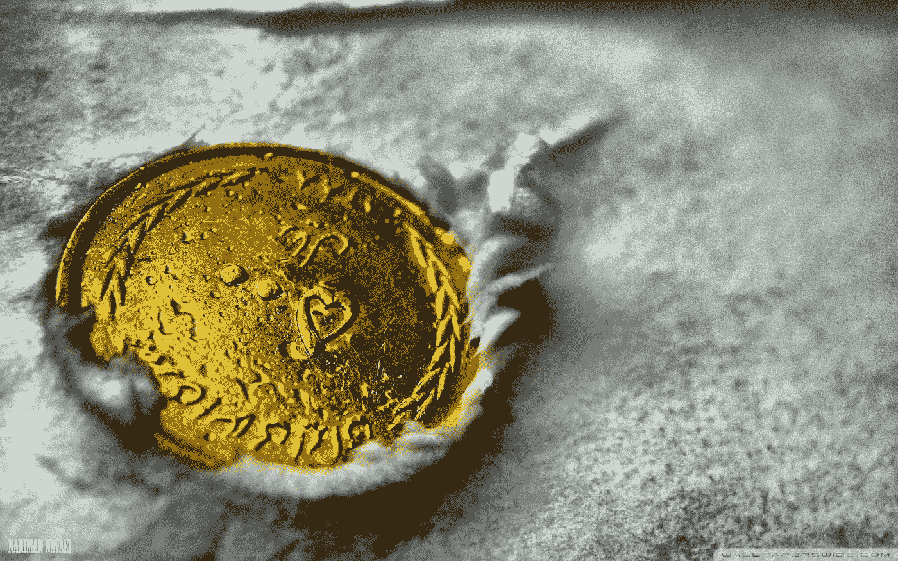
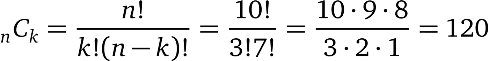

# 概率与统计

> 原文：<https://towardsdatascience.com/probability-vs-statistics-95f221cc74f7?source=collection_archive---------7----------------------->

## [基本问题 4 毫升](http://towardsdatascience.com/tagged/Essential-probNstats-4-ML)

## 概率与统计的区别以及统计方法的分析。

我们经常看到“概率”和“统计”这两个词放在一起，但是它们指的是同一个东西吗？这是 [Essential probNstats 4 ML](http://towardsdatascience.com/tagged/Essential-probNstats-4-ML) 项目的后续文章，在这篇文章中，我将解释这两个术语之间的区别，为什么它们被链接在一起，以及现有的统计方法。

# 概率与统计

**概率论**是与概率有关的数学分支。**概率**是一个事件发生可能性的数字描述。很多时候说概率，我们指的是概率论而不仅仅是数字。从句子的上下文来看，这是可以理解的。

**统计学**是数学的一个分支，涉及数据的收集、组织、显示、分析、解释和呈现。

这两者的关系是，在统计学中，我们应用概率(概率论)从数据中得出结论。

为了使定义更清楚，这里举两个例子:

## **概率示例:**

你有一枚公平的硬币(正面或反面的概率相等)。你会扔 100 次。60 头以上的概率有多大？由于标准的计算策略，我们只能得到一个答案。

## **统计示例:**

你有一枚来历不明的硬币。为了调查它是否公平，你把它扔 100 次，然后数人头的数量。假设你数了 60 个头。作为统计学家，你的工作就是从这些数据中得出结论(推论)。在这种情况下，不同的统计学家可能得出不同的结论，因为他们可能使用不同的结论形式或可能使用不同的方法来预测概率(例如着陆头)。

# 概率的基本术语

*在我们继续之前，让我们定义一些必要的概率基本术语:*

**实验**(或**试验**)是可以无限重复的任何程序，并且具有一组明确定义的可能结果。

样本空间是实验中所有可能结果的集合。

一个**事件**是一组实验结果。

事件可以是:

*   **独立**，表示不受其他事件影响。例如，如果你掷一枚公平的硬币，无论如何，它落在正面的机会是 1/2。
*   也就是说，他们受到其他事件的影响。例如，随着我们从一副牌中取出牌，我们选择国王的概率变得越来越高。
*   **互斥**也就是说它们不能同时发生。你不能同时向左转和向右转。

# 但是不同的统计学家如何根据概率得出不同的结果呢？

*有两种统计解释用于解决一个问题:***和* ***贝叶斯*** *。**

*频率主义者认为概率是实验中各种结果出现频率的量度。例如，如果我们有一个公平的硬币(50%的概率正面落地)，我们预计一半的实验将正面落地。*

*贝叶斯主义者认为概率是一个抽象的概念，用来衡量一个给定命题的知识状态或信任程度。这意味着概率有一个可能为真的值的范围，而不是单一的一个。这种方法将被我们作为数据科学家或 ML 工程师采用，用于语音或人脸识别等系统。*

# *集合的基本定义*

*在我们继续之前，我们需要对集合有一些基本的了解:*

*集合是元素的集合。*

*一个**空集**被表示为 **∅** ，它不包含任何元素。*

*集合(S)的**子集** (A)是存在于该集合中的一组元素。它被描绘成 A⊂S.*

*s 中 a 的**补码**是 s 中**不是 a 中**的元素的集合，用 Aᶜ或 s A 表示*

***A 和 B 的并集**是 A 或 B(或两者)中所有元素的集合。它表示为 A ∪ B。*

***A 和 B 的交集**是 A 和 B 中所有元素的集合，表示为 A ∩ B。*

*如果两个或多个子集没有公共元素并且它们的交集等于 **∅** ，则它们是**不相交的**。*

*两个或更多子集(如 A 和 B)的**差**是 A 中不在 B 中的元素的集合。我们将其记为 A-B。*

*最后，有两个重要的法则结合了交集、并集和补集。它们被称为**德摩根定律**，如下所示:*

*   *(一∪b)ᶜ=aᶜ∪bᶜ*
*   *(一∩ B)ᶜ= Aᶜ ∪ Bᶜ*

# *概率计算示例*

**在我们跳入问题之前，我们需要学习一些重要的概率概念:**

*   ***积法则:**如果有 **a** 做某事的方式和 **b** 做另一件事的方式，那么就有**a**b 两种动作的执行方式。例如，如果在一项奥林匹克运动中有 7 名参赛者，则有 765 = 210 种方法来授予奖牌(7 人授予金牌，6 人授予银牌，5 人授予铜牌)。*
*   ***排列**是****集合中元素放置的顺序。例如，集合{a，b，c}有六种排列:abc，acb，bac，bca，cab，cba。该集合的排列数也可以通过乘积法则找到:321 = 6 个排列。通常，集合的排列数是其长度的阶乘(在我们的例子中是 3！).*****
*   *******一个集合的组合**是从该集合中选择项目，使得不同顺序的元素没有重复。所以上一个集合中所有可能的 2 个元素组合是:{a，b}，{b，c}，{c，a}*****

*****我们也可以计算一个集合中 k 个元素的排列和组合。在任一情况下，计算这两者的通用公式为:*****

********************

*****ₙPₖ =一组大小为 n 的元素中 k 个不同元素的排列(列表)数*****

*****ₙCₖ =大小为 n 的集合中 k 个元素的组合(子集)数量*****

## *****最后，在那个阶段，我们准备着手解决问题！*****

*****假设我们有一枚公平的硬币，在 10 次投掷中正好有 3 个正面着地的概率是多少？*****

*****首先，我们必须计算在 10 次翻转中得到 3 个头的方法。这可以通过“组合”公式来实现:*****

**********

*****10 次翻转中的每一次都有 2 种可能的结果，所以根据乘积法则，我们有 2*2*2…=2 个 10 次翻转的⁰=1024 序列。现在我们可以用组合数除以序列总数来计算 10 次翻转中落地 3 头的概率:120/1024 ≈ **0.117** 。*****

# *****结论*****

*****我们了解了概率和统计的区别。我们还了解到，统计学家可能会根据结论的形式或概率计算方法得出不同的结果。最后，我们学习了如何计算一个具有同等可能性结果的问题的概率。*****

# *****参考*****

*****杰里米·奥洛夫和乔纳森·布鲁姆。 *18.05 概率统计导论。2014 年春天。麻省理工学院:麻省理工学院开放课件，[https://ocw.mit.edu](https://ocw.mit.edu/courses/mathematics/18-05-introduction-to-probability-and-statistics-spring-2014)。许可:[知识共享协议 BY-NC-SA](https://creativecommons.org/licenses/by-nc-sa/4.0/) 。******

*****皮尔斯罗德。(2017 年 10 月 6 日)。“概率:事件的类型”。数学很有趣。2019 年 12 月 14 日检索自[http://www . maths isfun . com/data/probability-events-types . html](http://www.mathsisfun.com/data/probability-events-types.html)*****

*****维基百科贡献者。(2019 年 11 月 2 日)。实验(概率论)。在*维基百科，免费百科*。检索到 2019 年 12 月 14 日 20:24，来自 https://en.wikipedia.org/w/index.php?[title=Experiment_(概率论)& oldid=924254710](https://en.wikipedia.org/w/index.php?title=Experiment_(probability_theory)&oldid=924254710)*****

*****维基百科贡献者。(2019 年 12 月 13 日)。概率论。在*维基百科，免费百科*。检索到 2019 年 12 月 15 日 10:59，来自[https://en.wikipedia.org/w/index.php?title =概率论& oldid=930545712](https://en.wikipedia.org/w/index.php?title=Probability_theory&oldid=930545712)*****

*****史蒂文·斯基娜。(2001 年 4 月 6 日)。概率与统计。2019 年 12 月 15 日检索自[https://www3 . cs . stony brook . edu/~ skiena/jaialai/excepts/node 12 . html](https://www3.cs.stonybrook.edu/~skiena/jaialai/excerpts/node12.html)*****

*****维基百科贡献者。(2019 年 12 月 4 日)。统计学。在*维基百科，免费百科*。检索于 2019 年 12 月 15 日 11:04，来自[https://en.wikipedia.org/w/index.php?title=Statistics&oldid = 929190255](https://en.wikipedia.org/w/index.php?title=Statistics&oldid=929190255)*****

*****维基百科贡献者。(2019 年 10 月 5 日)。乘积法则。在*维基百科，免费百科*。检索 2019 年 12 月 15 日 18:20，来自[https://en.wikipedia.org/w/index.php?title=Rule_of_product&oldid = 919664907](https://en.wikipedia.org/w/index.php?title=Rule_of_product&oldid=919664907)*****