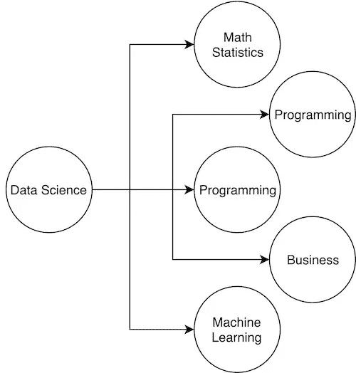

# 工具面前的问题:全栈数据科学通才的另一种视角

> 原文：<https://towardsdatascience.com/problems-before-tools-an-alternative-perspective-to-the-full-stack-data-science-generalist-403dd3658089?source=collection_archive---------13----------------------->

## [现实世界中的数据科学](https://medium.com/towards-data-science/data-science-in-the-real-world/home)

## 我们是否已经不再关注数据科学到底是什么？

我最近读了一篇来自 Stitch Fix 首席算法官 Eric Colson 的[文章](https://multithreaded.stitchfix.com/blog/2019/03/11/FullStackDS-Generalists/)，他谈到我们应该如何避免建立像制造工厂一样的数据科学团队，由高度专业化的个人组成，操作制造流程的不同部分。相反，数据科学团队应该采用全栈方法来构建，在这种方法中，数据科学家被视为多面手。多面手指的是执行从概念到建模到实施到测量的各种功能的能力。我不会在这里对这篇文章进行详细的总结，但是你应该在继续之前阅读 Eric 的文章。

这篇文章的目的是为埃里克的哲学提供一个补充的观点。在他的文章中，他采用了非常自上而下的方法来描述为什么数据科学团队应该由多面手组成。我相信，从数据科学从业者的角度以及数据科学的真正含义来看，通过自下而上的方法也可以得出相同的结论。

让我们从定义数据科学开始讨论。数据科学到底是什么，或者说数据科学家是做什么的？向我们友好的邻居 Interweb 先生寻求帮助，这里是我找到的一些定义。

# 先生，请告诉我，您所指的数据科学是什么？

*“数据科学是一个多学科领域，它使用科学的方法、流程、算法和系统，从各种形式的结构化和非结构化数据中提取知识和见解，类似于数据挖掘。”* — [维基百科](https://en.wikipedia.org/wiki/Data_science)

*“数据科学是“统一统计学、数据分析、机器学习及其相关方法的概念”，以便用数据“理解和分析实际现象”。它采用了从数学、统计学、信息科学和计算机科学等许多领域汲取的技术和理论*——[维基百科](https://en.wikipedia.org/wiki/Data_science)

*数据科学是一个跨学科领域，使用科学方法、流程、算法和系统从数据中提取价值。数据科学家结合一系列技能(包括统计学、计算机科学和商业知识)来分析从网络、智能手机、客户、传感器和其他来源收集的数据。*——[神谕](https://www.oracle.com/ca-en/artificial-intelligence/what-is-data-science.html)

*“数据科学是一个结合领域专业知识、编程技能以及数学和统计知识的研究领域，旨在从数据中提取有意义的见解。数据科学从业者将机器学习算法应用于数字、文本、图像、视频、音频等，以产生人工智能(AI)系统，该系统执行通常需要人类智能的任务。反过来，这些系统会生成分析人员和业务用户转化为切实商业价值的见解。”* — [数据机器人](https://www.datarobot.com/wiki/data-science/)

这些是一些精心制作的定义(比我能够表达的更好)，但这些定义(以及互联网上的许多其他定义)的一个可观察到的一致模式是，数据科学往往是通过执行一组特定任务或使用一组特定工具来定义的。如果你做 X，Y，Z 并使用 A，B，C，那么这被认为是数据科学。因果链应该是这样的:

**数据科学——21 世纪最不性感的领域**

实践数据科学将引导您使用数学和统计学，应用机器学习算法，学习编程，增加领域专业知识。为什么？首先，我认为通过包装和营销数据科学成为这个性感领域的过程，我们错误地定义了数据科学。我不认为上面提到的定义是不正确的，但我认为这样的定义更可信:

*“数据科学，就其最基本的术语而言，可以定义为从数据中获得洞察力和信息，实际上是任何有价值的东西。像任何新领域一样，试图给其定义设定具体界限往往很有诱惑力，但却适得其反。* — [深思熟虑](https://www.thinkful.com/blog/what-is-data-science/)

要让定义更不性感，我相信数据科学应该简单一点:*“只是用数据解决问题”。*数据科学家应该是“数据女孩或数据男孩”。不再性感了。

虽然我们在两个因果链中仍然有所有相同的元素，但因果关系逆转的微妙差异实际上导致了数据科学在现实中的实践方式的巨大差异。这和把一杯水看成半满还是半空是一个概念。尽管这两种观点都是正确的，但是认为事物半满的人和认为事物半空的人在行为方式上有很大的不同。

在第一个因果链中，我们看到许多数据科学从业者只对数据科学的特定任务感兴趣。你遇到过明确表示他们只对构建模型感兴趣，而不关心分析或与利益相关者合作的人吗？你很有可能。在通过第二个因果链的世界中，特定的数据科学任务被执行*，因为*它有助于解决手头的问题。

# 这与成为多面手有什么关系？

那么，经过这么多弯路，这些东西和成为多面手有什么关系呢？我相信，如果我们以正确的方式看待数据科学，真正优化数据科学的唯一方法是成为一名多面手(再次，欢迎在下面的评论中听到您的想法和意见)。为什么？如果我们总是以问题为主要焦点，我们会意识到，如果我们想以尽可能最好的方式解决问题，我们不能只做数据科学的一部分，而不做另一部分。回应 Eric 在他的文章中的观点，多面手角色提供了驱动工作满意度的所有东西:自主性、掌控力和目标。特别是在掌握方面，如果我们总是从问题开始，我们可以确定我们当前的工具包是否能够充分回答问题，或者我们需要更深入地分支并应用新的数据科学技巧或技术来帮助解决问题。

*原载于 2019 年 3 月 29 日*[*artofmarketingscience . github . io*](https://artofmarketingscience.github.io/problems_before_tools_an-alternative_view_to_generalist_data_scientist/)*。*