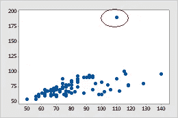

# 机器学习模型中的问题？先检查你的数据

> 原文：<https://towardsdatascience.com/problems-in-machine-learning-models-check-your-data-first-f6c2c88c5ec2?source=collection_archive---------10----------------------->

## *在将清洗数据输入机器学习算法之前对其进行简要分析*

Photo by [Eleonora Patricola](https://unsplash.com/@ele1010?utm_source=medium&utm_medium=referral) on [Unsplash](https://unsplash.com?utm_source=medium&utm_medium=referral)

许多人经常说数据预处理是机器学习算法中最重要的部分。人们常说，如果不清理数据并对其进行预处理，机器学习算法将会爆发。但是你有没有想过什么是不干净的数据，你如何区分干净的数据和不干净的数据，以及干净的数据有哪些不同的方面，然后我们可以在其上建立我们的模型？

Photo by [Joshua Sortino](https://unsplash.com/@sortino?utm_source=medium&utm_medium=referral) on [Unsplash](https://unsplash.com?utm_source=medium&utm_medium=referral)

好吧，这里是对机器学习中存在的主要挑战的一个小介绍。正如奥雷连·杰龙(Aurelien Geron)在他的书[动手机器学习](https://www.amazon.com/Hands-Machine-Learning-Scikit-Learn-TensorFlow/dp/1491962291)中所说，数据中可能存在两种类型的问题，正如他所说的，“糟糕的算法”和“糟糕的数据”。

## **数据不足**

用来建立机器学习模型的数据仓库应该包含大量的数据，这通常是明智的。虽然这通常是正确的，但是一个简单的机器学习模型可以建立在少到只有几百条记录的基础上。然而，更复杂的系统确实需要大型数据集和模型，例如图像识别甚至可能需要数百万条记录。
数据不足的真正问题在于，数据越少，方差越大。方差，可以很容易地定义为给定数据点或告诉我们数据如何分布的值的模型预测的可变性。模型中的高可变性意味着模型将完美地适合训练数据，但是一旦新数据被输入其中，模型将停止工作。

Photo by [Suhyeon Choi](https://unsplash.com/@choisyeon?utm_source=medium&utm_medium=referral) on [Unsplash](https://unsplash.com?utm_source=medium&utm_medium=referral)

## **非代表性训练数据**

为了很好地概括模型，训练数据准确地表示总体是至关重要的。换句话说，每次从总体中得出一个新样本时，样本必须准确地描绘总体的情况是至关重要的。训练数据集必须能够代表您想要归纳的案例。然而，这比听起来要难。如果样本太小，将会有采样噪声，这是由于偶然产生的不具有代表性的数据，但是如果采样方法有缺陷，即使是大样本也可能不具有代表性。这被称为采样偏差。
这里需要注意的是，如果必须减少采样偏差，方差就会上升，而如果方差要减少，偏差就会上升。这种现象也被称为 [**偏差-方差权衡**](https://en.wikipedia.org/wiki/Bias%E2%80%93variance_tradeoff) ，是找到一个最佳平衡点的过程，该平衡点使数据集中的方差和偏差都保持较低。

在处理偏见时，还有两个同样重要的概念，它们是:

*   样本可能倾向于选择部分人群，因此可能无法准确代表真实人群。这也就是俗称的数据中存在**偏斜，数据可以是右偏的，也可以是左偏的。**
*   **第二，也可能有这样的情况(特别是在调查中)，有足够多的人可能没有回答问题，并且没有在数据中得到体现。这也称为数据中存在 [**无响应偏差**](https://en.wikipedia.org/wiki/Participation_bias) 。**

****

**Presence of outliers in data**

## **质量差的数据**

**很明显，如果输入的数据已经是脏的，那么模型将不能很好地运行。脏数据是倾向于存在错误、异常值和噪声的数据。如果数据中有缺失的观察值，数据也可能是脏的。**

*   **为了处理异常值，如果我们可以丢弃这些观察值，这将减少数据集的大小，或者我们可以 [**winsorize**](https://en.wikipedia.org/wiki/Winsorizing) 它们，这可能会更好。Winsorized 观察值是那些最初是异常值的观察值，但是附加的条件已经传递给它们，以便将它们限制在特定的边界内。**
*   **数据集中的空白可以是缺失值，也可以是不存在的值。不存在的值通常在调查中更普遍，在调查中，一些特定的问题没有得到回答，我们没有它们的任何数据，而缺失的值更普遍地存在于数据中存在的值，但没有记录下来，因此可以不使用特殊的 [**标准化**](https://www.ringlead.com/blog/4-steps-data-standardization/) 方法进行处理。**

****

**Photo by [Sofia Kuniakina](https://unsplash.com/@kuniakina?utm_source=medium&utm_medium=referral) on [Unsplash](https://unsplash.com?utm_source=medium&utm_medium=referral)**

## ****无关紧要的特征****

**我在俄克拉荷马州立大学的项目主任 Goutam Chakraborty 博士总是说，机器学习在很大程度上取决于 GIGO(垃圾进，垃圾出)。这意味着，如果你把含有大量特征、大量噪声的坏数据放入模型，它最终会把垃圾还给你。ML 算法的一个重要方面是 [**特征工程**](https://en.wikipedia.org/wiki/Feature_engineering) 方面。这包括:**

*   ****特征选择**:在现有特征中选择最有用的特征进行训练。这可以通过使用套索回归等方法来实现。**
*   ****特征提取**:结合现有特征，创建一个新的、更有用的特征，在模型中具有更高的重要性。**
*   **通过**收集新数据**创建新特征**

****

**Various types of fits that can be present in the model**

## **过度拟合数据**

**正如上面的图像试图解释的那样，过度拟合数据是指模型已经尝试完全拟合训练数据。这通常是通过强制安装来实现的，而且通常好得令人难以置信。它也被称为傻瓜的黄金。这是因为每当这样的模型看到新数据时，该模型将给出令人难以置信的差性能。这种问题的可能解决方案是:**

*   ****正则化**:通过减少训练数据中的属性数量或约束模型，选择一个参数较少的模型，从而简化模型的过程。学习期间应用的正则化量可由*超参数控制。***
*   **收集更多训练数据**
*   **减少训练数据中的噪声**

## **数据拟合不足**

**欠拟合与过拟合相反:当模型过于简单而无法了解数据的底层结构时，就会发生欠拟合。这通常会导致无法解释的高度差异，因为模型无法解释这种差异。这个问题的解决方案可以是:**

*   **选择具有更多参数的更好(更强大)的模型**
*   **向学习算法提供更好的特征(特征工程)**
*   **减少对模型的约束(减少应用的正则化或减少超参数)**

**因此，上述问题可能存在于数据中，这可能使数据存在问题，并且为了机器学习模型有效地工作，这些问题应该被消除。要了解如何解决这些问题，应该使用并遵循此处的教程:**

** [## 数据清理和预处理完全初学者指南

### 如何在几分钟内为机器学习模型成功准备数据

towardsdatascience.com](/the-complete-beginners-guide-to-data-cleaning-and-preprocessing-2070b7d4c6d)**