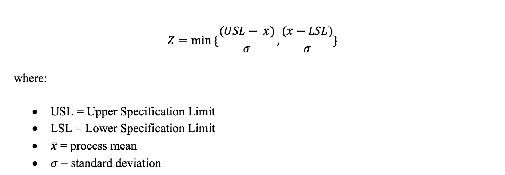
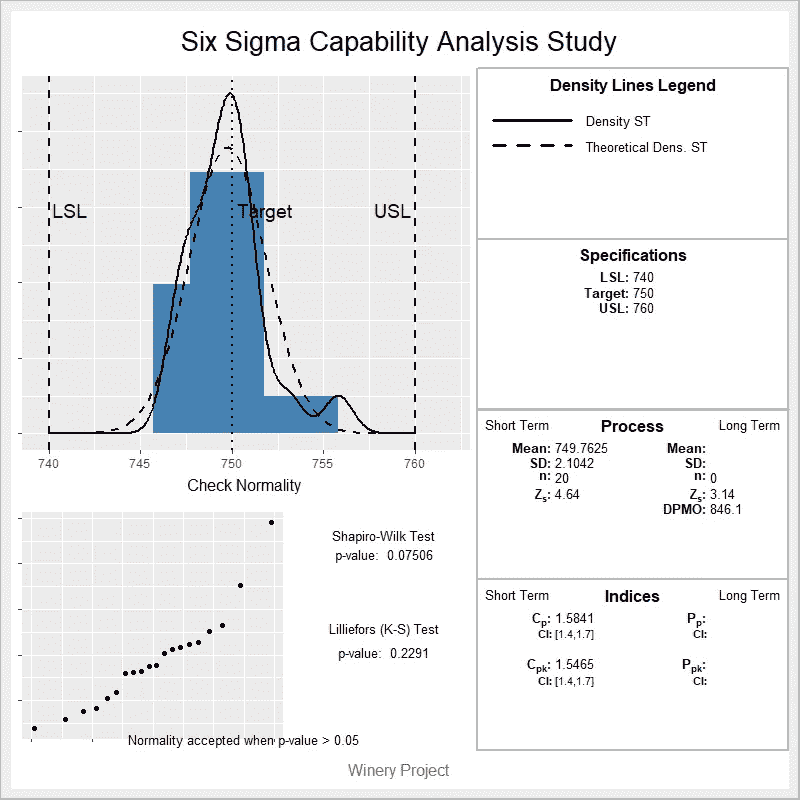

# 用 R 进行过程能力分析

> 原文：<https://towardsdatascience.com/process-capability-analysis-with-r-1a4ccc2d4270?source=collection_archive---------10----------------------->

## r 代表工业工程师

## 探索“六西格玛”R 包

Image by Lenny Kuhne available at [Unsplash](https://unsplash.com/photos/jHZ70nRk7Ns)

# 过程能力分析

过程能力分析是六适马项目中 DMAIC(定义、测量、分析、改进、控制)周期的*测量*阶段的重要组成部分。这种分析衡量过程性能如何符合客户的要求，并转化为要制造或生产的产品的有趣特性的规格限制。这种分析的结果可以帮助工业工程师识别过程中的变化，并制定进一步的行动计划，以提高产量、降低变化和减少缺陷数量。

## **规格**

规格是客户的心声。每一个过程都应该能够满足顾客的要求，这些要求必须量化才能达到。规格极限是客户要求的数字表达。由于过程中的自然变化，规格通常是一个有上限和下限的范围。*(规格上限)是工艺性能不可接受的值，而 *LSL* (规格下限)是工艺性能不可接受的值。*

*规格必须切合实际。为了评估它们的有效性，使用了来自六个适马场的*伦巴*方法，其中 *R* 代表合理， *U* 代表可理解， *M* 代表可测量， *B* 代表可信， *A* 代表可实现。*

## *过程性能*

*流程绩效是流程的声音。当一个过程接近*目标*，且*变化*尽可能小时，该过程可以被认为是正确的。在六适马方法中，最常见的过程绩效测量是:*

*   *产量( *Y* ):流程生产出的好产品或物品的数量。流程完成后，可以对其进行评估，计算符合规格的项目:*

**

*   *一次成品率( *FTY* ):考虑了工序中间的返工。因此，不管流程结束时有多少正确的项目，都会将正确的项目计为“第一次”正确的项目:*

**

*   *滚动产量( *RTY* ):当一个过程由几个相互联系的过程组成时使用。它是通过乘以每个链接进程的 *FTY* 计算出来的:*

**

*   *每机会缺陷( *DPU* ):每单位不符合项数量。缺陷是产量的补充:*

**

*   *每百万次机会中的缺陷( *DPMO* ):每百万次机会中的不符合项数量。它主要用作流程的长期性能测量:*

**

*来自 *SixSigma* R 软件包的 *ss.ca.yield* 函数计算所有之前的过程性能测量。对于下面的例子，让我们考虑一个过程由三个过程链接。我们来看看 R 代码！*

## *流程与规格*

*流程(Z)的*西格玛得分*是一个简单的数字，它表达了流程如何符合客户的规格。达到 6 的 *sigma* 水平的工艺可以被认为是“几乎完美”(即几乎没有缺陷)的设计工艺。6 的 *sigma* 值意味着将获得少于 3.4 的 DPMO(每百万个机会中的缺陷)。 *sigma* 是符合规格极限和过程平均值之间的标准偏差数。它是使用以下公式计算的:*

****

*DPMO through sigma scores*

## ***能力指数***

*能力指数直接比较客户规格和过程的性能。它们基于以下事实:过程的*自然极限*或*有效极限*介于平均值和+/- 3 标准偏差之间(即包含 99.7%的数据)。流程的能力(C *p* )通过以下公式计算:*

**

*然而，该公式不允许验证过程是否在平均值的中心(这是期望的)。为了解决这个问题，调整后的能力指数(C *pk* )通过以下公式计算:*

**

*像 sigma 分数一样，能力指数有助于确定过程满足客户规范的程度。一般来说，1.33 的 C *pk* 是可以接受的，但是它的值越大越好。*

*six sigma*R*R*包包含几个函数，用于获取对工业工程师和过程工程师有用的过程能力度量。我们来看看 R 代码！**

**

*Six Sigma Capability Analysis Study*

*从上面的六适马能力分析研究来看，上面的图表代表了样本数据的直方图，包括目标和规范。绘制了经验和理论密度函数的密度线。底部的图表表示分位数-分位数图(Q-Q 图),用于验证数据点是否呈正态分布。以同样的方式，两个常见的统计测试包括验证正态性假设:夏皮罗-维尔克测试和 Lilliefors (K-S)测试。在图的右边，包括了分析的事实:规格极限是在函数中输入的那些；计算过程性能和指数，并计算能力指数的置信区间(CI)。*

# *总结想法*

*过程能力分析为工业和过程工程师提供了一个很好的工具，用于识别过程中的变化，以提高其产量和效率。six sigma R 包只需要几行代码就可以获得关于过程能力的重要信息。非常鼓励工业、过程和质量工程师利用这一工具，以高质量和高效率的标准满足客户的要求。*

**— —**

**如果你觉得这篇文章有用，欢迎在* [*GitHub*](https://github.com/rsalaza4/R-for-industrial-engineering/blob/master/Six%20Sigma/Process%20Capability%20Analysis.R) *上下载我的个人代码。你也可以直接在 rsalaza4@binghamton.edu 给我发邮件，在*[*LinkedIn*](https://www.linkedin.com/in/roberto-salazar-reyna/)*上找到我。有兴趣了解工程领域的数据分析、数据科学和机器学习应用的更多信息吗？通过访问我的媒体* [*个人资料*](https://robertosalazarr.medium.com/) *来浏览我以前的文章。感谢阅读。**

**——罗伯特**