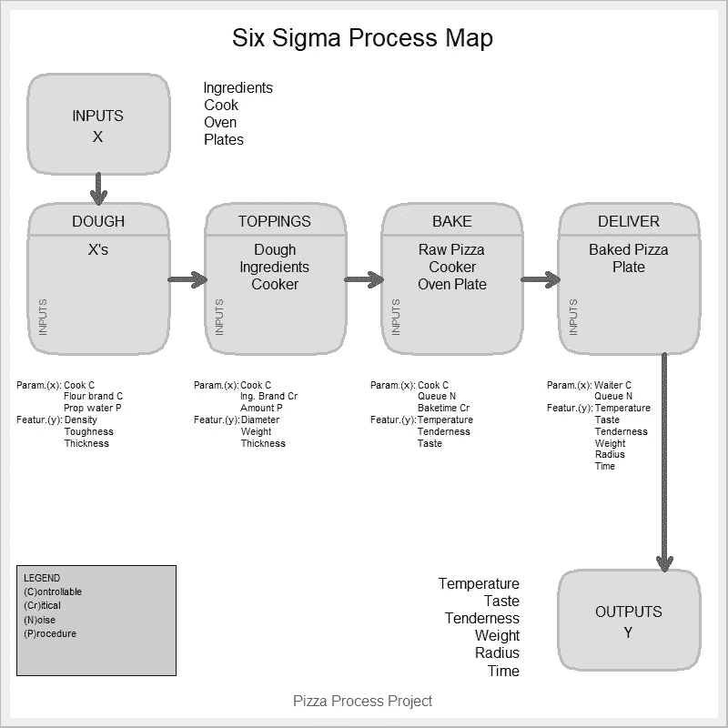

# 用 R 绘制流程图

> 原文：<https://towardsdatascience.com/process-mapping-with-r-3682a8e2f77e?source=collection_archive---------20----------------------->

## r 代表工业工程师

## 使用 R 包创建流程图

Image by Matteson Ellis available at [FCPAmericas](http://fcpamericas.com/wp-content/uploads/2014/04/FCPA.Internal.Controls.Process.jpg)

> 说得好的问题是解决了一半的问题。
> 
> ——*查尔斯·富兰克林·凯特林*

流程图是在 DMAIC(定义、测量、分析、改进、控制)周期的定义阶段检索流程信息的一个很好的工具。作为项目章程，流程图是其构建的来源，流程图包括描述流程所需的步骤，并确定其输入、输出、参数和特征；它描述了流程的当前状况，是确定根本原因的基础。流程图*令人大开眼界*，它们有助于识别流程的利益相关方(例如所有者、客户、供应商)、瓶颈、浪费和*改善*事件和*精益*改进的机会领域。

然而，构建流程图并不是一件容易的事情；收集关于进程的信息不是小事。顶级流程图的分解(即，将流程分解为简单的步骤)和信息检索流程可能包括许多必须克服的障碍。激励员工获取关于流程的更精确的信息是流程工程师必须克服的最重要的挑战之一，这可以通过选择最佳策略使他们参与项目并使他们相信其成功实施可以给整个组织带来的潜在好处来实现。

一旦过程被分解成更小的步骤，过程工程师必须独立地关注每一个步骤。必须充分识别和测量参数(对过程输出的产品特性有影响的所有因素或变量)和特性(定义质量的特性),以便对它们进行绘图和分析，从而设计实验、测试假设，并获得未来改进的重要结果。

来自 R 的 *SixSigma* 和 *grid* 包包含几个用于开发逐步流程图的函数。对于下面的例子，我们将考虑 Cano，Moguerza 和 Redchuk (2012)的教科书 *Six 适马与 R* 中的披萨餐厅案例，其中一家餐厅的经理对研究制作和提供披萨的过程感兴趣。我们来看看 R 代码！

*   **步骤 1:** 加载*网格*和 *SixSigma* R 包

*   **步骤 2:** 声明过程输入和输出

*   **第三步:**申报项目的步骤

*   **第四步:**声明每一步的输出

*   **第五步:**对每一步的参数进行声明和分类

# — — — — — — — — — — — — — — — — — — — — — — — — — #

参数组:

*   噪声:不可控制的因素
*   *C* =可控因素:可能在过程中发生变化
*   *P* =程序:通过标准程序的可控因素
*   *Cr* =关键:对流程影响较大的因素

# — — — — — — — — — — — — — — — — — — — — — — — — — #

*   **第六步:**声明每一步的特点

*   **步骤 7:** 用 *SixSigma* 包绘制流程图

*   **最终结果:**

Six Sigma Process Map Final Outcome

# 总结想法

six sigma R 包包含了很棒的特性，只需要几行代码就可以开发出顶级的流程图。用 R 开发它们的主要优势是它们的**可再现性**(即每次生成它们时，它们都有相同的方面)，这代表了在项目中使用可再现研究技术时的一个有用特性。通过将代码存储在您自己的库中，您将只需修改输入，流程图将再次自动呈现，这将节省您的时间，因为您不必打开新的绘图图、修改它、检查方面并从其他所谓的用户友好程序中导出图像。虽然这个用于开发流程图的 *SixSigma* 特性并不打算取代其他程序，但它提供了一种以更快和可重复的方式开发它们的新方法。

*— —*

*如果你觉得这篇文章有用，欢迎在*[*GitHub*](https://github.com/rsalaza4/R-for-industrial-engineering/blob/master/Process%20Mapping/Process%20Mapping.R)*上下载我的个人代码。你也可以直接在 rsalaza4@binghamton.edu 给我发邮件，在*[*LinkedIn*](https://www.linkedin.com/in/roberto-salazar-reyna/)*上找到我。有兴趣了解工程领域的数据分析、数据科学和机器学习应用的更多信息吗？通过访问我的媒体* [*简介*](https://robertosalazarr.medium.com/) *来探索我以前的文章。感谢阅读。*

*——罗伯特*