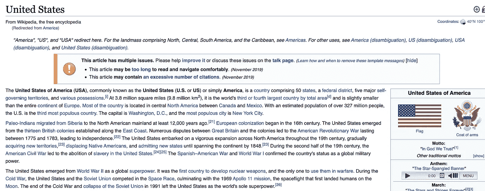

# 使用 Apache Spark 处理维基百科，创建热点数据集

> 原文：<https://towardsdatascience.com/process-wikipedia-using-apache-spark-to-create-spicy-hot-datasets-1a59720e6e25?source=collection_archive---------22----------------------->

## 从维基百科:名人数据集创建一个你选择的数据集


Wikipedia, The Free Encyclopedia

我们大多数人肯定都遇到过这样的情况，每当我们想了解某个国家的历史、纪念碑、电视剧和电影、名人的生活和职业生涯、过去的事件或当前的事件时，我们的首选是维基百科。聪明的人用它来获取各种各样的知识，听起来甚至更聪明。但是，你有没有想过它有多大？它有多少文件/文章？

维基百科目前有大约 598 万篇文章，并且每天都在增加。有各种各样来自各个领域的文章。我们可以使用这些数据来创建许多有趣的应用程序。如果您可以访问这些数据，您的下一个有趣的应用是什么？你如何得到整个数据集？即使你得到了它，处理它需要多少计算量？

所有这些问题都将得到解答。

***在本文中，我想创建一个名人数据集。过去或现在所有在维基百科上有页面的受欢迎的人，像维拉特·科利、萨钦·坦杜尔卡尔、板球界的瑞奇·庞廷、布拉德·皮特、莱昂纳多·迪卡普里奥、电影界的阿米特巴·巴强、物理学家阿尔伯特·爱因斯坦、伊萨克·牛顿等等。我将使用 Apache Spark (PySpark)来处理这个庞大的数据集。***

# 1.获取维基百科转储

为了开始这项任务，首先，我们需要 Wikipedia 转储。维基百科转储可以从[这里](https://dumps.wikimedia.org/enwiki/latest/enwiki-latest-pages-articles.xml.bz2)以 XML 格式下载。它不断刷新，包含最新的维基百科数据。

## 解析维基百科 XML 的脚本

接下来，可以使用免费提供的 [Python 包](https://github.com/attardi/wikiextractor)非常容易地解析这个下载的 XML。关于如何使用该软件包的更多细节可以在[这里](https://spark-in.me/post/parsing-wikipedia-in-four-commands-for-nlp)找到。

一旦解析完成，这就是解析后的目录结构的外观。


Parsed Directory Structure

每个目录由多个纯文本文件组成。文件内容的快照


Snapshot of File Content

每个文件包含多个维基百科文章。每篇文章都以<doc>标签开始，以</doc>结束。接下来就是把这些档案都翻一遍，筛选出名人对应的文章。 ***如果我们使用一台机器来完成，可能需要几天时间，因为这是一项计算密集型任务。*** 我们将利用分布式系统框架 Apache Spark (PySpark)来执行这项任务，这项任务只需要 10 到 15 分钟的时间，并配备合理数量的执行者。

# 2.通过 Apache Spark (PySpark)处理维基百科解析数据

## 阿帕奇火花

> [Apache Spark](https://en.wikipedia.org/wiki/Apache_Spark) 是一种快如闪电的集群计算技术，专为快速计算而设计。它基于 Hadoop [**MapReduce**](https://en.wikipedia.org/wiki/MapReduce) 并扩展了 MapReduce 模型，以有效地将其用于更多类型的计算，包括交互式查询和流处理。Spark 的主要特点是它的**内存集群计算**提高了应用程序的处理速度。

## 一些 Apache Spark 术语和转换函数(可选)

此部分是可选的。这一节是为 Spark 初学者或那些想在继续之前快速掌握一些 Spark 变换函数的人准备的。要了解关于这些功能的更多信息，请浏览此[链接](https://data-flair.training/blogs/spark-rdd-operations-transformations-actions/)。

*   **RDD** : RDD(弹性分布式数据集)是 Apache Spark 的基本数据结构，它是在集群的不同节点上计算的不可变对象集合。RDD 是分布在集群中许多机器上的数据元素的分布式集合。
*   **数据帧**:数据帧是组织成指定列的数据的分布式集合。它在概念上相当于关系数据库中的一个表。
*   **map()**:map 函数遍历 RDD 的每一条线，分割成新 RDD。使用 map()变换，我们接受任何函数，并将该函数应用于 RDD 的每个元素。

Usage of map() transformation function

*   **flatMap()** :借助 flatMap()函数，对于每个输入元素，我们在一个输出 RDD 中有很多元素。flatMap()最简单的用法是将每个输入字符串拆分成单词。

Usage of flatMap() transformation function

*   **filter()** : Spark RDD 过滤器()函数返回一个新的 RDD，只包含满足谓词的元素。

Usage of filter() transformation function

*   **whole text files():**whole text files 返回一个 PairRDD，其键是文件路径，值是文件内容。

## 开始执行任务

首先，我们将获取 HDFS 中传输的所有数据，并使用 wholeTextFiles 读取数据。

```
data = sc.wholeTextFiles(“hdfs:///Data_w/*/*”)
```

输出将具有键-值配对的 RDD，其中键是文件路径，内容是值。我们可以去掉文件路径，只处理内容。每个文件内容包含由<doc>标签分隔的多个维基百科文章。我们需要把所有这些文章作为单独的记录拿出来。为此，我们将使用一个 flatMap()函数。</doc>

```
pages = data.flatMap(lambda x :(x[1].split('</doc>')))
```

一旦我们有了所有的文章，我们需要找到文章是关于什么的。每篇文章的第一行是标题，其余部分是内容。我们可以使用这些信息将每篇文章转换成一个键-值对，其中键是标题，值是内容。


Snapshot of each article

Function to extract the title

Function to extract the content

```
pages = data.flatMap(lambda x :(x[1].split(‘</doc>’))).map(lambda x : (get_title(x),get_content(x)))
```

接下来，就是只过滤掉人物(名人)对应的文章。之前，写一些逻辑，让我们看看一些名人网页看起来如何。


Wiki Page of Sir Isaac Newton


Wiki Page of Virat Kohli


Wiki Page of Brad Pitt


Wiki Page of Michael Jackson

让我们也看看一些非名人的网页。



Wiki Page of the United States


Wiki Page of Taj Mahal, India

***名人页面和非名人页面有什么不同？所有名人页面的共同点是什么？***

大多数名人的页面在第一句话就包含了出生日期。在维基百科数据中，这个出生日期是以下两种格式之一:

1.  年月日:如 1993 年 8 月 12 日
2.  年月日:如 1993 年 8 月 12 日

我们可以利用这个事实来快速过滤掉所有的名人页面。我将使用 Regex 来查找这种格式。

Code to check if the Wiki page is a Celebrity Page or not

最后，我们可以将输出保存为表格。完整的代码如下所示:

Entire Code for the project

# 3.验证创建的名人数据集

维基百科总共有大约 598 万篇文章。我们的名人数据集有 138 万篇文章。所有名人的名单和获得的数据可以在[这里](https://github.com/samread81/Wiki-Celebrity-DataSet)找到。

该数据集包含了关于迈克尔·杰克逊、阿米特巴·巴强、布拉德·皮特、萨钦·坦杜尔卡尔、多尼女士以及所有我们能想到并核实的其他名人的文章。

# 4.结论

维基百科是互联网上所有可能信息的最佳去处之一。我们可以用它来创建许多有趣的应用程序，你的下一个大而有趣的 NLP 项目。随着 Apache Spark 的使用，处理这些海量数据变得很容易。用不到 20-25 行代码，我们就可以从中创建大多数有趣的数据集。

写一篇清晰易懂的好文章需要很多努力。我会继续努力做好我的工作。在 [**中**](https://medium.com/@mungoliabhishek81) 关注我，查看我以前的帖子。我欢迎反馈和建设性的批评。所有名人和数据集的列表以及代码可以在这里找到。

***我的 Youtube 频道获取更多内容:***

[](https://www.youtube.com/channel/UCg0PxC9ThQrbD9nM_FU1vWA) [## 阿布舍克·蒙戈利

### 嗨，伙计们，欢迎来到频道。该频道旨在涵盖各种主题，从机器学习，数据科学…

www.youtube.com](https://www.youtube.com/channel/UCg0PxC9ThQrbD9nM_FU1vWA) 

# 5.参考

1.  [https://www . tutorialspoint . com/Apache _ spark/Apache _ spark _ introduction . htm](https://www.tutorialspoint.com/apache_spark/apache_spark_introduction.htm)
2.  https://spark.apache.org/
3.  【https://en.wikipedia.org/wiki/Apache_Spark 
4.  [https://en.wikipedia.org/wiki/MapReduce](https://en.wikipedia.org/wiki/MapReduce)
5.  [https://data-flair . training/blogs/spark-rdd-operations-transformations-actions/](https://data-flair.training/blogs/spark-rdd-operations-transformations-actions/)
6.  [https://data-flair.training/blogs/spark-rdd-tutorial/](https://data-flair.training/blogs/spark-rdd-tutorial/)
    [https://data-flair . training/博客/Apache-spark-rdd-vs-data frame-vs-dataset/](https://data-flair.training/blogs/apache-spark-rdd-vs-dataframe-vs-dataset/)
7.  [https://www . analyticsvidhya . com/blog/2019/10/py spark-for-初学者-第一步-大数据-分析/](https://www.analyticsvidhya.com/blog/2019/10/pyspark-for-beginners-first-steps-big-data-analysis/)
8.  [https://blog.softhints.com/python-regex-match-date/](https://blog.softhints.com/python-regex-match-date/)