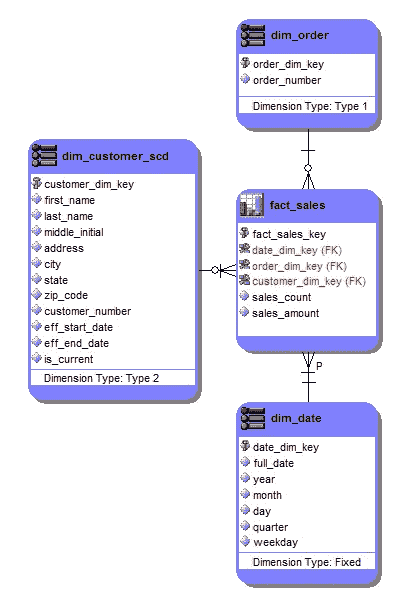
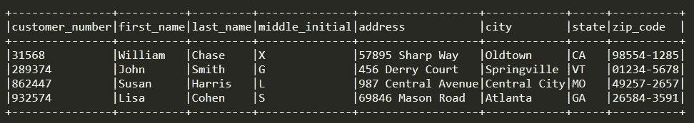
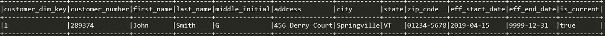
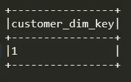
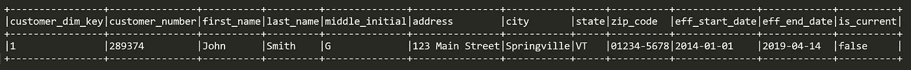
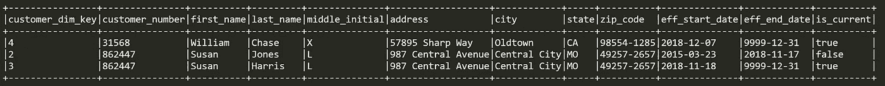
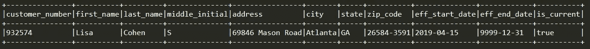
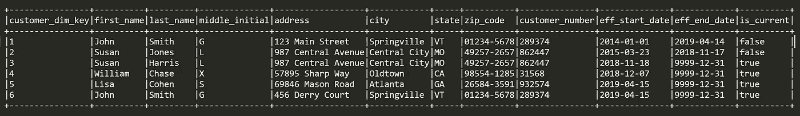

# 在 AWS 中使用 PySpark 处理渐变维度类型 2

> 原文：<https://towardsdatascience.com/processing-a-slowly-changing-dimension-type-2-using-pyspark-in-aws-9f5013a36902?source=collection_archive---------1----------------------->

随着新技术的出现，使得数据处理变得像闪电一样快，云生态系统允许灵活性、成本节约、安全性和便利性，似乎有一些数据建模哲学不太经常使用。其中一种方法是星型模式数据架构。

简而言之(*我假设阅读本文的人熟悉概念*)，星型模式以多维方式存储数据，以便通过提供更快更简单的查询性能来提供更好的用户体验。在维度模型中，数据驻留在事实表或维度表中。事实表保存动作的度量和相关维度的键，维度包含所述动作的属性。维度可以是静态的(例如时间维度)，也可以保存历史(也称为渐变维度类型 2，也称为 SCD2)。值得注意的是，星型模式是分析系统，这意味着它们不*通常*直接从用户应用程序中消费数据。相反，数据存储在高度规范化的事务系统中，星型模式利用一些提取过程从该系统中获取数据。

下面是一个销售计划的基本星型模式的示例，它有一个事实表和三个维度(dim_customer_scd 是一个 SCD2)。



星型模式通常在 RDBMS 层处理，这里允许更新和删除(这里不讨论),但是当事实和 SCD2 表包含数百万或数十亿行时，处理时间可能是个问题。在这个时代，我们经常会想到 Spark 或 Hadoop 这样的分布式集群框架。人们可以整天开玩笑和假设哪个是首选框架，但这不是本次讨论的主题，我将解释如何在 AWS 环境中使用 Spark 作为框架和 PySpark 作为脚本语言来处理 SCD2，并使用大量 SparkSQL。

最基本的，SCD2 的目的是保存变更的历史。如果客户更改了他们的姓氏或地址，SCD2 将允许用户将订单链接回客户及其在订单时所处状态的属性。如果我不保留那段历史，就很难做到。本质上，我可以找到客户在任何时间点的真实状态。


dim_customer_scd (SCD2)

数据集非常窄，由 12 列组成。我可以把这些列分成 3 个小组。

*   **按键** : customer_dim_key
*   **非维度属性**:名，姓，中间名，地址，城市，州，邮政编码，客户号
*   **行元数据**:生效开始日期，生效结束日期，当前日期

**key**通常是自动创建的，没有商业价值。它们只是用作其他表的外键，并为行提供唯一性。有时可以使用自然键，但是在星型模式中非常少见。

**非维度属性**描述了数据集主题的不同方面，在所用的例子中是一个客户。这些属性可能具有业务意义，并在报告和分析中被进一步用于下游。我将把这些简单地称为“属性”。

**行元数据**列特定于 SCD2s，描述记录的状态。eff_start_date 存储记录生效的日期。eff_end_date 存储记录到期的日期(*注意:未到期的记录通常有一个遥远的日期，如‘9999–12–31’)*；is_current 表示记录是否是最新的。is_current 对于生效日期来说是多余的，但是有些人喜欢这个标志，以避免在他们的查询或脚本中使用日期逻辑。

我在这个数据集中有四行。如果我查看 **customer_number** ，我可以看到所有的行都由三个不同的客户组成:John、Susan 和 William。John 和 William(分别在第 1 行和第 4 行)在表中只有一个条目，这意味着他们的数据在插入后没有更改过。

另一方面，Susan 有两条记录(第 2 行和第 3 行)。第 2 行是历史记录，用 **is_current = false** 表示，而第 3 行是 Susan 自 **is_current = true** 以来的最新信息。第 2 行“姓氏”列中的值为“Jones ”,第 3 行包含“Harris ”,而所有其他属性字段保持不变。

当 Susan 的姓是 Jones 时，表中只有三行，当她的姓改变时，会添加第四行。在表格中实现这一点的实际逻辑是什么？在高层次上:

1.  发现源系统中的姓氏发生了变化。
2.  记录已过期；eff_end_date 更新为昨天的日期，is_current 设置为 false。
3.  将插入一条新记录，其中包含新的姓氏、今天的生效开始日期和将来的生效结束日期，并且 is_current 设置为 true。

*注意:对于 eff_start_date 和/或 eff_end_date 字段，使用逻辑业务日期通常更好，但是为了讨论的目的，让它保持简单*

在 RDBMS 中，很容易实现这一点。然而，由于 Spark 中更新功能的各种限制，我不得不采用不同的方式。

是时候讨论细节了。

## 步骤 1:创建 Spark 会话

我可以开始我们的 Spark 会议，并为我们在 S3 的目标路径创建一个变量:

```
from pyspark.sql import SparkSessionspark = SparkSession.builder.appName("scd2_demo").getOrCreate()v_s3_path = "s3://mybucket/dim_customer_scd"
```

## 步骤 2:创建 SCD2 数据集(用于演示目的)

您可以使用下面的脚本来生成当前的 SCD2，将其写入 Parquet，创建一个临时表，并查看结果(我*将始终使用这个模式来帮助描述*):

```
# ############## generate current_scd2 dataset ############## #hd_current_scd2 = """
 SELECT   BIGINT(1) AS customer_dim_key,
          STRING('John') AS first_name,
          STRING('Smith') AS last_name,
          STRING('G') AS middle_initial,
          STRING('123 Main Street') AS address,
          STRING('Springville') AS city,
          STRING('VT') AS state,
          STRING('01234-5678') AS zip_code,
          BIGINT(289374) AS customer_number,
          DATE('2014-01-01') AS eff_start_date,
          DATE('9999-12-31') AS eff_end_date,
          BOOLEAN(1) AS is_current
 UNION
 SELECT   BIGINT(2) AS customer_dim_key,
          STRING('Susan') AS first_name,
          STRING('Jones') AS last_name,
          STRING('L') AS middle_initial,
          STRING('987 Central Avenue') AS address,
          STRING('Central City') AS city,
          STRING('MO') AS state,
          STRING('49257-2657') AS zip_code,
          BIGINT(862447) AS customer_number,
          DATE('2015-03-23') AS eff_start_date,
          DATE('2018-11-17') AS eff_end_date,
          BOOLEAN(0) AS is_current
 UNION
 SELECT   BIGINT(3) AS customer_dim_key,
          STRING('Susan') AS first_name,
          STRING('Harris') AS last_name,
          STRING('L') AS middle_initial,
          STRING('987 Central Avenue') AS address,
          STRING('Central City') AS city,
          STRING('MO') AS state,
          STRING('49257-2657') AS zip_code,
          BIGINT(862447) AS customer_number,
          DATE('2018-11-18') AS eff_start_date,
          DATE('9999-12-31') AS eff_end_date,
          BOOLEAN(1) AS is_current
 UNION
 SELECT   BIGINT(4) AS customer_dim_key,
          STRING('William') AS first_name,
          STRING('Chase') AS last_name,
          STRING('X') AS middle_initial,
          STRING('57895 Sharp Way') AS address,
          STRING('Oldtown') AS city,
          STRING('CA') AS state,
          STRING('98554-1285') AS zip_code,
          BIGINT(31568) AS customer_number,
          DATE('2018-12-07') AS eff_start_date,
          DATE('9999-12-31') AS eff_end_date,
          BOOLEAN(1) AS is_current
"""df_current_scd2 = spark.sql(hd_current_scd2)df_current_scd2.coalesce(1).write.mode("overwrite").parquet(v_s3_path + "/current_scd2/")df_current_scd2.createOrReplaceTempView("current_scd2")# ############## review dataset ############## #df_current_scd2 = spark.read.parquet(v_s3_path + "/current_scd2/*").orderBy("customer_dim_key")df_current_scd2.show(10, False)
```

## 步骤 3:从源系统创建客户数据集(用于演示目的)

您可以使用下面的脚本来生成您的源数据，我将用它来修改我们的 SCD2:

```
# ############## generate customer_data dataset ############## #hd_customer_data = """
 SELECT   BIGINT(289374) AS customer_number,
          STRING('John') AS first_name,
          STRING('Smith') AS last_name,
          STRING('G') AS middle_initial,
          STRING('456 Derry Court') AS address,
          STRING('Springville') AS city,
          STRING('VT') AS state,
          STRING('01234-5678') AS zip_code
 UNION
 SELECT   BIGINT(932574) AS customer_number,
          STRING('Lisa') AS first_name,
          STRING('Cohen') AS last_name,
          STRING('S') AS middle_initial,
          STRING('69846 Mason Road') AS address,
          STRING('Atlanta') AS city,
          STRING('GA') AS state,
          STRING('26584-3591') AS zip_code
 UNION
 SELECT   BIGINT(862447) AS customer_number,
          STRING('Susan') AS first_name,
          STRING('Harris') AS last_name,
          STRING('L') AS middle_initial,
          STRING('987 Central Avenue') AS address,
          STRING('Central City') AS city,
          STRING('MO') AS state,
          STRING('49257-2657') AS zip_code
 UNION
 SELECT   BIGINT(31568) AS customer_number,
          STRING('William') AS first_name,
          STRING('Chase') AS last_name,
          STRING('X') AS middle_initial,
          STRING('57895 Sharp Way') AS address,
          STRING('Oldtown') AS city,
          STRING('CA') AS state,
          STRING('98554-1285') AS zip_code
"""df_customer_data= spark.sql(hd_customer_data)df_customer_data.coalesce(1).write.mode("overwrite").parquet(v_s3_path + "/customer_data/")df_customer_data.createOrReplaceTempView("customer_data")# ############## review dataset ############## #df_customer_data= spark.read.parquet(v_s3_path + "/customer_data/*").orderBy("customer_number")df_customer_data.show(10, False)
```


Current State of the SCD2



Customer_Data from Source System

## 第四步:手动查找变更(*只是为了主题*)

请记住，来自源系统的数据馈入到我们的 SCD2 中，因此我需要比较这两个数据集，以确定是否有任何差异。经过我们的手动调查，我看到:

*   约翰·史密斯改变了他们的地址
*   丽莎·科恩是一位新顾客
*   威廉·蔡斯和苏珊·哈里斯的属性保持不变

现在，我需要编写一些逻辑来完成以下所有任务:

*   为 John Smith 创建新条目
*   使约翰·史密斯的当前条目过期
*   保持威廉·蔡斯和苏珊·哈里斯的记录不变
*   为我们的新客户 Lisa Cohen 添加一个条目

## 步骤 5:为现有客户创建新的当前记录

为了从逻辑上捕捉这种地址变化，我需要比较当前的 SCD2 和源数据(*，就像我在*上面手动做的那样)以及标志变化。我还需要注意我们的行元数据字段，以确保我使用适当的日期终止和开始记录。

幸运的是，我可以在一个 SQL 块中完成这项工作，并将结果写到 S3 的一个文件中:

*   将 customer_data 数据集连接到 customer_number 上的当前 SCD2 数据集和当前记录
*   检查 WHERE 子句中的差异
*   从源数据集中选择所有属性
*   从当前 SCD2 数据集中选择 customer _ dim _ key(*用于步骤 6* )
*   将生效日期设置为今天
*   将生效日期设置为将来
*   将 is_current 设置为 1

```
# ############## create new current recs dataaset ############## #hd_new_curr_recs = """
 SELECT   t.customer_dim_key,
          s.customer_number,
          s.first_name,
          s.last_name,
          s.middle_initial,
          s.address,
          s.city,
          s.state,
          s.zip_code,
          DATE(FROM_UTC_TIMESTAMP(CURRENT_TIMESTAMP, 'PDT'))
              AS eff_start_date,
          DATE('9999-12-31') AS eff_end_date,
          BOOLEAN(1) AS is_current
 FROM     customer_data s
          INNER JOIN current_scd2 t
              ON t.customer_number = s.customer_number
              AND t.is_current = True
 WHERE    NVL(s.first_name, '') <> NVL(t.first_name, '')
          OR NVL(s.last_name, '') <> NVL(t.last_name, '')
          OR NVL(s.middle_initial, '') <> NVL(t.middle_initial, '')
          OR NVL(s.address, '') <> NVL(t.address, '')
          OR NVL(s.city, '') <> NVL(t.city, '')
          OR NVL(s.state, '') <> NVL(t.state, '')
          OR NVL(s.zip_code, '') <> NVL(t.zip_code, '')
"""df_new_curr_recs = spark.sql(hd_new_curr_recs)df_new_curr_recs.coalesce(1).write.mode("overwrite").parquet(v_s3_path + "/new_curr_recs/")df_new_curr_recs.createOrReplaceTempView("new_curr_recs")# ############## review dataset ############## #df_new_curr_recs = spark.read.parquet(v_s3_path + "/new_curr_recs/*").orderBy("customer_number")df_new_curr_recs.show(10, False)
```

上面的逻辑遍历所有记录，找到我手动观察到的一个变化。正如您在下面看到的，为 John Smith 用他的新地址创建了一个新记录，行元数据显示这个记录今天生效，将来过期。



New Record for John Smith

## 步骤 6:查找要过期的以前的当前记录

现在我有了一个已经存在的客户的新的当前记录，我需要终止以前的当前记录。我在之前的数据集中包含了之前的当前记录的 customer_dim_key，所以我将其分离出来供将来使用。

```
# ########### isolate keys of records to be modified ########### #df_modfied_keys = df_new_curr_recs.select("customer_dim_key")df_modfied_keys.coalesce(1).write.mode("overwrite").parquet(v_s3_path + "/modfied_keys/")df_modfied_keys.createOrReplaceTempView("modfied_keys")
```



Records to be Modified

## 步骤 7:终止以前的当前记录

现在我可以让之前的记录过期，同时再次注意我们的行元数据字段并正确地修改它们。回想一下，我不能更新记录，所以我必须创建它的一个新实例。

在这段代码中，我将:

*   将当前 SCD2 数据集连接到 customer_dim_key 上的 modified_keys 数据集
*   通过仔细检查 is_current = 1，确保当前记录即将到期
*   从当前 SCD2 数据集中选择所有属性和 eff_start_date
*   将生效日期设置为昨天
*   将 is_current 设置为 0

```
# ############## create new hist recs dataaset ############## #hd_new_hist_recs = """
 SELECT   t.customer_dim_key,
          t.customer_number,
          t.first_name,
          t.last_name,
          t.middle_initial,
          t.address,
          t.city,
          t.state,
          t.zip_code,
          t.eff_start_date,
          DATE_SUB(
              DATE(FROM_UTC_TIMESTAMP(CURRENT_TIMESTAMP, 'PDT')), 1
          ) AS eff_end_date,
          BOOLEAN(0) AS is_current
 FROM     current_scd2 t
          INNER JOIN modfied_keys k
              ON k.customer_dim_key = t.customer_dim_key
 WHERE    t.is_current = True
"""df_new_hist_recs = spark.sql(hd_new_hist_recs)df_new_hist_recs.coalesce(1).write.mode("overwrite").parquet(v_s3_path + "/new_hist_recs/")df_new_hist_recs.createOrReplaceTempView("new_hist_recs")# ############## review dataset ############## #df_new_hist_recs = spark.read.parquet(v_s3_path + "/new_hist_recs/*").orderBy("customer_number")df_new_hist_recs.show(10, False)
```

上述逻辑使记录正确过期，并写入其自己的数据集:



Expired Record for John Smith

## 步骤 8:隔离未受影响的记录

威廉·蔡斯和苏珊·哈里斯的记录没有变化，它们需要保留在目标数据集中，所以下一步是将它们放入自己的数据集中。

该逻辑将:

*   将 modified_keys 数据集左连接到 customer_dim_key 上的当前 SC2 数据集
*   查看不在 modified_keys 数据集中的记录
*   保持所有属性和行元数据不变

```
# ############## create unaffected recs dataset ############## #hd_unaffected_recs = """
 SELECT   s.customer_dim_key,
          s.customer_number,
          s.first_name,
          s.last_name,
          s.middle_initial,
          s.address,
          s.city,
          s.state,
          s.zip_code,
          s.eff_start_date,
          s.eff_end_date,
          s.is_current
 FROM     current_scd2 s
          LEFT OUTER JOIN modfied_keys k
              ON k.customer_dim_key = s.customer_dim_key
 WHERE    k.customer_dim_key IS NULL
"""df_unaffected_recs = spark.sql(hd_unaffected_recs)df_unaffected_recs.coalesce(1).write.mode("overwrite").parquet(v_s3_path + "/unaffected_recs/")df_unaffected_recs.createOrReplaceTempView("unaffected_recs")# ############## review dataset ############## #df_unaffected_recs = spark.read.parquet(v_s3_path + "/unaffected_recs/*").orderBy("customer_number")df_unaffected_recs.show(10, False)
```

未受影响的记录实际上是孤立的:



Unaffected Recs

## 步骤 9:为新客户创建记录

Lisa Cohen 是一位新客户，因此还不存在于我们的 SCD2 中。

以下逻辑:

*   Left 将当前 SCD2 数据集连接到 customer_number 上的 customer_data 数据集
*   查看不在当前 SCD2 数据集中的记录
*   使用源中的所有属性
*   将生效日期设置为今天
*   将生效结束日期设置为将来
*   将 is_current 设置为 1

```
# ############## create new recs dataset ############## #hd_new_cust = """
 SELECT   s.customer_number,
          s.first_name,
          s.last_name,
          s.middle_initial,
          s.address,
          s.city,
          s.state,
          s.zip_code,
          DATE(FROM_UTC_TIMESTAMP(CURRENT_TIMESTAMP, 'PDT')) 
              AS eff_start_date,
          DATE('9999-12-31') AS eff_end_date,
          BOOLEAN(1) AS is_current
 FROM     customer_data s
          LEFT OUTER JOIN current_scd2 t
              ON t.customer_number = s.customer_number
 WHERE    t.customer_number IS NULL
"""df_new_cust = spark.sql(hd_new_cust)df_new_cust.coalesce(1).write.mode("overwrite").parquet(v_s3_path + "/new_cust/")df_new_cust.createOrReplaceTempView("new_cust")# ############## review dataset ############## #df_new_cust = spark.read.parquet(v_s3_path + "/new_cust/*").orderBy("customer_number")df_new_cust.show(10, False)
```

这是结果。新客户的预期格式是:



New Customer Record

## 步骤 10:合并新 SCD2 的数据集

我已经创建了创建新的 SCD2 迭代所需的四个数据集:

*   现有客户的新当前记录的数据集(" *new_curr_recs* ")
*   现有客户的过期前当前记录的数据集(" *new_hist_recs* ")
*   未被修改的记录数据集("*未受影响 _ 记录*")
*   以前未见过的新客户的数据集(" *new_cust* ")

剩下的就是将它们融合在一起，形成最终产品。在最后这段代码中，我将:

*   找出最大客户尺寸关键值
*   联合两个没有 customer_dim_key 的数据集:new_cust 和 new_curr_recs
*   要创建新的 customer_dim_key，请使用 ROW_NUMBER()函数并添加最大 customer_dim_key 值(以保持连续性和唯一性)
*   将先前联合的数据集联合到 unaffected _ recs 和 new_hist_recs

```
# ############## create new scd2 dataset ############## #v_max_key = spark.sql(
    "SELECT STRING(MAX(customer_dim_key)) FROM current_scd2"
).collect()[0][0]hd_new_scd2 = """
 WITH a_cte
 AS   (
        SELECT     x.first_name, x.last_name,
                   x.middle_initial, x.address,
                   x.city, x.state, x.zip_code,
                   x.customer_number, x.eff_start_date,
                   x.eff_end_date, x.is_current
        FROM       new_cust x
        UNION ALL
        SELECT     y.first_name, y.last_name,
                   y.middle_initial, y.address,
                   y.city, y.state, y.zip_code,
                   y.customer_number, y.eff_start_date,
                   y.eff_end_date, y.is_current
        FROM       new_curr_recs y
      )
  ,   b_cte
  AS  (
        SELECT  ROW_NUMBER() OVER(ORDER BY a.eff_start_date)
                    + BIGINT('{v_max_key}') AS customer_dim_key,
                a.first_name, a.last_name,
                a.middle_initial, a.address,
                a.city, a.state, a.zip_code,
                a.customer_number, a.eff_start_date,
                a.eff_end_date, a.is_current
        FROM    a_cte a
      )
  SELECT  customer_dim_key, first_name, last_name,
          middle_initial, address,
          city, state, zip_code,
          customer_number, eff_start_date,
          eff_end_date, is_current
  FROM    b_cte
  UNION ALL
  SELECT  customer_dim_key, first_name,  last_name,
          middle_initial, address,
          city, state, zip_code,
          customer_number, eff_start_date,
          eff_end_date, is_current
  FROM    unaffected_recs
  UNION ALL
  SELECT  customer_dim_key, first_name,  last_name,
          middle_initial, address,
          city, state, zip_code,
          customer_number, eff_start_date,
          eff_end_date, is_current
  FROM    new_hist_recs
"""df_new_scd2 = spark.sql(hd_new_scd2.replace("{v_max_key}", v_max_key))# ############## review dataset ############## #df_new_scd2.coalesce(1).write.mode("overwrite").parquet(v_s3_path + "/new_scd2/")df_new_scd2 = spark.read.parquet(v_s3_path + "/new_scd2/*").orderBy("customer_dim_key")df_new_scd2.show(10, False)
```



New SCD2

在新版本的 SCD2 中，一切都如预期的那样:

*   威廉·蔡斯和苏珊·哈里斯的记录没有改变
*   约翰·史密斯有一个旧地址在 2019 年 4 月 14 日到期的记录
*   约翰·史密斯有一个新记录，新地址于 2019 年 4 月 15 日生效
*   丽莎·科恩的新纪录于 2019 年 4 月 15 日生效
*   数据集上一次迭代中存在的记录保留了它们的 customer_dim_keys，因此星型模式中的事实表不需要重新映射

新的 SCD2 存放在 S3，可以随心所欲地使用。

## 一些注意事项:

1.  表演很精彩。在我的生产环境中，源表有 382 列和大约 700 万条记录，SCD2 有 81 列和大约 1 . 1 亿条记录。处理这些数据平均需要大约 10 分钟。在标准 RDBMS 中，大约 180 分钟即可完成。处理时间缩短了 94%。
2.  我在这次讨论中使用的 S3 路径并不真正适用于现实生活中的商业场景，但在这个教学场景中非常适用。

我很难在网上找到任何关于使用 Spark 处理 SCD2s 和 star 图式的信息。坦白地说，这很令人沮丧，我很高兴自己弄明白了这一点。此外，我惊喜地发现，不需要火箭科学学位就能做到这一点。我希望您可能遇到的任何挫折都是短暂的，并且这个讨论可以帮助您进行大数据、星型模式脚本工作。