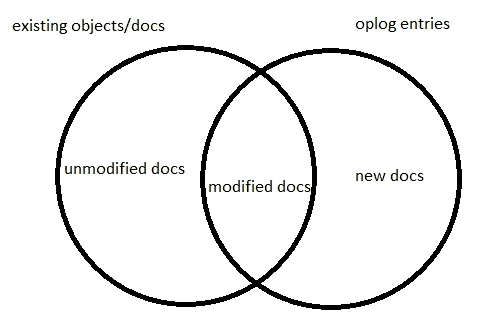

# 正在处理 MongoDB 操作日志

> 原文：<https://towardsdatascience.com/processing-mongodb-oplog-4884f702ec5?source=collection_archive---------17----------------------->

## 数据处理

## 从操作日志重建 MongoDB 文档

在之前的[帖子](https://medium.com/@atharva.inamdar/understanding-mongodb-oplog-249f3996f528)中，我介绍了什么是 MongoDB 操作日志及其语义。在这篇文章中，我将研究如何处理它以获得文档的新状态。

# 概述

首先，让我们提醒一下数据操作:插入、更新和删除。对于插入和删除，整个文档中只有`o`字段存在，或者只有`_id`被删除。对于更新，`o`字段包含作为`$set`和`$unset`命令的更新，`o2`记录正在更新的文档的`_id`。

我们可以忽略`c` (DB 命令)和`n` (NOOP)操作，因为它们不会修改数据。

# 问题

让我们考虑一个包含超过 1TB 数据的大型 MongoDB 集合，它每天都需要传输到一个仓库或湖泊或另一个存储系统。一种方法是每天使用`mongoexport`实用程序执行一次完全导出。然而，我们很快发现，这可能需要很长时间，这使得日常出口不可行。我们还必须考虑对集群本身的性能影响。

另一种方法是导出一次，获取 1 天的更新(操作日志),并将这些更新应用于现有对象。这需要 MongoDB 集群上更少的资源来读取操作日志，但也允许以任何所需的频率应用更改。

# 解决办法

请记住，操作日志是 MongoDB 集群变化的绝对有序列表。这意味着需要对每个文档顺序应用操作日志。这导致通过文档收集所有操作，排序和更新文档。从逻辑上讲，这听起来很简单。

我选择用 Apache Spark 和 Python 来解决这个问题，因为数据量需要分布式处理，而且我熟悉 Python。

## 读取操作日志

首先是阅读所有现有的导出文档和操作日志。

```
objs = sc.textFile(self.input()['objects'].path) \
         .map(json.loads)ops = sc.textFile(self.input()['oplog'].path) \
        .map(json.loads) \
        .map(lambda x: x['message']) \ #my tailing app writes the oplog as string in this `message` field.
        .map(json.loads)
```

## 清理和过滤操作日志

在此步骤中，我们将对象转换为元组，第一个元素作为对象 ID，第二个元素是操作日志条目本身。这将帮助我们基于密钥加入。

操作日志条目被类似地转换，但是因为每个对象 ID 可以有多个条目，所以我们使用一个`groupBy`。如果您记得操作日志也有在碎片之间迁移数据的系统操作，我们需要排除这些操作。这发生在现有的`fromMigrate`字段上的一个简单过滤器上。

```
objs = objs.map(lambda x: (str(x['_id']), x))ops = ops.filter(lambda x: "fromMigrate" not in x) \
         .map(prepare_op) \
         .groupBy(lambda x: str(x['id']))
```

此时，我们的对象和操作日志条目都已准备好进行处理和合并。

## 操作日志合并



为了应用操作，我们使用一个定制的映射函数应用于一个完全外部连接的结果。我们需要完全外部连接的原因是为了在操作日志中包含不存在的新对象，以及没有任何操作日志条目的未修改文档。完全连接为我们提供了完整的数据集，而不仅仅是修改过的文档。

```
final = objs.fullOuterJoin(ops) \
            .map(merge_object) \
            .filter(lambda x: x[1][0] is not None) \
            .map(lambda x: x[1][0]) \
            .map(remove_extra)
```

**合并 _ 对象**

这个映射函数负责应用操作。对于插入，它创建一个新记录。对于更新，它遍历`$set`和`$unset`来操作被改变的字段。对于删除，它会从 RDD 中移除文档。

**滤镜&贴图**

然后，过滤器和地图改变形状，返回一个 RDD，其中仅包含处于最终状态的合并文档。`remove_extra`功能通过删除`merge_object`期间添加的元数据字段来清理文档。

`final` RDD 现在包含在应用操作日志条目结束时所有文档处于一致状态的结果数据集。在我们的例子中，这是第二天的数据集。这种在 Spark 集群上运行的处理可以加快处理速度，并且不需要每次都完全导出数据。

# 流式传输

现在流媒体是一件大事，所以这里有一些关于它的话。这个管道可以变成流式管道。如果你照现在这样做，就有可能在小批量上运行它；但是，处理时间可能会比批处理间隔长。一种替代方式是以规则的间隔处理操作日志条目，以将这些条目折叠/合并成最终操作，该最终操作可以以更长的间隔应用于对象。我没有玩过这个，但是根据收藏的大小，它可能会工作得很好。对于流，返回修改过的文档并忽略任何删除或未修改的文档可能是有意义的。这将使连接更快，处理的集合更小。

如果你以相似或不同的方式处理 MongoDB 操作日志，我很乐意听听你对这个过程的想法。我希望在另一篇文章中讨论变更流，但是如果你用它来代替，请让我知道。