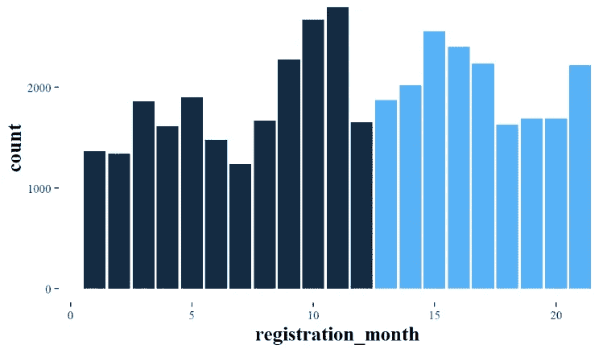
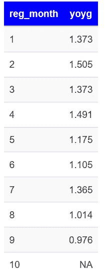
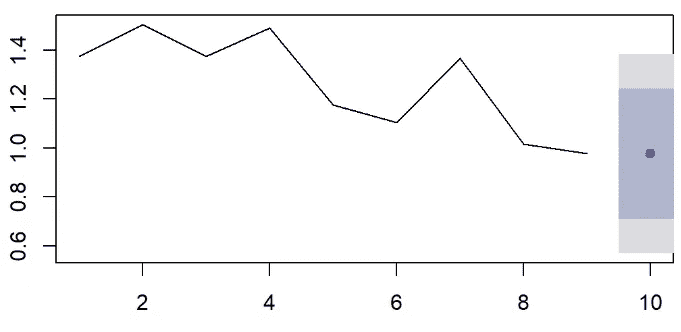
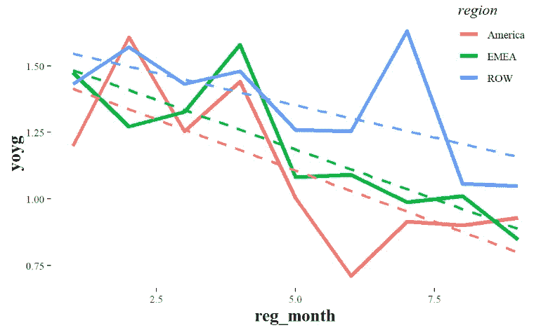
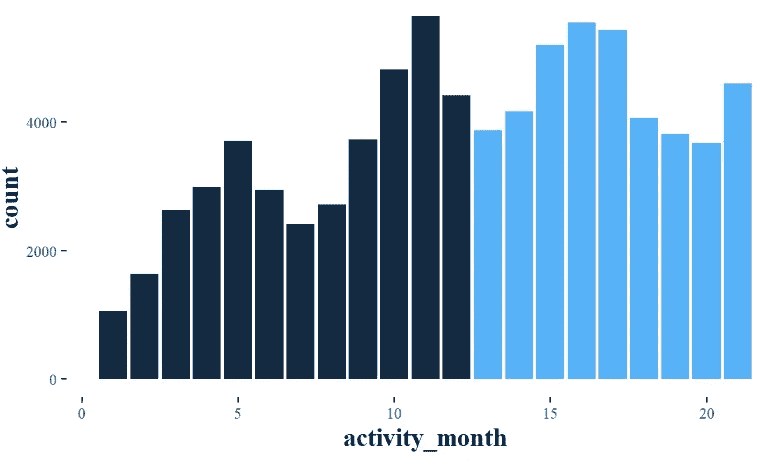
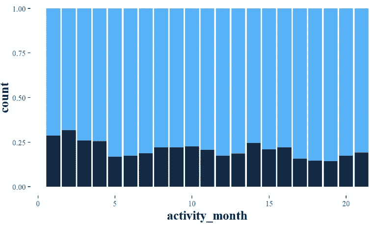
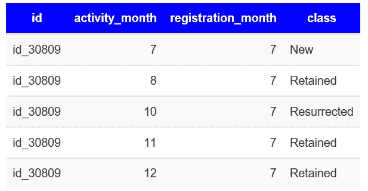
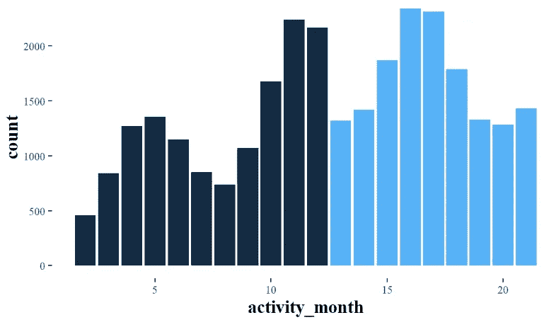
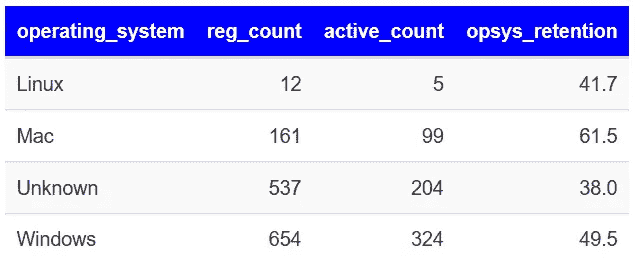

# r 代表产品分析

> 原文：<https://towardsdatascience.com/product-analytics-65812e82b2c2?source=collection_archive---------11----------------------->

## 用 R 从用户行为中获得洞察力

## 如何从用户行为中获得洞察力

该分析基于 Alistair Croll 和 Benjamin Yoskovitz 所著的《精益分析:使用数据分析更快地建立更好的创业公司》一书的概念。根据这本书，它旨在对产品生命周期的三个关键阶段——获取、活动和保留进行简单的数据探索。

# 关于数据

该示例基于一个真正的软件即服务、基于订阅的产品。有两个数据集可用:

*   *registrations.csv* :拥有基本人口统计数据的唯一用户
*   *activity.csv* :哪些用户在哪个月活跃过

关于数据集的更多信息可以在项目的 [GitHub 库](https://github.com/BenceToth/ceu_product-analytics)上获得。

# 获得物ˌ获得

> *习得是一个阶段，在这个阶段，你应该通过各种方式，包括有机的和无机的，来引起别人的注意。评估获取的相关指标包括流量、提及次数、每次点击成本、搜索结果、获取成本、打开率等。*

作为分析的第一步，让我们看看每个月的注册数量:

Figure 1: number of registrations per month

我们可以看到，第二年的注册数量总体较低(21831 对 18295)。第一年，大多数登记发生在秋季/初冬期间(9 月至 11 月)。我们不知道该产品何时投放市场，第一年上半年的低谷期可能类似于早期适应者，第二年下半年的高峰可能是一次成功的营销活动。在圣诞节假期经历了一些低谷之后，在第二年的五月出现了第二个高峰，然后注册人数突然下降了 36.87%。这可能是产品更新失败、市场覆盖范围缩小或其他情况。

为了更深入地挖掘数据，我们可以看到注册的逐年增长:

Table 1: Year on Year growth of registrations

下一个图显示了每个月的增长率，以及第 22 个月(第二年的 10 月)的简单预测:

Figure 2: Year-on-year growth & Naive Forecast

同比数据似乎在下降，但第二年的注册数量一直保持在较高水平，直到 9 月份。10 月份的天真预测是 0.976。

我们可以根据地理区域调查注册号是否有任何差异:

Figure 3: Region differences in year-on-year growth

比较地区，似乎有区别。除了第一年年初，美洲的表现不如 T2、EMEA 和世界其他地区。所有城市的注册人数都呈下降趋势，但*排*区域的增长速度似乎最快。这可能会推动未来注册量的增长，而 EMEA、尤其是美洲可能对该产品有不同的兴趣，或者他们受营销活动的影响较小。

**活动**

> *激活是将由此产生的路过访客转化为以某种方式注册的用户。这可以通过跟踪特定的活动里程碑来完成，如注册、签约、完成入职流程、至少使用一次服务、订阅等。*

下图显示了每月活跃用户的数量:

Figure 4: number of active users per month

用户数增加到第一年夏天，然后下降，9 月份才回到 5 月份的水平。它在 11 月达到高峰，在圣诞节和冬季下降。第二年的活跃用户数量在 3 月至 5 月间达到最高，夏季再次下降，显示出季节性特征。

正如我们所看到的，美国地区正在努力应对新注册。让我们看看 *America* 在每月活跃用户中所占的百分比:

Figure 5: number of active users per month

我们可以看到，来自美国的用户数量平均在 17-22%之间。该公司必须考虑投资于其他方式来推动市场，或者专注于他们的其他客户，这些客户似乎有更好的注册率和活动率。

看看用户的活动模式是值得的。用户可分为*新*(当月注册)*保留*(前一个月也活跃)或*复活*(前一个月不活跃且不是*新*)。

为了说明这一点，看一下随机选择的用户的活动历史:

Table 2: User activity history

这个在 7 月注册的用户在 8 月继续使用该服务，然后在 9 月没有进行任何活动。他 11 月回来，12 月也很活跃。第二年就没有用过了。

现在让我们来看看每个月*保留的*活跃用户的数量:

Figure 6: number of Retained users per month

# 保留

> *留存阶段的主要任务是* *说服用户反复回来，展现粘性行为。它可以通过参与度、自上次访问以来的时间、每日和每月的活跃使用、搅动等指标来跟踪。*

在我们的例子中，我们可以计算第二个月的保留率(第一个月的注册用户在第二个月是活跃的)。

第二个月的保留率为 46.33%。可以认为相当不错，通常在 20%到 60%之间。

让我们看看第二年(第 13 个月和第 14 个月之间)的相同指标。

二年级一月注册的用户，二月活跃的占 36.84%。这仍是一个可以接受的数值，但自去年以来下降 10%的原因是什么呢？这可能是因为对该产品感兴趣的大多数用户已经注册了，所以新注册的潜在感兴趣的用户变得更少了。通过这种方式，第二年加入的用户并没有参与到产品中，并在接下来的一个月中以更高的比例决定退出。

我们还可以根据用户的操作系统来计算第二个月的保留率:

Table 3: Second-month retention rate by Operating System

对于*未知的*操作系统，留存率(38%)远低于 *Mac* 用户(61.5%)。一项措施是调查数据收集过程，并确定这些用户实际使用的操作系统。在 *Mac* 和 *Linux* 用户之间也有 20%的显著差异。这可能意味着该产品并没有像在 Mac 上那样针对 Linux 进行优化。

# 结论

通过对不同产品分析实践的基本介绍，我们可以看到，只需很少的努力和一些编程知识就可以得出关于用户行为的有趣假设。A/B 测试等方法可以用来测试这些假设，例如:优化产品的 Linux 版本将如何影响保留率，特定的广告活动应该针对哪些地区，等等。

这个项目是作为匈牙利中欧大学“掌握产品分析”课程的要求而完成的。R 代码和数据集可以在 GitHub 上我的 [ceu_product-analytics](https://github.com/BenceToth/ceu_product-analytics) 存储库中找到。