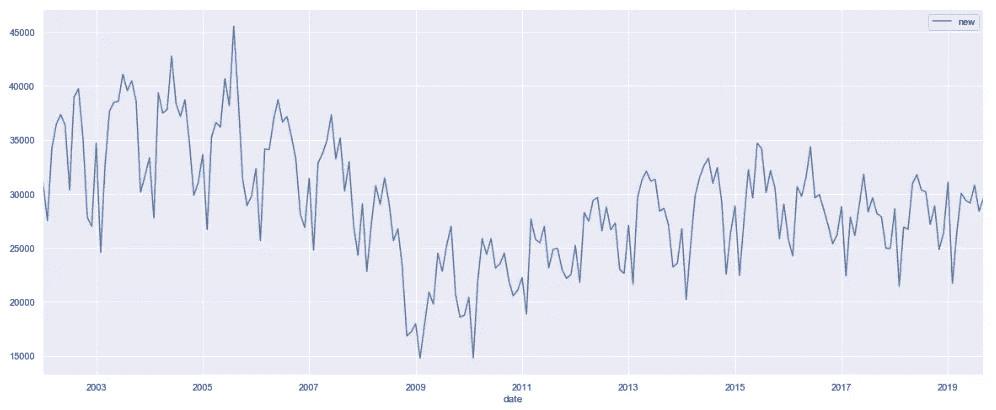
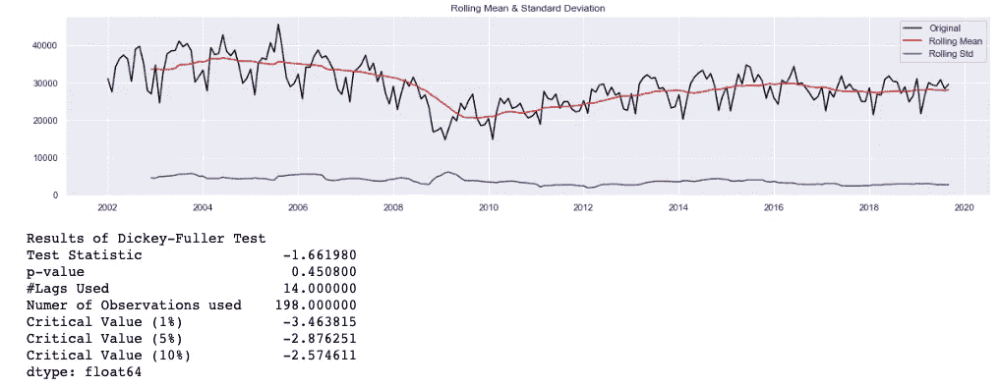
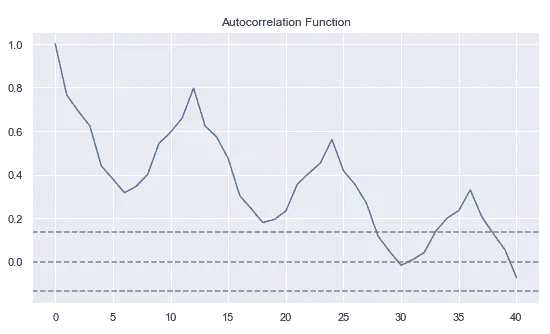
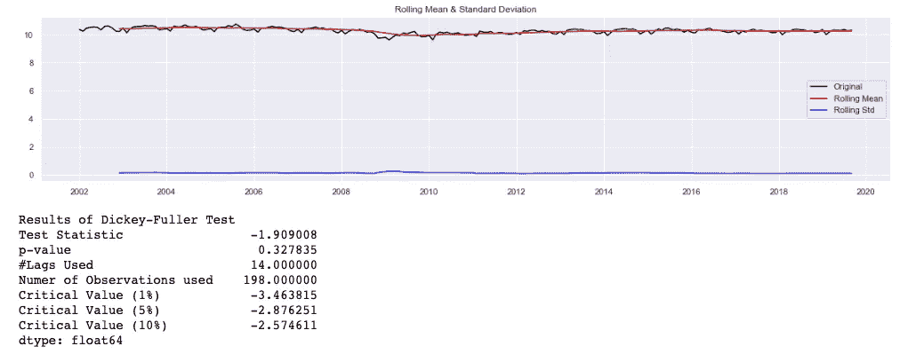
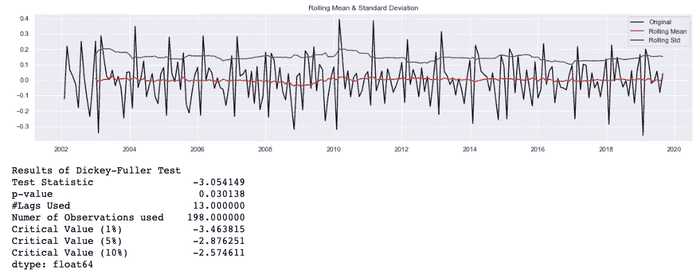
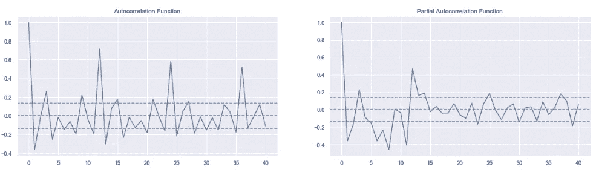
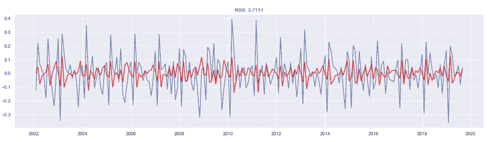
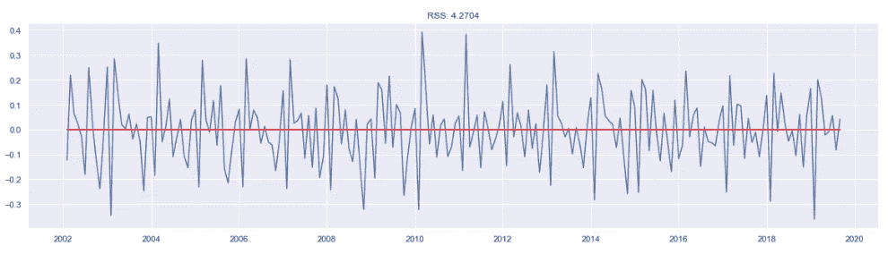
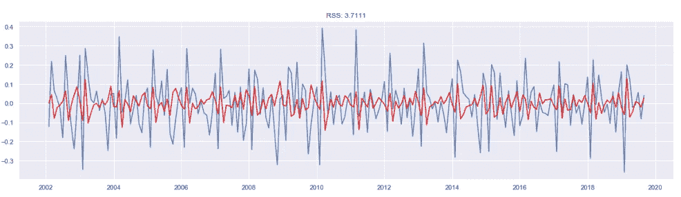
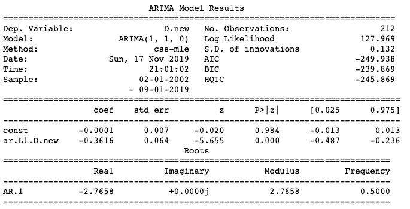

# 基于 ARIMA 的时间序列产品类别预测

> 原文：<https://towardsdatascience.com/product-category-prediction-with-time-series-using-arima-58dc4d3a7ae2?source=collection_archive---------27----------------------->

假设我们手头有现有数据，可以告诉我们某一特定产品类别的市场现状。现在，我们能够看到趋势和运动，以及每个时期的重大事件，这些事件对事件的积极或消极转变产生了影响。

下面的图表显示了美国销售的新车总数。从 2002 年到 2019 年。从这张简单的图表中，我们可以看到，由于 2008 年 3 月开始的金融危机，这一趋势从 2008 年开始逐渐下降，并在 2009 年达到最低点。

# of new cars sold in the U.S. from 2002–2019

如果我们想进一步分析汽车类别，预测消费者是否会像过去一样继续购买新车，该怎么办？这就是我们可以用 ARIMA 来回答这类问题的地方。

**自回归综合移动平均线**或 ARIMA，最简单的说法是使用自己的历史数据告知未来结果的方法，条件是数据是稳定的，即不受趋势、周期性、季节性或不规则性的影响。为什么？因为 ARIMA 研究的时间序列的性质并不依赖于观察时间。预测是困难的，因为时间序列本质上是不确定的。在我们上面的例子中，2008 年的金融危机影响了新车销售总量，这可以被视为一种不规则的变化，不会在一段时间内以特定的模式重复出现——这不是静态的。如果时间序列是平稳的，我们可以通过预测其统计特性，如均值、方差、自相关，使我们的问题变得简单一点。

ARIMA 由建模中的三个部分组成:

**AR( *p* )模型(自回归)** =作为预测因子的自身滞后值或

***I(d)(积分)** =平稳性所需的非季节性差异数，也称为 ***差异度****

***MA( *q* )模型(移动平均)** =过去预测误差的类回归模型，顺序称为 ***顺序的移动平均****

*如果时间序列是平稳的，那么预测某个时间 **𝑡** 的𝑦值的 ARIMA 方程为 *AR + I + MA* 表示为:*

*预测为 **𝑦** 时 **𝘵** = **常数** +加权求和的最后一个**𝑝**𝑦值+加权求和的最后一个 ***q*** 预测误差。*

*相同的等式用希腊字母正式表示为:*

***ŷ_𝑡= 𝑢+*𝜑_₁𝑦_*𝑡-*₁+…+𝜑_𝑝𝑦_*𝑡-𝑝-𝜃*_₁𝑒_*𝑡-*̿-…-*_***

*其中𝑢为常数， *𝜑_𝑘* 为滞后 *𝑘时的 AR 系数，* 𝜃_ *𝑘* 为滞后 *𝑘* 时的 MA 系数，而 *𝑒_* 𝑡- *是在时间段- *时产生的预测误差***

*在应用程序中，首先，我们必须确定数据是否稳定，这可以通过使用 [**增强的 Dickey-Fuller 测试**](https://en.wikipedia.org/wiki/Augmented_Dickey–Fuller_test) **来实现。**在测试中，我们想看看我们是否能拒绝陈述时间序列不是平稳的零假设(𝐻₀)。第二，可以用滚动均值和滚动标准差进行数学变换，直观地检验时间序列是否平稳。我们可以创建一个函数供将来使用。请注意，我们使用 12 年(或 1 年)作为数据评估的窗口期。*

*我们通过调用新创建的函数*test _ stationary()*来查看原始时间序列*

**

*A Dickey-Fuller Test on the original time-series*

*不出所料，p 值高于 5%，表明我们不能拒绝零假设，ADF 检验统计高于所有临界值，因此，结果不显著。请注意，所有临界值都会导致负数，这意味着更强烈地拒绝零假设。*

*另一种方法是绘制自相关图来可视化时间序列的平稳性——如果时间是非平稳的，我们将看到非常缓慢的衰减。*

**

*ACF of original non-stationary time series shows slow decay*

## *数据转换实现静止*

*由于大多数统计预测方法都是基于这样一个假设，即时间序列在经过数学变换后可以近似平稳，因此我们将尝试几种类型的变换，然后用 ADF 测试来检验时间序列是否已经平稳。*

*我们可以使用 numpy 包中的对数标度变换，将时间序列变换成对数标度。*

**

*A Dickey-Fuller Test on the logarithmic scale of ts.*

*从对数标度变换中，我们可以观察到滚动平均值和滚动标准差的更平滑趋势，这表明时间序列正在接近平稳性。然而，p 值仍然大于 5%,测试统计仍然大于所有临界值，因此我们将继续进一步区分转换后的数据。*

**

*A Dickey-Fuller Test on the differenced logarithmic scale of ts.*

*现在我们可以看到 ADF 检验统计量小于 10%和 5%的临界值，表明时间序列是平稳的，分别有 90%和 95%的置信度。为了获得更好的 ADF 检验统计，我们可以尝试其他类型的数学变换。但为了简单起见，我们将继续以对数标度为例。*

## *选择型号规格*

*这里，当选择 *p* 和 *q* 时，最常见的方法是通过**自相关函数(ACF)** 和**偏自相关函数(PACF)** 将其可视化。ACF 测量时间序列和其自身滞后版本之间的相似性。请注意，系数也捕捉二手影响。这意味着 *t* 捕捉滞后系列的直接和间接方式； *t-1* ， *t-2* 影响原。如果我们只想知道时间序列和它的滞后版本之间的直接关系，那么我们使用 PACF 来确定这种影响。*

*我们现在将使用 ACF 和 PACF 图来查看模型规格。*

**

*从 ACF 测试中，我们注意到在 h = 12，24，36 处有多个重复出现的峰值，这是由于每年的循环效应。但是我们不会考虑季节性因素。对于 PACF 检验，我们将尝试用 AR(1)，MA(0)和 ARIMA(1，1，0)来拟合模型，以解释滞后数，从而解释时间序列中的自相关模式。*

*请注意，理论上，实际情况是两个(p，q)中的一个应该是非零的，并且对于业务应用程序，两者之和通常小于 3。还建议避免使用既有 AR 系数又有 MA 系数的混合模型，除非您正在处理来自物理或工程应用程序的数据。最后但同样重要的是，经验法则是你应该总是得到一个更简单的模型。有关于[规格选择](https://people.duke.edu/~rnau/411arim3.htm#unitroot)的指南，其中 AR 和 MA 参数考虑单位根。*

**

*AR(1) Model*

**

*MA(0)*

*最后，我们使用 ARIMA(1，1，0)将 AR + I + MA 与 d = 1 组合起来。*

**

*ARIMA(1,1,0)*

**

*Summary of ARIMA(1,1,0)*

*我们还可以参考[赤池信息准则](https://en.wikipedia.org/wiki/Akaike_information_criterion) (AIC)来衡量我们比较不同模型时的拟合优度——AIC 数越小，模型拟合越好。最后，我们使用 *plot_predict()* 方法，根据实际时间序列来绘制我们的预测。*

**

*ARIMA forecast vs actual*

## *概括起来*

1.  *在本例中，我们只尝试了对数标度的时间序列转换。在实际应用中，可以使用指数衰减或时移等其他算术运算来平稳化时间序列，这可能会产生更好的 ADF 测试统计。*
2.  *其次，我们肯定应该尝试使用不同的参数来降低每个模型的 RSS 分数——这可以通过拟合不同的 p 和 q 值来实现。*
3.  *最后，我们所做的测试没有考虑季节性，在我们的时间序列中，我们看到每年有 12 个月的周期性影响，这可以通过季节性 ARIMA 来解决。*

*参考资料:*

1.  *[http://people . cs . Pitt . edu/~ Milos/courses/cs 3750/lections/class 16 . pdf](http://people.cs.pitt.edu/~milos/courses/cs3750/lectures/class16.pdf)*
2.  *https://otexts.com/fpp2/arima.html*
3.  *[http://people . duke . edu/% 7 ernau/Notes _ on _ non seasonal _ ARIMA _ models-Robert _ nau . pdf](http://people.duke.edu/%7Ernau/Notes_on_nonseasonal_ARIMA_models--Robert_Nau.pdf)*
4.  *[https://people.duke.edu/~rnau/411arim3.htm#unitroot](https://people.duke.edu/~rnau/411arim3.htm#unitroot)*