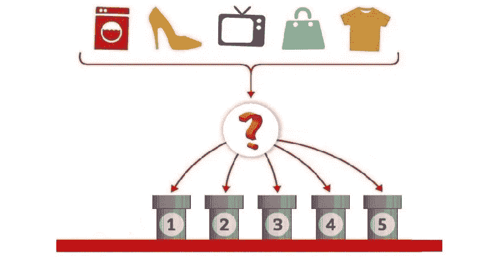
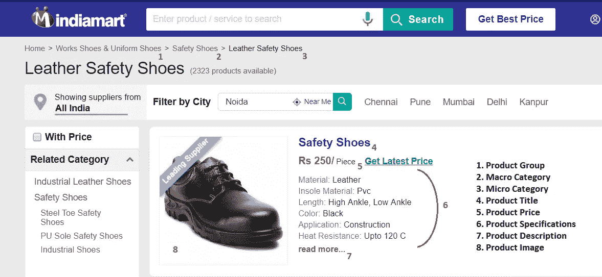

# 使用机器学习的产品分类-第一部分

> 原文：<https://towardsdatascience.com/product-classification-using-machine-learning-part-i-5a1cd0c2caf2?source=collection_archive---------7----------------------->

> *根据文本信息将产品分为最相关的类别。*

# 机器学习中从“M”到“L”

如果你考虑一下英语字母表，字母 M 和 L 是连续的，从一个字母移动到另一个字母似乎是小菜一碟。然而，机器学习(ML)可能并非如此。我们对后者的了解可能是不断扩张的沙漠中逐渐消退的海市蜃楼。在这里，我将探索分类问题，以弥补“M”和“L”之间的差距。



# 我的问题，我的方式

有一点经常被重申，那就是彻底理解你的问题陈述的重要性。眼前的问题是将产品分类到最合适的类别或桶中。 [Indiamart](https://dir.indiamart.com/) ，一个在线市场，总是需要相似的产品( [*此处阅读*](/classifying-products-as-banned-or-approved-using-text-mining-5b48d2eb1544) *关于 Indiamart* 上的产品)在它的平台上被列在一个标题下，这应该代表它们的特征，任何新产品都应该被分配到最合适的标题下。(*，其将被进一步称为‘类别’*)。

> 例如，棕色皮革安全手套应列在皮革安全手套(微观类别)和安全手套(宏观类别)下。这些宏观和微观类别列在一个产品组下。我们永远不会希望用户访问我们的皮手套页面，发现羊毛手套。我们只是想确保产品映射的正确性。

# 宏观和微观分类

这个问题需要在两个层面上进行分类——确定宏观和微观类别。对我们来说，每个微观范畴都与某个宏观范畴相关。为了理解我们如何定义宏观和微观类别，让我们以手机为例。在这里，三星、苹果、Lava 和索尼手机形成了一个宏观类别手机的微观类别。所以如果，我拿到一个像三星 Note 这样的 4 GB RAM，64 GB 内存的产品，必须分配给三星手机(微单类)和手机(微单类)。



A Product At Indiamart. **The Product Title, Specifications, and Description have been used to train the model.** Also, note the product’s mapping in macro and micro categories.

产品组就像是相关宏类别的保护伞。我们当前的架构正确地认识到这一更广泛的产品范围，因此我们在这里的主要关注点将是产品组内宏观和微观类别的识别。

# 当瀑布激发你解决问题的方法时

我是一个狂热的自然爱好者，水让我有了许多发现，但正如人们所说的那样，“你不能仅仅站着凝视就穿越海洋”。谢谢，维克拉姆·瓦什尼帮助我渡过难关。在我们的瀑布方法中，有两个独立的模型——一个用于宏观类别，另一个用于微观类别；两者都是按顺序调用的。我们试图通过两步预测结果来降低树:首先，预测一个宏类别，然后预测一个微类别(仅在预测的宏类别内)。

> 这就是说，对于一个产品，一旦你知道它是一个空调(宏观类别)，那么我们将微观类别(分体式空调、窗式空调、盒式空调等)的预测限制在宏观类别内。所以，我不会在其他电器下寻找结果。

# 解码分类器

我们使用 FastText 来训练我们的模型。F [astText](http://fasttext.cc/) 是来自**脸书**的开源库，用于高效学习单词表示和句子分类。

*如果你是 FastText 的新手，在运行它时遇到问题，请参考这个* [*视频教程*](https://youtu.be/nXp5aWWoWeY) *。*

我们使用的是一个基于监督文本的分类器，它是使用以前标记的产品训练的。培训文件包含产品，每个产品在单独的文件中都有宏观和微观类别的适当标签。

***宏类别的培训文件:***

> __label__ 平地机平地机推土机卡特彼勒 140k2
> 
> _label_ 挖掘机 jcb js140 挖掘机

***培训文件为微类别:***

> _ _ label _ _ JCB _ 挖掘机 jcb js140 挖掘机
> 
> __label__ 卡特彼勒 _ 平地机平地机推土机卡特彼勒 140k2

**训练命令**

```
imart@DESKTOP-CFGCP74 ~                                                                                                                                                 
$ fastText/fasttext.exe supervised -input ~/Training_File.txt -output ~/model.bin -lr 0.8 -minn 3 -wordNgrams 1 -thread 4 -loss hs;
```

针对每个宏观和微观类别标签，对数千种产品进行机器训练，以便建立关系。下次我们向它提供产品的文本信息时，它应该能够解释产品的宏观和微观类别。

**测试宏类别的模型**

```
imart@DESKTOP-CFGCP74 ~                                                                                                                                                 
$ fastText/fasttext.exe predict- prob ~/model.bin - 1 ;
**used mahindra earthmaster**
__label__**Backhoe_Loader** 0.9862
```

**测试微观类别的模型**

```
$ fastText/fasttext.exe predict-prob /cygdrive/c/Users/imart/Desktop/Bin\ Files/Backh.bin - 2                                                                           
**used mahindra earthmaster**                                                                                                                                               
__label__**Mahindra_Backhoe_Loader** 0.910756 __label__**Used_Backhoe_Loaders** 0.0892926
```

**精度和召回**

```
$ fastText/fasttext.exe -test ~/model.bin ~/Testing_File.txt ;@p : 0.952
@r : 0.952
```

*注意:对于产品“二手 Mahindra Earthmaster ”,我们得到的宏观类别预测为“反铲装载机”,微观类别预测为“Mahindra 反铲装载机”和“二手反铲装载机”,这是正确的。* ***目前，当结果与对相同产品进行分类的主题专家进行比较时，该模型运行的准确率为 93.70%。***

# 数据清理

这是非常必要的，这里我们将整个数据转换成小写，删除 xml，html 标签，如

等。、特殊符号和一些与用例相关的停用词。

# 超参数调谐

只有当弦被微调时，你才能得到完美的音乐，同样，机器的输出取决于用于训练模型的超参数。**我们对 320 多个模型进行了训练和测试，以达到学习率、纪元、单词 n 元语法的最佳组合**。这将在另一篇文章中详细介绍。

# 越多越开心

建议的一件事是获取尽可能多的训练数据。更大数量的标签将提高结果的准确性。为了避免预测偏差，我们还求助于标签加载。

# 这不是结束

正如丘吉尔所说——“这不是终点。这甚至不是结束的开始。但这也许是开始的结束。”到目前为止，我只探索了产品的一个方面——它包含的文本。图像、价格和位置呢？视觉可能会给这个分类问题增加另一个维度。

> 我们正从基于单词的向量转向句子嵌入，从文本挖掘转向图像分类——谷歌的 BERT，GUSE 脸书的《InferSent》和《ResNeXt》可能会成为一线希望。

我将在后续文章中介绍如何应用基于图像的分类器来解决同样的问题。此外，我将分享我们如何尝试将宏观和微观类别的独立模型整合成一个单一模型。

[*维克拉姆·瓦什尼*](https://medium.com/u/47a096395dd5?source=post_page-----5a1cd0c2caf2--------------------------------) *，* [*阿尤什·古普塔*](https://medium.com/u/f3499cb43377?source=post_page-----5a1cd0c2caf2--------------------------------) *，* [*阿苏托什·辛格*](https://medium.com/u/17b024118255?source=post_page-----5a1cd0c2caf2--------------------------------)*——感谢你对这个项目*的持续贡献，感谢你鼓励我写这篇文章。

*感谢整个品类团队一直以来的支持。*