# 电子商务中的图像分类第一部分

> 原文：<https://towardsdatascience.com/product-image-classification-with-deep-learning-part-i-5bc4e8dccf41?source=collection_archive---------11----------------------->


This eye-catching image becomes all the more enchanting when you get to know that our brain processes visuals **60,000** times faster than text and retains **80** percent of what we see versus just **20** percent of what we read.

# 当图像成为故事讲述者

图像通常承担着讲述故事和表达强大思想的角色，就像他们说的那样“一张图片胜过千言万语”。图像讲述思想的能力吸引了人类，由于人类大脑的一半直接或间接用于视觉，视觉成为我们理解周围世界的主要感觉。

在本文中，我将解释我们如何使用图像来解决最流行的商业问题之一，即产品分类。

# **圣杯**

像 [Indiamart](https://dir.indiamart.com/) 这样的大型在线市场有数以千计的宏类别，用于列出各种产品。产品必须被映射到平台上最合适的微观类别下。*【关于* ***宏观范畴*** *和* ***微观范畴*** *的定义请参考这篇值得称道的* [*帖子*](https://medium.com/@mukeshkumar_561/product-classification-using-machine-learning-part-i-5a1cd0c2caf2) *的一节:“我的问题，我的方式”]*

**这篇文章的目标是建立直觉和理解，如何训练神经网络来使用产品的图像识别产品的微观类别。**

> 例如，在宏观类别*‘皮革安全手套’，*中可以有各种微观类别，如*工业皮革手套、皮革焊接手套、铬革手套等。*我们打算对我们的产品进行分类，使*工业* *皮革* *安全手套*图片始终归入*工业* *皮革* *安全手套*微型类别*。*同样，一个*工作靴*的图像总是预测一个微观类别*安全工作靴*，其中其宏观类别是“*安全靴*”。

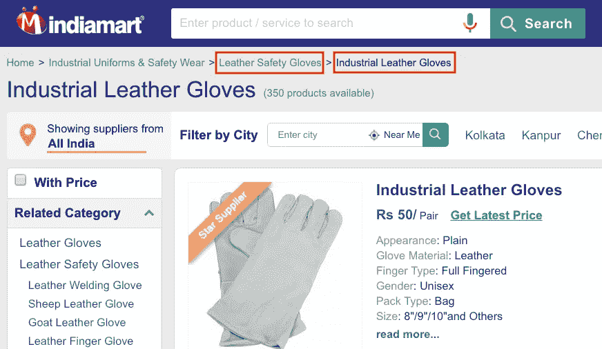

For an Industrial Leather Glove product, ‘Leather Safety Gloves’ *is a* ***macrocategory*** *for which the* ***microcategory*** *is ‘Industrial Leather Gloves’*

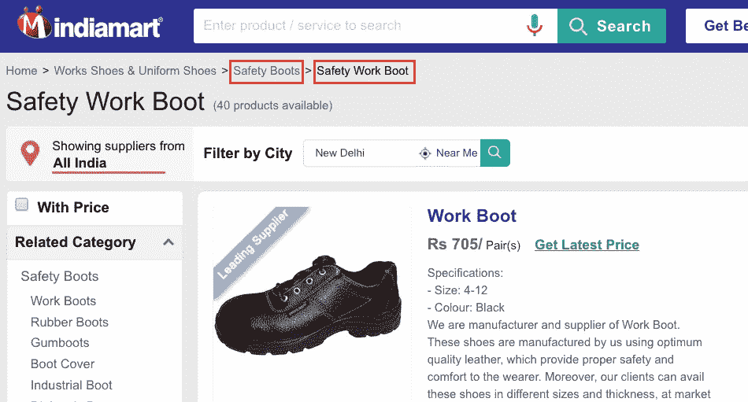

For a Work Boot product, ‘Safety Boots’ *is the* ***macro category*** *and the micro category**here**is ‘Safety Work Boot’*

现在让我们看看图像分类背后使用的概念。如果您想直接跳到实现，请随意跳过' ***引擎盖下有什么？-*-**部分技术基础知识。

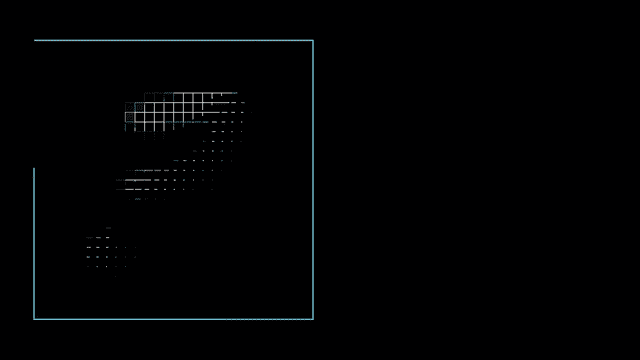

Predicting the number written inside the image would have become comically trivial to dauntingly difficult for a machine using only its pixel information, without the concept of Machine Learning and Neural Network!

# 引擎盖下是什么？-技术基础

我们将使用*卷积神经网络(CNN)* 使用[监督学习](https://en.wikipedia.org/wiki/Supervised_learning)对产品图像进行分类，并在 *PyTorch(* 这是一个由脸书开发的人工智能框架)上运行。为此，我们采用了脸书的 **ResNet** 模型，该模型根据来自 [ImageNet 数据库](http://www.image-net.org/about-overview)的 100 多万张图像进行了预训练。

## 什么是预训练模型？

预先训练的模型先前已经在数据集上训练过，并且包含代表它被训练的数据集的**特征**的权重。学习到的特征通常可以转移到不同的数据中。

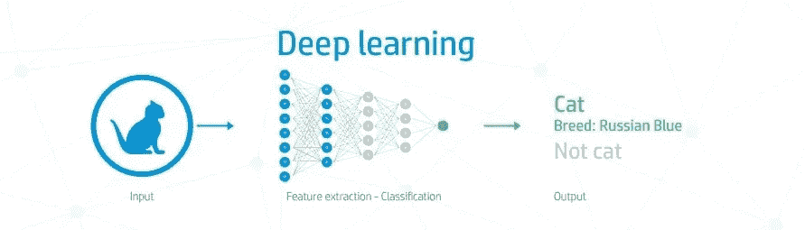

## 什么是深度学习？

深度学习是机器学习的一个子集，它通常有不止一个隐藏层。深度学习最重要的一点是，它可以在有大量(通常是有标签的)数据的地方取得非常好的结果。

> 在数学中，卷积是对两个函数进行数学运算以产生第三个函数，该函数表示一个函数的形状如何被另一个函数修改。

**卷积神经网络** **(CNN** )是受构成动物大脑的[生物神经网络](https://en.wikipedia.org/wiki/Biological_neural_network)启发的计算系统。这类系统 ***学习*** *(逐步提高自己的能力)*通过考虑实例来做任务，一般不需要针对任务的编程。例如，他们可能会学习识别包含猫的图像，分析已被手动标记为“猫”或“没有猫”的示例图像，并使用分析结果来识别其他图像中的猫。**标记**通常采用一组未标记的数据，并用有意义的信息性标记来增加每一段未标记的数据。

*残差学习试图解决更深层次的神经网络训练的复杂性及其随深度的饱和精度的问题*。

**什么是剩余学习？**

在一般的 CNN 中，几个层被堆叠起来，并被训练来完成手头的任务。网络在其层的末端学习几个低/中/高级特征。在残差学习中，我们不是试图学习一些特征，而是试图学习一些残差。

> *残差可以简单理解为学习到的特征减去该层的输入*的减法。

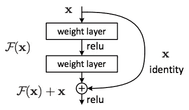

Residual Learning: A building block

ResNet 通过将第 n 层的输入直接连接到某个第(n+x)层来实现这一点。使用 **ReLU** (ReLU 代表**整流线性单元**，是一种激活功能)。

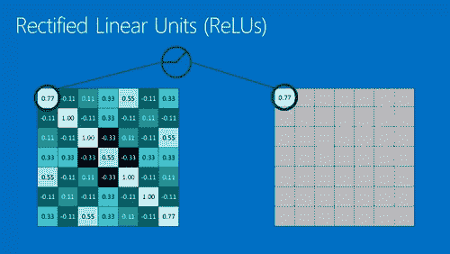

A ‘Rectified’ Linear Unit substitutes everything dissimilar (negative value) with zero. So by the end, we are left with only a similar looking image.

如果您不确定在您的网络中使用什么激活功能，ReLU 通常是一个不错的首选。为什么？请阅读[这篇](https://www.tinymind.com/learn/terms/relu)了解更多 ReLU。

ResNet34 是一个 34 层深度剩余网络。其他型号如 ResNet50、ResNet101 和 ResNet152 也有售。

# 系统需求

从脸书的 [Github](https://github.com/facebook/fb.resnet.torch) 链接下载或克隆 ResNet 模型。

在 [Ubuntu 14.04+](http://www.ubuntu.com/) 上安装 Torch ResNet 依赖项:

*   在装有 **CUDA GPU** 的机器上安装[焊炬](http://torch.ch/docs/getting-started.html)(计算能力为**3.5 或以上**的 NVIDIA GPU)
*   安装 [cuDNN v4 或 v5](https://developer.nvidia.com/cudnn) 和焊枪 [cuDNN 固定器](https://github.com/soumith/cudnn.torch/tree/R4)

参见[安装说明](https://github.com/facebook/fb.resnet.torch/blob/master/INSTALL.md)获取分步指南。

# 我们开始吧！

**先决条件:**假设对 Python & Linux 命令有一个基本的了解，以便继续学习。

## ***我们如何为自定义数据集采用 RESNET？***

## **数据收集-**

了解数据的第一步可以让你达到前所未有的高度，达到预期的预测结果的准确性。我们确定了自定义标签所需的属性，以便与训练好的模型一起使用，并将**微类别 ID** 、**产品 ID、**和**产品图片的 URL** 提取为 tsv(制表符分隔值)格式。

我们把图片从网址下载到一个文件夹结构里，组织成-

标签名称被保存为单独的文件夹名称，每个名称都有其相关的图像。这整个结构被封装到另一个文件夹中，该文件夹应该被命名为' **train** '。同样，另一个名为“ **val** ”的文件夹(即包含产品图像的标签名称文件夹)应保存在与“列车”相同的位置。*【该文件夹组织标准由脸书给出，是其模型工作所必需的】*

在我们的场景中，该结构应该类似于:

```
train/<Micro_category_ID1>/<Product_ID1.jpg>
train/<Micro_category_ID2>/<Product_ID1.jpg>
val/<Micro_category_ID1>/<Product_ID1.jpg>
val/<Micro_category_ID2>/<Product_ID1.jpg>
```

为了实现这一点，我们使用了下面的 Linux 命令，该命令应该在终端中的路径“train”处触发:

```
while read -r mcat_id product_id url; do if [ ! -d "${mcat_id}" ]; then mkdir -p ${mcat_id}; fi; cd $mcat_id; wget -O $product_id $url; cd ..; done < tsvfilename
```

该命令从 tsv 文件中读取微类别 id、产品 id 和图像 URL，并在相应的微类别文件夹路径中迭代地从 URL 中下载图像，将其重命名为产品 ID(以便于以后识别)。

瞧！我们已经准备好了训练数据。等等……什么？不，它仍然不在那里！

下面是获得想要的结果的最重要的步骤之一。

## 数据清理-

我们希望准备一个同质的输入数据集，以避免模型在训练时偏向某些微类别 id 的图像，从而总是预测这些微类别。

我们设计了一个 shell 脚本，将所有图像转换成。jpeg(无论是名称还是格式，不包括。png，。gif 等。)，删除下载的错误文件，删除重复文件，并将所有图像的尺寸缩小到 224 X 224 px(如果宽度或高度大于 224 px)。

我们选择图像尺寸大小为 224 X 224 px，因为观察到此设置的*顶部 1* 和*顶部 5* 误差较小。欲了解更多详情，请查看[和](https://datascience.stackexchange.com/questions/16601/reason-for-square-images-for-deep-learning)。

> 在 **top1** score 中，您检查预测的顶级类别(具有最高概率的类别)是否与目标标签相同。
> 
> 在 **top5** 得分的情况下，您检查目标标签是否是您的前 5 个预测之一(具有最高概率的 5 个预测)。

## 标签加载-

顾名思义，这是一个处理标签上的数据负载的过程，使得每个标签的图像计数达到一个可比较的水平。

为了向模型提供涵盖每天从用户处收到的各种产品图像的数据，我们对现有数据集执行了**图像增强**。

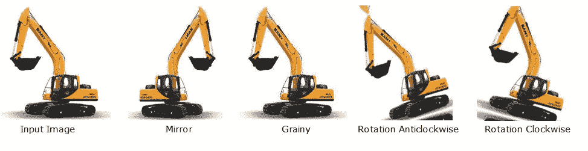

Here, the input image has been augmented in various forms (by introducing noise and inclination) to increase scarcely available training data set.

下面的 python 脚本用于镜像每张图像，顺时针、逆时针旋转它们，还为每张图像创建了粒状图像。

我们还必须确保一些微类别 id 最终不会比其他微类别 id 具有更大的权重，从而使模型产生偏差，预测不正确的结果。这可能是这样的情况，一些微类别比另一个有更多的列出的产品(有图片)。

> 例如，在宏观类别“充气家具”中，微观类别“充气沙发”比微观类别“充气沙发”具有更多带有图像的产品。


我们使用了一个 Python 脚本，它将文件夹 **train** 的微观类别 ID 文件夹中的图像相乘。目前，我们已将倍增系数定为 98 个百分点(即所有单个文件夹的图像计数中的一个图像计数，其中涵盖了总计数的 98%的图像)。

终于可以去训练了！

# 训练模型-

使用从 Github 下载的文件夹下的 ***main.lua*** 文件，即 fb.resnet.torch，用我们自己的数据集训练模型的各层。

```
th ~/fb.resnet.torch/main.lua -nClasses 122 -nEpochs 100 -data ~/imageclassification/train/ -save ~/Desktop/imageclassification_c122e100b30t4g1 -batchSize 30 -nThreads 4 -nGPU 1
```

*   **-nClasses** 是我们的标签数量(即微类别 id)
*   **-数据**是列车文件夹的路径
*   **-save** 是保存所有模型(即. t7 文件)的文件夹路径(在指定的新文件夹(即~ ~/Desktop/image classification _ c 122 e 100 b 10t 4g 1)中的每个时期结束时会生成一个模型，其中每个模型都在其之前的模型数据之上进行训练。)
*   **-batchSize** 是每个历元中用于训练的图像数量
*   - **nEpochs** 是我们希望我们的模型运行的迭代次数(我们还在每个时期的末尾获得 top1 和 top5 误差，用于最佳模型的分析)
*   **-nThreads** 是 GPU 使用的线程数
*   - **nGPU** 是我们将用于培训的 GPU 数量

另一个参数是**-深度**(此处未使用)，因此，默认情况下，*我们有一个 ResNet-34 模型*。如果它是 50，我们将有一个 ResNet-50 模型。

根据您的便利和资源可用性，在培训时可以使用各种其他参数。可以通过以下方式探索它们:

```
th main.lua --help
```

好的！让我们发出命令！

**搞定！**

根据您的训练数据集大小和系统速度，您应该有**耐心**并为您的学生提供**充足的** **时间**来学好:)

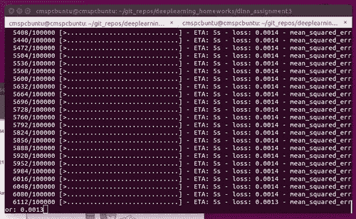

Training…Training……Training!!!

**main.lua** 自动在-save 文件夹中并行生成两个额外的模型，即 **model_best.t7** 和 **latest.t7** 。

> model_best.t7 是在具有最少 top1 和 top5 错误的纪元上创建的模型的副本。
> 
> latest.t7 是完全训练的模型，即由最后一个时期创建的模型。

这两种模式并不总是相同的。在我们的例子中，观察到最好的模型是在纪元 99 生成的，但是最新的模型是来自纪元 100 的模型。所以，**我们使用了 model_best.t7 进行测试。**

# 测试模型-

**classify.lua** (在 fb.resnet.torch/pretrained/文件夹中)用于从 model_best.t7 获取所有测试图像的前 5 个预测。

这里需要注意的重要一点是， *classify.lua 从 imagenet.lua* (在同一个文件夹中，即“pretrained”)中导出预测标签。

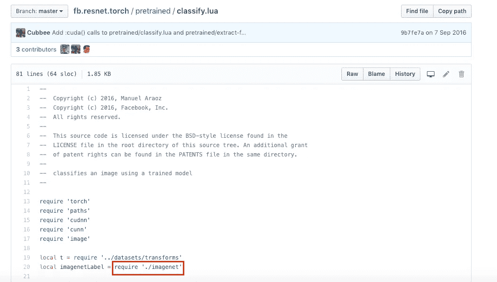

所以，我们替换 imagenet.lua 中的旧标签(鸟类、动物等的名称。来自 ImageNet 数据库)与我们自己的标签值，即微类别 id。

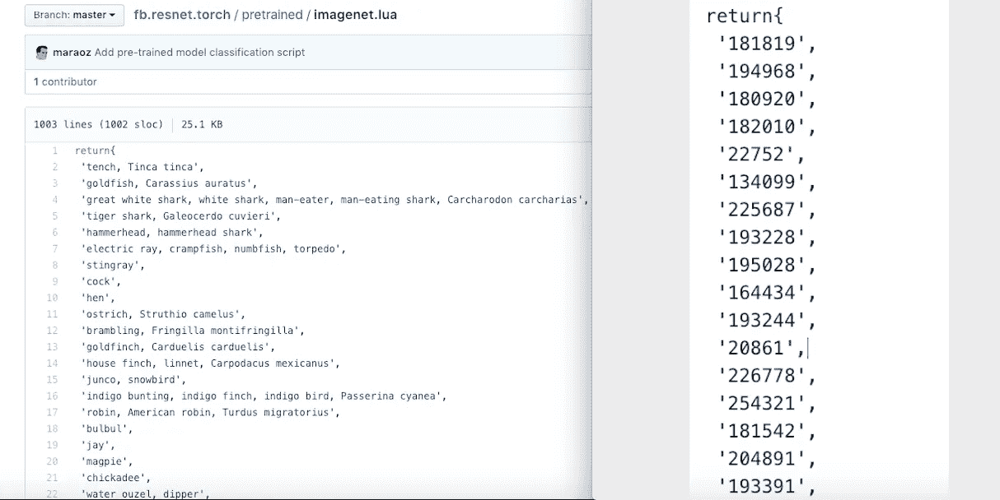

The left image shows the original labels in the **imagenet.lua** file. The micro category ID’s which are used as our labels are being substituted in the same file as shown in the right picture.

现在，让我们测试我们的最佳模型！

我们从“train”中挑选了一些标签，并将其复制到“val”中，以测试我们训练的模型在相同数据上的准确性。

下面的测试命令输出“val”中每个图像的前 5 个预测结果及其预测概率:

```
for f in ~/imageclassification/val/* ;do ( [ -d $f ] && cd "$f" && echo Entering into $f && th ~/fb.resnet.torch/pretrained/classify_new.lua ~/Desktop/imageclassification_c122e100b30t4g1/model_best.t7 $f/*  >> ~/Desktop/imageclassification_c122e100b30t4g1.txt); done
```

# 余波

通过将创建的文本文件转换成 excel 文件进行分析。

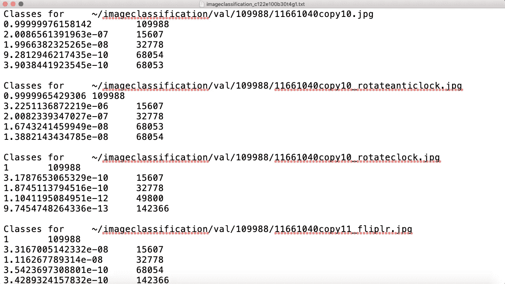

The testing file created by running **classify.lua**

excel 文件将上述预测分成列(使用 R 脚本)用于**原始微类别 ID** 和**产品 ID** (来自图像的本地路径)以及**预测微类别 1、预测微类别 1 的概率**。

通过对预测的和原始的微类别进行匹配检查，我们观察到在 99.28% 的情况下预测为真。*这些是训练模型的案例。*

后来，我们为添加的 70 个**新产品**重复了测试活动(因此，被训练的模型没有更早地学习它们)。

在这种情况下，*高于覆盖 80%数据的 50%模型置信度(概率)阈值，*我们观察到精度为 **95.38%。**

该模型的精度观察为 **1.00** ，灵敏度/召回率观察为 **0.95** 。该结果的混淆矩阵如下所示:

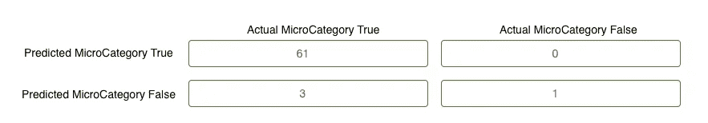

The matrix shows results for 65/70 cases excluding 5 cases where the user uploaded product image was not clear or was irrelevant for this macro category.

# **接下来会发生什么…**

*   我们也正在分析*宏类别*级别的预测准确性。
*   我们打算利用特征提取在不同的微观类别中找到相似的图像。为此，fb.resnet.torch/pretained 文件夹中提供了一个有用的脚本，即 *exract-features.lua* 。
*   我们希望利用图像分类来识别平台上被禁止的*内容。*

本系列的后续文章将会重点介绍上述目标的实现。

我希望这篇文章能帮助您扩展关于使用 Resnet 进行定制业务案例的知识，如果您有任何问题或意见，我很乐意听取您的意见。你可以打*jain.prachi@indiamart.com*找到我

*感谢* [*维克拉姆*](https://medium.com/u/47a096395dd5?source=post_page-----5bc4e8dccf41--------------------------------)*[*阿尤什【古普塔】*](https://medium.com/u/f3499cb43377?source=post_page-----5bc4e8dccf41--------------------------------)*[*阿苏托什*](https://medium.com/u/17b024118255?source=post_page-----5bc4e8dccf41--------------------------------)*[*穆凯什*](https://medium.com/u/1b7897ab0b1c?source=post_page-----5bc4e8dccf41--------------------------------) *的大力支持。****