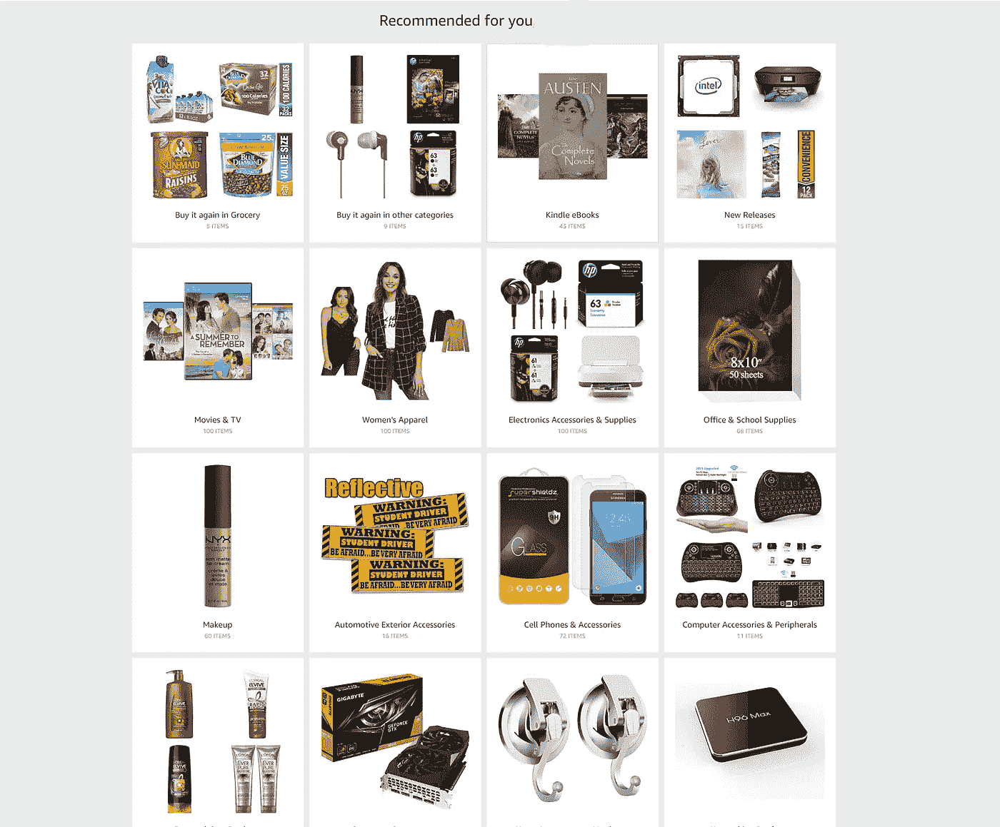

# 使用亚马逊评论数据集的产品推荐器

> 原文：<https://towardsdatascience.com/product-recommender-using-amazon-review-dataset-e69d479d81dd?source=collection_archive---------9----------------------->

## [现实世界中的 DS](https://towardsdatascience.com/data-science-in-the-real-world/home)

[Amazon’s recommender](http://www.amazon.com)

# ***有什么问题？为什么我们需要推荐系统？***

在线商店的目录中有数百万种产品。由于这种“信息过载”，找到合适的产品变得很困难。用户会感到困惑，这使得用户在选择产品时认知超载。

# **什么是推荐系统？**

推荐系统通过推荐可能的产品列表来帮助客户，他们可以很容易地从中选择合适的产品。它们通过提供可比较的成本、功能、交付时间等，使客户了解可供购买的新产品和/或类似产品。

推荐系统已经成为电子商务网站和其他业务(如社交网络、电影/音乐呈现网站)不可或缺的一部分。它们对这些企业的收入有着巨大的影响，也通过减少搜索和筛选过载数据的认知负荷而使用户受益。推荐系统通过理解用户对系统的使用并推荐他们认为有用的项目来个性化用户体验。

你可能遇到过亚马逊推荐系统的例子，如下所示:

[Recommendation based on recently viewed items](http://www.amazon.com)

推荐系统可以用两种不同的方法构建:基于内容的过滤和协同过滤。

## 基于内容的过滤

在基于内容的过滤中，不同产品之间的相似性是基于产品的属性来计算的。例如，在基于内容的书籍推荐系统中，书籍之间的相似性是基于流派、书籍的作者、书籍的出版商、书籍的标题等来计算的。

## 协同过滤

协同过滤通常用于推荐系统。这些技术旨在填充用户-项目关联矩阵的缺失条目。我们将使用协同过滤(CF)方法。

CF 基于这样一个想法，即最好的推荐来自有相似品味的人。换句话说，它使用志同道合者的历史项目评级来预测某人将如何评价某个项目。协同过滤有两个子类别，通常称为基于记忆和基于模型的方法。

**基于内存的**

有两种方法:第一种方法识别用户群，并利用一个特定用户的交互来预测其他相似用户的交互。第二种方法标识已经被用户 A 评级的项目的聚类，并利用它们来预测用户 A 与不同但相似的项目 b 的交互。这些方法通常遇到大型稀疏矩阵的主要问题，因为用户-项目交互的数量对于生成高质量的聚类来说可能太低。

**基于模型的**

这些方法基于机器学习和数据挖掘技术。目标是训练模型能够做出预测。例如，我们可以使用现有的用户-项目交互来训练一个模型，以预测用户可能最喜欢的前 5 个项目。这些方法的一个优点是，与基于记忆的方法等其他方法相比，它们能够向大量用户推荐大量项目。它们有很大的*覆盖范围*，甚至在处理大型稀疏矩阵时也是如此。[10]

## 矩阵分解

一种非常流行的协同过滤方法是矩阵分解。它有一组用户和一组项目，以及一个非常稀疏的矩阵，表示已知的用户对项目的评级。我们希望预测矩阵中缺失的值。为了做到这一点，我们将每个用户和每个项目表示为潜在特征的向量，使得这些向量的点积紧密匹配已知的用户对项目的评级。期望未知的用户对项目的评级也可以通过相应特征向量的点积来近似。我们希望最小化的目标函数的最简单形式是:

这里，r 是已知的用户对项目的评级，x 和 y 是我们试图找到的用户和项目特征向量。由于有许多自由参数，我们需要正则化部分来防止过拟合和数值问题，gamma 是正则化因子。经过一定次数的迭代后，特征向量的变化变得非常小，并且达到收敛。

## 交替最小二乘法

交替最小二乘法(ALS)是矩阵分解的方法之一。当有两个因变量(在我们的例子中，向量 x 和 y)时，它用于非线性回归模型。该算法固定其中一个参数(用户向量 x)，同时通过最小化二次型来最优地求解另一个参数(项目向量 y)。该算法在固定用户向量和更新项目向量以及固定项目向量和更新用户向量之间交替，直到满足收敛标准。

业界有几种有效且可扩展的矩阵分解实现。其中一个突出的例子是由 [Apache Spark](https://spark.apache.org/) 提供的，这是一个分布式数据处理引擎，可以通过 [Elastic Mapreduce](https://aws.amazon.com/emr/) 集群在亚马逊网络服务上轻松运行。

Apache Spark 实现了一个分布式版本的[交替最小二乘法(ALS)和权重正则化](https://spark.apache.org/docs/latest/ml-collaborative-filtering.html)。

**数据采集和选择**

该数据集可在加州大学圣地亚哥分校网站上获得。感谢麦考利教授和他的团队提供了这个数据集。[1][2]该数据集包含亚马逊的产品评论和元数据，包括 1996 年 5 月至 2014 年 7 月期间的 1.428 亿条评论。[1]由于数据的巨大规模，处理所有这些数据是一个相当大的挑战。因此，推荐器是使用 5 个产品类别的数据集构建的，即庭院、草坪和花园、乐器、办公产品、汽车、即时视频。

**数据清理**

为了使数据具有一致的格式，采取的步骤有:

1.  删除不必要的列
2.  删除重复记录
3.  检查无效数据
4.  检查适用列的范围(如等级在 1 到 5 之间)
5.  处理缺失值和异常值

## **探索性数据分析**

了解要素及其数据类型并查看数据分布是一种很好的做法。绘制数据可以洞察数据遵循的模式。“庭院、草坪和花园”产品类别数据集用于绘制图表 1 至 6。

**1)产品总体评分分布**

许多用户给产品打 5 分，然后是 4 分和 3 分，而很少用户给 1 分或 2 分。

**2)历年评分的平均值和中值**

从下图中，我们可以推断出，从 2000 年到 2014 年，产品的平均评级有所下降。从 2000 年到 2014 年，除了 2010 年和 2011 年，产品评级的中位数保持在 5

**3)跨年度评分数量趋势**

用户对亚马逊上的产品给出的评级数量呈上升趋势，这表明越来越多的用户开始使用亚马逊电子商务网站进行在线购物，越来越多的用户开始对 2000 年至 2014 年购买的产品给出反馈。从 2012 年到 2014 年，用户给出的评级数量显著增加。

**4)每个用户的评级分布**

每个用户的收视率分布呈长尾正态分布。花园和庭院数据集中的用户总数是 1685。单个用户给出的最大评分数为 63，单个用户给出的最小评分数为 1。根据目前的数据(截至 2014 年)，用户在亚马逊上平均给出 7.55 分。

**5)按月评级分布**

从下面的方框图中，我们可以说 6 月的收视率最高，其次是 5 月和 7 月。这表明在这三个月里，购买量很大。与此相反，二月显示了用户给出的最低数量的评级，因此可以推断最低销售额可能发生在二月。这是有道理的，因为在夏季，园艺产品的购买量较高。

**6)具有特定评级的亚马逊产品的年度统计**

下图显示，与评级为“4”和“5”的产品相比，评级为“1”、“2”或“3”的产品数量逐年显著减少。

**7)按产品类别划分的亚马逊评分明细**

我使用了来自亚马逊评论数据集的 5 个不同数据集来绘制下图，即“汽车”、“花园和庭院”、“乐器”、“办公室”和“即时视频”。总的来说，“办公类”产品和“即时视频”在这 5 个类别中似乎更受欢迎。在所有五个类别中，好的评级数量(4.5)多于坏的评级数量(1.2)。

# 履行

## 火花设置

我在一台搭载 32 GB 内存英特尔 i5 处理器的 Windows 10 机器上安装了 Spark。

## 火花 MLLib

Apache Spark MLlib 提供的 ALS 实现用于该推荐器。MLlib 是 Apache Spark 的可扩展机器学习库。Spark 擅长迭代计算，使 MLlib 能够快速运行。

Apache Spark 实现了一个分布式版本的[交替最小二乘法(ALS)和权重正则化](https://spark.apache.org/docs/latest/ml-collaborative-filtering.html)。Apache 的 spark.mllib 目前支持基于模型的协同过滤，其中用户和产品由一小组潜在因素描述，这些因素可用于预测缺失的条目。spark.mllib 使用[交替最小二乘(ALS)](http://dl.acm.org/citation.cfm?id=1608614) 算法来学习这些潜在因素。[6] [12]

## 模型选择和超参数

为推荐引擎设置的主要超参数是秩(潜在因素的数量)、λ(正则化参数)和迭代。对于[0.6，0.2，0.2]拆分，等级设置为值[8，10，20]，对于数据集中无拆分，等级设置为[ 2，5，10，20]。使用的λ范围从[0.001 到 50]。对于数据集中的无分割，迭代次数在 5 到 20 之间变化，对于数据集中的[0.6，0.2，0.2]分割，迭代次数设置为 20。

我使用了 spark.mllib 中的 ALS 实现，在那里可以设置和测试这些超参数。

## 模型评估

对于推荐引擎评估，使用不同的指标，如 RMSE、MAE、精确度和召回率。我用 RMSE 进行了模型评估。RMSE 越小，推荐引擎越好。

# 结果

1)数据集分为训练、测试和验证，训练占 60%，测试占 20%，验证占 20%。除了使用分割，我们还在 8-20 的范围内改变等级超参数。一些重要的观察结果如下:

*   我们一直看到这里评估的所有类别的 RMSE 值都很低。
*   令人惊讶的是，办公用品类别的 RMSE 为 0，表明预测是完美的(我们检查了数据中的错误或系统问题，如所有空值或相同值，但没有发现任何问题)。

我们看到度量对秩超参数非常小或没有敏感性。在更大的范围内搜索这个参数将是一个有趣的下一步。

2)在第二种方法中，我们再次对训练、验证和测试集使用 60–20–20 分割。除了使用分割，我们还在 0.001-50 的范围内改变正则化超参数。一些重要的观察结果如下:

a)对于除“办公产品”类别之外的所有产品类别，将正则化参数设置为 0.001 会给出最佳 RMSE。对于“办公产品”类别，0.5 及以上的正则化参数给出最佳 RMSE。

b)除了在办公产品类别的情况下，我们看到度量对正则化超参数非常小或没有敏感性。

# 结论

在本文中，我们讨论了使用 Apache PySpark MLLib 构建的亚马逊评论数据集的五个不同产品类别的产品推荐器，并讨论了作为数据科学项目构建推荐器的主要步骤。

# 后续步骤

我们希望在云中实现这个推荐器。下一步将是为亚马逊评论数据集中剩余的产品类别定制推荐器。这个推荐器利用用户给出的等级。进一步利用用户给出的评论文本会很有意思。

# 确认

我真诚地感谢我的数据科学导师 Ramakrishna Soma 博士对我完成这个项目的指导和鼓励。

# 参考

1) R. He，J. McAuley，沉浮:用一类协同过滤对流行趋势的视觉演变建模， *WWW* ，2016 [pdf](http://cseweb.ucsd.edu/~jmcauley/pdfs/www16a.pdf)

2) J. McAuley，C. Targett，J. Shi，A. van den Hengel，基于图像的风格和替代品推荐，*2015 年*， [pdf](http://cseweb.ucsd.edu/~jmcauley/pdfs/sigir15.pdf)

3)好的、坏的和丑陋的:数据科学工作的 Apache Spark

[https://thenewstack . io/the-good-bad-and-ugly-Apache-spark-for-data-science-work/](https://thenewstack.io/the-good-bad-and-ugly-apache-spark-for-data-science-work/)

4)使用 NumPy 和 Pandas 清理 Pythonic 数据

[https://realpython.com/python-data-cleaning-numpy-pandas/](https://realpython.com/python-data-cleaning-numpy-pandas/)

5)使用 Python 和 Pandas 清理数据:检测缺失值

[https://towards data science . com/data-cleaning-with-python-and-pandas-detecting-missing-values-3e 9 c 6 ebcf 78 b](/data-cleaning-with-python-and-pandas-detecting-missing-values-3e9c6ebcf78b)

6)阿帕奇火花[https://spark.apache.org/](https://spark.apache.org/)

7)阿帕奇 PySpark

[https://spark . Apache . org/docs/0 . 9 . 1/python-programming-guide . html](https://spark.apache.org/docs/0.9.1/python-programming-guide.html)

8)博瓦迪利亚、奥尔特加、埃尔南多阿。Gutiérrez，基于知识的系统中的推荐系统调查，第 46 卷，2013 年 7 月，第 109–132 页

9)什么是协同过滤？

[https://dzone . com/articles/building-sales-recommendation-engine-with-Apache-s](https://dzone.com/articles/building-sales-recommendation-engine-with-apache-s)

10)夏如华， [**推荐者系统**](https://link.springer.com/book/10.1007%2F978-3-319-29659-3) ，一本综合的书

11) Greg Linden，Brent Smith，Jeremy York，[Amazon.com 建议:项目对项目协作过滤，IEEE 互联网计算，第 7 版第 1 号，第 76-80 页，2003 年 1 月](https://dl.acm.org/citation.cfm?id=642471)

12)阿帕奇火花 ALS

[https://spark . Apache . org/docs/2 . 2 . 0/ml-collaborative-filtering . html](https://spark.apache.org/docs/2.2.0/ml-collaborative-filtering.html)

13)使用 Pyspark 对 Movielens 数据集进行简单矩阵分解的示例

[https://medium . com/@ connectwithgosh/simple-matrix-factorization-example-on-the-movie lens-dataset-using-py spark-9b 7 E3 f 567536](https://medium.com/@connectwithghosh/simple-matrix-factorization-example-on-the-movielens-dataset-using-pyspark-9b7e3f567536)