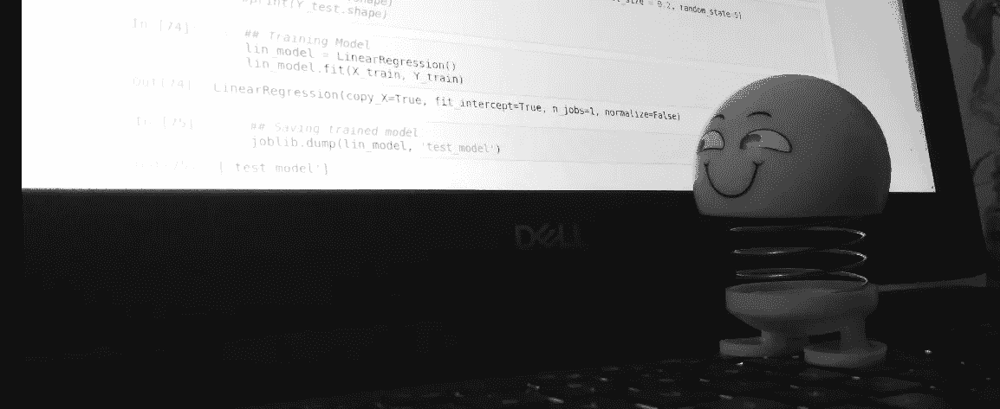
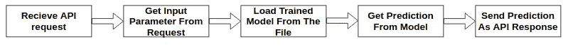
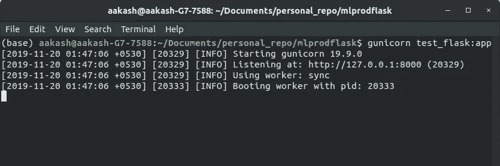
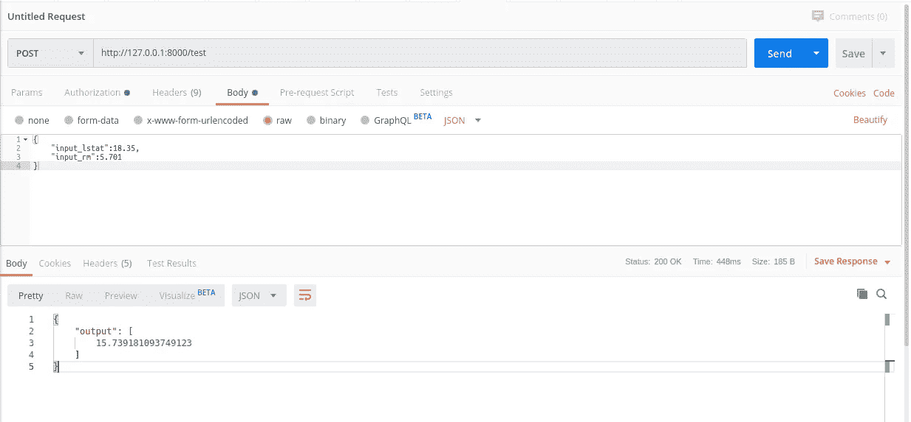
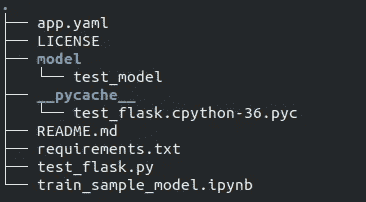
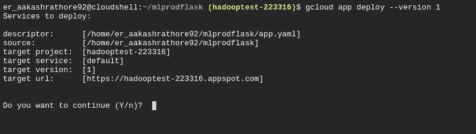
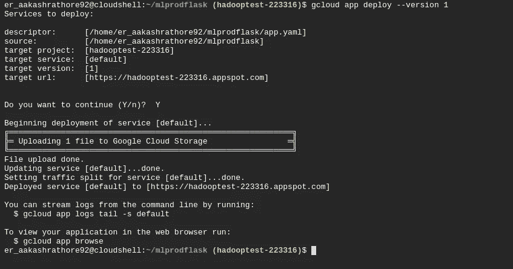
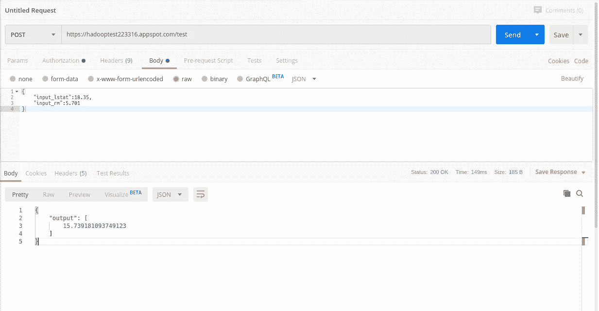

# 使用 Flask 和 Google App Engine 生产您的机器学习模型

> 原文：<https://towardsdatascience.com/productionalize-your-machine-learning-model-using-flask-and-google-app-engine-594896714d69?source=collection_archive---------33----------------------->



这个小教程将帮助你理解一个经过训练的机器学习模型是如何用于生产的。

如今，你可以找到很多学习数据科学和机器学习的教程、MOOCs 和视频。但它们都没有解释当你在 jupyter notebook 或其他 IDE 中的本地系统上训练和优化一个机器学习模型后，你的机器学习模型会发生什么。

在生产环境中，没有人坐在系统前面提供输入并检查您创建的模型的输出。

因此，在本教程中，我们将在 flask 中创建一个简单的 RESTful web 服务，以 API 响应的形式提供我们的机器学习模型输出，然后在谷歌云平台的应用引擎中部署该应用。

> **设置和要求:**

1.  Python 3.6
2.  文字编辑器
3.  谷歌云平台账户
4.  Jupyter 笔记本

另外，请安装下面指定的库:

在 Flask 中创建 RESTful API 所需的库

> **训练一个样本机器学习模型:**

我将在波士顿住房数据集上训练一个样本线性回归模型，这两个数据集都可以在 Scikit-learn 库中找到，最后我将使用 Joblib 将训练好的模型保存在一个文件中。

下面是示例 python 代码:

```
## Importing required Librariesimport pandas as pd
import numpy as np
## for sample dataset
from sklearn.datasets import load_boston
## for splitting data into train and test
from sklearn.model_selection import train_test_split
## LinearRegression model
from sklearn.linear_model import LinearRegression
## For saving trained model as a file
from sklearn.externals import joblib## Getting sample dataset
boston_dataset = load_boston()
boston = pd.DataFrame(boston_dataset.data, columns=boston_dataset.feature_names)
boston['MEDV'] = boston_dataset.target## Preparing variable
X = pd.DataFrame(np.c_[boston['LSTAT'], boston['RM']], columns = ['LSTAT','RM'])
Y = boston['MEDV']## splitting train and test data
X_train, X_test, Y_train, Y_test = train_test_split(X, Y, test_size = 0.2, random_state=5)
#print(X_train.shape)
#print(X_test.shape)
#print(Y_train.shape)
#print(Y_test.shape)## Training Model
lin_model = LinearRegression()
lin_model.fit(X_train, Y_train)## Saving trained model
joblib.dump(lin_model, 'test_model')
```

> **创建一个简单的烧瓶应用程序:**

现在，我们将创建一个简单的 RESTful 应用程序，将我们的模型输出作为 API 响应。我们的应用程序将完成以下任务:



Task flow of our API

下面是 flask 应用程序的代码。你也可以从 GitHub 获得，使用这个[链接](https://github.com/aakashrathore92/mlprodflask/blob/master/test_flask.py)。

```
from flask import Flask,request
from flask_restful import Resource,Api
from sklearn.externals import joblib
import pandas as pdapp=Flask(__name__)
api=Api(app)class Test_index(Resource):
    def post(self):
        loaded_model = joblib.load('./model/test_model')
        test_data=request.get_json()
        input_df=pd.DataFrame([test_data])
        input_df.rename(columns={"input_lstat":'LSTAT',"input_rm":'RM'},inplace=True)
        print(input_df)
        y_train_predict = loaded_model.predict(input_df)
        test_output=pd.DataFrame(y_train_predict,columns={'output'})
        output=test_output.to_dict(orient="list")
        return outputapi.add_resource(Test_index,"/test")
if __name__=='__main__':
    app.run(debug=True)
```

> **测试我们的应用程序(本地或开发环境):**

在编写完我们的应用程序后，我们将在本地或开发环境中进行测试，然后在 Google 云平台中进行生产。

我使用 Gunicorn，一个运行我们应用程序的 WSGI 应用服务器。

只需在终端中打开项目目录并运行以下命令:

```
$ gunicorn test_flask:app
```

我们将获得运行我们的应用程序的本地端口的详细信息:



App running in gunicorn server

让我们用 postman 应用程序测试 API 响应。我们将向应用程序端点发出一个 POST 请求，传递一个包含输入参数的 JSON 请求体，如果没有错误，我们将得到一个包含模型预测的 JSON 对象响应。



Testing app response in Postman

> **在 Google 云平台中将应用部署到生产:**

我们测试的应用程序部署在本地系统中。为了使我们的系统可以全球访问，我们需要将它部署在一些服务器上，这些服务器有一个全球 URL 来评估我们的应用程序。

为此，我们将使用谷歌云平台的应用程序引擎。

*注意:在接下来的步骤之前，请检查您是否拥有 Google Cloud Platform 帐户，以及您的系统中是否安装了 google cloud SDK。你可以在这里* *找到设置 google SDK* [*的细节。*](https://cloud.google.com/sdk/install)

Google App Engine 需要一个名为“app.yaml”的部署描述符文件，用于在 google cloud 中部署我们的应用程序。

下面是部署描述符 app.yaml 文件的内容:

app.yaml 文件的内容

现在创建一个目录结构，如下所示:



Directory Structure for deploying app in production

最后，在终端中打开同一个目录文件夹，使用 below 命令在 Google cloud 中部署 app。

```
$ gcloud app deploy --version 1
```

Google Cloud SDK 将检查适当的权限，然后读取部署描述符文件“app.yaml”并要求确认。键入“Y”。



App deployment in Google app engine

得到确认后，Google cloud SDK 将复制应用程序引擎实例中所有需要的文件，如果没有错误，我们将获得应用程序的全局端点。



Successful deployment in google app engine

在我们的例子中，全局端点 URL 是:*[*https://hadooptest223316.appspot.com*](https://hadooptest-223316.appspot.com)*

> ****测试我们的应用程序(生产环境):****

**让我们再次用 postman 应用程序测试我们的 API 响应。我们将向我们的全局端点 URL 发出 POST 请求:**

****

**Testing the production app in GCP app engine**

**我们再次将所需模型的预测作为 API 响应。**

> ****结论:****

**在本文中，我们看到了机器学习模型是如何在生产中使用的。虽然这是一个非常基本的用例。但这将让你对机器学习模型如何在不同应用程序内的云服务器中投入生产有所了解。**

****我希望你喜欢我的文章，如果你想了解更多关于这个话题的信息，你可以在**[**insta gram**](https://www.instagram.com/_aakash.rathore/)**或**[**LinkedIn**](http://www.linkedin.com/in/aakash-rathore-big-data-engineer)**上关注并留言给我。****