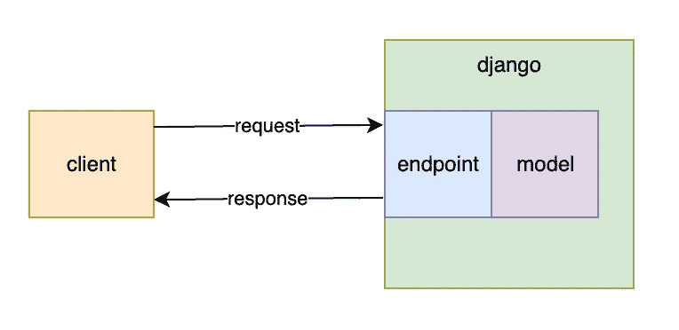
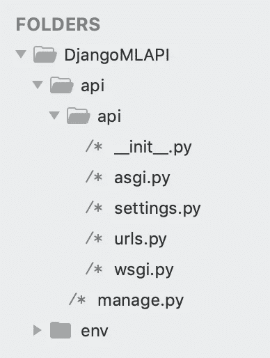
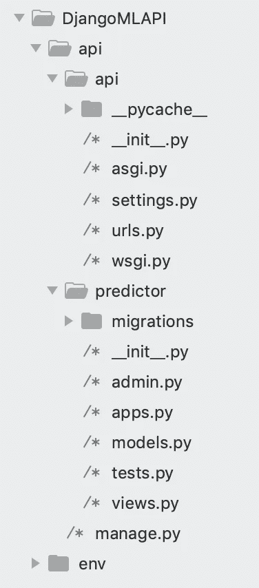

# 用 Django API 生产机器学习模型

> 原文：<https://towardsdatascience.com/productionize-a-machine-learning-model-with-a-django-api-c774cb47698c?source=collection_archive---------1----------------------->

## 关于在 Django API 背后部署机器学习模型的教程。



之前，我写过一篇关于用烧瓶制作 ML 模型的教程。

Flask 的重量更轻，但是如果我们需要更多的功能，django 会附带它。

我构建了一个 API，通过 sklearn 模型进行预测。下面是我一步一步的代码。

**本教程包含 3 个部分:**
1。训练 ML 模型
2。构建 django 应用程序
3。测试 API

# 第 1 部分:训练 ML 模型

第一部分可以在笔记本上完成。

这不是关于机器学习的教程。所以我们将根据虚构的数据训练一个模型。也就是说，它将像你可以训练的任何其他 sklearn 模型一样工作。

我们的模型将根据动物发出的噪音来检测动物是否是狗。

创造虚构的数据！在每个内部列表中，第一个索引是动物的声音，第二个索引是指示动物是否是狗的布尔标签。

```
data = [
    ['woof', 1],
    ['bark', 1],
    ['ruff', 1],
    ['bowwow', 1],
    ['roar', 0],
    ['bah', 0],
    ['meow', 0],
    ['ribbit', 0],
    ['moo', 0],
    ['yip', 0],
    ['pika', 0]
]
```

将上述内容转换为功能和标签列表。

```
X = []
y = []for i in data:
    X.append( i[0] )
    y.append( i[1] )
```

安装矢量器并转换要素。

```
from sklearn.feature_extraction.text import CountVectorizervectorizer = CountVectorizer()
X_vectorized = vectorizer.fit_transform(X)
```

训练线性回归。

```
from sklearn.linear_model import LinearRegression
import numpy as npregressor = LinearRegression()
regressor.fit(X_vectorized, y)
```

现在用几个例子来测试一下。

```
test_feature = vectorizer.transform(['woof'])
prediction = regressor.predict(test_feature)
print(prediction)test_feature = vectorizer.transform(['ribbit'])
prediction = regressor.predict(test_feature)
print(prediction)test_feature = vectorizer.transform(['meoww'])
prediction = regressor.predict(test_feature)
print(prediction)#=> [1.]
#=> [0.]
#=> [0.36363636]
```

完美。

将我们的模型打包成字节流，这样我们就可以将它们存储在应用程序中。

```
import picklepickl = {
    'vectorizer': vectorizer,
    'regressor': regressor
}
pickle.dump( pickl, open( 'models' + ".p", "wb" ) )
```

# 第 2 部分:构建 django 应用程序

打开命令行，进入存储 django 项目的目录。为这个应用程序创建一个目录并`cd`到其中。

```
mkdir DjangoMLAPI && cd DjangoMLAPI
```

创建虚拟环境并安装所需的软件包。

```
python3 -m venv env
source env/bin/activate
pip install django djangorestframework sklearn numpy
```

现在创建一个 django 项目，这个目录包含了我们正在处理的所有代码。如果我们需要的话，这还包括数据库配置和应用程序设置。

虽然“项目”实际上代表了我们正在构建的应用程序，但是 django 使用术语“app”来指代项目中的包。我们的主包将被称为`api`。

```
django-admin startproject api
```



这生成了一堆支持我们的项目所需的样板代码。它看起来像左边的文件树。

外层的`/api`只是一个包含我们所有项目代码的文件夹。

内部的`/api`是我们项目的主要 python 包。

接下来，我们将在项目中生成一个“应用程序”。这将为我们 API 背后的机器学习提供动力。

我们把这个叫做预测器。

```
cd api
python manage.py startapp predictor
```



完整的目录现在看起来像左边的文件树。

我们在这里添加了一个名为`/predictor`的文件夹，里面有很多文件。

我们的用例甚至不需要这些文件中的几个。在本教程的最后，我们将继续删除它们。

`apps.py`是我们定义配置类的地方。这是只运行一次(而不是每次请求都运行)的代码，所以我们最终会将代码放在那里来加载我们的模型。

将包含在每个请求上运行的代码。所以我们把矢量化和回归逻辑放在那里。

现在让我们将这个应用程序添加到`INSTALLED_APPS`中。打开`/api/api/settings.py`，给`INSTALLED_APPS`添加`'predictor'`。它应该如下图所示。

```
INSTALLED_APPS = [
    'django.contrib.admin',
    'django.contrib.auth',
    'django.contrib.contenttypes',
    'django.contrib.sessions',
    'django.contrib.messages',
    'django.contrib.staticfiles',
    'predictor'
]
```

现在在`/predictor`中创建一个名为`/models`的文件夹。把你训练好的腌渍模型移到这个目录。

请注意，在真实的生产环境中，我会将它从应用程序中分离出来(可能使用 S3)，这样我们就不需要在每次更新模型时都重新部署应用程序。但在这里，我们只是将模型包含在应用程序中。

将这一行也添加到设置中。我们将使用它来加载我们的模型。

```
MODELS = os.path.join(BASE_DIR, 'predictor/models')
```

现在编写在应用程序启动时加载我们的模型的代码。在`/api/predictor/apps.py`里面使用这个代码。

```
from django.apps import AppConfig
from django.conf import settings
import os
import pickleclass PredictorConfig(AppConfig): # create path to models
    path = os.path.join(settings.MODELS, 'models.p')

    # load models into separate variables
    # these will be accessible via this class
    with open(path, 'rb') as pickled:
       data = pickle.load(pickled) regressor = data['regressor']
    vectorizer = data['vectorizer']
```

现在创建一个支持我们回归逻辑的视图。打开`/api/predictor/views.py`并用此代码更新。

```
from django.shortcuts import renderfrom .apps import PredictorConfigfrom django.http import JsonResponse
from rest_framework.views import APIViewclass call_model(APIView):
    def get(self,request):
        if request.method == 'GET': # get sound from request
            sound = request.GET.get('sound')

            # vectorize sound
            vector = PredictorConfig.vectorizer.transform([sound]) # predict based on vector
            prediction = PredictorConfig.regressor.predict(vector)[0] # build response
            response = {'dog': prediction} # return response
            return JsonResponse(response)
```

设置路由，将 URL 映射到`/api/api/urls.py`中的视图。

```
from django.urls import path
from predictor import viewsurlpatterns = [
    path('classify/', views.call_model.as_view())
]
```

您可以删除以下文件，因为我们不需要它们。

```
api/predictor/tests.py
api/predictor/models.py
api/predictor/admin.py
```

# 第 3 部分:测试 API

现在启动服务器。

```
python manage.py runserver
```

并发出几个 curl 请求来测试它。你也可以直接在浏览器中输入网址。

```
curl -X GET [http://127.0.0.1:8000/classify/?sound=meow](http://127.0.0.1:8000/classify/?sound=meow)
#=> {"dog": 0.0}curl -X GET [http://127.0.0.1:8000/classify/?sound=woof](http://127.0.0.1:8000/classify/?sound=woof)
#=> {"dog": 1.0}
```

放松点皮兹。起作用了！接近`1`的数字表示是狗，接近`0`的数字表示不是狗。

我们找到了。一个 django API，加载并运行一个经过训练的机器学习模型！