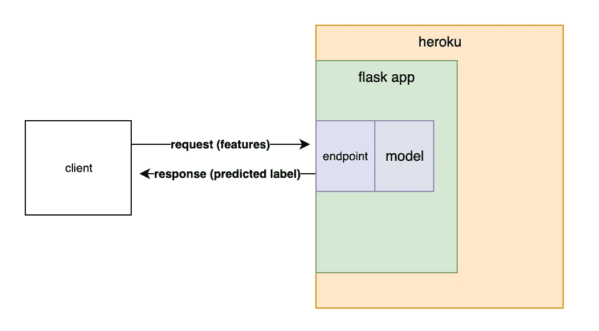
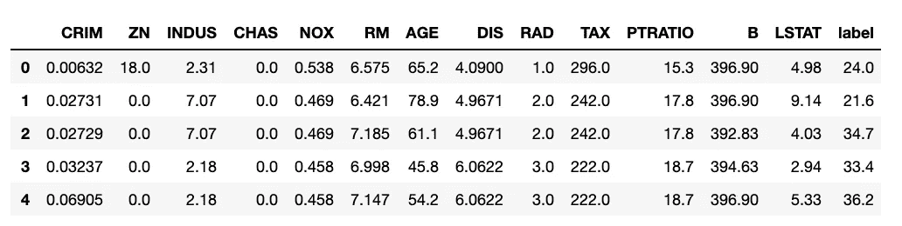
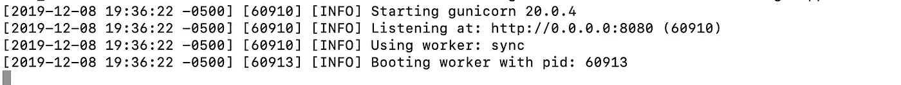
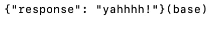
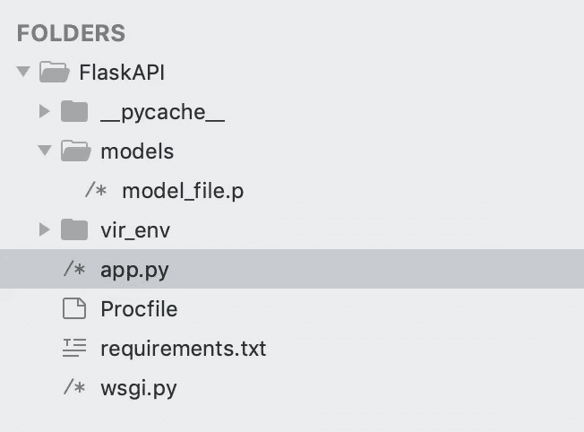
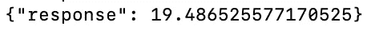
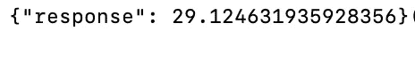
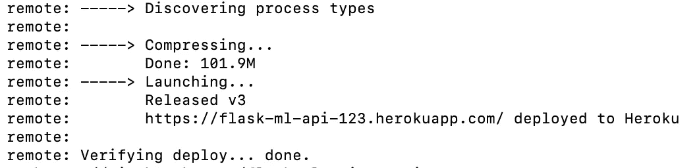
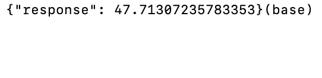

# 用 Flask 和 Heroku 制作一个机器学习模型

> 原文：<https://towardsdatascience.com/productionize-a-machine-learning-model-with-flask-and-heroku-8201260503d2?source=collection_archive---------14----------------------->

## 如何在互联网上的 Flask API 背后部署一个经过训练的 ML 模型？



作为一名软件开发背景的人，我从未对生产我的模型有过任何犹豫。但是对于任何刚刚进入编码领域的人来说，作为一名数据科学家，这可能并不明显。

一个模型要在现实世界中使用，你需要把它生产出来。

在这篇文章中，我们将讨论一些事情。创建一个 ML 模型
2。将其包装在 API
3 的烧瓶中。将 API 部署到 Heroku 上

# 创建一个快速而肮脏的模型

本教程不是关于训练模型的，所以我们将在波士顿住房数据集上训练一个非常简单的模型，而不考虑它的工作情况。

```
# import dataset
from sklearn.datasets import load_boston# load data
data = load_boston()import pandas as pd# load into a dataframe
df = pd.DataFrame(data['data'], columns=data['feature_names'].tolist())
df['label'] = data['target']
df.head()
```



左边的`label`代表`Median value of owner-occupied homes in $1000’s`每个地区以千美元计的平均房屋价值。该数据集背后的想法是使用其他列中的值来预测平均房价。

我们将只使用`RM`、`average number of rooms per dwelling`来进行预测，完全知道这不会创建一个准确的模型。

```
# shuffle data
shuffled_df = df.sample(frac=1)# split data
split = int(len(shuffled_df) * .7)
train_df = shuffled_df[:split]
test_df = shuffled_df[split:]# stock function for extracting X,y columns from df
def X_and_y_from_df(df, y_column, X_columns = []):
    X = {}
    for feature in X_columns:
        X[feature] = df[feature].tolist()
    y = df[y_column].tolist()
    return X, y# extract X and y
X_train, y_train = X_and_y_from_df(train_df, 'label', ['RM'])
X_test, y_test = X_and_y_from_df(test_df, 'label', ['RM'])# reshape
import numpy as np
X_train_arr = np.array(X_train['RM'])
X_train_arr = X_train_arr.reshape(X_train_arr.shape[0],1)
X_test_arr = np.array(X_test['RM'])
X_test_arr = X_test_arr.reshape(X_test_arr.shape[0],1)# train model
from sklearn.linear_model import LinearRegression
model = LinearRegression()
model.fit(X_arr, y_train)# predict results
y_pred = model.predict(X_test_arr)
```

我已经预测了这里的结果，但坦率地说，我们不在乎。如果我们在这个问题上花更多的时间，我们可以建立一个更精确的模型。

# 酸洗模型

泡菜什么？！

Pickling 将对象转换成字节流，该字节流可以存储、传输并在以后转换回原始模型。Pickles 是 python 允许您保存几乎任何开箱即用对象的方法之一。

```
import picklepickl = {'model': model}
pickle.dump( pickl, open( 'model_file' + ".p", "wb" ) )
```

嘣。我们的模型现在作为泡菜保存在与我们的 jupyter 笔记本相同的目录中。

# 构建一个 Flask API

Flask 是 Python 的一个微框架。它没有其他框架的多余功能，因此非常适合构建简单的 API。

我们将在命令行上运行几个命令来开始。

创建一个目录来存储应用程序
`mkdir FlaskAPI`

光盘进入
目录`cd FlaskAPI`

创建虚拟环境
`python3 -m venv vir_env`

激活虚拟环境
`source vir_env/bin/activate`

安装我们需要的所有软件包
`pip3 install flask gunicorn sklearn`

保存生产需要安装
`pip3 freeze > requirements.txt`的包和版本列表

在我们创建的最后一个目录中，用命令行创建几个文件和另一个目录。

```
touch app.py
touch Procfile
touch wsgi.py
mkdir models
```

在您喜欢的代码编辑器中打开`FlaskAPI`目录。我喜欢 sublime，所以我将用`sublime .`在当前目录中启动它。

将以下内容复制到`app.py`中。

```
import flask
from flask import Flask, jsonify, request
import jsonapp = Flask(__name__)[@app](http://twitter.com/app).route('/predict', methods=['GET'])
def predict():
 response = json.dumps({'response': 'yahhhh!'})
 return response, 200if __name__ == '__main__':
 application.run(debug=True)
```

并将以下内容复制到`wsgi.py`

```
from app import app as applicationif __name__ == "__main__":
    application.run()
```

现在启动应用程序！在同一个目录下运行`gunicorn --bind 0.0.0.0:8080 wsgi:application -w 1`

你应该看看…



尝试用`curl -X GET [http://0.0.0.0:8080/predict](http://0.0.0.0:8080/predict)`从另一个终端窗口向它发出请求



成功。我们有一个本地运行的 Flask API。

是时候添加我们的机器学习模型了。拿起你的`model_file.p`泡菜，放入我们制作的应用程序中的`/models/`目录，这样你的文件树现在看起来像左边。

将此功能添加到`app.py`

```
def load_models():
    file_name = "models/model_file.p"
    with open(file_name, 'rb') as pickled:
        data = pickle.load(pickled)
        model = data['model']
    return model
```

并修改您的`predict()`函数，如下所示

```
def predict(): # stub input features
    x = 5.963 # load model
    model = load_models()
    prediction = model.predict([[x]])[0] response = json.dumps({'response': prediction})
    return response, 200
```

您还需要将`import json`和`import pickle`添加到`app.py`的顶部。

`app.py`现在的样子

```
import flask
from flask import Flask, jsonify, request
import json
import pickleapp = Flask(__name__)def load_models():
    file_name = "models/model_file.p"
    with open(file_name, 'rb') as pickled:
       data = pickle.load(pickled)
       model = data['model']
    return model[@app](http://twitter.com/app).route('/predict', methods=['GET'])
def predict(): # stub input features
    x = 5.963 # load model
    model = load_models()
    prediction = model.predict([[x]])[0] response = json.dumps({'response': prediction})
    return response, 200if __name__ == '__main__':
    application.run(debug=True)
```

请注意，我们是在模拟输入值，而不是实际发送给应用程序并解析响应——这就来了。

让我们再次测试应用程序，以确保模型在我们的 API 后面工作。

停止网络服务器，用`gunicorn — bind 0.0.0.0:8080 wsgi:application -w 1`重启

现在提出另一个请求，`curl -X GET [http://0.0.0.0:8080/predict](http://0.0.0.0:8080/predict)`



完美。我们的模型根据 API 中输入的特性预测标签！

现在让我们的 API 接受来自请求的输入特性。

将此添加到`predict()`

```
# parse input features from request
request_json = request.get_json()
x = float(request_json['input'])
```

现在`app.py`看起来像

```
import flask
from flask import Flask, jsonify, request
import json
import pickleapp = Flask(__name__)def load_models():
    file_name = "models/model_file.p"
    with open(file_name, 'rb') as pickled:
        data = pickle.load(pickled)
        model = data['model']
    return model[@app](http://twitter.com/app).route('/predict', methods=['GET'])
def predict(): # parse input features from request
    request_json = request.get_json()
    x = float(request_json['input'])

    # load model
    model = load_models()
    prediction = model.predict([[x]])[0] response = json.dumps({'response': prediction})
    return response, 200if __name__ == '__main__':
    application.run(debug=True)
```

还要把这个加到`Procfile`，它实际上没有扩展名。

```
web: gunicorn app:app --preload
```

再提一个要求。这次我们稍微修改了一下，这样我们的 API 就知道它得到了一个 JSON。

```
curl -X GET http://0.0.0.0:8080/predict -H "Content-Type: application/json" -d '{"input":"7"}'
```



再次，成功！我们有一个内部包含模型的工作 API。

# 部署到 Heroku

通过在命令行运行`git init`将 git 添加到应用程序中。

然后运行`nano .gitignore`并添加以下几行:

```
vir_env
__pycache__/
.DS_Store
```

然后按`ctrl+x`、`y`，再按`enter`保存并关闭 mac 上的文件。这将防止将不必要的文件推送到 Heroku。

通过在命令行运行`git add . -A`和`git commit -m 'first commit'`继续向 git 添加文件。

用 [Heroku](http://heroku create flask-ml-api-123) 创建一个账户。然后在命令行用`heroku login`登录 Heroku，再用`heroku create flask-ml-api-123`创建一个 app。`flask-ml-api-123` 是我选的应用名称。你需要找一个没人用过的名字。

现在用`git push heroku master`把我们的 app 推送到 heroku。

部署时，您将看到 Heroku 为您的应用程序提供的 URL。这是您发送 API 请求的地方。



对我来说是`[https://flask-ml-api-123.herokuapp.com/](https://flask-ml-api-123.herokuapp.com/)`。

现在在那里提出一个请求

```
curl -X GET [https://flask-ml-api-123.herokuapp.com/predict](https://flask-ml-api-123.herokuapp.com/predict) -H “Content-Type: application/json” -d '{"input”:”9"}'
```



现在我们正在谈话！我们已经训练了一个模型，将其包装在一个 API 中，并将其部署到 Heroku。显然，我们还应该添加很多东西，比如身份验证。但是这应该让你开始！