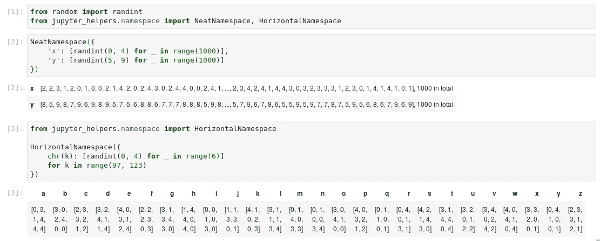

# Jupyter (Python)的生产力技巧

> 原文：<https://towardsdatascience.com/productivity-tips-for-jupyter-python-a3614d70c770?source=collection_archive---------15----------------------->

最近几周我一直忙于我的 MRes 项目，睡眠很少。这让我在工作中最重要的工具:Jupyter Notebook/Jupyter Lab 中寻找改进工作流程的方法。我在这篇文章中收集了所有的窍门和技巧，希望其他研究人员可能会发现这些有用的东西:

1.  [计算完成(或失败)后播放声音](#3b5a)
2.  [将通知集成到您的操作系统中(为 GNOME shell 做好准备)](#ad45)
3.  [跳转到变量、函数或类的定义](#3424)
4.  [启用 rpy2 的自动完成功能(非常适合 ggplot2)](#7a8a)
5.  [在一个漂亮的表格中总结字典和其他结构](#2c78)
6.  [有选择地从其他笔记本导入](#8dd4)
7.  [出错或打开笔记本时，滚动到最近执行的单元格](#68cb)
8.  [长输出的交互(跟随)尾](#8313)

注意:为了方便使用，我将下面的代码片段收集到 Python3 包中( [jupyter-helpers](https://github.com/krassowski/jupyter-helpers) )。您可以通过以下方式获得:

`pip3 install jupyter_helpers`

它可以开箱即用，但是如果您希望获得最佳体验，强烈推荐以下依赖项:

```
pip3 install ipywidgets
jupyter labextension install @jupyter-widgets/jupyterlab-manager
```

# 1.计算完成后播放一段声音

如果一个单元(或一串单元)的执行时间超过几秒钟，您可以配置 Jupyter 来播放声音。我之前描述过两种方法，[基于 Python 的方法](https://stackoverflow.com/a/50648266/6646912)和[基于 JavaScript 的方法](https://stackoverflow.com/a/50569680/6646912)。python 的代码大致如下:

然而，助手包得到了一个升级版本，它负责隐藏音频播放器和许多其他东西。像这样使用它:

```
from jupyter_helpers.notifications import NotificationsNotifications(
     success_audio='path/to/beep-07.wav', time_threshold=2
)
```

在上面的例子中，我使用了来自 soundjay.com 的`beep-07.wav`。如果你在 GNOME 中使用 Ubuntu 或其他发行版，你可以提供一个默认警告声音的路径，例如`/usr/share/sounds/gnome/default/alerts/bark.ogg`。

## 异常时播放喇叭声音

类似地，您可以添加一个钩子，在出现异常时发出不同的声音。这里有一个由 SO 的 [Kevin 提出的非常简单的机制:](https://stackoverflow.com/a/41603739/6646912)

当然，更先进的是`jupyter_helpers`包的一部分:

```
from jupyter_helpers.notifications import NotificationsNotifications(failure_audio='path/to/beep-05.wav')
```

# 2.将通知与您的操作系统集成

当我在图书馆工作时，我需要一个哔哔声和喇叭声的替代品。对于我这个 GNOME 用户来说，Notify-send 变成了一个完美的工具(向下滚动查看其他桌面环境的说明)。
设置事物使用:

```
from jupyter_helpers.notifications import NotificationsNotifications(
    success_audio='path/to/beep-07.wav', time_threshold=2,
    failure_audio='path/to/beep-05.wav',
    integration='GNOME'
)
```

这对 GNOME 用户来说是现成的，尽管安装一个名为`notify-send.sh`的插件会让通知在不再需要时消失。这可以通过附加的`setup.sh`脚本来完成。


Figure 1: Fully integrated notifications

操作系统集成已准备好与任何其他桌面环境挂钩，尽管它需要一些脚本:

```
from jupyter_helpers.desktop_integration import DesktopIntegrationclass WindowsIntegration(DesktopIntegration): def notify(self, title, text, notify_id=None, **kwargs):
        pass   # add your code here def notify_close(self, notify_id):
        pass   # add your code hereNotifications(
    success_audio='path/to/beep-07.wav', time_threshold=2,
    failure_audio='path/to/beep-05.wav',
    integration=WindowsIntegration
)
```

如果您希望将它与您的操作系统集成，请考虑发送 PR。

# 3.跳转到变量/函数/类的定义

使用鼠标使用`Alt` + `click`跳转到一个定义，或者使用`Ctrl` + `Alt` + `B`带[jupyterlab-go-to-definition](https://github.com/krassowski/jupyterlab-go-to-definition)扩展的仅键盘选项:


Jump-to-definition supports Python and R. PRs to support other languages are welcome

最后，使用`Alt` + `o`跳回到之前的位置:


The ability to jump back is quite helpful for notebooks with longer outputs

要安装扩展，请使用:

```
jupyter labextension install @krassowski/jupyterlab_go_to_definition
```

2020 年更新:现在有了 [jupyterlab-lsp](https://github.com/krassowski/jupyterlab-lsp) 更强劲的跳跃！

# 4.为 rpy2 启用自动完成功能(ggplot2！)

如果您的工作更多的是关于出版物而不是交互式仪表板，那么您很有可能熟悉 ggplot2。虽然有一些伟大的项目，如 plotnine，试图将其移植到 Python，但我仍然发现在使用 rpy2 R-Python 接口时，使用 ggplot(尤其是扩展)功能更完整。

然而，到目前为止，自动完成还不包括`%%R`单元格中的 R 对象(如果加载的话也不包括 ggplot 函数)。我准备了一个简单的解决方法:

它可能会在未来得到改进，正如本 GitHub 问题中所讨论的那样。


Auto-completion now also includes R objects and ggplot functions

同样，来自`jupyter_helpers`的一个简单导入将解决这个问题:

```
from jupyter_helpers import rpy2_autocompletion
```

2020 年更新:现在也可以用 [upyterlab-lsp](https://github.com/krassowski/jupyterlab-lsp) 完成！

# 5.在一个漂亮的表格视图中总结字典

这不是一个新颖的想法，尽管我希望分享我的比不太先进的类可以帮助别人。这是基于 Python3 `SimpleNamespace`的，但是为 Jupyter 扩展了一个支持熊猫和 numpy 的 HTML 表示:

```
from jupyter_helpers.namespace import NeatNamespaceNeatNamespace(your_dict)
```

长集合将被修剪，所以当浏览器努力呈现意外打印的字典时，不必担心空间或内存不足。水平和垂直方向可以更好地利用空间。



Namespaces with HTML: when nested data needs to be looked at before converting to DataFrame

# 6.选择性地从其他笔记本导入

有一段时间，我试图遵循数据/方法/结果分离，为每个更大的分析准备了三个 Jupyter 笔记本:`data.ipynb`、`methods.ipynb`和`results.ipynb`。为了节省对一些东西进行无用的重新计算的时间，我想从*数据*和*方法*笔记本中进行选择性导入，以便在*结果*笔记本中使用。

现在可以(基于 [nbimporter](https://github.com/grst/nbimporter) )使用一个导入和一个魔法:


这个在本 SO 线程中[有描述，还是希望看到一些建议。](https://stackoverflow.com/questions/54317381/selectively-import-from-another-jupyter-notebook)

# 7.滚动到最近执行的单元格

您可能已经注意到，之前显示的`Notifications`类使笔记本在异常情况下向下滚动到违规单元格(图 1)。通过`scroll_to_exceptions=False`可以禁用此功能。

相反，如果您想要更多的自动滚动，您可以使用底层助手函数来标记您晚上结束工作的单元格，以便在早上快速打开笔记本:

```
from jupyter_helpers.utilities import scroll_to_current_cellscroll_to_current_cell(preserve=True)
```

# 8.用于长输出的交互式尾部

最后，当运行第三方应用程序时(但不是在构建一个完全成熟的管道的时候)，人们可能只想看到当前运行的进程的尾部。在 bash 中，使用`tail -f`很容易实现。

如果您需要查看输出，并且在刷新到笔记本电脑时会降低计算机速度，或者只是生成冗长的输出，那么`FollowingTail` helper 可能适合您:


Apply tail -f equivalent to keep the outputs at reasonable length!

# 接下来还有更多！

我现在只有这么多时间，但我会分享更多已经写好的和新的助手和片段。这是一种回馈令人惊叹的科学计算社区的方式(从 Python 和 R 端)，它使我能够完成我的论文。我有另一个项目来，这可能需要克服其他挑战。

一旦准备好了，我会在 Twitter 上分享这个消息。

感谢您的阅读——希望它值得至少为一位研究人员撰写。