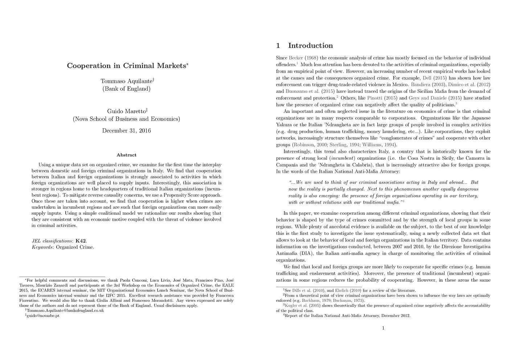
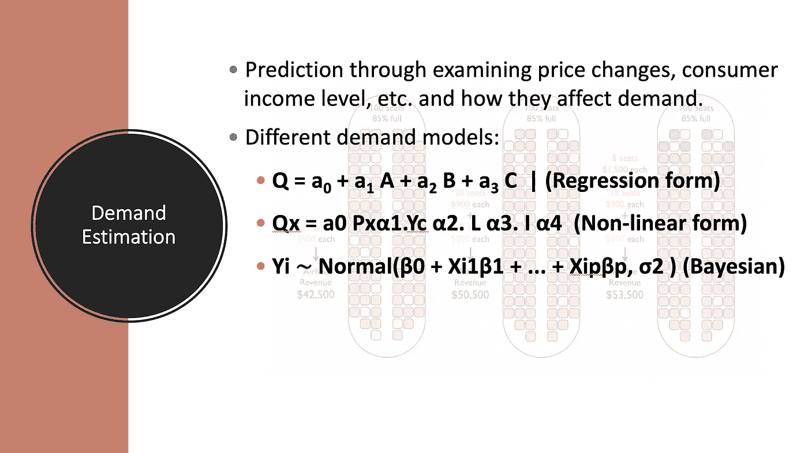

# 教授变身数据科学家:为什么 Guido Maretto 博士离开学术界开始创业

> 原文：<https://towardsdatascience.com/professor-turned-data-scientist-why-dr-guido-maretto-left-academia-for-the-startup-life-da29102a8325?source=collection_archive---------4----------------------->

## [独家 TDS 采访](https://towardsdatascience.com/tagged/tds-interview)

## TDS 采访了这位前教授(加州理工学院博士),询问他为什么离开副教授职位，以及如何在大学毕业后加入行业。

**面试官:** [Haebichan Jung](https://www.linkedin.com/in/haebichan?source=post_page---------------------------) ，Recurly 的数据科学家，TowardsDataScience.com 的项目负责人。

**受访者:**[Guido Maretto](https://www.linkedin.com/in/guido-maretto)博士，Flyr 实验室的数据科学家，Nova 商业和经济学院商业战略的前副教授。前麻省理工学院研究员。

**你的专业背景是什么？**

在加州理工学院获得博士学位后，我在比利时的布鲁塞尔获得了博士后学位，然后我在葡萄牙里斯本的 Nova 商学院开始了一个教师职位，在那里我呆了 7 年，直到我进入工业界，成为旧金山 Flyr 实验室的一名数据科学家。

[https://flyrlabs.com/](https://flyrlabs.com/)

**你在新星学校的主要职责是什么？**

我在教学和做研究。最初我的研究主要是数学和理论模型。后来我对实证分析更感兴趣了，所以用数据。具体原因是，我和一位在布鲁塞尔的同事现在在英格兰银行工作，我们对政府关于意大利犯罪组织的说法感到好奇。不同的政治家在发表相反的声明。因此，我们认为有必要通过这些数字来回答谁在本质上撒谎的问题，并揭示一些真相。

Cooperation in Criminal Markets by Dr. Guido Maretto: [https://mpra.ub.uni-muenchen.de/75949/](https://mpra.ub.uni-muenchen.de/75949/)

那是我对在工业界工作感兴趣的时候。因为当你在学术界工作时，你有很多时间用好的方法论非常精确地回答问题。因此，你有机会用最好的方法更好地得到正确的答案。但遗憾的是影响很低。即使你发现了问题的根本原因，并找到了潜在的好的解决方案，可能也要过好几年，政策制定者才会找到解决方案或进行分析。我所在的地方更是如此，那就是南欧。这就是让我对进入行业感兴趣的原因:解决问题的可能性，不仅仅是找到解决方案，而是实际实施解决方案。

**这是从学术界转向工业界的主要原因吗？**

绝对的。我想说，数据科学对在学术环境中进行实证研究的主要吸引力在于，你被迫以更高的速度运行，但你可以实际实施你找到的解决方案。

**您是如何管理从学术界到数据科学的转变的？**

我通过参加编码训练营加强了我的技能，这非常重要，因为我们在统计方法方面使用的机器类型，但最重要的是在用于进行经济研究的统计包中使用的机器类型与我在工业中使用的不同。尽管目标可能是实现最优定价、估计需求等等，但所使用的数据类型和数量以及行业状况要求使用不同的工具集。

**你过去作为学者使用的工具和你现在作为数据科学家使用的工具有什么重要区别？**

经济学家大多是在 Stata 上接受培训的，这是与学术界不同的非常重要的东西。幸运的是，如今 R 在课程中变得越来越常见。但是大部分数据科学工作都是用 Python 和一点 r 语言完成的。但是有一个技能缺口需要在学术界之后弥补。SQL 在工业中也很重要，任何从事数据科学工作的人都知道完全脱离 SQL 是相当困难的。

**作为一名学者，你过去解决的问题类型和你现在正在解决的问题有什么相似和不同之处？**

就学习的主题而言，没有区别。现在在一家帮助各大航空公司给座位分配价格的公司工作。因此，我所做的是需求估计，不同市场的竞争分析，以及创建能够对情况做出反应的自动化模型，从而为我们的客户提供尽可能好的价格。

所以就我日复一日所想的而言，实际上没什么区别。就我对工作组织的看法而言，有着天壤之别。从本质上来说，一切都更快，一切也都更浅。但这是必须的，因为在找到一个好的解决方案和同时做一些事情之间有一个权衡。这种权衡在学术界并不存在，但对于一家公司的生存来说却是至关重要的——在实现最大改进的同时保持运营。

Demand estimation modeling

**说到主题和你正在解决的问题，比如需求评估，数据科学和经济学之间几乎没有区别。但是，当涉及到解决这些问题的更广泛的学科方法时，你也看到了任何大的重叠吗？**

是的，特别是在经济学中，但对于大多数使用数据的科学(在学术界)来说，重点不是预测将会发生的事情，而是解释为什么会发生事情。更准确地说，我们在数据科学中做的是大量的预测，在学术研究中做的是大量的推断。

现在不要介意经济学之外的 80%的社会科学研究甚至不理解因果关系和相关性之间的区别，但那是他们自己的问题……无论如何，在现实中最大的方法论差异是，悬挂你的头在一个关系是否是因果关系上是重要的，只有在它涉及到预测的时候。当我们想要预测的是需求时，情况肯定是这样，因为这是一个受到许多内生性和各种偏见影响的问题。

但在其他情况下，这些方法是非常不同的，一些问题可能会导致使用高度非线性和完全不透明的方法，这些方法缺乏对模型内部关系的可解释性，但在预测方面却很棒。

> 旁注:为了澄清，Guido 认为某些问题用复杂的神经网络这样的数据科学方法处理得很好。相比之下，其他问题，如通过需求估计的价格设定，更适合基于推理的方法，这些方法更简单，但在经济学/统计学中使用的回报更准确。定价的内生性就是一个具体的例子。
> 
> 在价格设定的情况下，一个重要的内生变量是消费者对设定价格的支付意愿，该变量未被观察到，不包括在我们的模型中，并且不独立于价格。
> 
> 要了解更多关于内生性的知识，请参考这篇 TDS 文章。

 [## 内生性介绍

### 一个冰淇淋小贩在海滩上卖冰淇淋。他收集了两年的总销售额(Y)和销售价格(X)的数据…

towardsdatascience.com](/endogeneity-the-reason-why-we-should-know-about-data-part-i-80ec33df66ae) 

**你如何在日常实践中解决这两种范式的差异？**

实际上，两者都有一点。因为如果你对需求数据使用深度神经网络(DNN ),然后你开始设定价格——这是大多数公司在定价中所做的——他们使用机器学习模型来进行需求估计——你会发现这个模型会失败，因为产生价格的过程已经改变了，它已经变成了你的选择

> 旁注 2:这也是与内生性有关的原因。在这里，模型是根据价格不独立于内生变量(客户的支付意愿)的数据来训练的。因此，一旦这些模型在生产中投入使用，这些模型将改变产生价格的过程及其与内生变量的协方差。因此，基于原始训练集的预测变得不太精确。

所以使用非常强大的方法是有一点艺术的，这些方法可以让我们达到很高的精确度，但却不可解释。实际上，在我的日常工作中，包括需求评估，我认为两者都要做一点。因此，它偏离了学术研究和经济学中典型的对因果关系的探索。但是不能完全放弃，因为我用来强化因果分析的工具在特征选择和预测方面非常强大。

**在 Flyr 实验室，您会用到哪些常见的数据科学工具和技术？**

我们用 Python 做任何事情。就我们使用哪些套餐而言，我们是一家小公司，所以我们仍然有自由挑选，而不会被绑定到特定的套餐。由于我的经济背景，我喜欢用 StatsModels 进行分析，因为我发现这是提供最完整的端到端推理使用的软件包。例如，它允许我非常容易地对错误进行分类，这对于 scikit 来说是非常复杂的——例如 learn。

然后，在某些情况下，为了部署到生产中，我们将转移到 scikit-learn 或 Tensorflow，以使用它们的一些功能，而这些功能在生产中并不是很好。

**Flyr 实验室面临的更大挑战是什么？**

绝对意义上还是相对于学术界？

**绝对而言。**

从绝对意义上来说，我要说的是，有一件事始终具有挑战性，那就是需要在不同层面上获得对一个解决方案的认同。有时候政治会阻碍这一切。所以这是最复杂的部分。因为从性格上来说，我不喜欢说太多话，一遍又一遍地重复同样的事情。所以当我说服一个人这个解决方案是好的，我不会对说服第二个人太兴奋，等等。

然而，我想说这是数据科学家职业生涯的基本方面。因为如果没有对您的解决方案的自我宣传，您将无法实施它，也无法对您公司的指标产生影响。这最终会影响到你的职业生涯。所以我觉得是必要之恶。

对一些人来说，这可能是相当愉快的。比方说，许多人进入数据科学和产品领域，是因为他们偏爱工作的软方面[软技能]，而不是实际的分析和生产事实。

**最后一个问题，你对 TDS 社区，尤其是那些想进入数据科学领域的学术界或经济学界人士有什么忠告吗？**

这些天发生了什么，博士奖学金的数量没有减少，如果不是增加的话。大学里的教师职位和纯研究职位的数量正在减少。因此，在你的整个职业生涯中，一定要留意并保持向工业和数据科学过渡的机会。

> 非常感谢 TDS 的 Ludovic Beni stant 的支持和指导。

 [## Haebichan Jung - Medium

### 阅读容格在媒介上的作品。项目负责人@TDS |数据科学家@ Recurly…

medium.com](https://medium.com/@haebichan) 