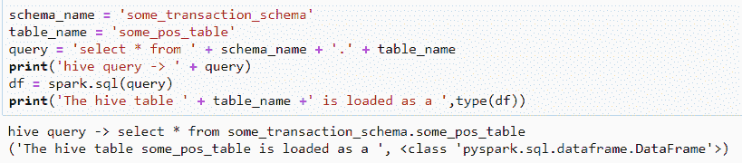
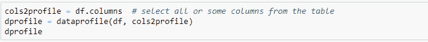
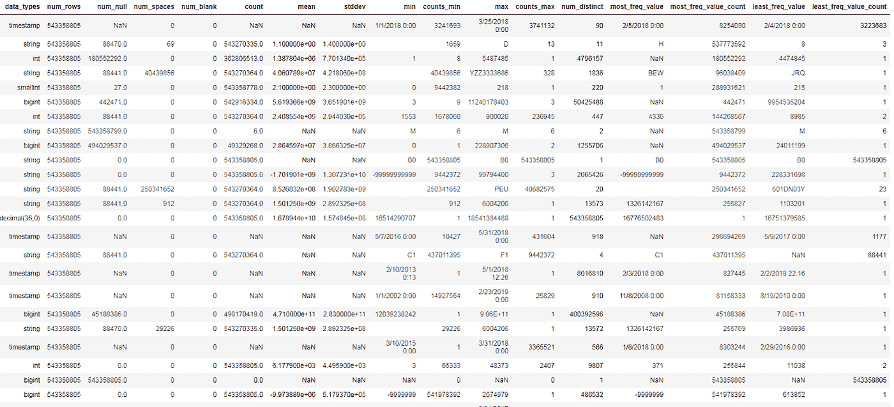

# 使用 Spark 分析分布式环境中的大数据:机器学习的 Pyspark 数据入门

> 原文：<https://towardsdatascience.com/profiling-big-data-in-distributed-environment-using-spark-a-pyspark-data-primer-for-machine-78c52d0ce45?source=collection_archive---------8----------------------->

*沙欣·高赫尔博士*

当使用数据建立预测模型时，在数据可用于任何机器学习任务之前，建立数据的神圣性是重要的。从建模的角度来看，查看**数据概要**有助于轻松检测数据中的任何错误值和列。通过计算表中每一列的最小值和最大值、每一列的平均值和标准偏差、每一列中不同值的数量、最频繁出现的值及其计数、最不频繁出现的值及其计数以及每一列中缺失值的数量来生成配置文件。数据的这些属性是理解表中每一列包含的内容并开始了解数据分布的良好起点。数据概要文件是一个很好的数据检查工具，可以确保数据是有效的，适合进一步使用。

对于可以加载到内存中使用 python 或 R 访问的小型数据集，数据剖析可以相当快地完成。然而，对于大型数据集，例如每天可以轻松达到数百万条记录的交易数据，这将成为一项艰巨的任务。在许多公司中，数据通常以分布式方式存储在 Hadoop 分布式文件系统(HDFS)中。在接下来的内容中，我将介绍一个使用 Spark 在分布式环境中分析大数据的实用函数。Spark 是集群计算和并行处理的框架。我将特别使用 pyspark，它是 Apache Spark 和 python 的合作产品。更详细的代码和解释可以在 [GitHub](https://github.com/shaheeng/Spark/tree/master/Pyspark) 中找到。我还将分享数据概要文件可以帮助设计用于建模目的的数据准备和预处理策略的一些方法。

下面我将从指定的配置单元模式中查询一个配置单元表，并使用 spark SQL 将其作为 Spark 数据帧加载。

下面的 pyspark 实用程序函数将以列表的形式对待分析的列(所有或部分选定的列)和 pyspark 数据帧中的数据作为输入。

上面的函数将绘制列的轮廓，并将轮廓打印为 pandas 数据框。

Profile DataFrame

# 数据配置文件用途

数据配置文件在许多方面都很有用。它提供了对数据质量的一定程度的信心，并且是开始理解数据的最快方法。在确保数据质量的同时，数据概要还有助于设计 ***数据准备和预处理策略*** 。通过观察列及其属性，它可以立即帮助做出关于如何处理缺失值、基数、无信息列和清理数据的决策。

***处理缺失值***

通过显示列中缺失值(空值、nans、空格和空白)的百分比，数据配置文件可以帮助确定阈值百分比值，高于该值的列将被丢弃以用于建模目的。尽管有些算法能够处理缺失值，但理解*缺失*的原因是很重要的。如果观察到一个列有大部分(~80%)缺失值，那么要问的问题是，该列是否应该出于建模目的而被丢弃，或者缺失值是否意味着什么。例如，一列包含车辆使用优质汽油的天数，要问的问题是-列中缺少的值是指数据实例是针对只使用普通汽油的车辆，因此缺少值，还是只是没有正确记录值？(提示:请 SME 参与调查)。上面的属性还可以帮助设计一种策略，为有一些值(~20%)缺失的列输入值。关于用平均值或众数值替换缺失值是否可行的决定，或者更复杂的输入算法，如 SMOTE 等。可以通过查看数据配置文件来简化。

***处理基数***

通过查看列中唯一值的数量，数据配置文件可以很容易地帮助确定列是分类的还是连续的。可以通过查看分类列的唯一值的数量来确定基数，然后可以使用该数量来决定适当的编码技术以及是否需要宁滨来缩减特征空间。

***处理无信息列***

使用数据概要文件，很容易发现只有一个唯一值的列，并且从建模的角度来看，可以很容易地将其作为不添加任何信息的常量列丢弃。如果缺失值的数量与行数相同，则可以识别空列并将其丢弃。如果唯一值的数量与行数相同，则该列是索引列，也可以被丢弃。

***处理脏数据***

我发现数据配置文件特别有用的一点是数据清理。如果数据配置文件显示最频繁出现的值为 *None* 或最小值为 *-9999.9* 或最大值为 *99999* ，则表明这些值需要转换为 nan 或 null，并再次生成配置文件以找到真实的最小值、最大值和模式值。它还有助于发现数据中需要清除的不可打印字符和空格，然后才能进一步使用这些数据。

上面只是一些预处理和数据准备步骤的例子，数据概要文件可以立即开始通知这些步骤。数据分布中的不平衡、异常值和偏斜是 data profile 也可以帮助揭示的一些其他事情。

# 摘要

对于任何类型的分析工作负载，了解数据的输入和输出都是不可替代的。在将数据用于任何机器学习练习之前，分析数据应该是第一步，随后是可视化，以更好地理解不同数据元素之间的关系，并形成关于如何通过模型最好地捕捉它们的假设。对数据的良好理解不仅有助于产生有价值的见解，而且有助于为稳健的机器学习模型进行智能特征工程。我很想知道概要文件中还可以包含哪些有助于为建模目的准备数据的数据属性，以及提高代码效率的技巧(无需配置更大的集群)。虽然这里展示的用例是在 Hadoop 中分析数据，但是 pyspark 函数足够通用，可以从任何作为 pyspark 数据帧加载的[源](https://github.com/shaheeng/Spark/tree/master/Pyspark)中获取输入数据。尽情享受吧！

@Shaheen_Gauher

Shaheen Gauher 的职业是人工智能沟通者、智能解决方案推动者和数据科学家。她帮助企业构建和部署预测解决方案，以最佳地利用他们的数据，并使他们能够通过技术和人工智能实现更多目标。她是训练有素的气候科学家和物理学家，并在塔夫茨大学艺术与科学研究生院的数据分析顾问委员会任职。