# 通过聚类在 Spotify 上分析我最喜欢的歌曲

> 原文：<https://towardsdatascience.com/profiling-my-favorite-songs-on-spotify-through-clustering-33fee591783d?source=collection_archive---------12----------------------->


Credits: [https://www.samma3a.com/tech/en/spotify-testing-whats-new-timeline-feature/](https://www.samma3a.com/tech/en/spotify-testing-whats-new-timeline-feature/)

音乐是我们生活中不可或缺的一部分。当无法用语言描述我们的感受时，它是帮助我们表达自己的共同语言。音乐也有助于我们调节情绪。它影响我们的灵魂和情感，让我们感到快乐、悲伤或充满活力。我们可能会在长途驾驶中放一些歌曲跟着唱，或者在健身房里听一些欢快的歌曲。

我们中的许多人对所听的音乐都有特定的品味，而且这种品味可能会随时间而变化。这让我想到…

1.  这些年来我对音乐的品味改变了吗？如果有，这些变化是什么时候发生的？
2.  根据我最近的音乐品味，我现在在听什么类型的音乐？

多亏了 Spotify API，我能够提取和探索我喜欢听的歌曲——那些让我点击心形图标的歌曲。

## **设置**

要从 Spotify API 获取数据，我们需要按照以下步骤进行初始设置:

1.  登录 [Spotify for Developers](https://developer.spotify.com/dashboard/) 并创建一个应用。
2.  从应用程序仪表板页面中，选择编辑设置，并将重定向 URIs 设置为 http://localhost:8888。
3.  记下客户端 ID 和客户端密码。

## **收集数据**

我们可以使用 Spotify Web API 的 Python 库 [Spotipy](https://spotipy.readthedocs.io/en/latest/) 来获取相关数据。为了获得歌曲，我们需要生成一个授权令牌。

```
import spotipy
import spotipy.util as util
from spotipy.oauth2 import SpotifyClientCredentialscid = '<INSERT CLIENT ID>'
secret = '<INSERT CLIENT SECRET>'
username = ""
client_credentials_manager = SpotifyClientCredentials(client_id=cid, client_secret=secret) 
sp = spotipy.Spotify(client_credentials_manager=client_credentials_manager)# Get read access to your library
scope = 'user-library-read'
token = util.prompt_for_user_token(username, scope)
if token:
    sp = spotipy.Spotify(auth=token)
else:
    print("Can't get token for", username)
```

有两个 API，**current _ user _ saved _ tracks**和 **audio_features** ，用于获取标题、艺术家、添加歌曲的时间以及声音、舞蹈性和乐器性等特征。这些功能将帮助我们更好地理解我们的播放列表。

下表列出了一些功能描述:


要查看一首歌曲的完整功能，您可以查看此链接。

[](https://developer.spotify.com/documentation/web-api/reference/tracks/get-audio-features/) [## 获取音轨的音频功能|面向开发者的 Spotify

### 获取由唯一的 Spotify ID 标识的单曲的音频特征信息。

developer.spotify.com](https://developer.spotify.com/documentation/web-api/reference/tracks/get-audio-features/) 

```
df_saved_tracks = pd.DataFrame()
track_list = ''
added_ts_list = []
artist_list = []
title_list = []more_songs = True
offset_index = 0while more_songs:
    songs = sp.current_user_saved_tracks(offset=offset_index) for song in songs['items']:
        #join track ids to a string for audio_features function
        track_list += song['track']['id'] +',' #get the time when the song was added
        added_ts_list.append(song['added_at']) #get the title of the song
        title_list.append(song['track']['name']) #get all the artists in the song
        artists = song['track']['artists']
        artists_name = ''
        for artist in artists:
            artists_name += artist['name']  + ','
        artist_list.append(artists_name[:-1]) #get the track features and append into a dataframe
    track_features = sp.audio_features(track_list[:-1])
    df_temp = pd.DataFrame(track_features)
    df_saved_tracks = df_saved_tracks.append(df_temp)
    track_list = '' if songs['next'] == None:
        # no more songs in playlist
        more_songs = False
    else:
        # get the next n songs
        offset_index += songs['limit']#include timestamp added, title and artists of a song
df_saved_tracks['added_at'] = added_ts_list
df_saved_tracks['song_title'] = title_list
df_saved_tracks['artists'] = artist_list
```

这是获得的数据集的一个例子。

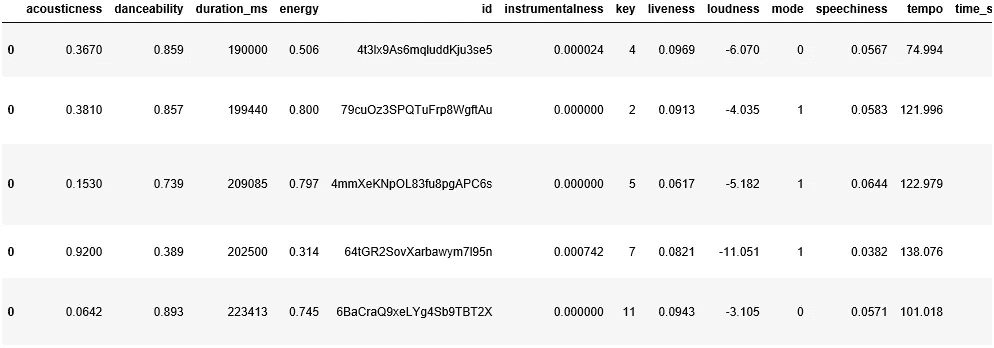

# 我对音乐的品味变了吗？

获得数据后，是时候找出特征如何随时间变化了。我们可以根据歌曲添加的年份和月份对歌曲进行分组，得到每个特征随时间变化的平均值，并将其可视化。

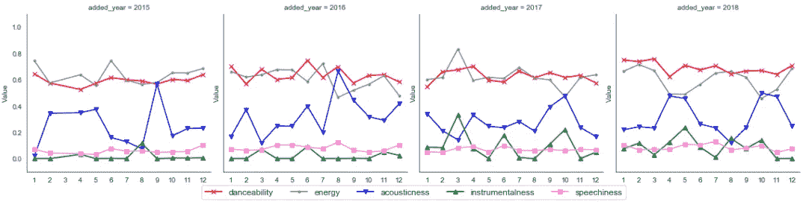

折线图按年份分开，以使其更清晰。语音(紫色)在这些年中最稳定，接近 0。这说明我一般听说唱少的歌。声音(蓝色)是波动的，这意味着随着时间的推移，我混合了声音和非声音的歌曲。

最让我感兴趣的是工具性(绿色)。对于 2015 年和 2016 年，它稳定地接近 0。然而，从 2017 年开始，工具性开始波动。这大概是我的音乐品味从 2017 年开始发生变化的标志吧。我们可以将数据过滤为 2017 年添加的歌曲。

# 我在听什么类型的歌曲？

## 使聚集

根据上面的图表，我知道我正在听更多的器乐歌曲。但是是器乐舞蹈类的歌曲吗？还是更古典的歌？其他人呢？我目前对音乐的品味如何？我们可以将具有相似特征的歌曲分组在一起，并对每个聚类进行分析。一种聚类方法是 [K 均值聚类](https://en.wikipedia.org/wiki/K-means_clustering)，这是我将用来分析我的歌曲。

对于聚类，我们希望同一个聚类中的点尽可能靠近。我们还希望集群之间的距离尽可能的远。这使得每个集群看起来紧凑，同时彼此间隔开。

这是 4 个集群的可视化效果。绿点代表每个群集的质心(群集的中心)。

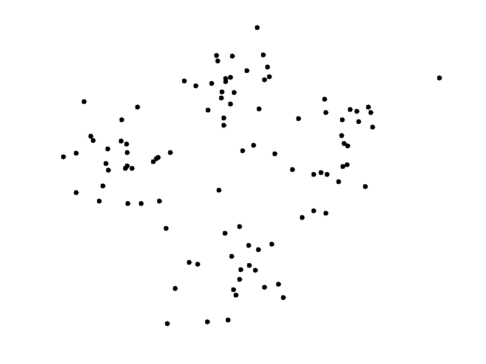

K-means clustering taken from [http://shabal.in/visuals/kmeans/6.html](http://shabal.in/visuals/kmeans/6.html)

因为聚类依赖于距离，所以我们的数据规模会影响结果。例如，如果我们希望按身高(从 1.5 米到 1.9 米)和体重(从 60 公斤到 80 公斤)进行分类。因此，点在高度轴上的分布为 0.4，权重为 20。这意味着权重将在确定聚类中起主导作用。

我们可以将数据的范围标准化，这样特征就会影响结果。

```
cluster_features = ['acousticness', 'danceability', 'instrumentalness', 'energy', 'speechiness']df_cluster = df_recent[cluster_features]
X = np.array(df_cluster)
scaler = StandardScaler()
scaler.fit(X)
X = scaler.transform(X)
```

了解了聚类的作用后，我们听了多少种类型/组的歌曲？一种方法是根据自己的知识做出有根据的猜测。如果你听所有类型的音乐，从 edm 到 hip hop 到 jazz 等等，你可以给出一个更高的数字，比如… 7？因为 K-means 聚类需要我们指定想要的聚类数，所以可以设置 k=7，这里 K 是聚类数。

另一种方法是借助肘法来确定聚类数。在 elbow 方法中，我们可以对一系列设定的聚类数执行聚类，例如 k=1，k=2，…，k=9，k=10。对于每个 k，我们将取每个点并测量它到它们的聚类质心的平方距离，并将它们相加。这被称为距离平方和(SSD)。SSD 测量每个点离聚类质心有多近。因此，SSD 越小，同一簇中的点越接近。

```
ss_dist = []
K = range(1, 11)
for k in K:
    km = KMeans(n_clusters=k, init='k-means++', random_state=123)
    km = km.fit(X)
    ss_dist.append(km.inertia_)plt.plot(K, ss_dist, 'bx-')
plt.xlabel('k')
plt.ylabel('Sum of squared distances')
plt.title('Elbow Method For Optimal k')
plt.show()
```

因此，如果我们绘制每个 k 的 SSD，我们将得到如下所示的曲线:

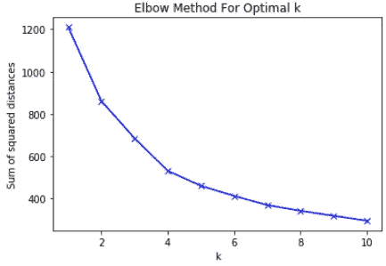

从上面的图中可以看出，随着 k 的增加，SSD 减小。这是有意义的，因为点可能有一个更近的集群要分配，导致较低的 SSD。

前面我提到过，我们希望每个集群中的点尽可能接近。但是，我们不能选择 k=10，因为它是最低的。想象一下。如果我们选择 k=N，其中 N 是歌曲的数量，我们将每首歌曲作为自己的聚类，因此 SSD 将为 0。这是因为每个点的聚类质心就是该点本身。

相反，我们将选择 k，这样，如果我们添加另一个群集，SSD 会略有下降。这就是所谓的肘法。如果我们把曲线想象成我们的手臂，我们会在开始时得到一个陡峭的斜坡，然后在中途突然变得平缓。这赋予了它“肘部”的形状。

基于肘形方法，推荐的聚类数是 4，因为线从 k=4 到 k=5 变得平缓。然而，我也试验了 k=5，发现我喜欢给定的集群。因此，在这篇文章中，我将分享我得到的 k=5 的结果。

## 集群可视化

太好了，我们终于有自己的集群了！那么我们的星团看起来怎么样呢？遗憾的是，目前我们还无法查看它。这是因为我们的聚类是使用 5 个特征形成的。如果你把每个特征看作一个维度，你得到的是 5 维。因为我们可以看到高达 3 维的图像，我们将需要执行一种叫做[降维](https://en.wikipedia.org/wiki/Dimensionality_reduction)的技术。这允许我们从 5 维降低到任何更低的维度。

为了尽可能直观地解释它，降维的目的是从一个更高的维度得到一个低维的特征集，同时保留尽可能多的信息。如果你想更好地理解它的作用，你可以看看这个关于主成分分析(PCA)的[视频](https://www.youtube.com/watch?v=FgakZw6K1QQ)，这是降维的方法之一。

让我们看看如果我们使用主成分分析来降低维度，会保留多少数据。

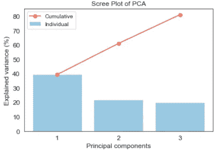

蓝条显示每个主成分(PC)对数据贡献了多少信息。第一台 PC 提供了 40%的数据信息。第二个和第三个各贡献 20%。红线显示 PCs 数据的累积信息。通过从 5 维减少到 2 维，60%的数据信息被保留。同样地，如果我们减少到 3 维，80%的数据信息被保留。

现在让我们看看我们的集群在二维和三维散点图上是什么样子。

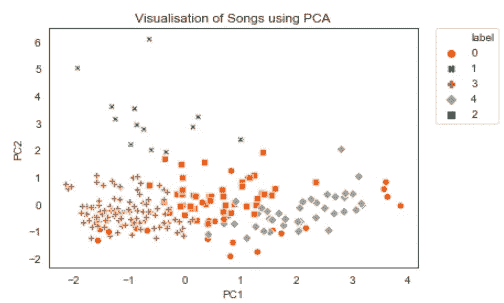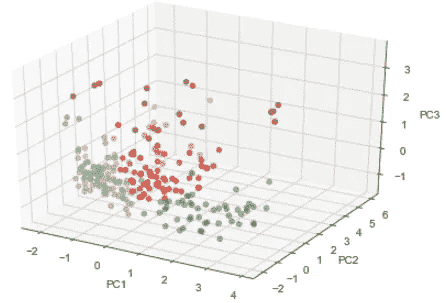

二维散点图中的点相互重叠，看起来可能没有很好地完成聚类。然而，如果我们从三维视角来看，我们可以更好地看到集群。

让我们尝试另一种方法，称为 t-分布式随机邻居嵌入(t-SNE)。t-SNE 在可视化高维数据方面表现良好。更多细节，你可以阅读[这篇](https://www.datacamp.com/community/tutorials/introduction-t-sne)教程。

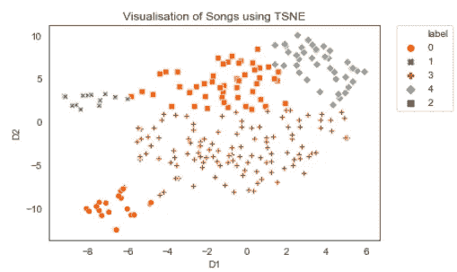

在这种情况下，二维 t-SNE 散点图能够很好地显示 5 个集群。我们也可以大致分辨出，聚类 3 是最大的聚类，聚类 0 或 1 是最小的。让我们使用条形图来看看集群是如何分布的。

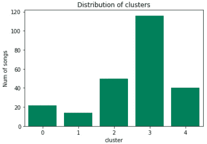

## 聚类分析

现在，我们可以了解不同集群的特征。让我们比较一下集群之间的特性分布。

```
# set binning intervals of 0.1
bins = np.linspace(0,1,10)# create subplots for number of clusters(Rows) and features(Cols)
num_features = len(cluster_features)
f, axes = plt.subplots(num_clusters, num_features, 
                       figsize=(20, 10), sharex='col'row = 0
for cluster in np.sort(df_recent['cluster'].unique()):
    df_cluster = df_recent[df_recent['cluster'] == cluster]
    col = 0 for feature in cluster_features:
        rec_grp = df_recent.groupby(pd.cut(df_recent[feature], bins)).size().reset_index(name='count')
        cluster_grp = df_cluster.groupby(pd.cut(df_cluster[feature], bins)).size().reset_index(name='count') sns.barplot(data=rec_grp, x=feature, y='count', 
                    color='grey', ax=axes[row, col])
        sns.barplot(data=cluster_grp, x=feature, y='count', 
                    color='red', ax=axes[row, col]) axes[row, col].set_xlabel('')
        axes[row, col].set_xticklabels(range(1,10))
        if col > 0:
            axes[row, col].set_ylabel('')
        if row == 0:
            axes[row, col].set_title(feature) col += 1

    row += 1

f.suptitle('Profile for each clusters')

plt.show()
```

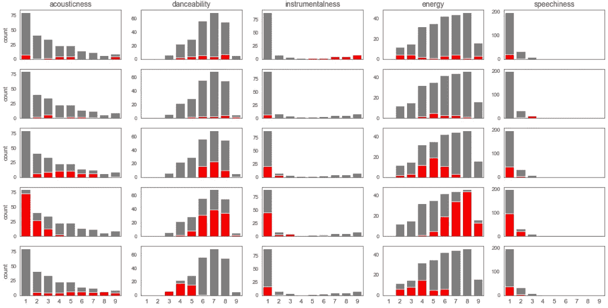

每行代表 0 到 4 的分类，每列代表特性。灰色条代表特征的分布。这使我们能够大致了解特征的分布。红色条表示该聚类中用于与其他聚类进行比较的特征的分布。

当我们观察每个聚类的分布时，我们可以看到每个聚类在某些特征上是高的或低的。这可以通过红色条相对于灰色条是在右侧(高)还是左侧(低)来识别。从这些特征中，我们可以描绘出它们的轮廓，甚至得出一个集群的身份。

集群 0(仪器):**高**仪器性。**低**语速。

第一组(抒情):**高**可舞性，活力，语速。**低**声音性、乐器性。

集群 2(寒冷振动):**高**可跳舞性。**低**能量、仪表、语音。

第三组(舞蹈):**高**可舞性，活力。**低**声音、仪表、语音。

集群 4(减速):**高**声音。低可舞性、仪表、精力、语言。

我们还可以通过取聚类特征的平均值并将其绘制到雷达图上来绘制轮廓。这可能更容易一目了然地查看所有集群之间的差异。

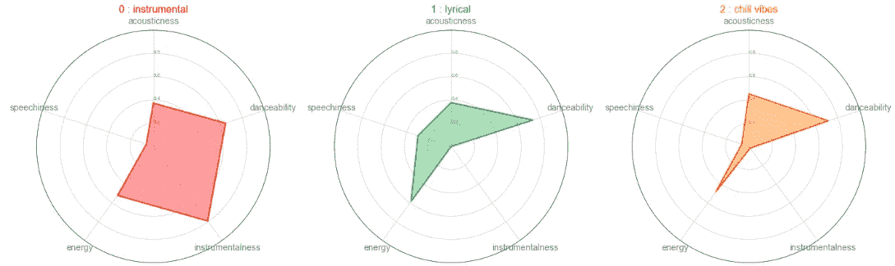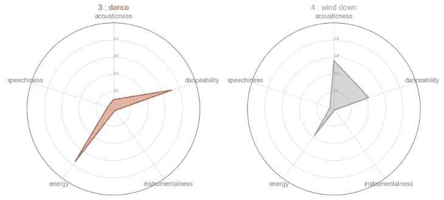

雷达图的读数类似于上面给出的剖面图。我们还可以看到集群 2 和集群 4 具有相似的统计数据。不同之处在于，聚类 2 更关注可舞性，而聚类 4 更关注听觉。

## 聚类样本

让我们看看每个聚类中的歌曲是否符合聚类简档。这里有 3 首歌曲，你可以听一听，看看是否有意义:

**第 0 组(器乐):**
FKJ 回家
酷玩催眠
阿斯托尔·皮亚佐拉、邦德的《自由探戈》

**第一组(抒情):**
蔡林·鲁索的九月玫瑰
扎维亚·沃德的烛光
IU 的 BBIBBI

**集群 2(寒气盛传):**
放弃游戏由水槽，切特 Faker
铁青由伊莱扎
找到一条路由马特昆廷，林卡杨

**集群 3(舞蹈):** Oh Wonder 的 ultra life
Pb 地下的 Little Man
Finesse(混音)【专长。卡迪 B]由布鲁诺·马斯，卡迪 B

**第四组(放松):** 被塞布丽娜·克劳迪奥冻结
打破距离 2.0 由阿什顿·埃德明斯特
有人待在温哥华睡眠诊所

# 结论

我们首先观察了不同时期的不同特征，试图弄清楚音乐品味是否发生了变化。从过滤后的数据集中，我们进行了聚类分析。然后，我们进行可视化处理，以大致了解它的样子，并确保聚类是正确的。最后，我们绘制了每个特征的分布，并对它们进行了描述。在一天结束的时候，我们能够更好地理解我们喜欢的歌曲类型。

数据的收集可以在我的 Github 上的[这里](https://github.com/jkwd/spotify/blob/master/Code/Spotify%20Get%20Data.ipynb)找到，分析可以在[这里](https://github.com/jkwd/spotify/blob/master/Code/Favourite%20songs%20EDA.ipynb)找到。

感谢您的阅读，希望您对此感兴趣。请随时在下面的评论区提供您的反馈，或者通过我的 [LinkedIn](https://www.linkedin.com/in/johnkohweide/) 联系我。希望你有一个伟大的一周！

# 参考

*   绘制刻面图:【https://seaborn.pydata.org/examples/many_facets.html】T22
*   主成分分析(PCA)分步指南:
    [https://www.youtube.com/watch?v=FgakZw6K1QQ](https://www.youtube.com/watch?v=FgakZw6K1QQ)
*   关于 t-SNE 的教程:
    [https://www . data camp . com/community/tutorials/introduction-t-SNE](https://www.datacamp.com/community/tutorials/introduction-t-sne)
*   绘制雷达/蜘蛛图:
    [https://python-graph-gallery . com/392-use-faceting-for-Radar-chart/](https://python-graph-gallery.com/392-use-faceting-for-radar-chart/)