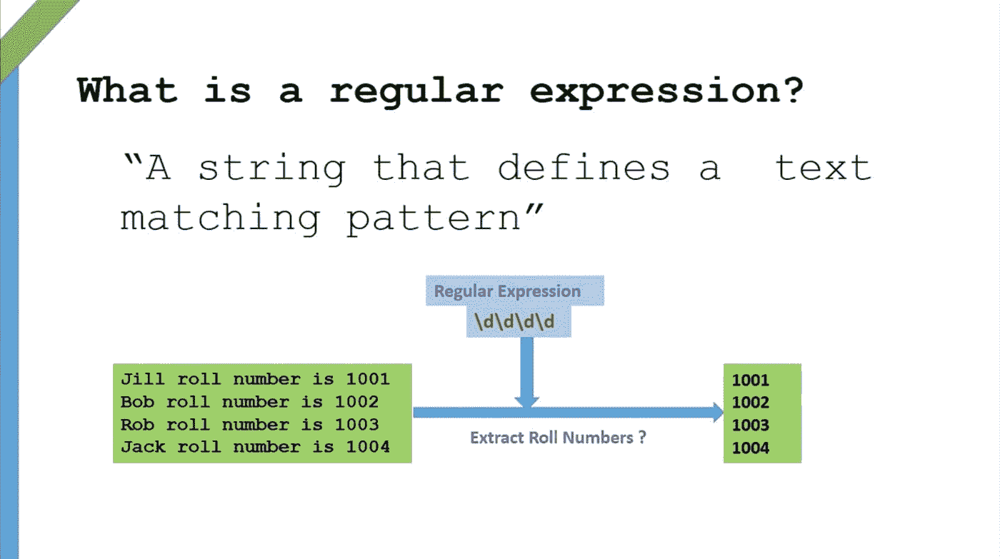

# 以编程方式在 Python 中构建 REGEX(正则表达式)用于模式匹配

> 原文：<https://towardsdatascience.com/programmatically-build-regex-regular-expression-in-python-for-pattern-matching-3fee104fe42a?source=collection_archive---------8----------------------->


Photo by [Aidan Granberry](https://unsplash.com/@atgranberry?utm_source=unsplash&utm_medium=referral&utm_content=creditCopyText) on [Unsplash](https://unsplash.com/search/photos/letters-computer?utm_source=unsplash&utm_medium=referral&utm_content=creditCopyText)

当您准备进行文本分析或自然语言处理时，正则表达式(Regex——通常读作`ri-je-x`或`reg-x`)非常有用。尽管 Regex 很有用，但它也非常令人困惑和难以理解，并且总是需要(至少对我来说)多次[点击并返回到多个堆栈溢出链接。](https://duckduckgo.com/)

首先:

## 什么是 Regex

> 根据维基百科，一个**正则表达式**、 **regex** 或 **regexp** 是定义一个*搜索模式*的字符序列。



Image Courtesy: [comidoc.com](https://comidoc.com/master-regular-expressions-python-examples/)

## 看起来怎么样？

这是测试 URL 有效性的正则表达式模式:

```
^(http)(s)?(\:\/\/)(www\.)?([^\ ]*)$
```

典型的正则表达式包含—字符(`http`)和元字符(`[]`)。这两者的结合形成了特定任务的有意义的正则表达式。

## 那么，有什么问题呢？

记住字符和元字符的组合方式来创建一个有意义的正则表达式本身就是一个乏味的任务，有时比 NLP 的实际问题更大。事实上，这推动了迷因世界和互联网上的卡通节目。像这样:


## 手边的解决方案

这个星球上的一些好人已经创建了一个开源的 Javascript 库[**JSVerbalExpressions**](https://github.com/VerbalExpressions/JSVerbalExpressions)来简化正则表达式的创建。然后其他一些优秀的灵魂将 javascript 库移植到 Python 上—[**Python verbalexressions**](https://github.com/VerbalExpressions/PythonVerbalExpressions)。这就是开源世界的美妙之处。抱歉我离题了，但我想提出一个观点。

## 安装—python verbalexceptions

基于您所拥有的 Python 版本，您可以使用 pip 安装 PythonVerbalExpressions。

```
pip3 install VerbalExpressions
```

## 导入并启动

就像 ML 库`scikit-learn`如何使用一个基本的构造函数并在其上构建一样， *VerbalExpressions* 遵循类似的 API 语法。

```
from verbalexpressions import VerEx
verEx = VerEx()
```

## **伪问题**

让我们创建一个伪问题，我们希望用 regex 来解决它，通过它我们可以理解这个包，以编程方式创建 regex。

一个更简单的例子，我们有多个这样的文本:

```
strings = ['123Abdul233',
           '233Raja434',
           '223Ethan Hunt444']
```

我们想从中提取名字。所以我们的结果应该是:

```
Abdul, Raja, Ethan Hunt
```

## 伪代码

在我们编码之前，最好在一张餐巾纸甚至一张纸上写下伪代码。也就是说，我们希望提取除数字(即数字)之外的名称(即字母的组合)。我们为一行代码构建一个正则表达式，然后为列表中的所有元素迭代它。

## 该表达式

我们使用`range()`函数来表示给定范围内的任何内容。

```
expression = verEx.range('a','z','A','Z',' ')
```

在这个表达式中，来自`a-z`或`A-Z`或`whitespace`的任何东西(空白:因为`Ethan Hunt`)。

要了解 python 代码如何实际转换成 regex 模式:

```
expression.source()#output: '([a-zA-Z\\ ])'
```

## 寻找和寻找

现在表达式已经准备好了，我们可以用它以多种方式查找所需的子字符串。在这里，我们将求助于 Python 库中的任何 regex `re`。因为我们要处理`re`，我们将编译为`re`构建的`expression`。

```
import rere_exp = expression.compile()
```

现在，`re`编译已经完成。我们将使用那个`re_exp`在一行中测试这个正则表达式(输入列表的一个元素)。

```
re.findall(re_exp,strings[0])#output: ['A', 'b', 'd', 'u', 'l']
```

那是有前途的！让我们使用我们的字符串连接和 for 循环技巧来完成我们的伪问题！

```
[''.join(re.findall(re_exp,line)) for line in strings]#output: ['Abdul', 'Raja', 'Ethan Hunt']
```

## 结束了

因此，我们设法在不了解正则表达式的情况下构建了正则表达式模式。简而言之，我们使用 Python 以编程方式生成了一个正则表达式模式(这不需要正则表达式模式的高级知识),并完成了一个小任务来展示其潜力。这里需要注意的是，这个 Python 包`VerbalExpressions`没有来自其父库`javascript`的所有函数，所以功能是有限的。要了解更多关于使用 Python 的 Regex 的信息，请查看这个 Datacamp 课程。完整的代码可在[这里](https://github.com/amrrs/blogpost_codes/blob/master/Build%20REGEX%20Python%20for%20Pattern%C2%A0Matching.py)获得。