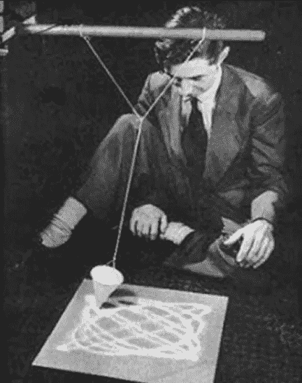

# 编程是艺术

> 原文：<https://towardsdatascience.com/programming-is-art-2d2c66fb0f96?source=collection_archive---------13----------------------->

## 一篇主张将编程作为一种艺术形式的辩论性文章

我强烈认为自己是一个有创造力的人。这是我的主要优势之一。我同样喜欢创建新概念的过程，就像我喜欢构建实现一样。它可以是任何事情，从在我信任的吉他上写一首歌到在 Adobe Illustrator 中创建一个新的设计。从起草商业模式到在《超级马里奥制造 2》中建立关卡。从用我不知道的原料烹饪一道新菜，到建立人工智能策略。有时我只是毫无目的地创造东西——有时快乐在于创造，而不是结果。并不是所有的艺术都必须被分享，有时候美只是来自于创作时内心的平静。

艺术有一种在各种奇怪的普通地方展示自己的方式。在享用一餐之前，我喜欢花点时间来欣赏它的特色。当我坐在咖啡馆时，我喜欢观察我的周围，艺术存在于每个人的表情中，存在于任何房间的每个角落。有时当我听音乐时，我会闭上眼睛，让我的创造力随着旋律的声音尽情发挥。

我真的相信艺术无处不在。当我与他人分享这一观点时，许多人似乎同意我的观点。

但是接下来就是编程了。围绕编程有一个奇怪的污名，有人说它不是一种创造性形式，而仅仅是一种逻辑形式。但是更严重的是:编程不是艺术的观念。根据这篇文章的标题，你可能会猜到，我将提出相反的论点。

编程是艺术。

Photo by [Ilya Pavlov](https://unsplash.com/@ilyapavlov?utm_source=unsplash&utm_medium=referral&utm_content=creditCopyText).

请允许我从最不有趣，但经常被问到的一点开始:定义。如果我们要讨论某样东西是否被归类为艺术，首先检查它的定义是很自然的，也是意料之中的，但是我不打算在这里花太多时间。如果我们要追溯这个术语的根源，[牛津词典](https://www.lexico.com/en/definition/art)提供了一系列的定义供人们欣赏，现在我们将不再看这本广泛流传的词典。

> 人类创造力和想象力的表现或应用，通常以绘画或雕塑等视觉形式，创作出主要因其美感或情感力量而被欣赏的作品。

第一个定义不同于字典中的所有定义，它认为艺术的主要产品是情感力量或美。我觉得这很奇怪。当一个精心制作的王座的主要目的是让有权有势的人就座，一个巨大的城堡的主要目的是给人类居住，一个最精致的菜肴的主要目的是食用时，这怎么可能呢？如果这些作品的主要目的是以功能性的方式使用，那么它们就不被认为是艺术吗？当然，无论是谁写下了这样的定义，他都不可能漫步于维也纳的内街，那里的每一座建筑都是宏伟的，否则他们不可能想出如此狭隘的定义。

> **1.1** 由人类的创造技能和想象力产生的作品。

令人欣慰的是，人们移动眼睛的距离不能超过几个像素来移动字典，因为第二个定义及其后的所有定义都相当宽。有人可能会说，人类创作的每一件作品都包含创造性技能和想象力，因此每一支铅笔、手机充电器和卫生纸也是潜在的艺术作品。一个人创作的每一件东西在最初创作时都需要一定的创造力。然而，如果遵循严格的公式和明确定义的规则，同一物品的后续创造可能不会。因此，只有第一支铅笔、手机充电器和卫生纸可能是一件艺术品，因为同一制造商随后制造的每一件物品都可能是在工厂里按照严格的说明制造的。然而，对于编程来说，每个产品都需要独特的指令，因为没有两个功能是完全相同的。

我可以继续定义，但我会把剩下的留给你[，因为我想你会发现牛津的以下三个定义不允许任何惊喜，而是用不同的词重复相同的思想，所有这些都允许编程被解释为艺术](https://www.lexico.com/en/definition/art)

What is art? Perhaps, much like its creation and subsequent meaning is up for a subjective interpretation, so too is its definition? Photo by [Chris Barbalis](https://unsplash.com/@cbarbalis?utm_source=unsplash&utm_medium=referral&utm_content=creditCopyText).

那么，为什么有人不认为编程是一种艺术形式呢？也许是因为代码行缺乏自然美，所以才是真正的*？但是路边的一块石头，在雕塑家把它变成雕像之前，到底有多美？一个音符的集合，直到一个音乐家把它演奏出来，到底有多美？在厨师把金枪鱼变成一道菜之前，它有多美？所以我问你:在形成应用程序之前，代码行有多美？单个的元素并不总是呈现出一种自然美，但是这些元素的总和放在一起形成了一个有思想的集体作品。*

因此，*部分的美*不可能是答案。*那么逻辑*呢？编程是由逻辑构成的，逻辑不是艺术，对吧？有些头脑是理性的，而有些是感性的。有些人被逻辑所吸引，有些人被传统的美所吸引。然而，列奥纳多·达·芬奇创造了建立在科学基础上的艺术，一个音乐家创造了逻辑上相互遵循的音调，一个厨师逻辑上结合了互补的配料。大多数艺术作品实际上是一个逻辑过程的结果，是对互补元素的选择。逻辑和艺术往往是相辅相成的。

> 大多数艺术作品实际上是一个逻辑过程的结果，是对互补元素的选择。

Art is everywhere, and can be made with any tool. For many, the computer has become a tool that allows for the creation of art, be it art, designs, music, programming applications, or otherwise. Photo by [Dmitry Chernyshov](https://unsplash.com/@oneor0?utm_source=unsplash&utm_medium=referral&utm_content=creditCopyText).

所以逻辑也不可能是它。*或许是学习曲线*，以及随之而来的误解？事实上，成为一名艺术家或音乐家需要无数个小时的训练，然而任何孩子都可以在几秒钟内唱一首创作的歌曲或创作一幅画——不需要训练。也许这就是艺术的真正含义？毫不费力地投入情感，无论是伟大的还是渺小的，立即得到一个创造性的工作作为回报？虽然你可能会错，但编程也不例外。你富有创造力的额头上的汗水会以同样的方式立即呈现出来。创作过程没有什么不同，学习曲线也没有更长。

*数学*那么？虽然编程和数学实际上是两个非常不同的研究领域，但还有一种误解，认为这两者是一样的，数学不可能是艺术，因此编程也不可能是艺术。然而，事实并非如此，因为数千年来，数学一直是艺术的一个组成部分。早在耶稣基督诞生之前，从希腊帝国开始，艺术家就已经使用数学来雕刻、绘画、舞蹈和作曲。

Max Ernst creating a work of art using gravity as a tool to enable creativity (1942).

M. C. Escher’s famous painting Print Gallery (1956), which sparked great discussions among mathematicians and artists alike.

也许*创意投入的产品*本身，那么？添加颜色，收到一幅画。添加曲调并获得一首歌曲。如果你输入几行代码，你会得到什么？绝对的任何事情和一切。华丽的动画电影，史诗般的视频游戏，以及你每天与之互动的漂亮界面。虽然编程的产品并不重要，因为它毕竟是艺术，但编程是你每天都在接触的艺术作品。

我希望现在我已经让你相信编程是一种艺术，如果我没有做到这一点，这篇文章的其余部分也不会说服你，但它可能会鼓励你自己尝试编程，如果你还没有这样做的话。

最后一个误解是，编程是少数人的专利。误解可能会说，为了能够编写代码，你需要一些与生俱来的天赋，也许是逻辑思维，或者对数学的偏好。并非如此。就像任何人都可以画画一样，任何人都可以写代码。

我从未上过歌唱课。然而我喜欢唱歌。但我只有在家里舒服的时候才会这么做。听过我歌声的人少之又少，没听过的人有福了，因为不是特别好听。但我唱歌不是因为我擅长，也不是因为我想成为擅长。我这么做只是因为我喜欢。这听起来可能是显而易见的，但值得一提的是，你不需要*做*某件事的意图是让它变得令人惊叹。你可以试着做着玩玩。我经常听到这样的想法，人们不想尝试编程，因为他们认为自己永远也不会做好。也许你会，也许不会。那又怎样？你可能无法开发创新。你可能不会选择编程作为职业技能。但是你不需要做这两件事来享受艺术创作。

*每个人*都能创造艺术

使用任何*介质。*

My drawings are bad, but I still enjoying drawing. It’s a creative process that puts my mind at ease. I have the very same feeling when I am programming application in my spare time, or writing articles such as this one. Photo by [Neven Krcmarek](https://unsplash.com/@nevenkrcmarek?utm_source=unsplash&utm_medium=referral&utm_content=creditCopyText).

A child creating art. Photo by [Lego](https://www.lego.com/sv-se/themes/duplo/articles/play-and-learn-d2943e224aa840b69429bffaa04e3b29).

Art in the making. Photo by [Fabian Grohs](https://unsplash.com/@grohsfabian?utm_source=unsplash&utm_medium=referral&utm_content=creditCopyText).

在你离开之前，我们下次再讨论另一个话题，让讨论更进一步。下面这幅画是人工智能做的。它在拍卖会上以 432，500 美元售出。没有人类任何输入的艺术还是艺术吗？因为在这个过程中没有人参与，真的有任何创造力和想象力吗？或者这只是一个简单的计算机执行的自动化逻辑过程？但是，在创作艺术作品时，人类不也是遵循逻辑流程的计算机吗？嗯，这是另一个时间的辩论。

Is art made without human input still art? Photo from [Obvious Art](http://obvious-art.com/index.html), who also developed the AI that created this painting.