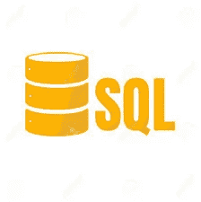

# 面向数据科学家的编程语言

> 原文：<https://towardsdatascience.com/programming-languages-for-data-scientists-afde2eaf5cc5?source=collection_archive---------9----------------------->

如今有 256 种编程语言可供选择，选择学习哪种语言可能会非常困难。有些语言更适合构建游戏，有些更适合软件工程，有些更适合数据科学。

# 编程语言的类型

低级编程语言是计算机用来执行操作的最容易理解的语言。这方面的例子有**汇编语言**和**机器语言**。汇编语言用于直接的硬件操作，访问专门的处理器指令，或者解决性能问题。机器语言由计算机可以直接读取和执行的二进制文件组成。汇编语言需要将汇编软件转换成机器代码。低级语言比高级语言速度更快，内存效率更高。

与低级编程语言不同，高级编程语言对计算机的细节有很强的抽象性。这使得程序员能够创建独立于计算机类型的代码。这些语言比低级编程语言更接近于人类语言，并且也在幕后由解释器或编译器转换成机器语言。这些我们大多数人都比较熟悉。一些例子包括 Python、Java、Ruby 等等。这些语言通常是可移植的，程序员不需要过多地考虑程序的过程，而是将注意力集中在手头的问题上。现在很多程序员都使用高级编程语言，包括数据科学家。

# 数据科学编程语言

## 计算机编程语言

在最近的一项全球调查中，发现近 24，000 名数据专业人员中有 83%使用 Python。数据科学家和程序员喜欢 Python，因为它是一种通用的动态编程语言。Python 似乎比 R 更适合数据科学，因为它比 R 快，迭代次数少于 1000 次。据说它比 R 更适合数据操作。这种语言还包含用于自然语言处理和数据学习的优秀包，并且本质上是面向对象的。

## 稀有

对于即席分析和探索数据集，r 比 Python 更好。它是一种用于统计计算和图形的开源语言和软件。这不是一门容易学习的语言，大多数人发现 Python 更容易掌握。对于超过 1000 次迭代的循环，R 实际上使用 lapply 函数击败了 Python。这可能会让一些人怀疑 R 是否更适合在大数据集上执行数据科学，然而，R 是由统计学家构建的，并在其操作中反映了这一点。数据科学应用在 Python 中感觉更自然。

## Java 语言(一种计算机语言，尤用于创建网站)

Java 是另一种通用的、面向对象的语言。这种语言似乎非常通用，被用于嵌入式电子设备、web 应用程序和桌面应用程序。数据科学家似乎不需要 Java，然而，像 Hadoop 这样的框架运行在 JVM 上。这些框架构成了大数据栈的大部分。Hadoop 是一个处理框架，为运行在集群系统中的大数据应用管理数据处理和存储。这允许存储大量数据，并支持更高的处理能力，能够同时处理几乎无限的任务。此外，Java 实际上有许多用于机器学习和数据科学的库和工具，它很容易扩展到更大的应用程序，而且速度很快。

关于 Hadoop 的更多信息:[https://www.youtube.com/watch?v=MfF750YVDxM](https://www.youtube.com/watch?v=MfF750YVDxM)

## 结构化查询语言

SQL(结构化查询语言)是用于在关系数据库管理系统中管理数据的领域特定语言。SQL 有点像 Hadoop，因为它管理数据，然而，数据的存储有很大的不同，并在上面的视频中解释得很好。SQL 表和 SQL 查询对于每个数据科学家来说都是至关重要的，需要了解和熟悉。虽然 SQL 不能专门用于数据科学，但数据科学家必须知道如何在[数据库管理系统](https://www.techopedia.com/definition/24361/database-management-systems-dbms)中处理数据。

## 朱莉娅

Julia 是另一种高级编程语言，是为高性能数值分析和计算科学而设计的。它有非常广泛的用途，如 web 编程的前端和后端。Julia 能够使用它的 API 嵌入程序，支持[元编程](https://stackoverflow.com/questions/514644/what-exactly-is-metaprogramming)。据说这种语言对 Python 来说更快，因为它被设计成快速实现像线性代数这样的数学概念，并且更好地处理矩阵。Julia 提供了 Python 或 R 的快速开发，同时生成了运行速度与 C 或 Fortran 程序一样快的程序。

## 斯卡拉

Scala 是一种通用编程语言，提供对函数式编程、面向对象编程、强大的[静态类型系统](https://thecodeboss.dev/2015/11/programming-concepts-static-vs-dynamic-type-checking/)以及并发和同步处理的支持。Scala 旨在解决 Java 的许多问题。同样，这种语言有许多不同的用途，从 web 应用到机器学习，但是，这种语言只涵盖前端开发。这种语言以可扩展和适合处理大数据而闻名，因为其名称本身就是“可扩展语言”的首字母缩写。Scala 与 Apache Spark 的结合支持大规模并行处理。此外，有许多流行的高性能数据科学框架是在 Hadoop 之上编写的，可以在 Scala 或 Java 中使用。

# 结论

总之，Python 似乎是当今数据科学家使用最广泛的编程语言。这种语言允许集成 SQL、TensorFlow 和许多其他用于数据科学和机器学习的有用函数和库。拥有超过 70，000 个 Python 库，这种语言的可能性似乎是无限的。Python 还允许程序员创建 CSV 输出，以便轻松读取电子表格中的数据。我对新加入的数据科学家的建议是，在考虑其他编程语言之前，先学习并掌握 Python 和 SQL 数据科学实现。同样显而易见的是，数据科学家必须具备一些 Hadoop 知识。

我们来连线:

【https://www.linkedin.com/in/mackenzie-mitchell-635378101/ 号

【https://github.com/mackenziemitchell6 