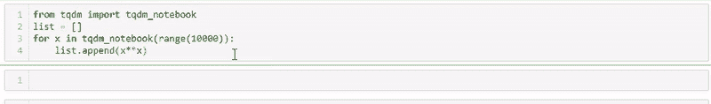
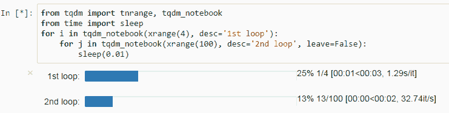
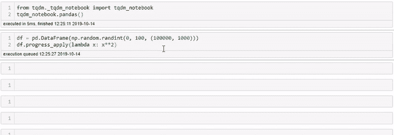

# Python 中的进度条(还有熊猫！)

> 原文：<https://towardsdatascience.com/progress-bars-in-python-and-pandas-f81954d33bae?source=collection_archive---------8----------------------->


Everyone likes a low-tech ominous progress bar

时间和估计你的函数在 Python 中的进度(还有熊猫！)

在这篇文章中，我将尝试打破我自己保持的最短、最简洁的文章记录，所以不再多说，让我们开始吧！

# tqdm 简介



Beautiful, isn’t it? Source: [*https://github.com/tqdm/tqdm*](https://github.com/tqdm/tqdm)

tqdm 是 Python 的一个包，可以让你立即创建进度条，并估计函数和循环的 TTC(完成时间)!

只需在您喜爱的终端上使用 pip 安装 tqdm，您就可以开始了:

```
pip install **tqdm**
```

# 使用 tqdm

使用 tqdm 真的相当容易，只需导入 tqdm:

```
>>> from **tqdm** import **tqdm**, **tqdm_notebook**
```

如果你在 Jupyter 笔记本环境中工作，任何时候你在你的代码中看到一个循环，你可以简单地把它包装在`tdqm()`或者`tqdm_notebook()`中。您也可以使用`desc=`参数对您的进度条进行描述:



Source: [*https://github.com/tqdm/tqdm*](https://github.com/tqdm/tqdm)

## 但是`.apply()`在熊猫身上的功能呢？

导入 tqdm 后，您可以启动方法:tqdm.pandas()，或者如果您在 Jupyter 笔记本环境中运行代码，请使用:

```
>>> from **tqdm._tqdm_notebook** import **tqdm_notebook**
>>> **tqdm_notebook.pandas()**
```

然后你可以简单地用`.progress_apply()`替换你所有的`.apply()`功能，真的就这么简单！



So fast..!

# 结束语

感谢阅读！我发现人们似乎喜欢这种快速而中肯的文章风格，就像我的 [**只用一行 Python**](/exploring-your-data-with-just-1-line-of-python-4b35ce21a82d) 的文章探索你的数据一样，所以希望你也喜欢这篇文章！

如果你想看和了解更多，一定要关注我的 [**媒体**](https://medium.com/@peter.nistrup) 🔍**[**碎碎念**](https://twitter.com/peternistrup) 🐦**

**[](https://medium.com/@peter.nistrup) [## 彼得·尼斯特鲁普-中等

### 阅读彼得·尼斯特拉普在媒介上的作品。数据科学、统计和人工智能...推特:@PeterNistrup，LinkedIn…

medium.com](https://medium.com/@peter.nistrup)**