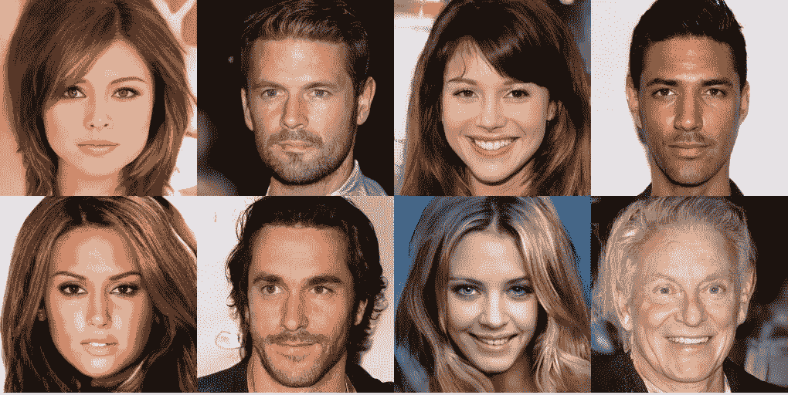
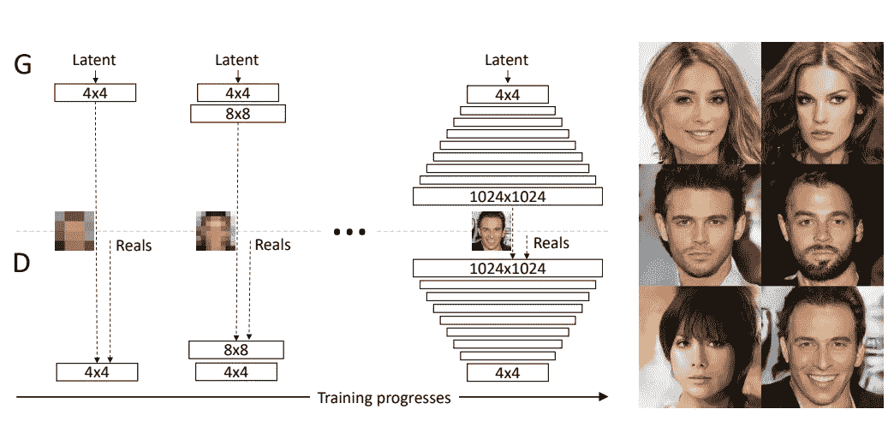
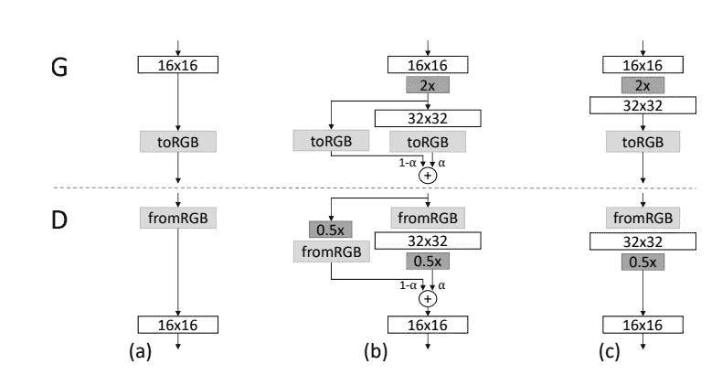
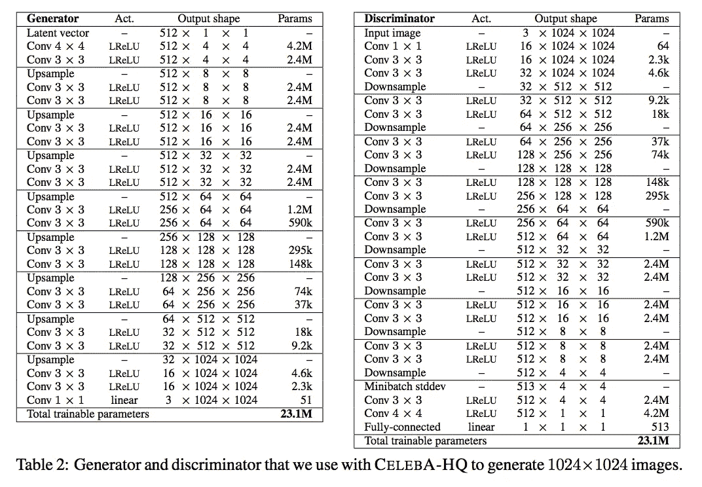
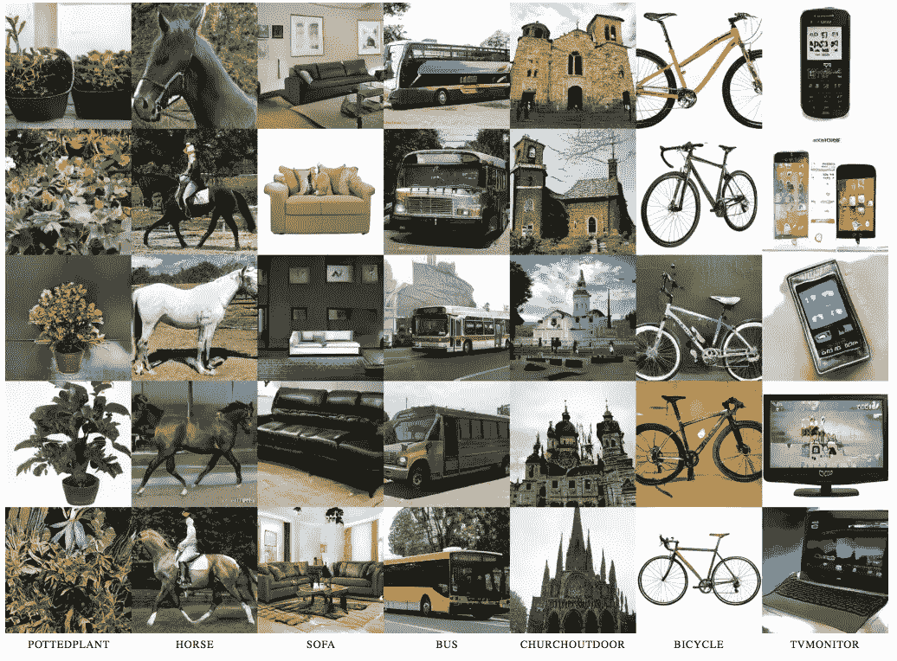
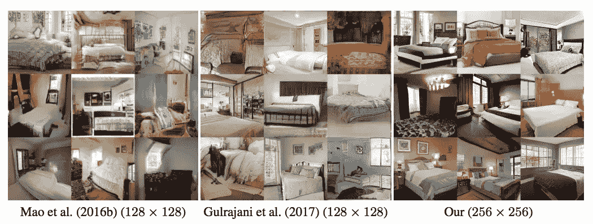

# 渐进增长的甘斯

> 原文：<https://towardsdatascience.com/progressively-growing-gans-9cb795caebee?source=collection_archive---------14----------------------->

NVIDIA 发布并在 ICLR 2018 上发布的逐步增长的 GAN 架构已经成为令人印象深刻的 GAN 图像合成的主要展示。传统上，GAN 一直难以输出中低分辨率图像，如 32 (CIFAR-10)和 128 (ImageNet)，但这种 GAN 模型能够生成 1024 的高分辨率面部图像。

1024 x 1024 facial images generated with the Progressively-Growing GAN architecture

本文将解释本文中讨论的用于构建渐进增长的 gan 的机制，这些机制包括多尺度架构、新层中的线性衰落、小批量标准偏差和均衡学习速率。下面提供了该论文的链接:

 [## 为了提高质量、稳定性和多样性而逐步种植甘蔗

### 我们描述了一种新的生成式对抗网络的训练方法。关键的想法是增长发电机…

arxiv.org](https://arxiv.org/abs/1710.10196) 

# **多规模架构**

Diagram of the Multi-Scale Architecture used in Progressively-Growing GANs

上图显示了多尺度架构的概念。鉴频器用来确定生成的输出是“真实”还是“虚假”的“真实”图像被向下采样到分辨率，如 4、8 等等，最高可达 1024。生成器首先产生 4 个图像，直到达到某种收敛，然后任务增加到 8 个图像，直到 1024 个。这个策略极大地稳定了训练，想象一下为什么会这样是相当直观的。从潜在的 z 变量直接到 1024 图像包含了空间中巨大的变化量。正如以前 GAN 研究中的趋势一样，生成低分辨率图像(如 28 灰度 MNIST 图像)比生成 128 RGB ImageNet 图像容易得多。逐渐增长的 GAN 模型的下一个有趣的细节是准确理解模型如何过渡到更高的分辨率。

# **淡入新图层**

Diagram depicting how new layers are added to progressive the target resolution from low to high resolution

如果你[熟悉 ResNets](/introduction-to-resnets-c0a830a288a4) ，这将是一个容易理解的概念，因为它比那要简单得多。为了解释这一点，请观察上图中的图像(b ),特别是虚线上方的 G 部分。当新的 32x32 输出图层添加到网络中时，16x16 图层的输出将通过**简单的最近邻插值法投影到 32x32 维度中。**这是一个需要理解的非常重要的细节。投影的(16x16 →32x32，通过最近邻插值)图层乘以 1-alpha，并与乘以 alpha 的新输出图层(32x32)连接，以形成新的 32x32 生成的图像。alpha 参数从 0 到 1 线性缩放。当 alpha 参数达到 1 时，16x16 的最近邻插值将完全无效(例如，1–1 = 0，特征映射* 0 = 0..).这种平滑过渡机制极大地稳定了逐渐增长的 GAN 架构。

下图显示了完成渐进式增长后的最终架构:

已经提出的两个概念，多尺度架构和新层中的淡化是本文的基本概念，下面的主题稍微高级一些，但是对于实现本文的最终结果仍然非常重要。如果您在这些概念的描述中发现了问题，并可以对其进行扩展，请留下您的评论:

# 小批量标准偏差

这种想法与许多 GAN 模型中缺乏明显的变化有关。这个问题和“模式崩溃”源于同一个根源。[在 Salimans 等人的著名 GAN 论文](https://arxiv.org/abs/1606.03498)中，他们引入了小批量鉴别。小批量鉴别将额外的特征映射连接到鉴别器上，该鉴别器由一批中所有图像的特征统计组成。这推动了批量生成的样本共享与批量真实样本相似的特征，否则迷你批量特征层将容易暴露生成的样本是假的。渐进增长的 GANs 通过增加一个更简单的、不变的特征图修改了这个想法。此恒定要素地图是从跨空间位置的批次中所有要素的标准偏差中得出的。这个最终常数映射类似地被插入到鉴别器的末端。

# 均衡学习率

均衡学习率背后的思想是用常数来缩放每层的权重，使得更新的权重 w’被缩放为 w’= w/c，其中 c 是每层的常数。这是在训练期间完成的，以在训练期间将网络中的权重保持在相似的比例。这种方法是独特的，因为通常现代优化器如 RMSProp 和 Adam 使用梯度的标准偏差来归一化它。这在权重非常大或非常小的情况下是有问题的，在这种情况下，标准偏差是不充分的标准化器。

应用渐进式增长、新层中的淡入、小批量标准偏差、均衡学习率以及本文中未讨论的另一个概念，逐像素归一化实现了令人印象深刻的高分辨率 GAN 结果:

LSUN Images generated at 256x256 with the progressively-growing GAN architecture, amazing detail!

Comparison of Progressively-Growing GANs (Far Left) with Mao et al. (Least Squares GANs, Far Left), and Gulrajani et al. (Improved Wasserstein GAN, middle) on the LSUN interior bedroom images

感谢您阅读本文！希望这有助于您对逐渐增长的 GAN 模型有所了解。如果你对此有任何想法，请查看这篇文章并发表评论！